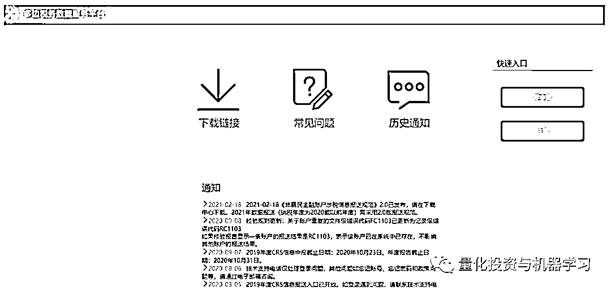

# 私募基金有望持牌经营！

> 原文：[`mp.weixin.qq.com/s?__biz=MzAxNTc0Mjg0Mg==&mid=2653313254&idx=1&sn=9cfbf2f38f6dcece9f96b9c928e797d4&chksm=802d9af3b75a13e57e14d0148573ba5ebb514e9f79985ee06d98470509cbff89e2a553ec2f7b&scene=27#wechat_redirect`](http://mp.weixin.qq.com/s?__biz=MzAxNTc0Mjg0Mg==&mid=2653313254&idx=1&sn=9cfbf2f38f6dcece9f96b9c928e797d4&chksm=802d9af3b75a13e57e14d0148573ba5ebb514e9f79985ee06d98470509cbff89e2a553ec2f7b&scene=27#wechat_redirect)

 

今天与大家分享 3 个消息！

**1、私募基金有望持牌经营？**

**2、基金从业资格新增 11 个考试城市**

**3、CRS 系统开放部分申报功能**

**1、私募基金有望持牌经营？**

据中国证券报报道，今年全国两会，全国政协委员、证监会科技监管工作委员会副主任张野准备提交的两份建议中，其中一份与私募基金密切相关，即《关于修订、明确对私募基金管理人持牌管理的建议》。

张野认为，我国私募基金领域的适用法律为《证券投资基金法》，对私募基金不设行政许可，仅要求私募基金登记备案，且不适用于私募股权基金、创业投资基金，监管执法手段不足。建议修订《基金法》，明确对私募基金管理人设立行政许可，实施持牌管理，同时将私募股权基金、创业投资基金纳入《基金法》规制。

张野指出，近年来私募基金已成为服务实体经济高质量发展和创新创业的重要力量，但在快速发展过程中问题和风险日益凸显。私募基金行业具有显著的金融属性和风险外溢性，但尚未实施牌照管理，监管抓手严重不足。在我国金融体系中，银行、保险、证券等传统金融机构实行牌照管理，互联网金融机构经过专项整治后基本实现市场出清，少部分纳入牌照管理，地方金融组织实行属地监管和牌照管理，唯独私募基金行业实行事中事后监管，无行政许可，大量不具备资质的机构和个人纷纷涌入，风险不断爆发。目前私募基金已成为金融监管的“洼地”。从境外情况看，2008 年金融危机后全球普遍对私募基金管理人实行注册和持牌监管。

自 2013 年私募基金纳入证监会监管以来，私募基金行业取得快速发展，在促进社会资本形成、提高直接融资比重、推动科技创新、优化资本市场投资者结构、服务实体经济发展等多方面发挥着重要作用。在经济下行和内外形势压力下，私募基金逆势增长，截至 2020 年底，已登记管理人 2.46 万家，已备案私募基金 9.68 万只，管理规模 15.97 万亿元。截至 2020 年三季度，私募股权基金、创业投资基金累计投资于境内未上市未挂牌企业股权、新三板企业股权和再融资项目数量达 13.2 万个，为实体经济形成股权资本金 7.88 万亿元。

今年 1 月，证监会发布《关于加强私募投资基金监管的若干规定》，进一步加强私募基金监管，严厉打击各类违法违规行为，严控私募基金增量风险，稳妥化解存量风险，提升行业规范发展水平，保护投资者及相关当事人合法权益。证监会提出，将进一步完善私募基金法律法规体系，夯实加强私募基金监管的制度基础。同时将加大政策支持力度，进一步发挥私募基金在提高直接融资比重、支持创业创新、服务实体经济和居民财富管理等方面的重要作用。

**2、基金从业资格新增 11 个考试城市**

近期，2021 年首场基金从业资格考试异常火爆，考试报名入口开放以后，名额很快被抢完。

为了最大限度满足广大考生报考需求，同时落实新冠肺炎疫情防控要求，中基协于 3 月 2 日发布通知，将新增开放 11 个考试城市，分别为哈尔滨市、长春市、长沙市、合肥市、南京市、沈阳市、成都市、太原市、西宁市、北京市、石家庄市。其中北京市和石家庄市，所有考生需持 7 日内核酸阴性证明和无异常健康码参加考试。

自 3 月 2 日 14 点至 3 月 7 日 24 点开放以上城市的集体报名和个人报名。

**考试时间：**3 月 27 日**报名时间：**截止至 3 月 7 日 24：00**报名方式：**

■ 个人报名网址

http://baoming.amac.org.cn:10080/CZSB30-Site/#/default/login

■ 集体报名网址

http://baoming.amac.org.cn:10080/CZSB30-Group/#/default/login

**考试地点：**本次考试在上海市、天津市、深圳市、广州市、杭州市、重庆市、西安市、济南市、武汉市、青岛市、厦门市、福州市、南宁市、海口市、南昌市、珠海市、呼和浩特市、贵阳市、兰州市、银川市、拉萨市、昆明市、宁波市、郑州市、泉州市、烟台市、金华市、乌鲁木齐市、哈尔滨市、长春市、长沙市、合肥市、南京市、沈阳市、成都市、太原市、西宁市、北京市、石家庄市等 39 个城市举行。考生可选择以上任何一个城市进行考试。其中北京市和石家庄市，所有考生需持 7 日内核酸阴性证明和无异常健康码参加考试。

**准考证打印时间：**3 月 22 日 10:00-3 月 27 日 24:00

**3、CRS 系统已开放**

目前 CRS 系统已开放零申报和注册通道。私募管理人及私募基金需要在 5 月 31 日前通过系统报送相关情况。

目前，《非居民金融账户涉税信息报送规范》2.0 已发布，2021 年数据报送（纳税年度为 2020 或以前年度）需采用 2.0 版报送规范。

报送对象：全部私募基金管理人报送时间：5 月 31 日前报送系统：多边税务数据服务平台，https://aeoi.chinatax.gov.cn/报送内容：

1、若私募管理人之前未注册过多边平台的，首先需完成多边税务数据服务平台注册。

2、注册完成之后对在本私募机构开立的金融账户（如私募机构的投资者账户）进行尽职调查，判断其是不是“非居民金融账户”。 

尽调完发现没有“非居民金融账户”，则可以进行“零申报”。

如果是“非居民金融账户”，需要收集相关账户信息并记录报送，做“非零申报”。

 

量化投资与机器学习微信公众号，是业内垂直于**量化投资、对冲基金、Fintech、人工智能、大数据**等领域的主流自媒体。公众号拥有来自**公募、私募、券商、期货、银行、保险、高校**等行业**20W+**关注者，连续 2 年被腾讯云+社区评选为“年度最佳作者”。