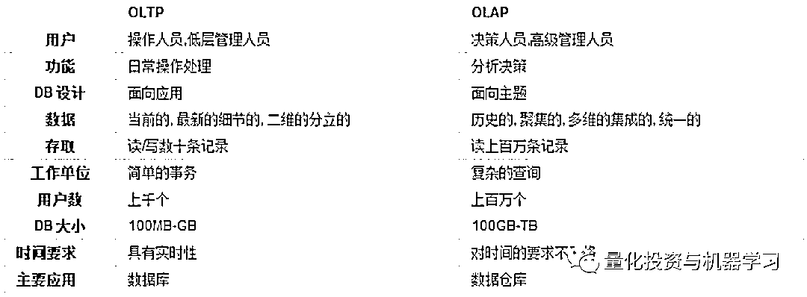
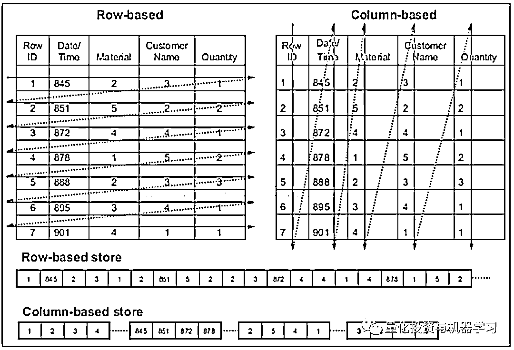
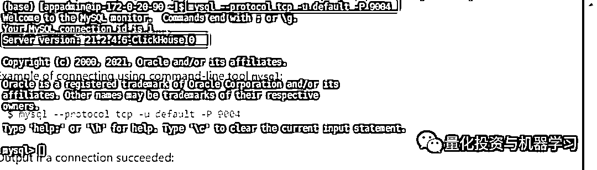
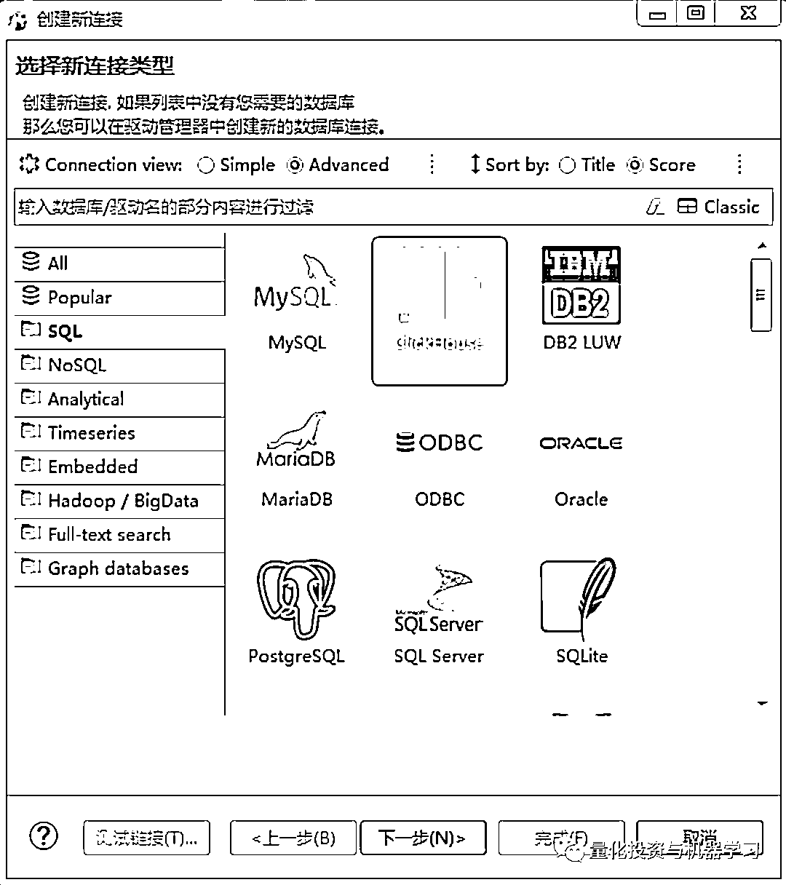
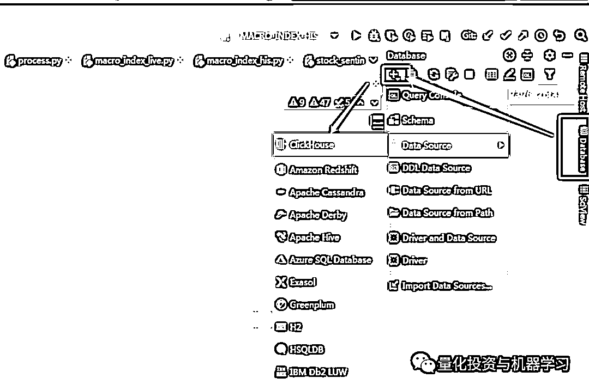
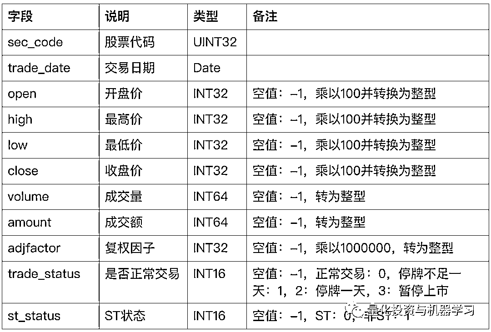
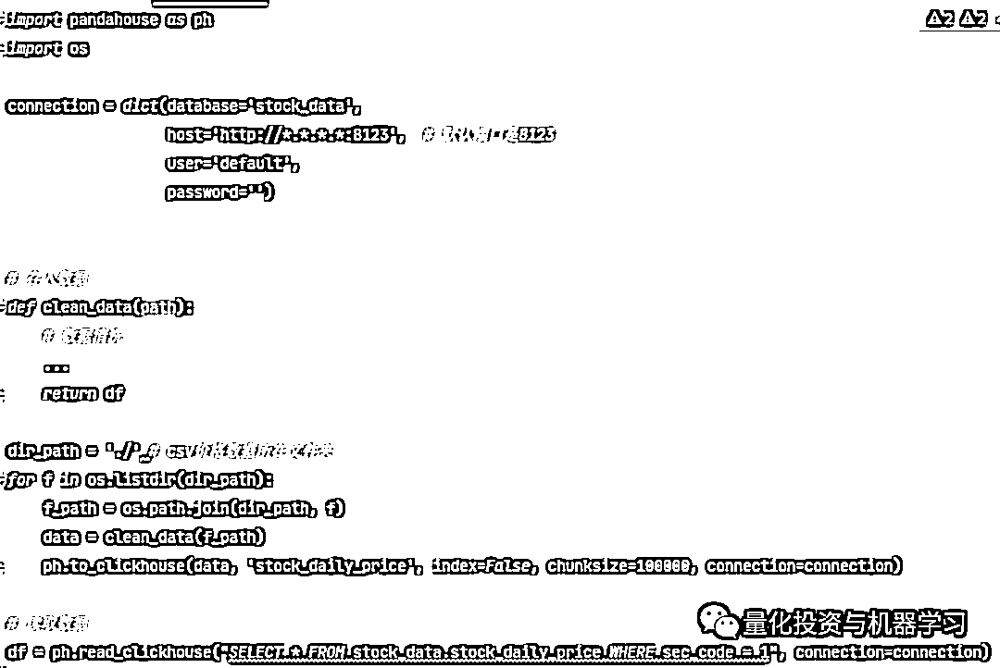
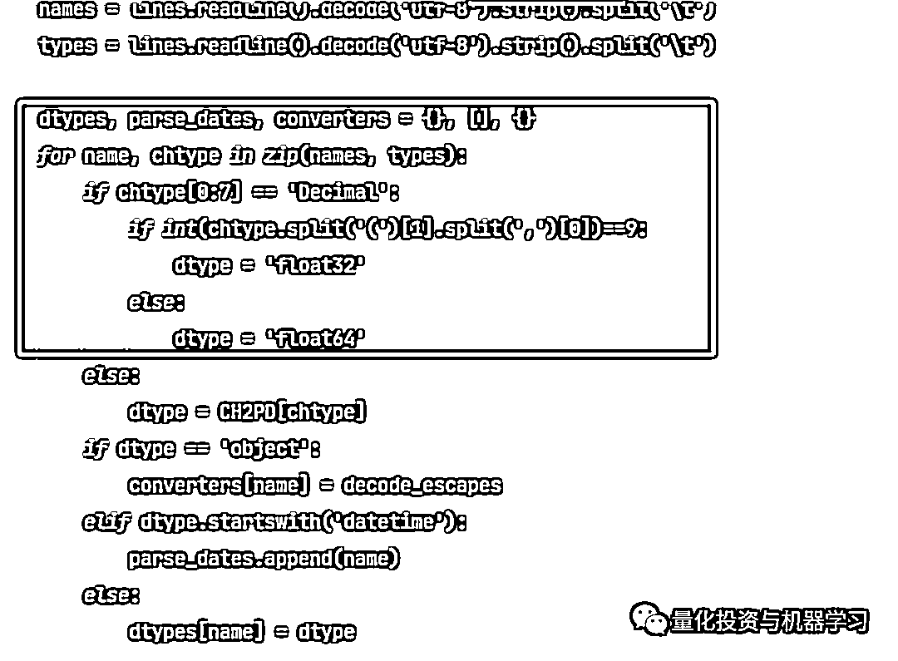

# 一千、倍！ClickHouse 存储 A 股数据实践

> 原文：[`mp.weixin.qq.com/s?__biz=MzAxNTc0Mjg0Mg==&mid=2653313194&idx=1&sn=f7c16e13650dc3ff9517faaf3aad2f35&chksm=802d9abfb75a13a9394ecfc03acc5dfd952f21cfeabe25f07c55a456c1df06132f86f96645f8&scene=27#wechat_redirect`](http://mp.weixin.qq.com/s?__biz=MzAxNTc0Mjg0Mg==&mid=2653313194&idx=1&sn=f7c16e13650dc3ff9517faaf3aad2f35&chksm=802d9abfb75a13a9394ecfc03acc5dfd952f21cfeabe25f07c55a456c1df06132f86f96645f8&scene=27#wechat_redirect)


作者：量化投资与机器学习公众号独家撰写

**前言**

量化回测，苦于 MySQL 久矣，特别是进行**股票日内因子**构建分析或全市场因子测试的时候，每当按下回车时，MySQL 就跟丢了魂一样，查询费时，大吞吐量读取也非常耗时。虽然 MySQL 的优化技巧足够写一本书，但这些都需要交给专业的 DB 工程师去做，量化打工人没有能力更没有时间倒腾这些。那有没有省时省力，高效存储股票行情数据的解决办法呢。带着这个问题，编辑部简单的搜索了一下，总体分为几个方案：

1、用二进制文件分日期分股票存储，比如 HDF5。
2、使用 SQL Server 等支持分区表的事务型数据库。
3、使用 hive 这样的离线数据仓库。
4、用 Greenplum 等开源或商业 MPP 数据仓库。
5、InfluxDB, Kdb+和 Clickhouse 等开源或商用的专业时序数据库。

以上大部分技术总体看来就是三个选择：

**1、存文件：**最傻瓜的就是存 csv 文件，但需要手撸一个文件管理系统，后续维护也麻烦。
**2、常用数据库：**MySQL 或 Mongo，这也是大家日常在用的，好不好用心里都清楚。
**3、专业时序数据库：**商业的 KDB，鼎鼎大名，但一个字：贵。开源的 InfluxDB，Clikhouse（惊喜连连）。**为什么选择 Clickhouse？**

其实在 2017 年，量化投资与机器学习公众号就专门写了 2 篇文章介绍了 Clickhouse，可能在当时，社区还不够完善和活跃，大家对 Clickhouse 的认知度还不够，但是我们一直觉得 Clickhouse 是个好武器！

 ClickHouse：一款适合于构建量化回测研究系统的高性能列式数据库（一）

2017-07-27

 ClickHouse：一款适合于构建量化回测研究系统的高性能列式数据库（二）

2017-07-28


为什么 Clickhouse 适合且特别适合量化研究回测的场景，回答这个题，我们可以先了解几个概念。

**OLAP VS OLTP**

OLAP 是联机分析处理的简称，通俗的讲，**OLAP 的场景侧重对大量的数据进行多维度的分析**。数据批量导入后，分析师需要对数据进行反复分析，持续测试。数据读取的次数要远多于写入次数。OLTP 是联机事务处理的简称，通常是针对某一项小事务对数据进行不断的增删改查，比如在线购物、交易就是典型的 OLTP 场景。



很明显，量化研究回测就是一个典型的 OLAP 场景，首先我们需要快速的导入大量的历史数据，然后我们需要对大量的历史数据进行读取分析。**Clickhouse 等专业的时序数据库就是为了满足****OLAP****的场景。而传统的关系型数据库主要面向****OLTP****的场景。**

**行式存储 VS 列式存储**

与传统关系型数据库的行式存储不同的是，**Clickhouse 采用列式存储**，相比于行式存储，列式存储在分析场景下有着许多**优良的特性**。

*   分析场景中往往需要读大量行但是少数几个列。在行存模式下，数据按行连续存储，不参与计算的列在 IO 时也要全部读出，读取时间严重超时。而列存模式下，只需要读取参与计算的列即可，极大加速了查询。


*   同一列中的数据属于同一类型，节省了大量的存储空间，降低了存储成本,从磁盘中读取相应数据耗时更短。

所以列式存储相对于行式存储的优点总结起来：查得快，读的快。



**用 Clickhouse 存储 A 股行情数据**

**安装**

参考官方文档，不支持 Windows，如在 CentOS 的安装（小编的服务器是 CentOS7.0），只需在命令行执行以下代码：

```py
sudo yum install yum-utils
sudo rpm --import https://repo.clickhouse.tech/CLICKHOUSE-KEY.GPG
sudo yum-config-manager --add-repo https://repo.clickhouse.tech/rpm/clickhouse.repo
sudo yum install clickhouse-server clickhouse-client
sudo systemctl start clickhouse-sever 
```

**操作**

安装完之后，clickhouse 会默认创建用户名为 default，且密码为空的用户。对于 clickhouse 的操作可以通过以下几种方式：

1、clickhouse-client 客户端

在命令行输入 clickhouse-client，默认使用 default 账户连接 localhost 服务器


2、mysql 客户端

也可以通过 mysql 的客户端连接 clickhouse 数据库，在命令行执行以下代码：

```py
mysql --protocol tcp -u default -P 9004 
```



3、GUI 的客户端：DBeaver, Pycharm 专业版也可以连接 Clickhouse（推荐）：





**导入数据**

**股票日度行情数据存 ClickHouse 表设计**

*   只存储股票上市期间的价格数据（大于等于上市日期，小于退市日期）

*   上市期间每个交易日都存，如果没交易，则价格成交量及成交金额等都存为-1（-1 代表空值）。

*   价格数据都会乘以 100 装换为整型，复权因子乘以 1000000 转换为整型，如果直接存为 float 会出现小数位数变化的问题，比如 1258.021545 会变成 1258.0215453 。而如果使用 Decimal 控制精度，在使用 pandahouse 读取数据时需要修改源码。



*空值会影响效率，所以存储时把空值转换为-1

> 在整理行情数据的时候也遇到了很多意想不到的情况，比如暂停上市的股票每周五还出现有成交的行情数据。有些退市的股票不一定会有 ST 的状态，比如暴风影音直接从正常交易转为待退市股票，并没有 ST。量化第一步数据清洗，虽然耗时，但也是对自己负责。

**建库**

可以直接在 clickhouse-client 执行以下语句，创建 stock_data 数据库：

```py
CREATE DATABASE stock_data 
```

**建表**

建库完了就是建表，只有数据表见好了才能往表里导入数据：

```py
CREATE TABLE stock_data.stock_daily_price
(   `trade_date` Date,
    `sec_code` UInt32,
    `open` Int32,
    `high` Int32,
    `low` Int32,
    `close` Int32,
    `volume` Int64,
    `amount` Int64,
    `adjfactor` Int32,
    `st_status` Int16,
    `trade_status` Int16
) ENGINE = ReplacingMergeTree() 
ORDER BY (intHash32(sec_code), trade_date) 
```

**说明**

*   默认都是非空，如果允许空，则使用 Nullable(Int32)的字段类型声明。

*   注意：amount 和 volume 设置为 Int64，防止数据超范围。

*   ENGINE 是表引擎，默认使用 MergeTree，这里使用 ReplacingMergeTree 是为了防止重复值。

*   ORDER BY 表示对某几列数据进行排序，比如这里对股票代码和日期进行排序，ORDER BY 的列也会被设置为索引。

**导入数据**

我们使用 python 读取 csv 并进行数据清洗后，在存入 clickhouse 中，所以需要用 python 连接 clickhouse，有以下两种方法：

*   clickhouse-driver：主要用于操作数据库，而不是读写数据。如果用于读取数据，获取的数据还需要进行类型的转换，不如直接用 pandahouse 来的便捷。

*   pandahouse：类似 pandas 的 to_sql 和 read_sql，可以将 clickhouse 的数据直接读取为 Dataframe



**数据类型为 Decimal 时，pandahouse 会出现异常报错，原因是由于 pandahouse 里面没有对 Decimal 的数据类型作相应的转换，可以在源文件做以下修改：**

```py
# convert.py 
```



**对比**

编辑部一共在数据库里存入了 4300 只股票所有的历史行情，一共 1100 多万行，虽然没有做严格的速度测试，但对以下简单查询语句在同一机器的 MySQL 和 Clickhouse 进行了对比。

**MySQL 2620ms  VS  Clickhouse** **10ms**

```py
SELECT COUNT(sec_code) FROM stock_daily_price; 
```

**MySQL 725ms  VS  Clickhouse** **18ms**

```py
SELECT COUNT(distinct (sec_code)) FROM stock_daily_price; 
```

**MySQL 10ms VS Clickhouse** **2.2ms**

```py
SELECT * FROM stock_daily_price WHERE sec_code='600000.SZ' LIMIT 10; 
```

量化研究，特别是多因子测试，经常需要**获取上千只股票，不同日期的价格数据**，所以我们在 Python 中直接连接数据库取数据，读取**1000 只股票 2017 年-2020 年的行情数据**（都使用 in 操作符），其中：

Clickhouse 用时：**132ms**

MySQL 用时**：145 秒**

**Clickhouse 的速度是 MySQL 的****1000 倍！**

量化投资与机器学习微信公众号，是业内垂直于**量化投资、对冲基金、Fintech、人工智能、大数据**等领域的主流自媒体。公众号拥有来自**公募、私募、券商、期货、银行、保险、高校**等行业**20W+**关注者，连续 2 年被腾讯云+社区评选为“年度最佳作者”。