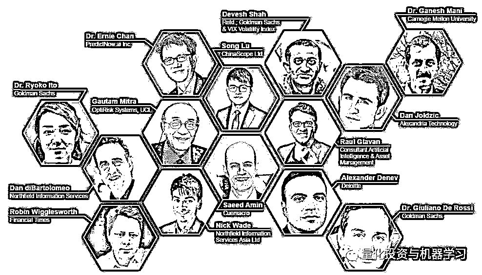

# 三、月量化峰会：AI、机器学习、情绪分析

> 原文：[`mp.weixin.qq.com/s?__biz=MzAxNTc0Mjg0Mg==&mid=2653313087&idx=1&sn=0acb5b6674b944794b535a00bdbb706d&chksm=802d9a2ab75a133cf31cd7d9d536485ab6b854aa01b0dcdf75231341e029c27ea94c2514e043&scene=27#wechat_redirect`](http://mp.weixin.qq.com/s?__biz=MzAxNTc0Mjg0Mg==&mid=2653313087&idx=1&sn=0acb5b6674b944794b535a00bdbb706d&chksm=802d9a2ab75a133cf31cd7d9d536485ab6b854aa01b0dcdf75231341e029c27ea94c2514e043&scene=27#wechat_redirect)

***1***

**Financial Evolution**

量化投资与机器学习公众号（简称：QIML）作为国内量化圈 TOP 自媒体，一直致力于为全网 Quant 提供优质的研究内容与新闻资讯。 

近日，英国知名量化教育机构 UNICOM 将在**本月 24-25 日**在**线上**举行一场别开生面的线上量化峰会▼

**QIML 作为 UNICOM 大中华地区唯一指定媒体合作伙伴**，将为大家同步这场量化峰会！

**注意！**  

由于此次量化峰会属于**付费模式**，价格在**$99~$249**。

**但是！**

QIML 为国内量化爱好者争取到了巨大的福利，那就是：

**免费参加！！！**

希望大家能够积极踊跃报名，QIML 将不断为你们带来福利与惊喜！

***2***

**具体报名方式**

请大家**扫码下方二维码**或者点击**阅读原文**，填写报名信息：

**报名信息一定要用英文填写！**

**主办方会在峰会开始前 7-10 天**，为大家统一发送线上参会方式，**届时请各位注意查收****邮****箱****！**

***3***

**峰会介绍**

时间：**3 月 24 日—25 日，16:30-20:30（北京时间）**

形式：**线上** 

权益：**免费（仅针对 QIML 读者）**

**2、演讲嘉宾介绍**

在这里主要介绍一下 Ernie Chan 博士： 

Ernie1988 年在多伦多大学获得理学士学位，1991 年获得理学硕士学位，1994 年获得康奈尔大学哲学博士学位。PredictNow 创始人。自 1994 年以来，Ernie 的职业生涯一直专注于开发统计模型和先进的计算机算法从大量数据中发现模式和趋势。他也是 QTS Capital Management 的创始人。同时，Ernie Chan 博士也是新加坡南洋理工大学大学金融学兼职副教授，西北大学数据科学硕士项目的兼职教师。

想必国内很多量化爱好者都看过这本启蒙书籍：

没错，这本就是 Ernie Chan 博士写的，国内也对其进行了翻译出版。同时还有这两本大家耳熟能详的书籍也是 Ernie Chan 博士所写：

十分期待届时 Ernie Chan 博士的精彩演讲！ 

**3、会议议程介绍**

**3 月 24 日，16:30-20:30（北京时间）**

**3 月 25 日，16:30-20:30**（北京时间）****

请大家**扫码下方二维码**或者点击**阅读原文**，填写报名信息：

**报名信息一定要用英文填写！**

主办方会在峰会开始前 7-10 天，为大家统一发送线上参会方式。**届时请各位注意查收邮箱！**

**点击阅读原文，免费报名参会！**