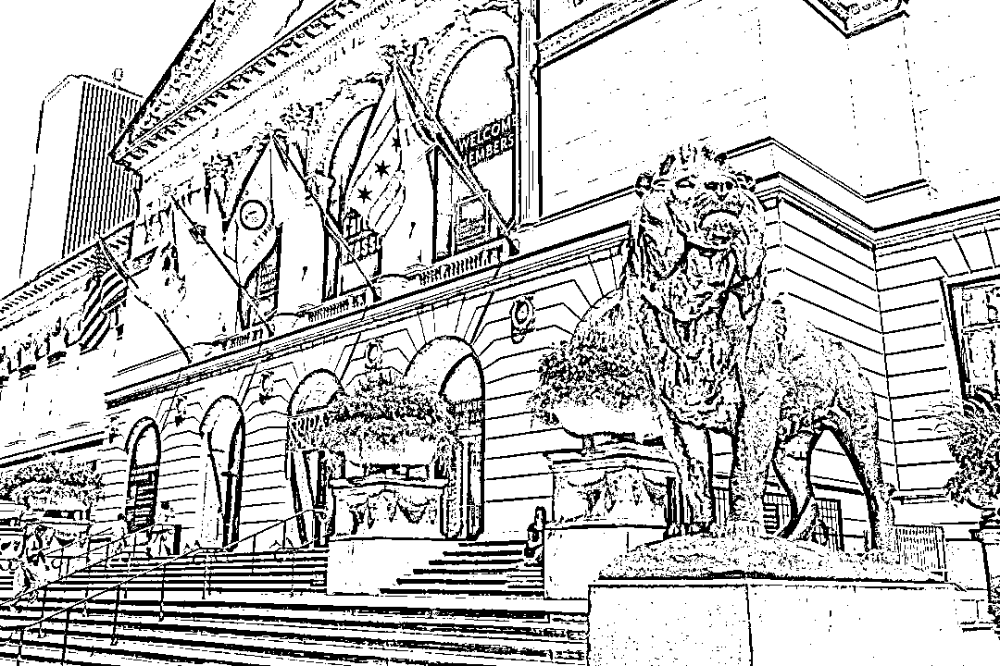

# Citadel 掌舵人：芝加哥首富 Ken Griffin 的赚钱奇遇

> 原文：[`mp.weixin.qq.com/s?__biz=MzAxNTc0Mjg0Mg==&mid=2653312530&idx=1&sn=0747519c64de86df26772a0ef03c524c&chksm=802d9407b75a1d11c101ec4635d359eb110f7fd761255b6b5632f4b423c69c77e16bd15b8632&scene=27#wechat_redirect`](http://mp.weixin.qq.com/s?__biz=MzAxNTc0Mjg0Mg==&mid=2653312530&idx=1&sn=0747519c64de86df26772a0ef03c524c&chksm=802d9407b75a1d11c101ec4635d359eb110f7fd761255b6b5632f4b423c69c77e16bd15b8632&scene=27#wechat_redirect)

### **全网 Quant 都在看！**

作者：哎克丝

今天，我们来聊聊芝加哥最富的男人，Ken Griffin。

他曾多次坐上伊利诺伊州富豪榜第一位，是对冲基金巨头 Citadel 的掌舵人，买豪宅名画上瘾，曾给哈佛大学捐过历史上数额最高的一笔捐款，上演过对冲基金圈的世纪离婚，还曾在中国疫情爆发时慷慨解囊。

Let's 搬好小板凳，八卦下这位富豪的传奇人生！

 图片来自：Chicago Magazine

**富三代的致富经 **

**小说都不敢这么写的真·霸·总 **

1968 年，Ken Griffin 出生在佛罗里达州的代托纳比奇。

学生时期，Griffin 是个校园活跃分子，不过不是在参加 Party 这方面。

在博卡拉顿社区高中读书时，Griffin 是数学俱乐部的主席，他还在自己的卧室里创办了一个专卖给学校教育软件的公司，叫做 EDCOM。

佛罗里达州劳德代尔堡的本地报纸 Sun-Sentinel 上，18 岁的 Griffin 曾刊登过一篇文章，名为：

***For team of Boca students, ***

***computer’s screen is arena.***

***博卡的同学们，***

***电脑屏幕是角斗场。***

啧啧，那可是在计算机还远未普及的上世纪 80 年代啊。

靠着吊打同龄人的经历，Griffin 被哈佛大学录取。1987 年，还在念大二的 Griffin 用一台传真机、一台电脑和一部电话，在宿舍里开始了他的基金创业之旅。Griffin 后来说，他需要试着跟他的孩子解释：老爹在做这个事儿时，还没有互联网。当时因为互联网远未兴起，为了得到实时的股价，Griffin 向哈佛申请，允许他在寝室屋顶上摆一个大碗一样的卫星接收器。他发现可转换债券的交易效率不够高，于是他一边精进自己的编程技术，一边从自己的姥姥、牙医还有亲戚那里筹集了 10 万美元的启动资金，在梅林证券开了一个经济账户。紧接着，他游说哈佛的学生们向自己投资，并建立了一个可转换债套利的组合。1987 年，他的基金以 26.5 万美元的价格发行。毕业时，他的基金已价值 100 万美金。 图片来自：Harvard Crimson 大学毕业后，Griffin 搬来芝加哥，在 Glenwood Capital Investments 的创始人 Frank Meyer 麾下工作。Meyer 极赏识 Griffin 的才华，在 90 年代就给了他这个毛头小伙子 100 万美金让他进行管理。Meyer 的信赖并没有错付，Griffin 在一年之后让这笔资金的回报率高达 70%。1990 年，Griffin 用 Meyer 给的 400 万美金的资金创建了 Citadel。如果说在 Griffin 考入哈佛时，他是个有头脑、有名校金字招牌、身高 183cm 的高富帅；当 Griffin 在大学里靠基金赚到人生的第一桶金后，他已然是个金光闪闪的小开；那么在他成立 Citadel 后，Griffin 便好似驾驶着巨型捕捞船，将全球的财富不断收入他的大网。 图片来自：Wall Street Journal1998 年，Citadel 已拥有 100 多名员工，管理着超过 10 亿美元的投资。虽然 Griffin 也曾因为挖同类公司的墙角，被别家 CEO 发公开信警告，但 Citadel 依然将世界一众顶级名校的博士们收入麾下。他们利用复杂的数学模型来建模和分析，使得 Citadel 成为了定量研究领域的佼佼者。Third Point 的 CEO Daniel Loeb 给 Griffin 的公开信节选 2008 年金融危机期间，Citadel 的两支明星基金在 10 个月里亏损了 35%，曾让 Citadel 这台金融巨兽元气大伤。当时 Griffin 在给投资人的道歉信中说，这个困境源于自己的过度自信，“我宁愿当时少用一些杠杆，”不过他相信自己有能力扭转任何市场灾难。于是，Let’s 乘风破浪。在减持或退出流动性差资产的同时，Citadel 把重点放在了全球股票、可转债、能源和欧美国债等大型市场上；到了 2009 年 11 月，Citadel 的主要基金涨幅达到了 58%。如今，Citadel 共管理着 330 亿美金，而 Citadel Securities 是华尔街最大的做市商之一，管理着美国 1/5 的股票。根据 2021 年福布斯的统计，Griffin 在 Citadel Securities 的股票价值为 112 亿美元，他也以 150 亿美元的身价坐拥 2020 全球富豪榜第 34 位。**资本巨兽：Citadel**

Citadel 的总部位于芝加哥 131 S Dearborn St 的一座大楼里面。在这座 37 层大楼的高层，向下看是 Loop 区的车水马龙，向外远眺是密歇根湖的风光，不过在这里工作的人恐怕没有太多兴致欣赏风景。他们面前是浮动的数据和各种密密麻麻的复杂公式，因为瞬息万变的股价，他们每一秒的操作都决定着百万美金的得失。而 Citadel 的文化，更是高度强调严谨和保密性。 曾有文章盘点过，比进录取率 5.8%的哈佛本科更难的地方，进入 Citadel 位列难度榜 Top 1：*“众所周知，在华尔街找份工作很不容易；而想去对冲基金公司 Citadel 工作，则几乎是不可能的。Ken Griffin 是哈佛校友。他在 CNBC 上说，他的公司计划在 10000 个申请者中，录用 300 位员工。也就是说，该公司录取率仅为 3%！”**---学霸山丘 CEO Bowen Guo* 在一亩三分地上有网友提问，Citadel 这个公司难进吗？下方回复都是清一水的：“这是排的上名的大害鸡房（hedge fund)，挤破头的地方。”“很难进…羡慕能进去的人，要大牛，pay 的好，我这种连简历都递不进去。”“我认识的进去的都是名校物理数学博士…进去了如果三个月做不出阿尔法也会压力山大。”清华、北大、哈佛、普林斯顿、芝大…拥有名校毕业证只是敲门砖，还得经历层层（变态）复杂的笔试和面试，才能斩获 offer。可如此严苛的招人标准，恰恰激起了一水儿中国大牛们无人可挡の胜负欲。Citadel 的外籍员工比例中，中国人名列前茅。其中 Citadel Securities 的 CEO 赵鹏，就是土生土长的北京人。2017 年，年仅 34 岁的赵鹏凭借卓绝的战略眼光和商业思维，成为了 Citadel Securities 的 CEO, 并于 2019 年登上了福布斯 40 Under 40 的榜单。  图片来自：ForbesCitadel 的工资待遇倒也没什么特别的。**不过就是实习生拿 5 位数月薪，公司顺便包 5 星级酒店给你住，不过就是工作两年开玛莎拉蒂，不过就是留学生最快赚回几百万学费的地方，不过就是跳槽进去，年薪翻倍罢了。**我不馋，一点也不馋。不过看到员工福利，就真心让人柠檬精上身了。总结起来就是两个字：**包场**。去 Six Flags 坐过山车, 看 Hamilton 歌剧，去迈阿密私人海滩度假…全部包场!抱好你身边在 Citadel 工作的小伙伴的大腿，请他们下次包场时一定分你张亲友票，带着你去见见世面！**那些姥姥教给 Griffin 的事 **Griffin 曾为母校哈佛大学捐了 1.5 亿美金，这也是哈佛历史上收到数额最大、最慷慨的一笔捐款。Griffin 说，这笔钱也是为了来纪念自己的姥姥，Genevieve Huebsch Gratz。一直到现在，许多美国人上大学都需要申请助学贷款，而在 1990 年代，Gratz 用自己的积蓄，将五个孙子孙女全部送入大学并为他们支付了学费，其中就包括为 Griffin 付清了在哈佛的所有费用。 Griffin 在哈佛捐款的接待会现场在给 Gratz 的悼词上，Griffin 将自己的成功，全部归功给了她。不只是金钱的资助，Griffin 说，姥姥教会他最重要的是努力和善良。在 1959-1963 年间， Gratz 的父母、兄弟和丈夫先后去世。至亲的离世，让经营家里在伊利诺伊州 3 个农场，一个种子公司和一个大型燃油厂的责任，全都压在了她这个年纪尚轻的寡妇身上。在 Gratz 在她后来的回忆录里写到，自己的丈夫离世后，紧接着就有从芝加哥来的、“穿着很华丽“的银行的人，说有买家想买她的油厂，让她卖厂签字。而 Gratz 当时的回应，放到爽文小说里也毫不违和：“我很随意地向上看了看，说，‘你们没一个人知道罐头瓶和油瓶的区别吧？我的生意我自己管。如果我失败了，我也自己负责。’“Griffin 说姥姥还曾跟他讲，因为冬天天气冷，许多人付不起加油费，她就让他们继续加油，等天暖和了再一起还。好在坚韧开出了花，前半辈子努力要强的老人，在孩子孙子们的陪伴下安度了晚年。Gratz 曾写道，Griffin 经常在读百科全书时睡着，喜欢收集硬币，还说等宇宙飞船能载人时，邀请姥姥陪他一起做第一批乘客。在 Gratz 要进行一台风险性很大的手术之前，Griffin 请所有人都离开手术室，确认姥姥做手术时决心已定。在护士推着她的轮椅往手术室走的时候，她还不忘对 Griffin 喊道，别忘了按时帮我报税啊！2010 年夏天，Gratz 在吃完早餐之后，去床上躺着然后安详地离世了，享年 98 岁。**霸总亲身示范：****男人，敢花才会挣 **富豪们的有钱都是那么相似，爱好却各有各的不同。不同于马云喜欢 Cosplay，王健林喜欢唱歌，Griffin 的爱好就显得朴实无华且枯燥，那就是买，买，买。**艺术品买不买？****买！**2016 年，他豪掷 5 亿美金买了两幅油画，破了当时最高的私人艺术品交易记录。一幅是价值 3 亿美金、Willem de Kooning 1955 年的油画 Interchange；另一幅是 Jackson Pollock 1948 年的画 Number 17A。即使在各行各业生意都不景气的 2020 年，他也花了 1 亿美元，买了 Jean-Michel Basquiat 的油画 Boy and Dog in Johnnypump，并将这个私藏挂在了芝加哥艺术博物馆，供大家欣赏。**豪宅买不买？****买！**2015 年，他在迈阿密海滩花了 6 千万美元买下了当地最贵的顶层公寓；2019 年，他花了 5 千多万美元，买下了芝加哥高级公寓的几层楼，紧接着，他在英国伦敦花了 1.22 亿美元，买下了当地最贵的房子之一，距离白金汉宫仅一街之隔。他还怒买了美国最贵的房子，位于纽约曼哈顿中央公园以南、售价 2.38 亿美元的顶层别墅。图片来自：business insider 这还只是这位富豪房产的一部分，据 Business Insider 统计，这些年他买楼买地花的钱已超过了 8 亿美金。真心建议 Griffin 退休后开个小红书账号，分享他买过的名画，做一个 room tour 带大家看自己各地的豪宅，而且做用品评测绝不恰饭做推广！保准粉丝数量跟他做 Citadel 挣的钱一样，涨的蹭蹭的。**对亿万富豪来说，爱情是什么滋味？**有钱有名如 Griffin，背靠钱打的江山, 还是绕不过婚姻的围城。Griffin 的第一任妻子是他的高中同学 Katherine Weingartt。2003 年，在与第一任妻子离婚后，Griffin 与同是建立于伊州的投资基金 Aragon Global Management 的创始人 Anne Dias 结婚。Argon 曾被 US Banker 评估为由女性运营的估值最高的对冲基金，而 Anne Dias 还是 Eurazeo， 一家总部位于巴黎的上市投资公司的管理委员会成员，在乔治敦大学当教授开设对冲基金战略课程，以及哈佛商学院院长顾问委员会的成员。无论是才智、野心还是颜值，两人可谓是强强结合，一时风光无两。他们的婚礼在凡尔赛高调举行，当时 Cirque du Soleil 和 Donna Summer 都曾在婚礼上表演。如果说两人的相遇是烈火烹油，可故事的结尾只算惨淡收场。2015 年，两人在芝加哥法庭进行了长达 17 小时的庭审，被外媒称为“对冲基金圈的世纪离婚” 。Anne Dias 曾控诉 Griffin 不允许她继续住在芝加哥的公寓里，不支付他们“书面上”约定好的该付的钱，说他堂堂一州首富竟然拒付三个孩子的生活费。而 Griffin 的发言人表示 Anne Dias 的这些言论简直“无底线”。发言人曾表示，“在两人分居期间，Griffin 已经支付了所有该付的钱，甚至一些不该他出的钱，包括给 Anne 几百万的现金以及以 Anne 的名义赠送给哈佛价值 1000 万美金的礼物。但像 Anne 那些令人发指的荒唐要求，比如去圣巴泰勒米（法属在加勒比海上的领地）45 万美金的度假费，就真是太过分了。”圣巴泰勒米 Anne Dias 的发言人也呛声回击，“Griffin 说自己付了 Anne Dias 去圣巴泰勒米的度假费纯属假的。Anne Dias 去那是为了和孩子一起过圣诞节，花费远没有说的 45 万美金那么多，并且这钱是 Anne 自己付的。另外以 Anne 之名送给哈佛礼物也是假的，那份礼物明明署了他们两个人的名字。”两人的离婚官司主要围绕婚前协定的有效性，也在争夺他们三个孩子的抚养权的判定。Griffin 想共同抚养，而 Dias 想独自抚养，因为她想带着三个孩子离开芝加哥，去纽约和湾区继续搞事业。**做慈善，Griffin 是认真的 **有外媒评价过 Ken Griffin，虽然他不是世界最富有的人，但他在买房、买画和捐款上，一定名列前茅。迄今为止，Griffin 共计捐款超过 10 亿美元。为了纪念他给芝加哥大学经济系的 1.25 亿美元捐款，芝大经济系改名为 Kenneth C. Griffin Department of Economics.他也曾为许多机构捐过钱，比如芝加哥安与罗伯特卢里儿童医院、菲尔德自然历史博物馆、芝加哥艺术博物馆、现代艺术博物馆和美国自然历史博物馆等。**2020 年，COVID-19 疫情在全球肆虐，Citadel 以及 Citadel Securities 共计向中国、芝加哥、纽约和英国等各个地方和组织捐款了超过 2 亿美元。**其中在去年二月份中国疫情爆发最严重之时，**Citadel 向湖北省捐款 750 万美元。**在医疗物资最匮乏的时候，他们还用其中一部分钱直接从英国购买了口罩、防护服和消毒产品等最急需的防疫物资，帮助中国度过难关。**单论这个事，Salute!**这位富豪的传奇人生还在继续，不过故事看到这里，已经感觉真实的人生，比小说还精彩了。**一个朴素的小心愿，希望为本文点赞、在看和分享的朋友，早日变成亿万富翁（或亿万富翁的父母）！**量化投资与机器学习微信公众号，是业内垂直于**量化投资、对冲基金、Fintech、人工智能、大数据**等领域的主流自媒体。公众号拥有来自**公募、私募、券商、期货、银行、保险、高校**等行业**20W+**关注者，连续 2 年被腾讯云+社区评选为“年度最佳作者”。