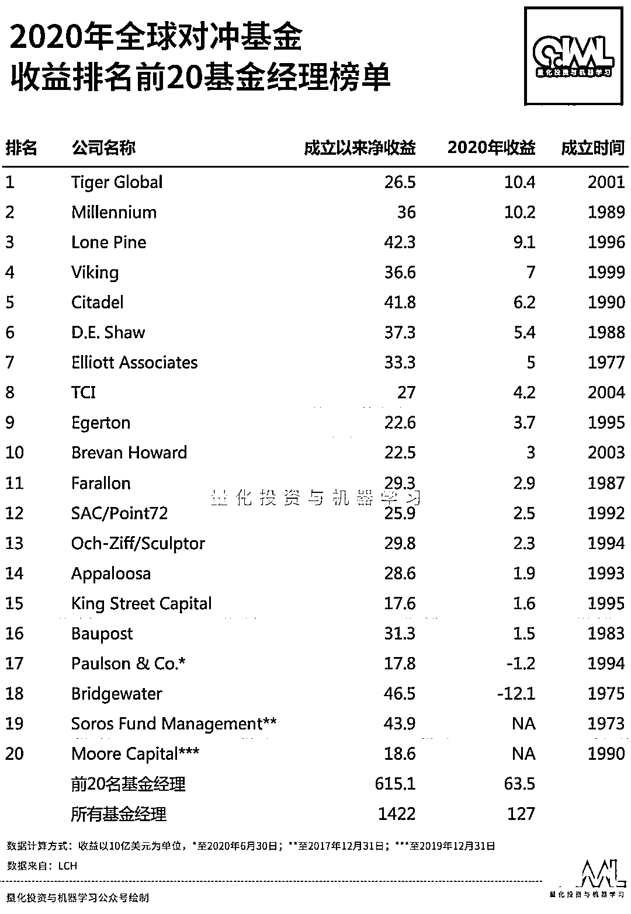
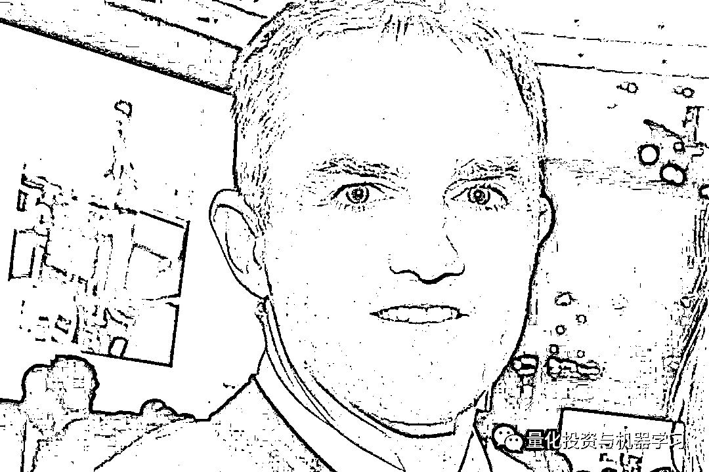

# 三十八、亿美元，小团体作战！全球最赚钱的对冲基金经理

> 原文：[`mp.weixin.qq.com/s?__biz=MzAxNTc0Mjg0Mg==&mid=2653312479&idx=1&sn=fab3df73b6078503058efbedf2197bbd&chksm=802d97cab75a1edc2580165837aa12d776cadf35edd5e153fab17b044973724c80ab5fc2833e&scene=27#wechat_redirect`](http://mp.weixin.qq.com/s?__biz=MzAxNTc0Mjg0Mg==&mid=2653312479&idx=1&sn=fab3df73b6078503058efbedf2197bbd&chksm=802d97cab75a1edc2580165837aa12d776cadf35edd5e153fab17b044973724c80ab5fc2833e&scene=27#wechat_redirect)

### 

**全网 Quant 都在看！**

**对于全人类来说**

**这是糟糕的一年**

**对于对冲基金大佬来说**

**这是美好的一年**

《机构投资者》发布的 2020 年全球对冲基金经理年度收入榜单在昨日揭晓，让我们都有谁在 TOP10！

**第一名**  

**$3,800,000,000**  

**Israel (Izzy) Englander：Millennium**

**旗舰基金收益率：+26%**

Englander 去年赚了 38 亿美元，约合 265 亿人民币！

Israel (Izzy) Englander

Millennium 在 2020 年确实表示很好，Englander 在过去 20 年中有 19 年上榜（去年并列第三）。根据彭博亿万富翁指数榜（共 500 位）2021 年最新**金融-对冲基金**行业的排名中，Englande 也是榜上有名！

**Millennium 依靠“小团体”（独立运营团队）来管理其资金！**

Englander 表示，截至 2020 年，Millennium 拥有超过 265 个“小团体”，这是 Millennium 史上最多的。而两年前，只有 200 个。

“小团体”通常由一名或多名投资组合经理和分析师组成，最小分队可以只有两人。**每个团队的收益与其自身业绩成正比。 而千禧年的薪酬结构更加细化：如果你的团队的策略做得好，你就会得到奖励，即使该基金其他团队都出现了亏损。**

**Millennium 的选人也是十分严格的！**

Englander 在近日的年度投资者信中说到：**“我们每年聘用大约 1%的基金经理”**。被 Englander 称为“潜在”的基金经理会进行一系列条件的筛选，这些条件包括：业绩和预期的 Alpha 驱动因素、风险状况和收益波动性，以及基础设施要求和对金融资源依赖等。

**换句话说，你需要有一个良好的业绩记录，能够产生强劲的收益，夏普比率达到 2 或更高**（根据相关报道，**去年 Millennium 整个基金的夏普比率平均为 4.44！！！**）**，而且你的策略不依赖于昂贵的技术基础设施。**

在 Millennium 多元化发展的过程中，越来越多的员工在以往专注于基本面股票和利率策略之外拓展业务。多元化是 Millennium2020 年业绩优异的一个基本因素。Englander 表示：“在过去的一年里，我们在的全部的四项策略以及全球三个区域都取得了很好的收益！”

截止最新数据显示，Millennium 目前 AUM 达 454 亿美元！

数据来自：Preqin

**第二名**

**$2,600,000,000**

**James Simons：Renaissance Technologies**

**旗舰基金收益率：+76%**

根据彭博最新报道：西蒙斯老爷子的文艺复兴科技最近几个月因产品业绩问题，自去年 12 月以来，**投资者已至少赎回大约 50 亿美元。**

根据公开资料显示，**去年 12 月，****客户在三个外部基金中赎回 18.5 亿美元，今年 1 月，客户赎回 19 亿美元。同时，投资者又将在本月赎回 16.5 亿美元。**

分析认为，尽管如果 2 月份有资金流入这些对冲基金，或者投资者决定撤回赎回，赎回潮流可能暂缓。

巨额赎回主要是因为 3 只基金去年的业绩表现惨淡。其中，机构股票基金（RIEF）在 2020 年亏损了 19%，机构多元化 Alpha 基金（RIDA）亏损了 32%，机构多元化全球股票基金（RIDGE）亏损了 31%。不过，其自营基金却取得了惊人收益，大奖章基金去年收益率高达 76%。**内外部基金差目前让市场很多投资者产生了争议！**

**第三名**

**$2,500,000,000**

**Chase Coleman：Tiger Global Management**

**旗舰基金收益率：+48%**

据对 LCH 最新披露的数字显示，**2020 年对冲基金行业获利 1270 亿美元**。Chase Coleman 的 Tiger Global 为客户创造了 104 亿美元的收入！

**从 2020 年的榜单数据中我们可以得出，排名前 20 的基金经理掌管着全球 17%的对冲基金资产，并创造了该行业自成立以来的 1.4 万亿美元利润的 43% 。**

说起第一名老虎基金，QIML 相信很多读者首先想到的是其创始人 Julian Robertson 老爷子。真的是不亏叫老虎：

**无冕之王，咆哮而来！**

*图片来自：网络

Julian Robertson 他所主导的基本面价值投资方法影响了华尔街一代的对冲基金经理。即使在今天老虎系的投资人也遍布整个华尔街比，如现如今 Tiger Global 的老大**Coleman****。**

*图片来自：网络

Coleman 更倾向于风险资本投资，其 360 亿美元的资产中约有一半来自风险资本投资，而他的对冲基金管理着约 100 亿美元。他的业绩一直保持两位数，2019 年的收益率达到 33% ！

科尔曼的老虎全球**只有两次亏损**：

**第四名**

**$1,800,000,000**

**Kenneth Griffin：Citadel**

**旗舰基金收益率：+24%**

根据彭博最新报道，2020 年全球前 15 名对冲基金巨头的收入中，格里芬在基金的收入占比很高，大家看虚线：

根据最新的投资者报告显示，**格里芬的 Citadel Securities 第四季度的净交易收入为 17 亿美元，使得全年的总交易收入达到 67 亿美元！**几乎是 2018 年最高数字的 2 倍！

*图片来自：网络

Citadel Securities 的收入和利润在 2020 年增长了一倍多：

*数据来自：Citadel Securities presentation

目前 Citadel Securities 在美股市场市场的交易份额为 27%，高于 2017 年的 21%。在 order flow 占主导地位，占市场的 46%。

给大家科普一下： 

**Citadel 是一家全球领先的对冲基金**

**Citadel Securities 是一家全球领先的做市商**

**第五、六名（并列）**

**$17,000,000,000**

**Steve Cohen：Point72 Asset Management**

**旗舰基金收益率：+16%**

**David Tepper：Appaloosa Management**

***旗舰基金收益率：+13%***

并列第五的 Point72 的科恩与 Appaloosa David Tepper 都赚了 17 亿美元。科恩还因为今年在 Twitter 发表的一些有关 GME 言论，使其家人受到威胁，关掉了自己的 Twitter 账户。

**相关阅读：** 

不过 QIML 推荐的是 Point72 学院，确实不错！ 

Imagine a company that takes you on a year-long journey of learning and discovery, at the end of which you’ve become a highly-trained, deeply knowledgeable Research Analyst ready to contribute your research and ideas. That’s right – roughly ten months dedicated entirely to your development. That’s what the Point72 Academy can do for you – and it’s something no other Firm does. Are you ready to start your investing career?

***An experience like no other***

*“Point72 研究院将帮助你以一种前所未有的方式思考市场。我们将把你对研究和投资的热情转化为你作为 Point72 分析师所需要的技能。”*

Point72 研究院招募和培训大学毕业生，以速成的培训方式将其培养成为多/空股票投资专业人士。在 12 个月的金融分析师课程期间，学院课程学员将花费 2500 多个小时的时间学习创建和完善金融模型，开展初级研究，策划股票建议，并有效地传递其理念。

学院主任 Jaimi Goodfriend 表示，“Point72 学院转变了我们招募和培养青年投资人才的方式。首期学院课程班的才华和成就让我们大吃一惊，坦率来讲，甚至让我们感到汗颜。我们成功地将 2015 届的每位毕业生安置到我们的投资平台上。”

Point72 国际业务首席执行官 Marc Desmidt 表示：“我们可以将 Point72 在美国的投资方式教给青年才俊，并向他们提供直接与所在区域的投资组合经理共事的机会。”

并列第五的 Appaloosa 已经开始转型家族办公室，其于 2020 年初向多数客户返还资金后，预计将留下 15 名客户。

**第七名**

**$1,600,000,000**

**Philippe Laffont：Coatue Management**

**旗舰基金收益率：+65%**

Coatue 是最大的 long-short 对冲基金之一（AUM 110 亿美金）。由于押注 TeslaWirecard ，Philippe Laffont 的 Coatue 今年实现了 52%的涨幅，使其成为 2020 年全球表现最佳的大型对冲基金之一。

除了旗舰对冲基金，Coatue 还管理私人股权和风险资本等其他资产，总资达 250 亿美元。

**第八、九名**（并列）****

**$1,500,000,000**

**O. Andreas Halvorsen：Viking Global Investors**

**旗舰基金收益率：+27%**

**Scott Shleifer：Tiger Global Management**

**旗舰基金收益率：+65%**

Viking 在今年其三个主要基金都获得了强劲的收益。混合型基金 Viking Global Opportunities 连续第二年成为 Tiger Cub Halvorsen 表现最好的基金，该基金累计上涨 51.6%。

Scott Shleifer 管理着该 Tiger 多头基金和私募股权业务，这是他在 2003 年与 Chase Coleman 共同创立的。

**第十名**

**$1,400,000,000**

**Bill Ackman：Pershing Square Capital Management**

**旗舰基金收益率：+70%**

Ackman 今年有十亿美元的收入。Ackman 在疫情爆发之初做 Pershing Square，使其净赚 26 亿美元。

量化投资与机器学习微信公众号，是业内垂直于**量化投资、对冲基金、Fintech、人工智能、大数据**等领域的主流自媒体。公众号拥有来自**公募、私募、券商、期货、银行、保险、高校**等行业**20W+**关注者，连续 2 年被腾讯云+社区评选为“年度最佳作者”。