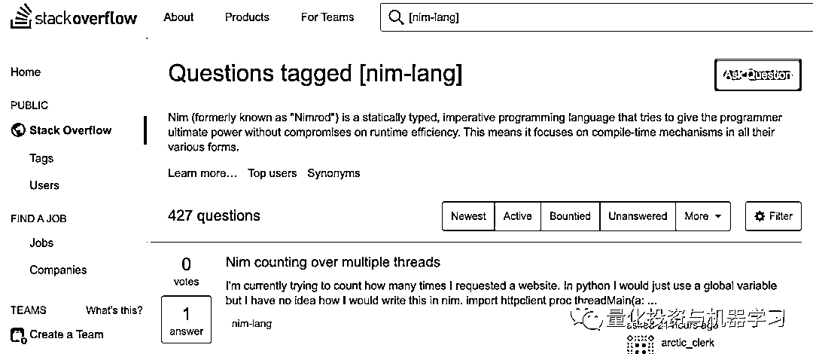

# Nim：高效、优雅！

> 原文：[`mp.weixin.qq.com/s?__biz=MzAxNTc0Mjg0Mg==&mid=2653312355&idx=1&sn=76dfd2a27692436e9298f198b95b879f&chksm=802d9776b75a1e6083eaedf6681e510b8e17f14ac530f220a799c6fcc5812527bd2d093c9568&scene=27#wechat_redirect`](http://mp.weixin.qq.com/s?__biz=MzAxNTc0Mjg0Mg==&mid=2653312355&idx=1&sn=76dfd2a27692436e9298f198b95b879f&chksm=802d9776b75a1e6083eaedf6681e510b8e17f14ac530f220a799c6fcc5812527bd2d093c9568&scene=27#wechat_redirect)

### 


**全网 Quant 都在看！**

# **Nim 是什么？**


它是一种静态的、可编译的、面向对象的编程语言。**Nim 被创建为一种速度与 C 一样快、表现能力与 Python 一样强、扩展能力与 Lisp 一样强的语言**。由于它的语法与 Python 相似，当你不喜欢 C 语言时，Nim 是一个很好的选择。

安装地址：*https://nim-lang.org/install.html*

在 Nim 官网，这段话概括了其强大的性能与特点： 


同时这里还有很好的 Nim 学学习教程：*https://nim-lang.org/docs/tut1.html*


**看看有 Nim 什么？**

我们随便写一段程序：


打印 num: 5 i: 5

**1、变量声明**

JavaScript 程序员对它非常熟悉。虽然有些语言使用 var，有些使用 let，但 JS 和 Nim 都允许使用这两种语言中的任何一种声明。但是，需要注意的是，它们在两种语言中的含义并不相同。

**2、块语法**

为了在 Nim 中标记一个新语法块，使用冒号后跟一个缩进行，Python 亦如此。

**3、关键词**

这两个循环以及 if 语句看起来和 Python 相差无几。实际上，第 5 行以后的所有代码实际上都是有效的 Python (假设我们定义了 echo 函数)。因此，Python 中的许多关键词和操作符在 Nim 中也是有效的，比如 not、is 和 or 等。

看到这里，大家可能觉得 Nim 没有任何特别之处。从语法上来说，它看起来更糟糕（因为需要使用 let 或 var）。

40th 斐波那契数列测试结果：


在我们测试中注意到：通过简单地向 Nim 编译器传递一个 flag，可以将其执行速度提高 10 倍以上。也有一些人做了测试，发现 Nim 甚至比 C 更快。正如官方文档中所述的：***“By default the Nim compiler generates a large amount of runtime checks aiming for your debugging pleasure. With ******-d:releasesome******checks are turned off and optimizations are turned on.”***

Nim 预装了一个名为 nimpy 的模块，还有一个名为 nimporter 的模块可供 Python 使用。后者可以使用 pip install nimporter 安装。当这些语言一起工作时，这两个包将是必不可少的！

还是使用纳菲函数（Naifeh function）寻找斐波那契序列的第 n 个数字。

创建一个名为 Benchmark 的文件夹，里面有 3 个文件：

*   main.py：我们要运行的文件

*   nmath.nim：保存 fib 函数 Nim 版本的文件

*   pmath.py：保存 fib 函数 Python 版本的文件

首先，我们把 fib 函数写在 pmath.py 中：

```py
def fib(n):
    if n == 0:
        return 0
    elif n < 3:
        return 1
    return fib(n - 1) + fib(n - 2)
```

把目光转移到 nmath.nim 上：

```py
import nimpy

proc fib(n: int): int {.exportpy.} =
    if n == 0:
        return 0
    elif n < 3:
        return 1
    return fib(n-1) + fib(n-2)
```

使用 proc 关键字定义函数 fib，将返回类型指定为整数。{.exportpy.}向 Nim 表示此函数将在另一个 Python 模块中使用。 

在 main.py 中，我们将创建一个简单的 benchmark：

```py
import nimporter
from time import perf_counter
import nmath # Nim imports!
import pmath
print('Measuring Python...')
start_py = perf_counter()
for i in range(0, 40):
    print(pmath.fib(i))
end_py = perf_counter()

print('Measuring Nim...')
start_nim = perf_counter()
for i in range(0, 40):
    print(nmath.fib(i))
end_nim = perf_counter()

print('---------')
print('Python Elapsed: {:.2f}'.format(end_py - start_py))
print('Nim Elapsed: {:.2f}'.format(end_nim - start_nim))
```

nimporter 包将 Nim 导入解析到常规的 Python 模块中，以便像使用原生模块一样使用。很酷！

要运行这段代码，请在命令提示符中输入常用的 python main.py 命令：

```py
Python Elapsed: 33.60
Nim Elapsed: 1.05
```

不过要记住，速度的差异可能取决于完成的任务。

根据 Github 用户测试的结果来看，Nim 还是不错的： 


https://github.com/UNIcodeX/PCPC

**为什么 Nim 比 Python 快呢？**

**1、Nim 是在解释 Python 的同时进行编译的。**这意味着当 Python 程序运行时，要做的工作比仅仅运行程序还要多，因为在实际执行之前需要对程序进行解释。这通常会使语言变得很慢。

**2、Nim 是一种静态类型语言。**对于动态类型的 Python 来说，解释器需要做更多的工作来找出并适当地处理类型，这也降低了执行速度。

下面是 Python 官方文档对**解释型语言**的解释：

***“Interpreted languages typically have a shorter development/debug cycle than compiled ones, though their programs generally also run more slowly.”***

这句话很好地总结了 Python 和 C 之间的博弈。你用 Python 做的事情，也可以用 C 做，但你程序的运行速度会快 N 个数量级。 

然而，你将花费更多时间在的编写和调试代码上，而且代码将越长，可读性越差。这就是为什么 C 语言不再向之前那样流行，而 Python 却如此火爆的原因。简单地说：Python is easy（相对而言的 easy）。

**所以，如果 Python 是在这个范围的一端，而 C 在另一端，那么 Nim 试图在中间的某个地方：稍微快点，稍微容易点，哈哈~**

然而，让 Nim 脱颖而出的是，乍一看，似乎把这种权衡最小化了。换句话说：**它比 Python 快得多，但是不像 C 那样难于编程。**

为了说明这一点，让我们看一下斐波那契实验中的代码。

C 代码：

```py
#include <stdio.h>

int fibonacci(int n) {
    if (n <= 1) {
        return n;
    } 
    return fibonacci(n-1) + fibonacci(n-2);
}

int main(void) {
    printf("%i", fibonacci(40));
}
```

Python 代码：

```py
def fibonacci(n):
    if n <= 1:
        return n
    return fibonacci(n-1) + fibonacci(n-2)

print(fibonacci(40))
```

Nim：

```py
proc fibonacci(n: int): int = 
    if n <= 1:
        return n
    return fibonacci(n-1) + fibonacci(n-2)

echo(fibonacci(40))
```

虽然 Nim 有 proc，使用=来声明函数，但它仍然比 C 简洁很多！

**未来可期**

在 2020 年 Stack Overflow 的调查中，Nim 甚至没有被提及。Stack Overflow 标签上也只有 427 个问题：



与 Python 的 150 万相比，不值一提！

我们也可以认片面的认为大多数开发人员没有使用过它，而且很多人甚至从未听说过 Nim 这个名字。

老实说，Nim 很酷的！

**Nim 能和 Python 抗衡吗？**

目前来说，**Nim 还不足以挑战多才多艺的 Python！**

也有一些人告诉我们：**Nim 更适合从 C++过渡的人，而不是从 Python 过渡的人！**

**Nim 句法关键点的简要概述**

更多的内容大家自行查看官。

**1、变量**

变量用 var、let 或 const 声明。

注意：虽然 let 在 JavaScript 作用域方面与 var 不同，但 Nim 表示一个变量，其值在初始化后不能更改。和 Swift 很像。

对于 const，编译器必须在编译时确定值，而 let 可以在运行时确定。

文档案例：

```py
const input = readLine(stdin) # Error: constant expression expected
let input = readLine(stdin) # works
```

此外，变量还么有这样声明：

```py
var
    a = 1
    b = 2
    c = 3
    x, y = 10 # Both x, y are assigned to 10
```

**2、函数**

Nim 中的函数称为 procedure，声明是这样执行的：

```py
proc procedureName(parameterName: parameterType):returnType =
    return returnVar
```

也可使用=代替：

```py
proc hello(s: string) = echo s
```

也可以像这样：

```py
proc toString(x: int): string = 
    result = 
        if x < 0: “negative” 
        elif x > 0: “positive” 
        else: “zero”
```

感觉上你还是应该 return result，但 result 不是变量，而是关键词。上面的代码片段是完全有效的。 

## **3、Control flow**

对于在 range 上迭代，大家可以使用 countup(start, finish)，或者 countdown(start, finish)而不是 range。或者你可以简化整个事情并使用: for i in start..finish

## **4、宏**

## Nim 支持宏和元编程（Metaprogramming），很重视这块！先忙有一章专门介绍：


https://nim-lang.org/docs/tut3.html

示例：

```py
import macros 
macro myMacro(arg: static[int]): untyped = 
    echo arg 

myMacro(1 + 2 * 3)
```

## **5、JavaScript 编译**

来自 Nim 官网： 

***“Nim includes a first-class JavaScript backend so you can target the client and server effortlessly at the same time.”***

如果你想用 Nim 编写贪吃蛇，您可以试试！


https://picheta.me/snake/

量化投资与机器学习微信公众号，是业内垂直于**量化投资、对冲基金、Fintech、人工智能、大数据**等领域的主流自媒体。公众号拥有来自**公募、私募、券商、期货、银行、保险、高校**等行业**20W+**关注者，连续 2 年被腾讯云+社区评选为“年度最佳作者”。