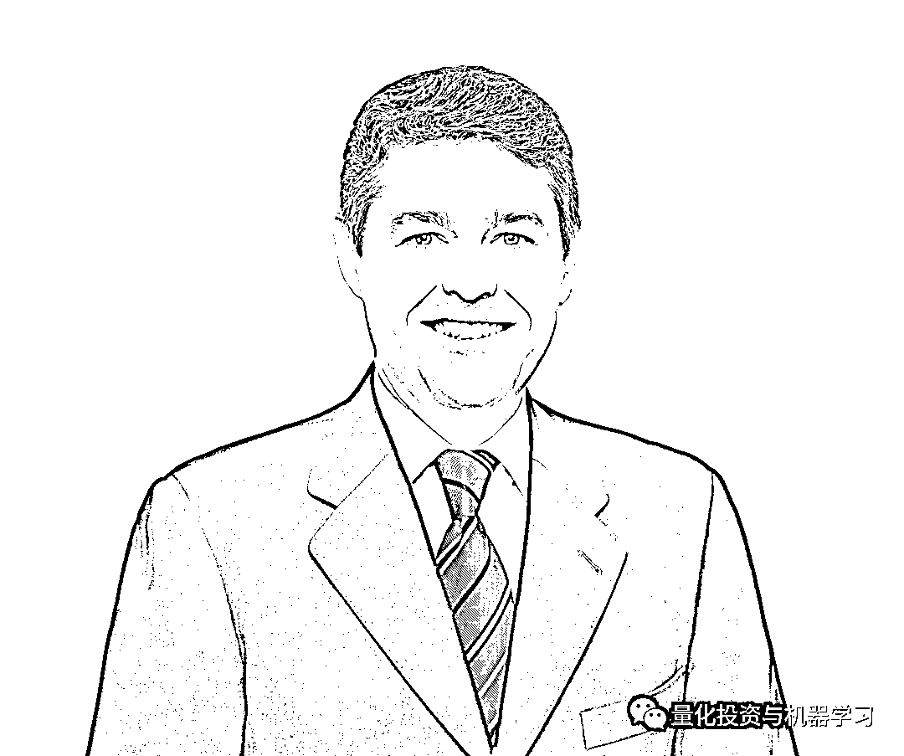

# JPM 2020 年度 Quant：Campbell R. Harvey

> 原文：[`mp.weixin.qq.com/s?__biz=MzAxNTc0Mjg0Mg==&mid=2653312298&idx=1&sn=36e55d4ee72013318b948b7c08000b36&chksm=802d973fb75a1e29953ab96562579fb2a4aabbac3cc5b85eb47662ffa0ed4141329627bdcb5c&scene=27#wechat_redirect`](http://mp.weixin.qq.com/s?__biz=MzAxNTc0Mjg0Mg==&mid=2653312298&idx=1&sn=36e55d4ee72013318b948b7c08000b36&chksm=802d973fb75a1e29953ab96562579fb2a4aabbac3cc5b85eb47662ffa0ed4141329627bdcb5c&scene=27#wechat_redirect)

### 

**全网 Quant 都在看！**

The Journal of Portfolio Management （简称：JPM）将 2020 年度 Quant 大奖颁发给了 Campbell R. Harvey，表彰其在量化投资组合理论领域的杰出贡献。

Campbell R. Harvey

Campbell R. Harvey，杜克大学金融学杰出教授，马萨诸塞州剑桥市国家经济研究局研究助理。在 2006-2012 年间担任《Journal of Finance》主编，并在 2016 年担任美国金融协会主席。Harvey 教授在芝加哥大学获得商业金融博士学位。LinkedIn 最近还将 Harvey 博士列为 2020 年金融和经济全球 TopVoice。

Harvey 博士提出了利率期限结构可以作为美国商业周期的领先指标的概念。此外，Harvey 博士也扛起了遏制金融文献中普遍存在**P-hacking**行为的大旗，这个问题不能再被否认或忽视。

https://faculty.fuqua.duke.edu/~charvey/Research/Published_Papers/P131_The_scientific_outlook.pdf

石川博士有一篇文章专门介绍了这些方面，大家可以参考：[Campbell Harvey: “Tortured Data”](http://mp.weixin.qq.com/s?__biz=MzIyMDEwNDk1Mg==&mid=2650880221&idx=1&sn=1b4105c37406bf921504018a5baed7bc&chksm=8c24894abb53005cd62e42433713dee19f14466f5f67837bfb8e4168456468b1bf67ad8a9e48&scene=21#wechat_redirect)

Harvey 博士的学术生涯超过 30 年，成就卓著。资产管理公司也高度重视他的提议，这从他担任 Man Group PLC 的投资战略顾问和 Research Affiliates LLC 的合伙人和高级顾问的职位可以看出。

JPM 编辑 Frank J. Fabozzi 表示：“Harvey 博士在学界和业界享有极大的盛誉。多年来，通过学术论文、演讲、博客和视频研讨会，Harvey 博士已经吸引了决策者的注意。我们很自豪地将 Harvey 博士纳入我们的获奖名单。”

Harvey 博士部分研究论文：

**1、Strategic Rebalancing** 下载地址：https://papers.ssrn.com/sol3/papers.cfm?abstract_id=3330134

**2、Alice’s Adventures in Factorland: Three Blunders That Plague Factor Investing** 下载地址：https://papers.ssrn.com/sol3/papers.cfm?abstract_id=3331680

**3、The Best of Strategies for the Worst of Times: Can Portfolios Be Crisis Proofed?** 下载地址：https://papers.ssrn.com/sol3/papers.cfm?abstract_id=3383173

**4、The Impact of Volatility Targeting** 

下载地址：https://faculty.fuqua.duke.edu/~charvey/Research/Published_Papers/P135_The_impact_of.pdf

**附录**

2019 JPM 年度 Quant 是我们熟知的老朋友：**Marcos López de Prado**

Marcos López de Prado

  

**你觉得 2021 年 JPM 年度 Quant 会是谁呢？大胆猜猜看！**

量化投资与机器学习微信公众号，是业内垂直于**量化投资、对冲基金、Fintech、人工智能、大数据**等领域的主流自媒体。公众号拥有来自**公募、私募、券商、期货、银行、保险、高校**等行业**20W+**关注者，连续 2 年被腾讯云+社区评选为“年度最佳作者”。