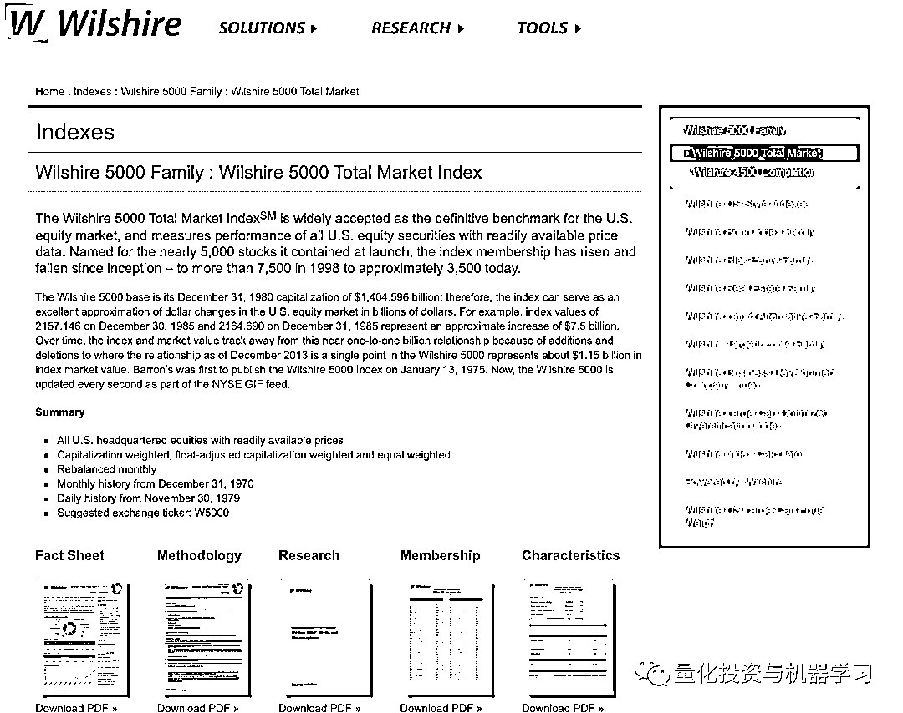

# 巴菲特指标：严重高估！

> 原文：[`mp.weixin.qq.com/s?__biz=MzAxNTc0Mjg0Mg==&mid=2653312142&idx=1&sn=0398909847826560a8bea59a877e9793&chksm=802d969bb75a1f8dadb08cde7f71d9a784565b4c35ca8129ac369f6ece49b6aa625f8c8d8c18&scene=27#wechat_redirect`](http://mp.weixin.qq.com/s?__biz=MzAxNTc0Mjg0Mg==&mid=2653312142&idx=1&sn=0398909847826560a8bea59a877e9793&chksm=802d969bb75a1f8dadb08cde7f71d9a784565b4c35ca8129ac369f6ece49b6aa625f8c8d8c18&scene=27#wechat_redirect)

### 

**全网 Quant 都在看！**

**巴菲特指标**

截至 2021 年 2 月 4 日，巴菲特指标：

#### **$48.7T ÷ $21.7T = ****224%**

#### 根据 CMV 的计算，**目前巴菲特指标比历史平均水平高出 84%（约 2.8 个标准差），这表明市场被严重高估**。自本世纪初的互联网泡沫以来，这一比率已飙升至历史最高水平，超过其长期趋势，表明美国股市“被严重高估”。 

#### 

巴菲特指标数低于 72％时，表明市场是严重低估的，72％至 93％的区间为略微低估，93％至 114％的区间为估值合理，114％至 134％的区间为略微高估，超过 134％即为严重高估。

巴菲特在 2001 年曾表示，“当这个比值在 70%至 80%之间，买入股票很可能会给你带去好的回报，如果这个指标接近 200%，比如 1999 年以及 2000 年的部分时期，你就是在玩火”。**市场人士普遍认为，当指标位于 100%及以上时，投资者就应该选择持币观望或者退出市场了。**

**指标计算方式**

巴菲特指标其计算方式为：

**美股总市值** **/** **美国国家 GDP**

2001 年巴菲特在《财富》杂志上发表的《巴菲特论股市》一文中表示：**所有公开交易的股票的市值占美国 GNP 的比例，这个比例虽然有一定的局限性，但是在任何时候衡量股市估值水平方面可能是最佳的单一指标。**也因巴菲特的原因，该指标被称为巴菲特指标。

**一些思考**

需要指出的是，没有哪个指标能够说明整个市场。在考虑投资组合分布时，投资者有许多不同的资产类别需要考虑和评估，例如公司债、房地产和大宗商品等。

一般来说，债券是一种风险较低的资产，可以替代股票市场，两者之间存在着高度的相互依赖关系。 

当利率高时，债券给投资者带来高收益，这就降低了对高风险股票的需求。此外，更高的利率意味着企业借贷成本更高，这使得企业更难借到现金来为经济增长融资。也就是说，任何负债的企业都将面临相对较高的利息支付，因此利润也会减少。同样，利润减少意味着股价下跌。所有这些推论也是正确的。低利率意味着债券支付给投资者的利息更少，这就降低了投资者对债券的需求，从而提高了股票相对于债券的价格。低利率使企业能够很容易地以低成本借入现金，为增长融资。企业支付的利息将较低，从而使利润较高。这就是说，如果利率高，股票就会下跌。如果利率低，股票就会上涨。

**今天的利率比以往任何时候都低。**下面是 10 年期美国国债的利率，在过去的 50 年里，它的平均利率是 6% 。在互联网泡沫的顶峰时期（当时巴菲特指标非常高），10 年期国债利率略高于平均水平，约 6.5%，这表明低利率并没有给股市带来强劲的增长。如今，巴菲特指标与互联网泡沫时期的历史平均水平相差无几，但利率却处于历史最低水平，接近 1%。这可以解释为，在网络泡沫期间，股票投资者有其他不错的投资选择——但他们仍不顾后果地大举投资股市。而现在，投资债券的收益如此之少，以至于你可能会因为通货膨胀而赔钱。如今的投资者需要从某个地方寻求收益，而低利率正迫使他们从风险更高的资产中寻求收益，这实际上推高了股市。然这并不能从根本上证明高巴菲特指标的正确性，但它确实表明，如今的市场不太可能像 2000 年那样迅速崩盘，而且只要利率处于异常低位，它就有理由保持异常高位。

**指标数据获取方式**

**1、威尔希尔 5000 指数**

美股总市值基于威尔希尔 5000 指数，月度数据开始于 1971 年，日度量开始于 1980 年。创建威尔希尔指数时，指数每上升 1 个百分点，相当于美国市值上升 10 亿美元。到 2013 年 12 月，指数上升 1 个百分点相当于 11.5 亿美元的增长。计算时要将数据调整回初始状态。

对于 1970 年之前的数据（没有 Wilshire 数据不可用的情况下），使用 Z.1 Financial Account - Nonfinancial corporate business; corporate equities; liability, Level，由美联储公布，它提供了 1945 年以来的总市值季度估计。为了整合数据集，对 Z.1 数据进行索引，以匹配 1970 年的 Wilshire 起点。

目前综合起来，当前美国股市的综合市值为 48.7 万亿美元：

数据下载获取方式： 

https://www.wilshire.com/indexes/wilshire-5000-family/wilshire-5000-total-market-index

**2、**美国国家**GDP**

美国国家 GDP 是由美国政府经济分析局按季度计算的。国内生产总值是对先前经济活动的静态测量——它不预测未来，也不包括对未来经济活动的任何预期或估值。国内生产总值是按季度计算和公布的，但等到数据公布时，会拖延几个月。为此，大家使用了亚特兰大联邦储备银行公布的最新**GDPNow**估计数据：

https://www.frbatlanta.org/cqer/research/gdpnow/archives.aspx

GDP 数据完没有经过通胀调整。对当前（年化） GDP 的估计是 $21.7T：

**数据下载获取方式：**

****

**https://fred.stlouisfed.org/series/GDP**

**量化投资与机器学习微信公众号，是业内垂直于**量化投资、对冲基金、Fintech、人工智能、大数据**等领域的主流自媒体。公众号拥有来自**公募、私募、券商、期货、银行、保险、高校**等行业**20W+**关注者，连续 2 年被腾讯云+社区评选为“年度最佳作者”。**