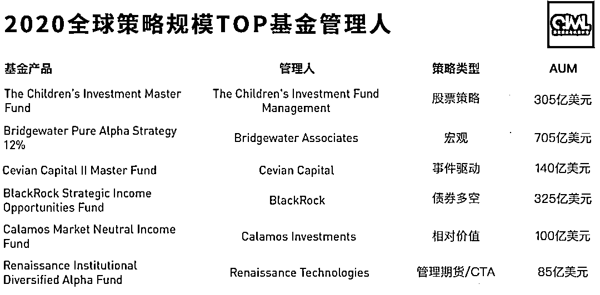

# 最新！2020 全球对冲基金 AUM 榜单出炉

> 原文：[`mp.weixin.qq.com/s?__biz=MzAxNTc0Mjg0Mg==&mid=2653312093&idx=1&sn=6afcd726323de15a671295df8ac83b1e&chksm=802d9648b75a1f5e5c30d0f5132dd0c4486fa9b2aedd0e8c7e80a1c69562568ea2840cb36bf5&scene=27#wechat_redirect`](http://mp.weixin.qq.com/s?__biz=MzAxNTc0Mjg0Mg==&mid=2653312093&idx=1&sn=6afcd726323de15a671295df8ac83b1e&chksm=802d9648b75a1f5e5c30d0f5132dd0c4486fa9b2aedd0e8c7e80a1c69562568ea2840cb36bf5&scene=27#wechat_redirect)

### 

**2021 年** 

**祝各位 Quant**

**永不回撤！！！**

我们看到，桥水的宏观策略基金占据前二的位置，累计规模达 1240 亿美元。

数据来自：Preqin，AUM 截止 2020 年 9 月

其中每类策略 AUM 排名第一的是：

数据来自：Preqin，AUM 截止 2020 年 9 月

虽然桥水基金的业绩在去年表现不尽人意，但其规模任处于第一位达 14121 亿美元。其次是 AQR 996 亿美元、Man Group 842 亿美元等。**排名前十****的对冲基金管理人 AUM 总和高达 6500 多亿美元！**

数据来自：Preqin

在国内量化私募中，100~1000 亿以上 AUM 的机构有：

单位：RMB，数据截止最新

**附录：相关榜单**

量化投资与机器学习微信公众号，是业内垂直于**量化投资、对冲基金、Fintech、人工智能、大数据**等领域的主流自媒体。公众号拥有来自**公募、私募、券商、期货、银行、保险、高校**等行业**20W+**关注者，连续 2 年被腾讯云+社区评选为“年度最佳作者”。