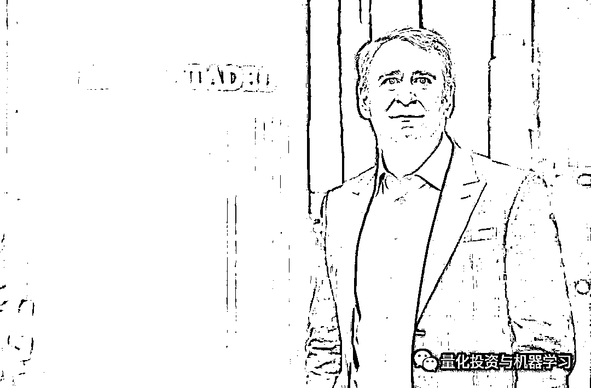
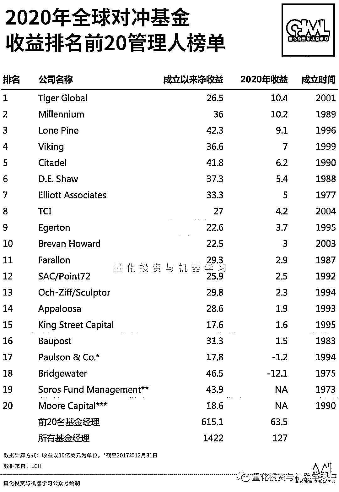

# 二百三十、亿美元！2020 全球 TOP15 对冲基金巨头如此赚钱

> 原文：[`mp.weixin.qq.com/s?__biz=MzAxNTc0Mjg0Mg==&mid=2653312046&idx=1&sn=09ec4704cacf4cd1b1d10b2448547853&chksm=802d963bb75a1f2da3861d4849316e971b293a897da9dc0d7c2f3a87d9313f026d1785aa34e9&scene=27#wechat_redirect`](http://mp.weixin.qq.com/s?__biz=MzAxNTc0Mjg0Mg==&mid=2653312046&idx=1&sn=09ec4704cacf4cd1b1d10b2448547853&chksm=802d963bb75a1f2da3861d4849316e971b293a897da9dc0d7c2f3a87d9313f026d1785aa34e9&scene=27#wechat_redirect)

### 

***全网 Quant 都在看！***

根据彭博最新报道，2020 年全球前 15 名对冲基金巨头的收入总和高达**230+亿美元！**

在 TOP15 榜单中，根据彭博亿万富翁指数榜（共 500 位）2021 年最新**金融-对冲基金**行业的排名中，西蒙斯、格里芬、Izzy Englander、David Shaw、科尔曼都榜上有名：

2020 年，收入靠前的基金经理管理的大多数旗舰基金都涨幅不少：

不过，我们常见的面孔，桥水基金的 Ray Dalio 因其 Pure Alpha II 基金连续第二年亏损，没有上榜。Two Sigma 今年也未能上榜！

**相关阅读：** 
说起第一名老虎全球，QIML 相信很多读者首先想到的是其创始人 Julian Robertson 老爷子。真的是不亏叫老虎：

**无冕之王，咆哮而来！**

*图片来自：网络

Julian Robertson 他所主导的基本面价值投资方法影响了华尔街一代的对冲基金经理。即使在今天老虎系的投资人也遍布整个华尔街比，如今天我们介绍的 Tiger Global 的老大**科尔曼。**

*图片来自：网络

科尔曼更倾向于风险资本投资，其 360 亿美元的资产中约有一半来自风险资本投资，而他的对冲基金管理着约 100 亿美元。他的业绩一直保持两位数，**2020 年的收益率达到 48% ！**

科尔曼的老虎全球**只有两次亏损**：

西蒙斯老爷子的文艺复兴旗下两只基金公损超过 30%。但大奖章基金却上涨了 76%。

**相关阅读：** 

排名第三 Millennium 的 Izzy Englander，其旗下基金表现在 2020 年很抢眼，多策略对冲基金在 12 月 17 日前上涨了约 23.3% ！Millennium 一直在投资股票和固收市场，重点关注流动性资产类别。**目前 Millennium 的 AUM 约为 485 亿美元**（大概）。

排名第四 Lone Pine 的多空基金上涨了 30% ，而其做多的基金上涨了 46%。

排名第五 Citadel 的格里芬，其 Citadel Securities 第四季度的净交易收入为 17 亿美元，使得全年的总交易收入达到 67 亿美元！几乎是 2018 年最高数字的 2 倍！

*图片来自：网络

Citadel Securities 的收入和利润在 2020 年增长了一倍多：

*数据来自：Citadel Securities presentation

目前 Citadel Securities 在美股市场市场的交易份额为 27%，高于 2017 年的 21%。在 order flow 占主导地位，占市场的 46%。

再给大家科普一下： 

**Citadel 是一家全球领先的对冲基金**

**Citadel Securities 是一家全球领先的做市商**

因为这两家公司完全独立，所以两家公司在英国的账户完全独立。不过，考虑到他们共同的出身，他们同时提交了账户：Citadel Europe LLP 和 Citadel Management Europe Ltd.（都是该对冲基金的一部分）和 Citadel Securities Europe（做市商）刚刚发布了截至 2019 年 12 月的财年业绩。这些数据表明，格里芬去年在欧洲经营的对冲基金十分成功。

排名第七的 Point72 的科恩在，基金收入上今年占比很少，很大一部分来自个人投资，比如他的艺术品收藏，还有纽约大都会棒球队等等。近期，因为在 Twitter 发表的一些言论，他的家人受到威胁，他决定关掉了自己的 Twitter 账户。

**相关阅读：** 

排名 14 的 D.E. Shaw，在扣除手续费后，旗下最大的对冲基金 2020 年的收益率为 19.4%！

排名 15 的 Melvin Capital 的 Gabe Plotkin 在 2020 年赚了约 8.5 亿美元，其旗舰基金的收益率为 53%。但在 1 月份发生的事情想必大家都知道了，因做空 GME 股票导致普 Plotkin 个人收入下降了 53%，损失近 4.6 亿美元！

同样这个榜单也和前几天我们根据 LCH 披露的数据基本一致。例如：Two Sigma 在 2018 年排名第 19 名，在 2019 年、2020 年从榜单上消失了。霍恩的 TCI 从 2019 年的第 1 名掉到了第 8 名。

2020 年全球对冲基金表现最佳的产品如下：

报道内容来自：彭博

报道内容来自：彭博

量化投资与机器学习微信公众号，是业内垂直于**量化投资、对冲基金、Fintech、人工智能、大数据**等领域的主流自媒体。公众号拥有来自**公募、私募、券商、期货、银行、保险、高校**等行业**20W+**关注者，连续 2 年被腾讯云+社区评选为“年度最佳作者”。