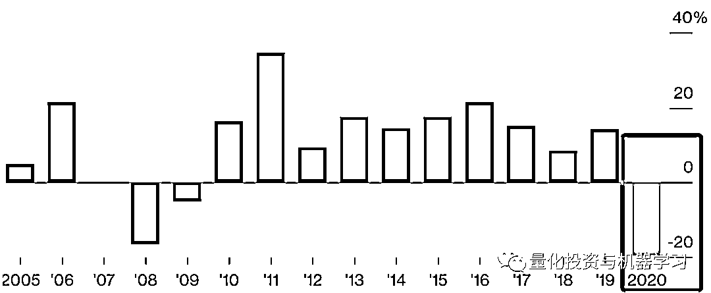

# 文艺复兴遭巨额赎回！

> 原文：[`mp.weixin.qq.com/s?__biz=MzAxNTc0Mjg0Mg==&mid=2653311970&idx=1&sn=f9867f3d7bed817223245c4390d6b7fb&chksm=802d91f7b75a18e1d3b15670e0b5e0b0b05e602ecbd0f08af8df469a3e631c2a20f611263f2d&scene=27#wechat_redirect`](http://mp.weixin.qq.com/s?__biz=MzAxNTc0Mjg0Mg==&mid=2653311970&idx=1&sn=f9867f3d7bed817223245c4390d6b7fb&chksm=802d91f7b75a18e1d3b15670e0b5e0b0b05e602ecbd0f08af8df469a3e631c2a20f611263f2d&scene=27#wechat_redirect)

### 

***全网 Quant 都在看！***

根据彭博最新报道：西蒙斯老爷子的文艺复兴科技最近几个月因产品业绩问题，自去年 12 月以来，**投资者已至少赎回大约 50 亿美元。**

数据来自：Investor documents

文艺复兴现在处于一种近 40 年历史中从未有过的境地：试图说服那些曾经争先恐后买入其基金的投资者，让他们相信，该基金仍然值得他们投资，并且能够获得超过市场水平的收益。老爷子的的大奖章基金自 1988 年成立以来平均回报率为 40% 左右。

根据公开资料显示，**去年 12 月，****客户在三个外部基金中赎回 18.5 亿美元，今年 1 月，客户赎回 19 亿美元。同时，投资者又将在本月赎回 16.5 亿美元。**

分析认为，尽管如果 2 月份有资金流入这些对冲基金，或者投资者决定撤回赎回，赎回潮流可能暂缓。

巨额赎回主要是因为 3 只基金去年的业绩表现惨淡。其中，机构股票基金（RIEF）在 2020 年亏损了 19%，机构多元化 Alpha 基金（RIDA）亏损了 32%，机构多元化全球股票基金（RIDGE）亏损了 31%。不过，其自营基金却取得了惊人收益，大奖章基金去年收益率高达 76%。**内外部基金差目前让市场很多投资者产生了争议！**

报道内容来自：彭博实际上，在去年年中就传出了文艺复兴基金亏损的消息。去年 10 月有报道披露，文艺复兴基金旗下的机构股票基金下跌了约 20%，机构多元化 Alpha 基金下跌约 27%，全球股票基金下跌约 25%。这也意味着，2020 年的最后两个月，文艺复兴基金不但没有跟上市场节奏，反而使亏损进一步加大。

反观去年**国内量化私募**却大幅盈利，规模也实现大幅增长。根据招商证券托管数据显示，**2020 年量化多头策略的收益平均高达 34.5%，超过非量化股票多头平均 28.8%的业绩，市场中性策略的收益也达到 11.2%。**同时，量化规模迎来爆发式增长，百亿量化私募俱乐部据公开数据显示国内现共有 12 家（数据来自私募排排网）， 分别是（公司简称，按首字母排序）：

**诚奇资产****幻方量化****金锝资产****九坤投资****进化论资产****灵均投资****明汯投资****鸣石投资****宁波幻方量化****启林投资****盛泉恒元****衍复投资**

注：上述私募规模数据与协会备案规模一致。文中提及的百亿私募需同时满足：机构类型为证券类私募管理人、管理的产品类型以证券投资基金为主。若同一法人名下有两家（或以上）私募机构，规模与业绩均不进行合并统计。

虽然从备案主体来看有 12 家百亿量化机构，但是宁波幻方量化与幻方量化运营团队一致。如果按公司背后的投研团队来划分，也可理解为目前市场上百亿量化私募为 11 家。

2021，希望国内外量化机构在新冠疫情的影响后：

量化投资与机器学习微信公众号，是业内垂直于**量化投资、对冲基金、Fintech、人工智能、大数据**等领域的主流自媒体。公众号拥有来自**公募、私募、券商、期货、银行、保险、高校**等行业**20W+**关注者，连续 2 年被腾讯云+社区评选为“年度最佳作者”。