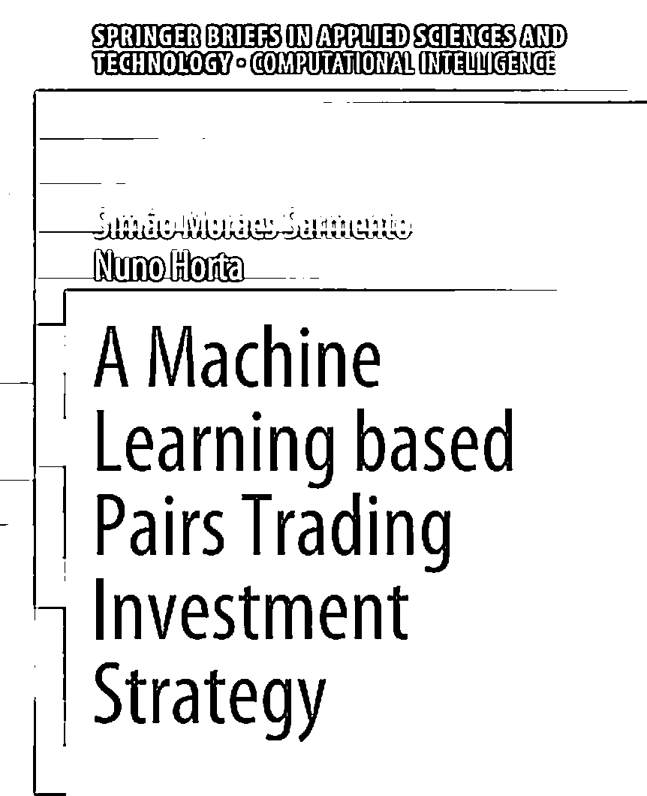
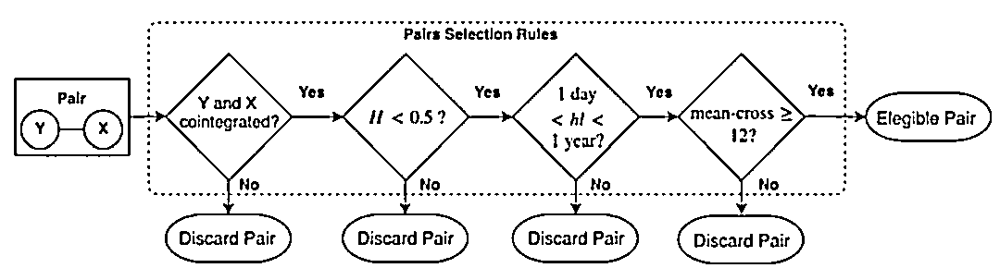
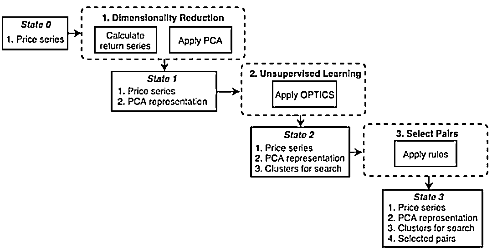
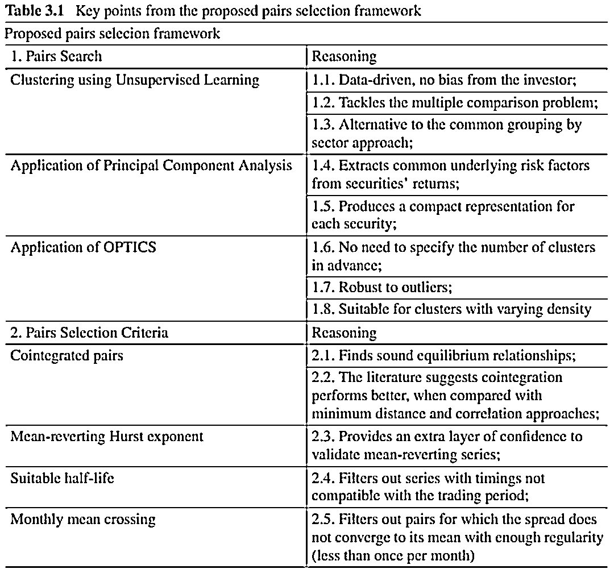
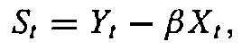
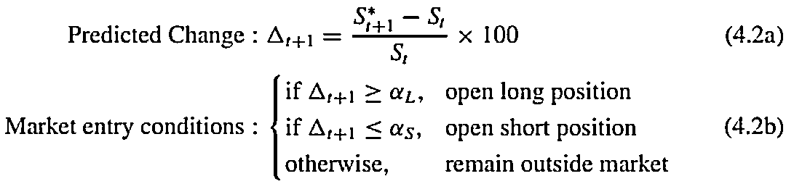
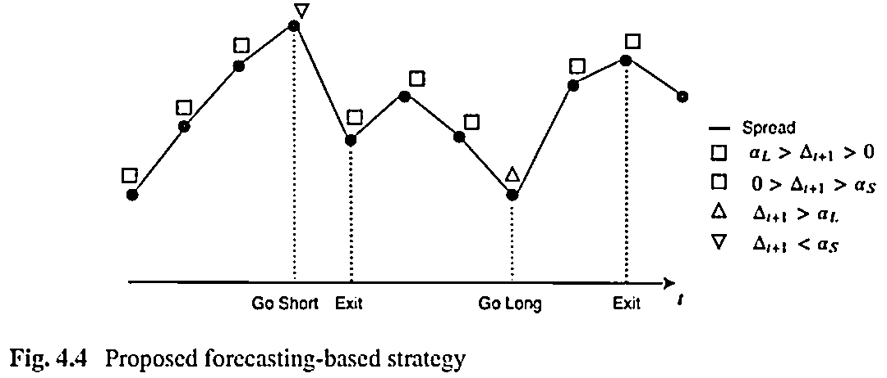
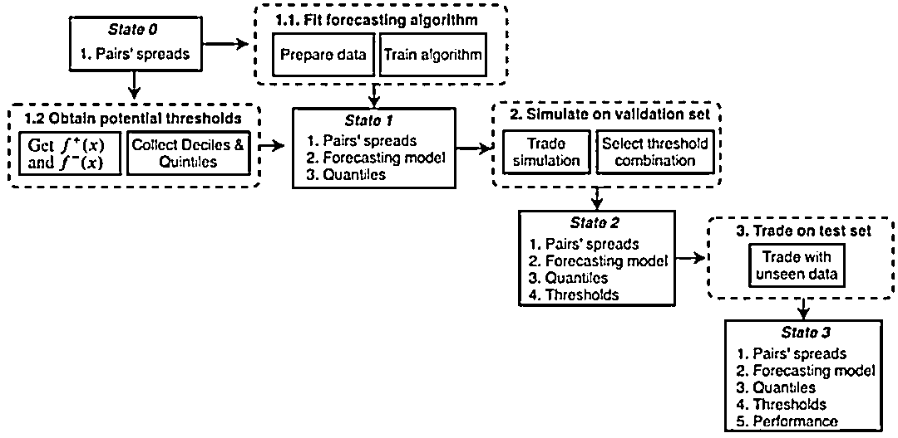

# 基于机器学习的配对交易策略框架

> 原文：[`mp.weixin.qq.com/s?__biz=MzAxNTc0Mjg0Mg==&mid=2653311869&idx=1&sn=cfa39bf7afdca3e8e3d98fb39fc4bc40&chksm=802d9168b75a187e8b5a88c72d3ec5170e7bed0cc8036438871c0500a8c146e5e44015a161c0&scene=27#wechat_redirect`](http://mp.weixin.qq.com/s?__biz=MzAxNTc0Mjg0Mg==&mid=2653311869&idx=1&sn=cfa39bf7afdca3e8e3d98fb39fc4bc40&chksm=802d9168b75a187e8b5a88c72d3ec5170e7bed0cc8036438871c0500a8c146e5e44015a161c0&scene=27#wechat_redirect)

### 

***全网 Quant 都在看！***

最近读到一本 Springer 的新书，书中提出了一种比较实用的应用到配对交易的机器学习的模型框架，本篇文章就书中提到的框架做一个**脱水解读**。

**配对交易**

配对交易是一种常见的多空策略。开发一个配对交易的策略，核心有两个步骤：首先是待交易的标的，比如说两个走势非常类似的股票，或者同一期货品种不同月份的合约。这类股票之所以具有相似的行情走势，是因为影响它们价格的因素比较相似。确定好交易标的后，就要对两者的价差建模，由于我们的假设是两者的价差会在一个稳定的区间波动（均值回归），所以在价差偏离合理区间在回归合理区间的过程中，我们就可以获得利润。

所以，配对交易的策略主要解决以下两个问题：

1、配对模型：怎么配对？

2、交易模型：怎么判断价差是否偏离？

**应用机器学习的配对交易框架**

**配对模型**

Sarmento and Horta (2020)提出了一套基于非监督学习的配对模型框架，该框架主要有以下三个部分组成：

**第一步——降维：精简能够代表每个股票的特征，主要应用 PCA 进行降维度**

学过时间序列的同学，对 PCA 应该非常熟悉，我们就不在赘述。PCA 在这里的应用主要是构建每个股票价格表现的特征，具体做法如下：

假设有 n 只股票，首先计算每只股票的标准化后的日度收益率，标准化是指用收益率除了标准差（滚动窗口，如 120 日 Rolling Standard Deviation）。对以上收益率计算协方差矩阵，并进行 PCA 降维，选取前 K 个特征值，这样每个股票就有了 K 个特征。

**第二步——非监督学习：利用以上特征结合聚类算法找到潜在的股票配对**

非监督学习算法有很多，但满足当前应用场景的算法必须有以下特点：

*   无需指定聚类的数量

*   无需对所有股票都进行分类

*   对于异常值的处理

*   聚类的形状没有特定的假设

基于以上的考虑，有两个算法满足所有的条件，关于两个算法的详细讲解，网上有很多资料，这里只给出简介，对于调包侠来说 scikit-learn 里的 cluster 有现成的模块：

**1、DBSCAN：**是一种基于密度的聚类算法，DBSCAN 将簇定义为密度相连的点的最大集合，能够把具有足够高密度的区域划分为簇，并可在噪声的空间数据库中发现任意形状的聚类。

**2、OPTICS：**在前面介绍的 DBSCAN 算法中，有两个初始参数 E（邻域半径）和 minPts（E 邻域最小点数）需要用户手动设置输入，并且聚类的类簇结果对这两个参数的取值非常敏感，不同的取值将产生不同的聚类结果，其实这也是大多数其他需要初始化参数聚类算法的弊端。为了克服 DBSCAN 算法这一缺点，提出了 OPTICS 算法（Ordering Points to identify the clustering structure）。OPTICS 并不显示的产生结果类簇，而是为聚类分析生成一个增广的簇排序（比如，以可达距离为纵轴，样本点输出次序为横轴的坐标图），这个排序代表了各样本点基于密度的聚类结构。它包含的信息等价于从一个广泛的参数设置所获得的基于密度的聚类，换句话说，从这个排序中可以得到基于任何参数 E 和 minPts 的 DBSCAN 算法的聚类结果。

**第三步——配对选取：应用一系列准则对以上配对进行筛选**

通过以上聚类，我们可以找到潜在的股票对（大部分情况下是一组股票），在筛选股票对的时候，作者采用了以下 4 个硬性指标：

1、两个股票必须协整

2、价差的 Hurst 指数要小于 0.5（没有趋势性）

3、均值回归的半衰期（half-life of mean-reversion）要在合理区间内

4、历史上有足够多的交易机会

下图给出了应用机器学习的**配对模型的框架图及各步骤的采用对应算法的逻辑：**

**交易模型**

股票对选出来之后，接下来就是具体的交易了，配对交易的实际对象是两个股票构成的价差，如下式（XY 为两只股票，S 为两者的价差，beta 为协整系数）：

可以应用**机器学习的模型**预测 S，并根据特定的阈值触发交易信号：

在这个场景中，任何可以用来预测时间序列的机器学习模型或深度学习模型都可以应用在价差的预测上。在选取特定阈值时，可以根据过去一段时间价差收益率的分布进行选取。具体的进出场触发机制如下图说明：

下图给出了交易模型的流程图：

**总结**

在这个框架中，作者首先在股票配对的环节应用到了非监督模型，其中应用 PCA 对股票进行特征抽取，然后基于这些抽取的特征进行聚类，在这个过程中我们也可以加入其他基本面的指标或者因子作为股票的特征。然后在具体的交易模型中，应用到机器学习对股票对的价差进行预测，并基于预测的结果和事先确定的阈值触发交易信号。

量化投资与机器学习微信公众号，是业内垂直于**量化投资、对冲基金、Fintech、人工智能、大数据**等领域的主流自媒体。公众号拥有来自**公募、私募、券商、期货、银行、保险、高校**等行业**20W+**关注者，连续 2 年被腾讯云+社区评选为“年度最佳作者”。