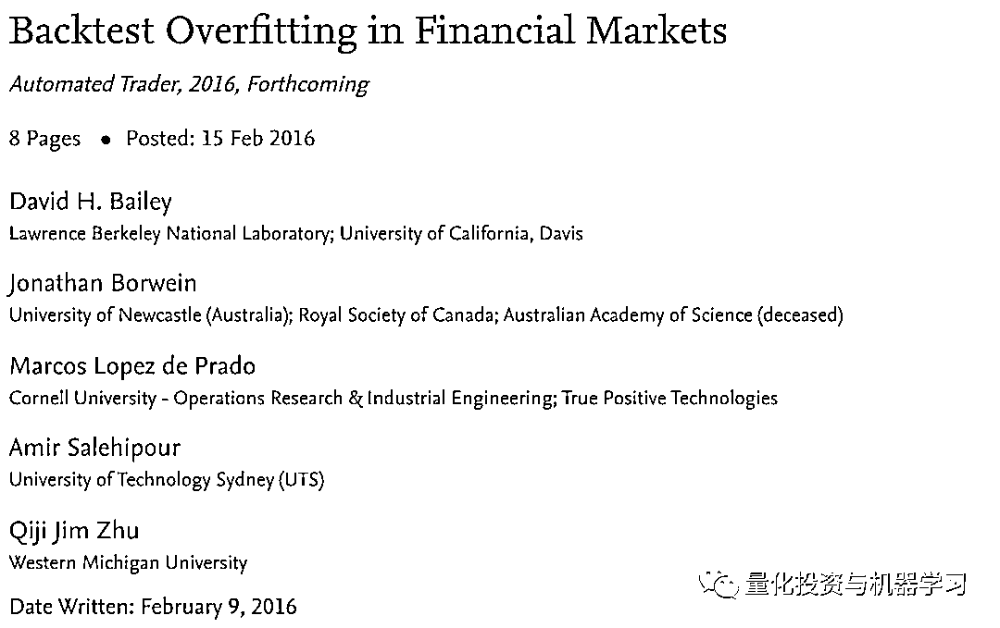
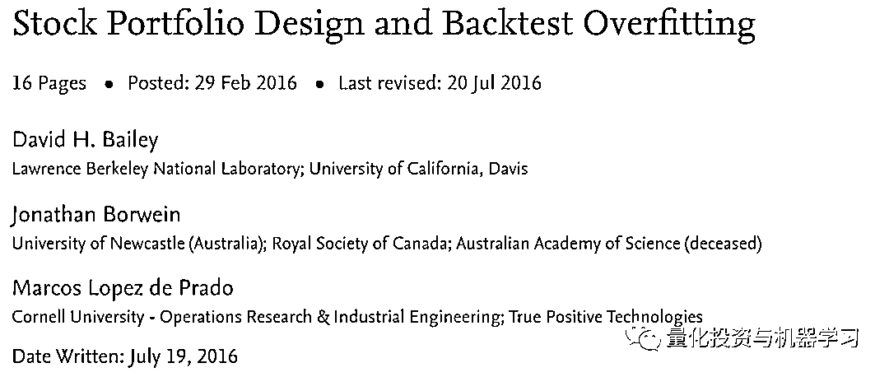
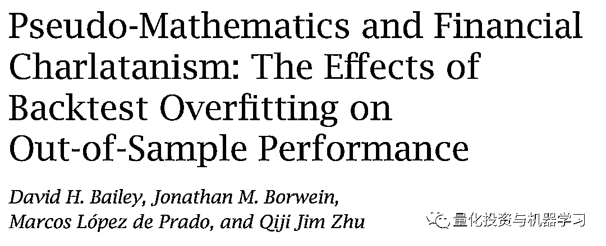
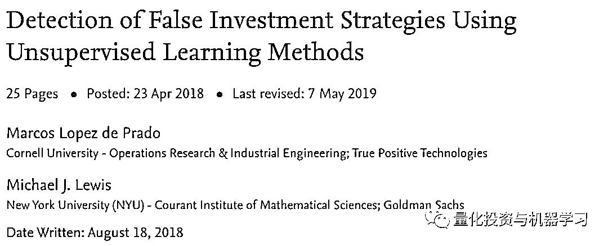
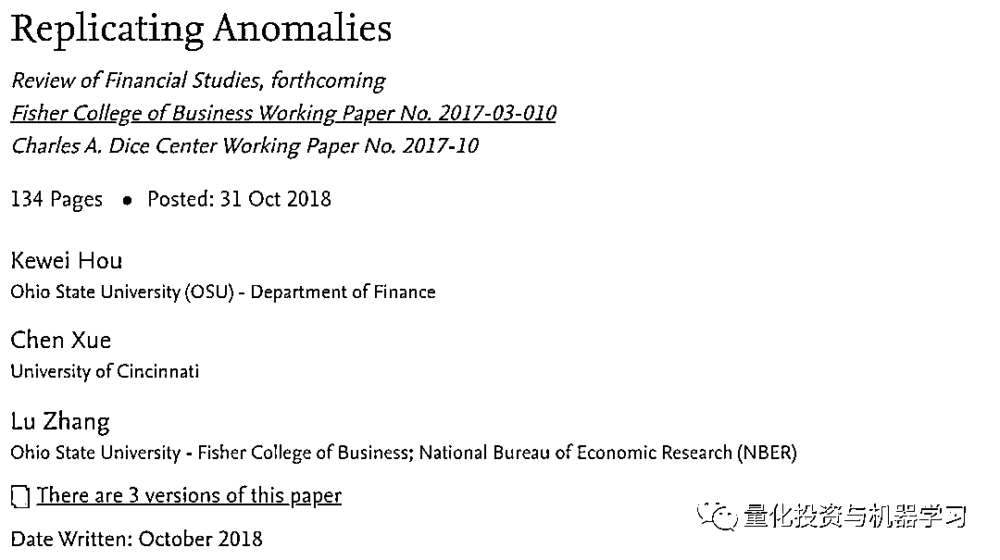
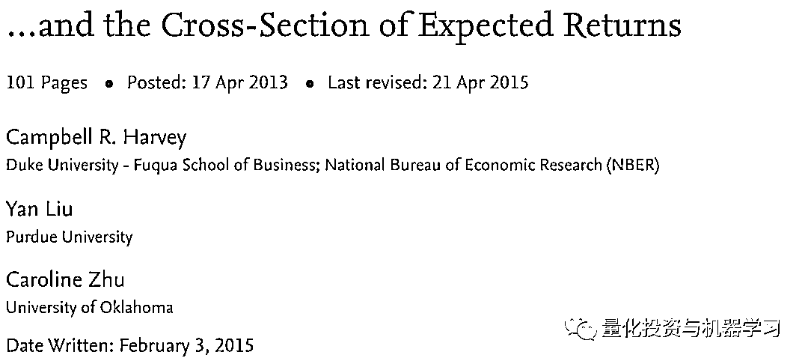
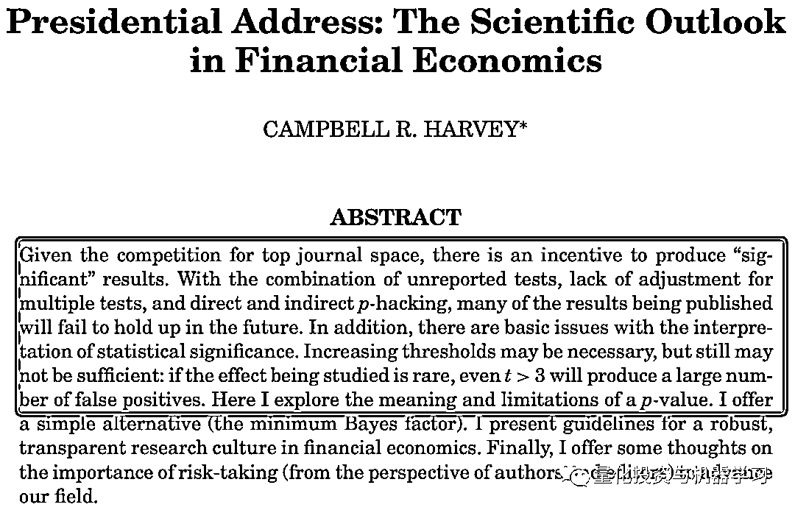
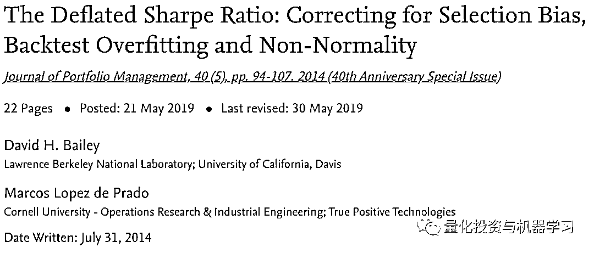
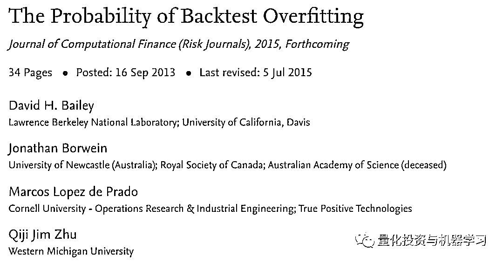

# 金融异象指标的失灵

> 原文：[`mp.weixin.qq.com/s?__biz=MzAxNTc0Mjg0Mg==&mid=2653311772&idx=1&sn=e159f27f40eb834cb8ccbbdc27cacdde&chksm=802d9109b75a181f54de0bb6b422e582616ac67472e47bf17cb94237427e3be791872b68cb1e&scene=27#wechat_redirect`](http://mp.weixin.qq.com/s?__biz=MzAxNTc0Mjg0Mg==&mid=2653311772&idx=1&sn=e159f27f40eb834cb8ccbbdc27cacdde&chksm=802d9109b75a181f54de0bb6b422e582616ac67472e47bf17cb94237427e3be791872b68cb1e&scene=27#wechat_redirect)

### 

***全网 Quant 都在看！***

**科学领域的可复制性危机**

造成如此结果的部分是因为**P-hacking！**

我们在统计时经常用到 P 值，一般认为 P≦0.05 有统计学意义。但是现在很多统计学家并不是这样认为，对于 P 值的滥用和误用进行了苛刻的批评。因此出现了一个新词：P-hacking。

P-hacking 最早应该是美国宾夕法尼亚大学的 Simmons 和他的团队提出来的，Simmons 等人也对 P-hacking 进行了定义：

### 

P-hacking refers to the practice of reanalyzing data in many different ways to yield a target result. They, and more recently Motulsky, have described the variations on P-hacking, and the hazards, notably the likelihood of false positives—findings that statistics suggest are meaningful when they are no.

P-hacking 按照字面的意思来看是「P 值黑客]，但是实际上的意思科研动力认为是「P 值篡改」或者「P 值操纵」。P-hacking 是科研人员不断的尝试统计计算直到 p<0.05，当然有时这可能是无意识的。

有一些可重现性危机，一些科学家无法复制一些关键实验：

《科学》杂志发表了一项名为“可复制性项目”（re - bility Project）的计划的成果。该计划是由非营利组织开放科学中心（Center for Open Science）协调的合作项目。参与者试图复制 100 个与实验相关的心理学研究，这些研究已经在三家著名的心理学杂志上发表。媒体广泛报道的结果令人深思，**只有 39 项研究被成功复制。**

大部分原因是研究人员在发表具有统计学意义的结果之前进行了大量的试验。或者在试验过程中改变不同的参数。这就是所谓的**The garden of forking paths**，并不总是经过深思熟虑的。

**金融领域的可复制性危机**

在过去的几年里，一些金融数学领域的一些学者已经注意到困扰大家的回测过拟合问题。例如，下面这篇在 2016 年发表的论文阐述了这个问题：

https://papers.ssrn.com/sol3/papers.cfm?abstract_id=2731886

为什么在理论上看起来不错的策略往往在实践中表现不佳，是因为回测中那些看起来牛逼轰轰的表现往往不会在实际应用中继续重现。

沿着这条线，在下面这篇论文中：

https://papers.ssrn.com/sol3/papers.cfm?abstract_id=2739335

论文表明：基于回测，可以很容易地实现任何预期的目标。比如 10 年或更长时间内每月增长 1%。然而，当呈现新的数据时，它们总是被证明是禁不住考验的。至少，完全不能复制当初所宣称的目标。

如今，随着算力与程序化技术的兴起，情况更加恶化了！

为一个策略生成千上万、数百万甚至数十亿的组合权重或参数已经变得越来越简单。正如这篇论文所提到的：

http://www.ams.org/notices/201405/rnoti-p458.pdf

Marcos Lopez de Prado、Michael Lewis 在回顾了上述以及该领域其它的最新发展后，遗憾地得出结论：**从业者和学者发现的大多数投资策略都是错误的！**

https://papers.ssrn.com/sol3/papers.cfm?abstract_id=3167017

同样，Marcos Lopez de Prado 在 2018 年《福布斯》采访 Brett Steenbarger 时，也从以下几个方面讨论了这种情况：

假设一家制药公司开发了 1000 种药物，并在 1000 组志愿者身上进行测试。当有几十种测试证明“显著性”的几率为 0.05 时，这些药物就被当作有效的治疗方法开始销售了。病人们相信这些“科学测试”，纷纷涌向这些新的药物。结果却发现，由于药物并没有带来预期的效果，他们的病情反而恶化了。一些消费者病得很厉害，有些人甚至死亡。

显然，这种欺骗行为会引起公众的强烈抗议。事实上，这正是我们有一个监管机构和法律来帮助确保药物在向公众提供之前经过了适当的测试的原因。但金融消费者却得不到这样的保护，使他们容易受到未经验证投资策略的影响。这些假阳性结果尤其具有误导性，因为它们是由一群具有专业研究背景的人所推动的，而这些研究人员并没有使用必要的科学工具来发现这些虚假的结果。

#### **新的异象指标研究**

**Fama****将有效市场定义为：如果资产价格完全反映了可得的信息，则市场有效。而在随后的研究中，众多异常收益现象（Anomalies）被发现，即持有具有某种特征的股票在未来会获取超额收益。**

为了更好地评估金融领域的可复制性状态，Kewei You、Chen Xue、Lu Zhang 发表了一篇关于金融领域异象指标复制的论文：

https://papers.ssrn.com/sol3/papers.cfm?abstract_id=3275496

在 Lu Zhang 教授的论文中，基于美国市场数据，对 447 种异常收益现象进行了研究（考虑到变量定义的唯一性，实际有大约 220 种异常收益变量）。结果表明，将 T 值为 2 作为阈值时，约 64%的异常收益组合收益是不显著的；将阈值提高至 3 时。约 85%的异常收益组合收益是不显著的。也就是说，**尽管已有文献记录了众多样本期内有效的因子，但当对其进行复制时，该因子有效性或丧失、或减弱。**

论文最后指出：**投资者必须对研究结果自己动手进行复制与回测，所谓“信任但要验证”。**对任何感兴趣的研究成果，都需要在研究团队反复独立测试验证后才相信，对学术研究结果反复测试检验是很有必要的。**科学文献自我纠正的机制是有限的，一般也只会纠正最重要研究成果的偏差。**

大部分基于流动性的变量基本只在微盘股有效，即使用等权重，交易摩擦因子的复制成功率也只有不到 40%。因此这个类别因子的有效性值得怀疑。我们并不是说流动性、交易微观结构和其他交易摩擦变量（例如交易费）在实践中不重要，而是就驱动股票获得超额收益的因子而言，交易摩擦远远没有价值、动量、投资和盈利因子重要。

其他一些众所周知的异象指标，作者无法复制，包括：

the Bhandari (1988) debt-to-market; the Lakonishok-Shleifer-Vishny (1994) five-year sales growth; the La Porta (1996) long-term analysts’ forecasts; several of the Abarbanell-Bushee (1998) fundamental signals; the O-score and Z-score studied in Dichev (1998); the Piotroski (2000) fundamental score; the Diether-Malloy-Scherbina (2002) dispersion in analysts’ forecasts; the Gompers-Ishii-Metrick (2003) corpo- rate governance index; the Francis-LaFond-Olsson-Schipper (2004) earnings attributes, including persistence, smoothness, value relevance, and conservatism; the Francis-LaFond-Olsson-Schipper (2005) accrual quality; the Richardson-Sloan-Soliman-Tuna (2005) total accruals; the Campbell-Hilscher-Szilagyi (2008) failure probability; and the Fama-French (2015) operating profitability.

有人担心，尽管 Kewei You、Chen Xue、Lu Zhang 引用了一些多重检验统计数据，但考虑到他们的研究范围，可能没有完全弥补这一现象。但这意味着，如果有什么区别的话，那么他们的研究结果是相对保守的。在他们的研究中，统计上可以复制的指标甚至更少，或者仅在非常有限的统计可信度下才可复制。

更重要的是应该记住，张教授他们的数据只持续到 2016 年。从那时起，全球市场上基于大数据的程序化交易大幅度增加，这也很可能意味着，一些曾经有重大价值的异象指标不再有效！

**发布新结果的压力**

2016 年，Harvey、Liu、Zhu 的一项研究表明：**他们分析了 296 篇已发表的论文中的异象，发现 80 至 158 篇（高达 53%）可能是错误发现。**

https://papers.ssrn.com/sol3/papers.cfm?abstract_id=2249314

作者认为，该领域的一种基本结构性结构偏差可能是罪魁祸首：尽管复制研究经常出现在大多数其他科学领域的顶级期刊上，但这类研究很少在金融和经济领域发表。换句话说，**人们普遍倾向于发表新的结果，而不是严格地验证之前的结果。**

美国金融协会前任主席 Campbell R. Harvey 也注意到了这类问题：

https://faculty.fuqua.duke.edu/~charvey/Research/Published_Papers/P131_The_scientific_outlook.pdf

由于复制性研究和其他没有报告显著新结果的研究往往产生较少的引用，这类论文不太可能发表。另一方面，Harvey 注意到研究人员也会造成发表偏见，摸清了期刊对有重大新结果的论文的套路，作者可能不会提交只有边缘结果的论文。这种偏见在其他领域被称为**“file drawer effect”**。发表偏见也可能是由于作者在期刊提交的论文中精心挑选最重要的结果引起的，这是**P-hacking**的一种形式。

**恢复可复制性**

幸运的是，有一些特定的工具可以用来防止这次有害的影响，如回测过拟合和其他形式的多重检验偏差。例如，2014 年 JPM 的这篇论文提供了一些可靠的方法来检测和防止错误的发现：

https://papers.ssrn.com/sol3/papers.cfm?abstract_id=2460551

同时，2017 年 JCF 的这篇论文提供了计算回测过拟合概率的理论框架：

https://papers.ssrn.com/sol3/papers.cfm?abstract_id=2326253

归根结底，唯一的长期解决方案是教育！但针对金融领域的研究人员来说，这个问题任重而道远~

**避免 P-hacking**

最后，在你自己的研究中避免 P-hacking 的一个好的方法是：从一开始就对自己诚实。仔细考虑并记录你想要测试的所有内容。如果你想测试 20 个不同的因子，请在开始测试之前指定这些因子，并在评估指标时考虑所有 20 个因子。

但最重要的是，想想你自己的模型在做什么。神经网络有时被认为是黑箱，从某种意义上说，的确如此，但是你应该批判性地回顾每一步。如果你正在进行图像识别，请观察每一层的激活，大致了解该层的激活基于什么。如果你正在进行强化学习来玩游戏，看看你是否能够大致理解逻辑是如何工作的。如果你正在进行自然语言处理，请考虑与同义词、反义词和相关单词有关的词向量。

**如果你在做股票市场分析，问问自己你真正想从模型中得到什么**。为什么某些因子的第 n 个延迟是一个预测因子？为什么以前的收益会影响未来的收益？你为什么只考虑最近的 N 次收益？为什么要预测一个（每天、每小时、每分钟）的周期？你为什么要考虑从 X 到 Y 这段时间？为什么验证到 Z？

将股票增量输入到一个递归神经网络中就可以达到减少损失的目的，但是有了解释，你也可以将这些值拟合到一个随机数生成器中。

*参考文献*

*1、Kewei Hou, Chen Xue, Lu Zhang, 2019, Replicating anomalies, forthcoming, Review of Financial Studies.*

*2、David H. Bailey, Marcos Lopez de, PradoJournal of Portfolio Management, 40 (5), pp. 94-107\. 2014*

3、David H. Bailey, Jonathan Borwein, Marcos Lopez de Prado, Qiji Jim Zhu, Journal of Computational Finance (Risk Journals), 2015, Forthcoming

*4、东北证券，高建、王琦，2018，Replicating Anomalies A 股检验*

*5、新全球资产配置，2019，因子战国：张橹教授对 q-factor 模型的五大讨论*

量化投资与机器学习微信公众号，是业内垂直于**量化投资、对冲基金、Fintech、人工智能、大数据**等领域的主流自媒体。公众号拥有来自**公募、私募、券商、期货、银行、保险、高校**等行业**20W+**关注者，连续 2 年被腾讯云+社区评选为“年度最佳作者”