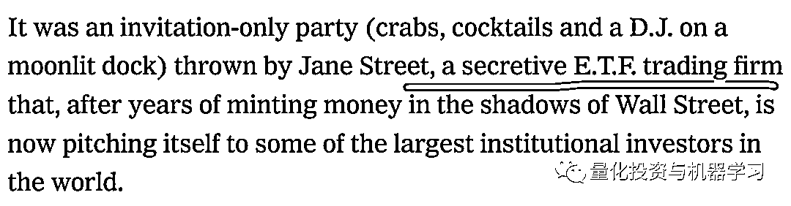
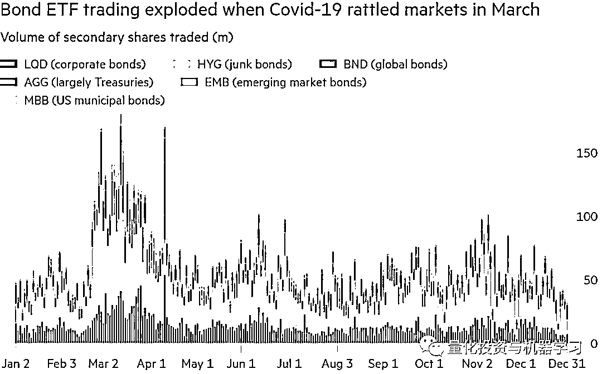
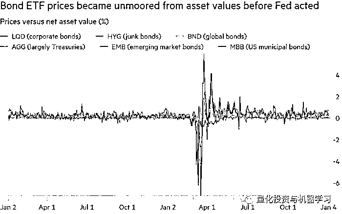
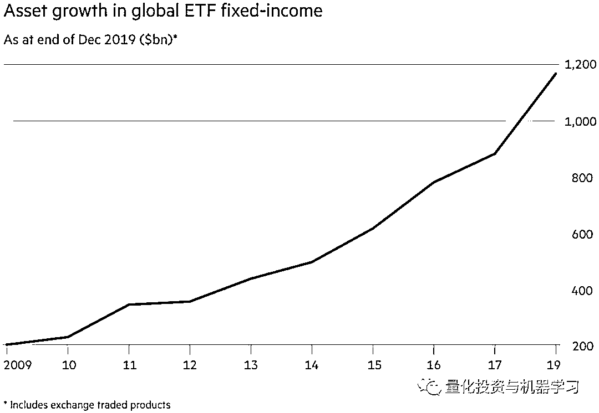
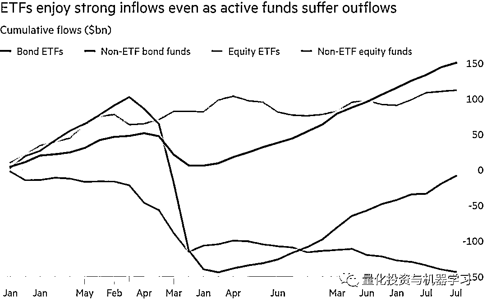
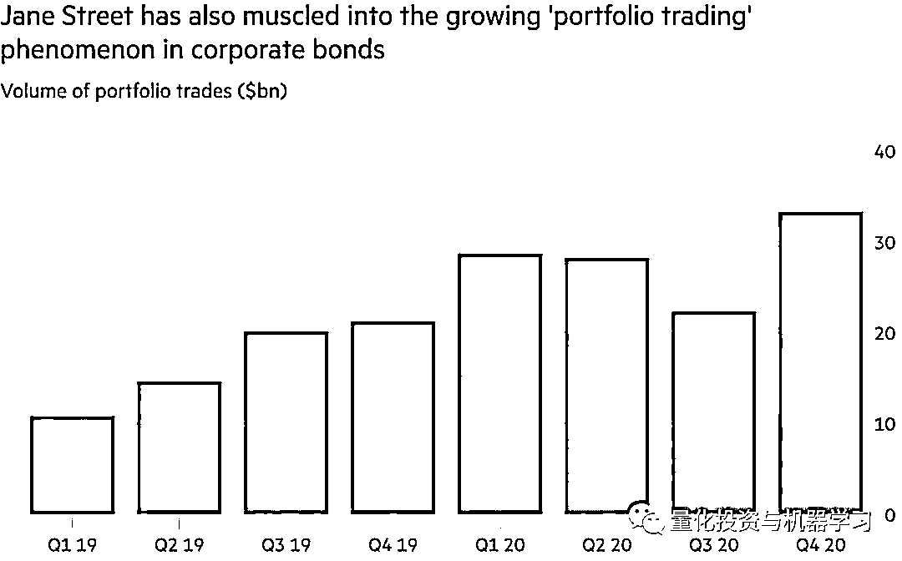
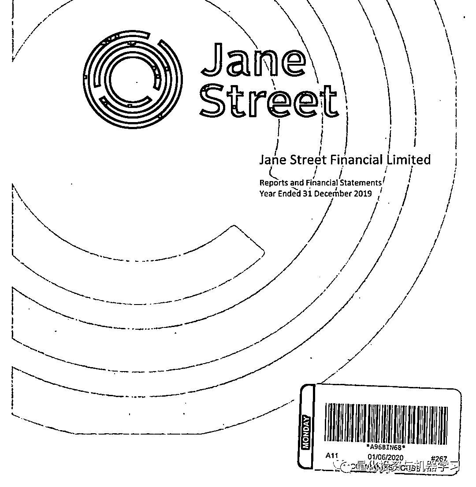

# Jane Street：华尔街低调的顶级做市商

> 原文：[`mp.weixin.qq.com/s?__biz=MzAxNTc0Mjg0Mg==&mid=2653311696&idx=1&sn=985dddf3cfff77992589aade761ee8bc&chksm=802d90c5b75a19d3452b83d1fbcb2076d77c1cc73351a8377fa0acba0defcecfd49583a8201c&scene=27#wechat_redirect`](http://mp.weixin.qq.com/s?__biz=MzAxNTc0Mjg0Mg==&mid=2653311696&idx=1&sn=985dddf3cfff77992589aade761ee8bc&chksm=802d90c5b75a19d3452b83d1fbcb2076d77c1cc73351a8377fa0acba0defcecfd49583a8201c&scene=27#wechat_redirect)

### 

***全网 Quant 都在看！***2016 年，纽约时报将 Jane Street 描述为：

现如今，Jane Street 已成为全球最大的做市商之一，**2020 年证券交易额超过****17 万亿美元！**

****

**OCaml**

对于 Jane Street 相对 junior 的工作，你不一定需要懂金融或经济，但你需要知道如何编程。Jane Street 的代码几乎全部使用 OCAML，因为他们是**函数式编程**的拥护者，Jane Street 从系统自动化到交易系统，从监控工具到代码研究，Jane Street 使用 OCaml 编写所有其能写的东西。

OCaml 全称 Objective Caml，是 Caml 编程语言的主要实现，由 Xavier Leroy，Jérôme Vouillon，Damien Doligez，Didier Rémy 及其他人于 1996 年创立。OCaml 是开放原始码项目。此项目的管理和大部分维护工作交由 INRIA。

由于 caml 的读音与 camel 一致，OCaml 的吉祥物自然被定为骆驼，而以 OCaml 服务为主的软件也通常以骆驼的形象作为其 LOGO。

OCaml 将 Caml 语言在面向对象方面做了延展。Caml 是函数式编程语言，它的扩展语言还有基于微软.net 平台的 f# (fsharp)语言。Caml 的代码大多可以在 f#中使用。F#的开发工具有 VS .net，Caml 的代码也可使用。OCaml 的开发工具包含交互式顶层解释器，字节码编译器，以及最优本地代码编译器。

**OCaml 有一个巨大并强悍的标准库，这使得她可以像 Python 或者 Perl 语言一样可以方便地开发各种应用程序，健壮的模块化与面向对象编程结构又使得她可以胜任大规模软件工程项目。**

**债券 ETF**

Jane Street 在 ETF 领域交易份额占比很大，ETF 通常占美股每日交易的四分之一。根据 ETFGI 提供的数据，其 ETF 管理规模近 8 万亿美元，其小众但迅速增长的债券 ETF 领域占据着主导地位，这种实力使得它在债券 ETF 交易中占据了一席之地现在与像 Vanguard Total Bond Market 这样的 bond king 正面交锋！

*图片数据来自：彭博

**何为债券 ETF？**

债券类交易所交易基金（简称：债券 ETF）是一个债券的打包投资工具，是以债券类指数为跟踪标的并试图复制其收益率的交易型证券投资基金。虽然债券 ETF 只包含债券，但是它们像股票一样在交易所交易，具有部分权益类证券的特性。投资者既可以在一级市场申购、赎回，也可以在二级市场买卖债券 ETF 份额，通过投资债券 ETF，投资者可以很方便地实现对一揽子债券的投资。以国债 ETF 为例，其跟踪标的指数是上证 5 年期国债指数，投资国债 ETF 就相当于购买了一揽子久期为 5 年左右的国债组合。投资者通过投资国债 ETF，可以方便且稳定地享有 5 年期国债的收益率。

曾任 Morgan Stanley 企业信贷交易主管、现为 Smith Capital 基金经理的 Steve Zamsky 表示：“Jane Street 是一家规模庞大且不断增长的公司，但没有人真正听说过它。**他们****老练、古怪，不是传统的华尔街交易员。**”

Jane Street 每年在看跌期权上的花费在 5000-7500 万美元。2 月初，又大幅提高了这一比例。原因是因为 Jane Street 会随时买卖 ETF、期权和债券，在特殊时期甚至更为关键。看跌期权会有额外的保护作用，所以 Jane Street 不会太担心出现极端的波动。

去年的 3 月 12 日美股大跌 9.51%，全球规模最大的 ETF SPDR 标准普尔 500 指数基金价值 2270 亿美元，其价格仅比其净资产价值低 0.13%。全球第二大 ETF、规模 1640 亿美元的 iShares 核心标准普尔 500 指数基金同一天收盘时仅折价 0.14%。 

同一天，规模达 36 亿美元的 VanEck Vectors 高收益市政指数基金的价格较其资产净值折价 19%，创下纪录，是美国规模 4.4 万亿美元的 ETF 市场中最大的折价的产品。

*图片数据来自：彭博

甚至之前下跌时表现尚可的产品也开始感到压力。3 月 12 日，规模达 310 亿美元的 iSharesiBoxx 高收益公司债券 ETF 的价格较其净资产价值折价超过 3.3%，创下 2009 年以来的最大单日折价幅度。 

美国债券市场的波动给相关 ETF 造成了前所未有的混乱。ETF 的净值和价格之间的差距一旦扩大，做市商通常会介入市场、以消补价格不一致之处、并从中获得几乎无风险利润。

ETF 跌破其净资产价值的情况并不少见，但一直低于净值的情况却很少见。在正常的市场环境中，被称为授权参与者的中间商会把这种下跌视作利好。一般来说，市场投资者会在 ETF 价格下跌时买入基金份额，然后向发行者赎回并换取标的债券。然后，授权参与者将出售这些债券以获得相对无风险的利润。通过减少 ETF 市场上的份额，该基金的市场价格通常会回归资产净值。

迫切需要筹集现金的投资者贱卖债券，使得市场波动性加剧，同时加大了投资者抛售基础债券的难度。

相比之下，虽然申购赎回过程受阻，但由于 Jane Street 等公司继续撮合买家和卖家，使得债券 ETF 股票的交易量大幅飙升。根据贝莱德的数据显示：3 月份的日均交易量为 335 亿美元，是 2019 年日均交易量的三倍以上。

这场混乱让 Jane Street 获得了丰厚回报！

*图片数据来自：ETFGI

尽管如此，在这场动荡之后从积极方面考虑，ETF 在市场紧张的时候为市场参与者提供了更好的价格，并为他们提供了退路，甚至可以帮助投资者控制了冠状病毒带来的冲击。

根据 EPFR 的数据显示，去年资金流入加速至逾 2400 亿美元，几乎是其它所有债券基金流入量的两倍。这使得整个固收 ETF 行业的规模超过 1 万亿美元。

*图片数据来自：EPFR

对 Jane Street 来说，这简直是一个天堂。**根据 Jane Street 的估计，其占美国所有一级和二级债券 ETF 交易的近三分之一**。根据去年一些银行的财务数据显示，**2020 年上半年，Jane Street adjusted 利润为 63 亿美元，较 2019 年同期增长逾 100%，上半年净交易收入 84 亿美元**是对冲基金巨头格里芬旗下做市商 Citadel Securities 公布收益（41 亿美元）的 2 倍多！****

根据 Coalition 的数据显示，**Jane Street 上半年的营收，相当于全球所有大型银行同期固益、大宗商品和外汇交易营收总和的七分之一！**

作为一家自营公司，Jane Street 没有透露它拥有多少员工。根据公开数据显示其英国办公室约有 256 人，不过这个数字在全球范围内大概 range 在 750 到 950。这也意味着，在 2020 年的 6 个月时间里，**Jane Street 的每名员工都至少创造了 410 万美元的利润！**

**Jane Street 的核心**

**Jane Street 之所以能够在债券 ETF 交易中占据如此重要的地位，是因为它越过了像 Virtu、Jump Trading 等以高频、算法为驱动的交易方式。**

Jane Street 的交易资本约为 150 亿美元，接近华尔街投行交易部的规模。**与许多高频交易机构不同，Jane Street 会持仓数小时，甚至数天，有时甚至数周，这对跟踪交易量较少的市场的 ETF 至关重要。**在任何一天，Jane Street 都将持有约 500 亿美元的证券，远远超过许多竞争对手！

虽然 Jane Street 拥有许多聪明的技术专家，但其基因决定了他们是真正的 Trader。**许多做市商都是由技术驱动的，但 Jane Street 由 Trader 驱动的。Jane Street 优势在于，他们对流动性较差的 ETF 的定价将优于任何人！”**

*图片数据来自：Jane Street

**Jane Street 的文化**

Jane Street 的非正统思想远远超出当初使用 OCaml 作为唯一编程语言的想象。公司没有首席执行官、没有等级制度，甚至没有明确的管委会。相反，Jane Street 由三四十名高管非正式地领导着。

*Jane Street 纽约办公室

根据知乎一位入职 Jane Street 的网友@是落拓呀描述：

**Jane Street 技术氛围浓厚，对新人的耐心细致的培养。同时看重候选人的内在价值：**

1、**诚实：**在解决问题的时候能够保持客观，不让你的偏见影响对事实的陈述和讨论。

2、**合作精神 ：**很多时候帮助你的同事可能比你手头上的工作的优先级更高。

3**、好奇心 ：**打破砂锅问到底的精神。

4、**谦虚：**会承认你不知道的东西，对错误负责，并且从错误中去学习。

5、**量化的决策能力和解决问题能力：**强调你在解决问题的时候，搜集处理信息，并利用信息得出解决方案的一个理性的能力。

从@是落拓呀入职一周的感受来看，Jane Street 员工对于看待问题的理性，思考问题的冷静，以及面对问题给与答复之前深思熟虑，以及措辞的严谨都很值得学习！对于求职者来说，这是一个不错的选择。

**更多阅读：**

 

****Jane Street 的薪酬****

和大多数公司一样，Jane Street 对薪酬问题很保密。不过，根据 2020 年 Jane Street 美国交易实习生的工资显示，其每月$14.5k，外加每周$500 的津贴。2020 年应届生的基本年薪为$200k，外加$100k 的 Sign-On Bonus（入职奖金），以及$100k-$150k 的业绩奖金。

在伦敦，Jane Street 向 Companies House 提交的账目为我们提供了更多有关该其支付方式的信息。Jane Street 在英国有多个实体（Jane Street Financial Ltd，Jane Street Europe Ltd，Jane Street International Trading Ltd），所有这些实体都需要和美国母公司之间进行内部联系，截止最新的 Jane Street 2019 年的账目反应了这个问题。

以上表明，Jane Street Financial Ltd 2019 年在英国雇佣了 256 人，高于前一年的 195 人。184 人在后台，从事技术方面的工作，69 人在前台，比如做量化交易员或 Marketing，3 人在管理部门。Jane Stree 为其支付 1.14 亿美元，占公司总收入的 55%，其人均收入为 44.7 万美元。

假设 Jane Street 在 2020 年在全球范围内分配 55%的收入支付同样的薪资，那么，仅上半年就将花费 37 亿美元用于薪酬支出。即使有 1000 名员工，6 个月的平均薪资也将达到 370 万美元。不过基于这个假设来看，在 Jane Street 工作，薪酬会让你满意的！

**更多阅读：**

 

以上内容整理自：FT、东方财富、彭博、知乎

量化投资与机器学习微信公众号，是业内垂直于**量化投资、对冲基金、Fintech、人工智能、大数据**等领域的主流自媒体。公众号拥有来自**公募、私募、券商、期货、银行、保险、高校**等行业**20W+**关注者，连续 2 年被腾讯云+社区评选为“年度最佳作者”。