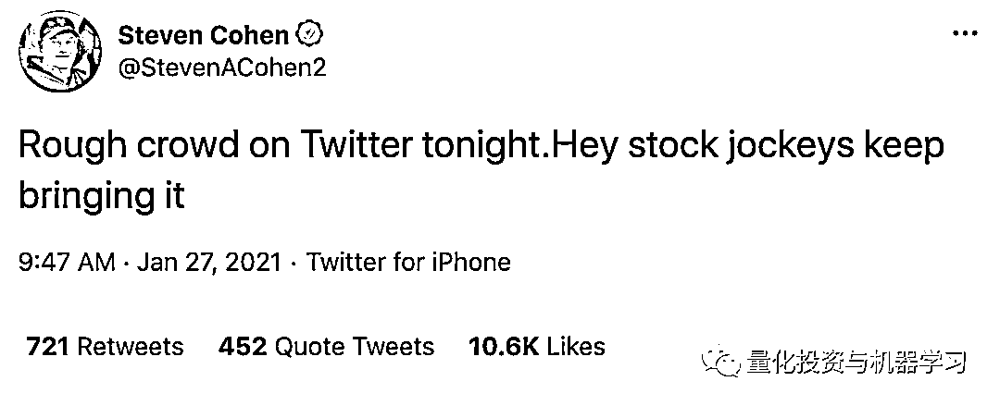

# 家人受到威胁！Point72 科恩直接关掉 Twitter

> 原文：[`mp.weixin.qq.com/s?__biz=MzAxNTc0Mjg0Mg==&mid=2653311475&idx=1&sn=c9f29a92288d22723a7821caffcf1088&chksm=802d93e6b75a1af04f55ada73a859e5c2757e9a0417c82c21ab09917846daef1b49f7fe507de&scene=27#wechat_redirect`](http://mp.weixin.qq.com/s?__biz=MzAxNTc0Mjg0Mg==&mid=2653311475&idx=1&sn=c9f29a92288d22723a7821caffcf1088&chksm=802d93e6b75a1af04f55ada73a859e5c2757e9a0417c82c21ab09917846daef1b49f7fe507de&scene=27#wechat_redirect)

### 

***全网 Quant 都在看！***

## GME 风波持续发酵！刚刚 Point72 创始人、纽约大都会棒球队的所有者科恩（Steve Cohen）发表了一段声明：**因为在 Twitter 发表的一些言论，他的家人受到威胁，他决定关掉了自己的 Twitter 账户。**

声明如下：

## 

目前科恩的 Twitter 已经搜不到内容了，账户也显示注销：

QIML 觉得这次事件对科恩有点过分了！一些网友也站出来为 Uncle Steve 打抱不平：

这件事的起因应该是因为之前 Point72 紧急向 Melvin Capital 注资的事情（7.5 亿美元）。Melvin Capital 的 Plotkin 周三向已向 CNBC 表示，在经历巨额亏损后（做空 GME），Melvin 已于本周二下午清掉了对 GME 的空头头寸。

从美国职棒大联盟（MLB）球队纽约大都会队的所有者 Sterling Partners 的手中收购这支球队后，肯恩一直在 Twitter 是一个诙谐、问我什么都可以的形象。

 

由于他给 Melvin 的注资有关 GME，使他成为 Reddit 网友讨论的目标，本月 27 号，科恩在 Twitter 一改上讨论纽约大都会队的风格，写道：

本周四，科恩还与 Barstool Sports 创始人 Dave Portnoy 在 Twitter 上进行了激烈的交锋，Portnoy 抨击 Point72、Citadel 和 Robinhood（因为 Robinhood 在 1 月 28 日开盘前暂停了包括 GameStop、AMC、Blackberry 等一系列股票在其平台上的买入选项，让用户们只剩下卖出股票和期权的选项）在 GameStop 交易中扮演的角色。

Dave Portnoy

科恩在 Twitter 上回复 Portnoy 说：

在 GameStop 散户投资者的购买狂潮中，科恩并不是唯一一个面临个人威胁的华尔街人士。本月 29 号，空头机构香橼（Citron Research）也直接缴械投降，在发表做空报告 20 年后，将不再发布做空报告，而专注于针对个人投资者的个人做多机会。

脑洞大开的网友：

**公众号作为量化领域的发声者，希望投资者回归理性！**

量化投资与机器学习微信公众号，是业内垂直于**量化投资、对冲基金、Fintech、人工智能、大数据**等领域的主流自媒体。公众号拥有来自**公募、私募、券商、期货、银行、保险、高校**等行业**20W+**关注者，连续 2 年被腾讯云+社区评选为“年度最佳作者”。