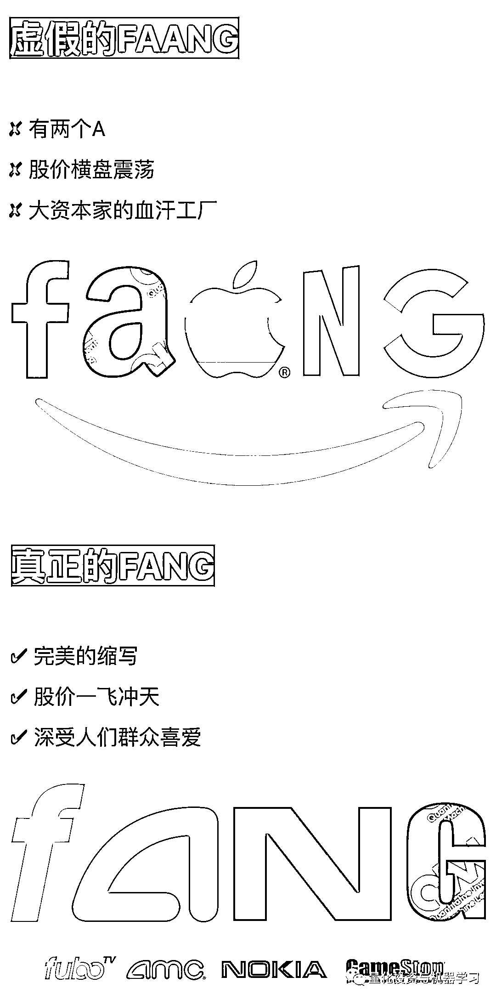
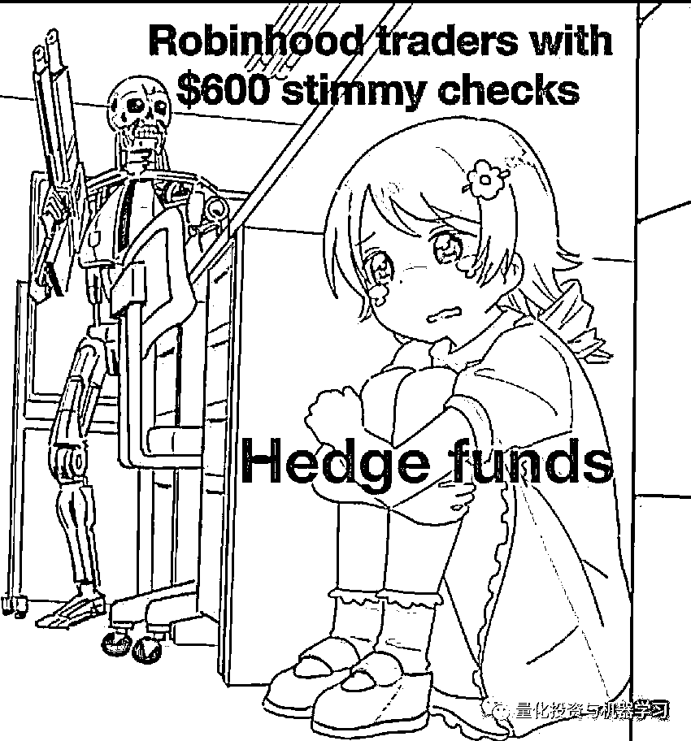

# 真正的 FANG

> 原文：[`mp.weixin.qq.com/s?__biz=MzAxNTc0Mjg0Mg==&mid=2653311397&idx=1&sn=34cc467ff9408f991e995d0757e5bc91&chksm=802d93b0b75a1aa6622aa9cbc41fdc5e8d21757dab971d7684d463f9bfc257279ae66d0858a4&scene=27#wechat_redirect`](http://mp.weixin.qq.com/s?__biz=MzAxNTc0Mjg0Mg==&mid=2653311397&idx=1&sn=34cc467ff9408f991e995d0757e5bc91&chksm=802d93b0b75a1aa6622aa9cbc41fdc5e8d21757dab971d7684d463f9bfc257279ae66d0858a4&scene=27#wechat_redirect)

### 

***全网 Quant 都在看！***

这几天**GameStop**发生的事在朋友圈刷屏，具体情况大家应该在各大媒体都看到相关报道，公众号在这里不再陈述。

万万没想到啊！Point72、Citadel 紧急向 Melvin Capital 注资的 27.5 亿美元可能也打光殆尽了吧

要知道，科恩之前从来没有对媒体说过话，没有发表过公开声明！在从美国职棒大联盟（MLB）球队纽约大都会队的所有者 Sterling Partners 的手中收购这支球队后，在 Twitter 上变成了一个诙谐、问我什么都可以的形象。

昨晚，科恩在 Twitter 一改上讨论纽约大都会队的风格。写道：

大家自己想吧··· 

**不过有关 Melvin Capital 破产的消息官方已经申明是虚假的！**

公众号也相信 Plotkin（Melvin 创始人）会走出这个困境！Plotkin 在业界的声誉非常好，尽管他在 2018 年亏损，但自开业以来，他的年化收益率达到了 30%，去年年底上涨了 50%以上，目前管理着约 125 亿美元的资产。Plotkin 之前在科恩的前公司 SAC Capital 工作了八年，他之前一直是科恩最大的赚钱帮手之一。

由此引发的媒体舆论也是让网友脑洞大开！

在 WSB 中，大家也通过漫画的方式调侃了对冲基金，这次事件真的可以写进 Billions 里面了！

今天就写到这吧。其他媒体报道几乎把来龙去脉翻了个底朝天。

**公众号作为量化领域的发声者，希望投资者回归理性，一切虚假繁荣终将破裂！**

量化投资与机器学习微信公众号，是业内垂直于**量化投资、对冲基金、Fintech、人工智能、大数据**等领域的主流自媒体。公众号拥有来自**公募、私募、券商、期货、银行、保险、高校**等行业**20W+**关注者，连续 2 年被腾讯云+社区评选为“年度最佳作者”。