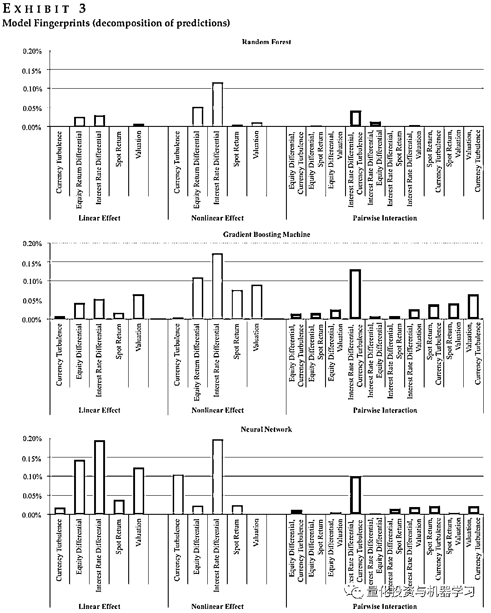

# 机器学习选股模型的可解释性分析

> 原文：[`mp.weixin.qq.com/s?__biz=MzAxNTc0Mjg0Mg==&mid=2653311376&idx=1&sn=749603504d2e97ce95360581b9ccf90c&chksm=802d9385b75a1a93a40644ba2b09eec61abcbc50e351b3dcb000e1d3fae18974d3cad23f5d8f&scene=27#wechat_redirect`](http://mp.weixin.qq.com/s?__biz=MzAxNTc0Mjg0Mg==&mid=2653311376&idx=1&sn=749603504d2e97ce95360581b9ccf90c&chksm=802d9385b75a1a93a40644ba2b09eec61abcbc50e351b3dcb000e1d3fae18974d3cad23f5d8f&scene=27#wechat_redirect)

### 

***全网 Quant 都在看！***

作者：Yimou Li, DaviD TurkingTon, anD aLireza YazDani

编译：QIML 编辑部

在上一篇文章中：

 

我们分享了道富如何以可投资及可解释为目标构建机器学习选股模型，在文章中我们提到了一个从 Linear、Nonlinear 及 Interactions 三个角度解释模型效果的核心概念：Model Fingerprints（简称 MF）框架。Li etl（2020）在 Joural of Financial Data Science 发表的一篇文章中，对 MF 框架有详细的解释。今天公众号就为大家**脱水解读**一下这篇文章。

MF 框架从 Linear、Nonlinear 及 Interactions 三个角度，分别对模型的以下两个方面进行了分析：

1、每个因子在模型中的作用：

*   线性部分（Linear）和非线性部分（Nonlinear）对模型效果的贡献；

*   每两个因子之间相互作用（Interactions）对模型效果的贡献。

2、模型应用到投资组合中，最终收益率的拆分，也是分为 Linear、Nonlinear 及 Interactions 三个部分。

我们分别从以上两个应用来解释 MF 框架：

**Part1：MF 框架**

**量化每个因子在模型预测结果中的边际贡献**

在把每个因子的效果拆解为 Linear、Nonlinear 及 Interactions 三部分之前，我们首先要掌握一个重要的概念：模型对于每个因子的边际依赖。Friedman (2001)提出了 partial dependence 的概念，主要为了测算每个单独的因子对于模型效果的影响程度。**具体的做法是，选定某个待分析的因子 k，每次对于所有的样本点，固定 k 的值而其他因子值不做变动，测试 k 在不同取值情况下模型效果的变化。**如果非要用数学公示加以表达，以下公式就是 Partial Dependence Eqution，表示在保持其他因子不变的情况下，因子 k 在不同取值时，模型效果的期望：

<embed style="vertical-align: -1.469ex;width: 39.982ex;height: auto;max-width: 300% !important;" src="https://mmbiz.qlogo.cn/mmbiz_svg/a18XcQ1EBBggIibBXCZoqdq8Xx89ajHgFaIBAy52dpqG6ttYVCYwCDicts84mxFRxhBK6OvynPYsRibcqpnXeJbicOXvicEuEplF5/0?wx_fmt=svg" data-type="svg+xml"><embed style="vertical-align: -1.948ex;width: 23.718ex;height: auto;max-width: 300% !important;" src="https://mmbiz.qlogo.cn/mmbiz_svg/a18XcQ1EBBggIibBXCZoqdq8Xx89ajHgFCiceoGfibiaVwIQ0udGs2kCsjSWcRMhrgMFwN2JK6hp1ICOK8urzyRF3z8zd3OBdElO/0?wx_fmt=svg" data-type="svg+xml">

在机器学习工具库 Scikit-Learn 中，有现成的分析 Partial dependence 的函数，plot_partial_dependence。以下图 1，就反应了在房价预测这个案例中，AveOccup 及 HouseAge 的边际贡献。

从"因子"到“收益率”的预测，机器学习模型的应用一直非常直观，但通常我们很难理解模型背后的逻辑，更别说把模型的机制进行可视化。在这篇文章中，我们参考 partial dependence 的理念，尝试从以下三个角度去分析机器学习模型的预测机制：Linear、Nonlinear 和 Interactions。

以下公式中，l 函数为线性 partial dependence function（假设预测模型为普通线性回归模型），f 函数为原始模型。

*   Linear prediction effect: 因子 k 的线性贡献用。k 在某个固定取值时，线性模型对于 k 的边际依赖，减去原始模型对于 k 的边际依赖的平均值，再对这个差的绝对值求均值。

<embed style="vertical-align: -0.566ex;width: 27.546ex;height: auto;" src="https://mmbiz.qlogo.cn/mmbiz_svg/a18XcQ1EBBggIibBXCZoqdq8Xx89ajHgFVlHKoepMViajGyjrIttge4o3KGSg9LGbSP3iaEkVOhVTA7WTlNcwuEeibXiaWVl6rCnl/0?wx_fmt=svg" data-type="svg+xml"><embed style="vertical-align: -3.014ex;width: 39.996ex;height: auto;max-width: 300% !important;" src="https://mmbiz.qlogo.cn/mmbiz_svg/a18XcQ1EBBggIibBXCZoqdq8Xx89ajHgFoFiaS6W2OKDKWFfDOiaKVRpdAsSLdbia1x7DHEiceC0zIYMfMzHNKJcFus2ZDBTlyhgz/0?wx_fmt=svg" data-type="svg+xml">

*   Nonlinear prediction effect：因子 k 的非线性贡献，等于原始模型 f 对于 k 的边际依赖，减去线性模型对于 k 的边际依赖，得到的差的绝对值的均值就是模型对于 k 的非线性依赖。（换个角度就是因子对于模型效果的非线性影响）

<embed style="vertical-align: -0.566ex;width: 33.494ex;height: auto;max-width: 300% !important;" src="https://mmbiz.qlogo.cn/mmbiz_svg/a18XcQ1EBBggIibBXCZoqdq8Xx89ajHgFsxibgDIM6136oynaxxQZibia913cypXr3ickHrzcPICAlNAkS24HyAUlItSx9pcNYFz5/0?wx_fmt=svg" data-type="svg+xml"><embed style="vertical-align: -2.819ex;width: 31.404ex;height: auto;max-width: 300% !important;" src="https://mmbiz.qlogo.cn/mmbiz_svg/a18XcQ1EBBggIibBXCZoqdq8Xx89ajHgFTibprrBiazKLX8Y8os7lHxTt7phl4XBicuxYOewEn3SRek6DaicQmQOJSjvCQIuOUHiaL/0?wx_fmt=svg" data-type="svg+xml">

*   Interactions effect：两个因子交互作用的贡献，等于原始模型 f 对于两个因子整体的边际依赖，减去原始模型 f 对于两个因子分别的依赖，再求这个差的绝对值的均值。

Pairwise interaction effect <embed style="vertical-align: -1.469ex;width: 34.811ex;height: auto;max-width: 300% !important;" src="https://mmbiz.qlogo.cn/mmbiz_svg/a18XcQ1EBBggIibBXCZoqdq8Xx89ajHgFqKLgUT08r510eeIj503Y3MpDIHZ8YWJSFibLibLskCibIBiajYpqsTyPIQibxyxIKZnJE/0?wx_fmt=svg" data-type="svg+xml">

关于 interactions effect 的定义，作者参考了 Friedman and Popescu (2008)的 H-statistic.

下图 1 展示了某个模型对于某个因子三个方面的依赖，从左到右分别是 Linear、Nonlinear 和 Interactions。

图 2 展示了模型对于两个因子交互作用的依赖，可以看出当因子 1 极高（或极低）且因子 2 极低（或极高）时，模型的效果较佳。

计算模型对于某个因子边际依赖的具体步骤如下：

1、固定因子 K 的值，用模型预测不同样本的预测目标；2、对于该因子 K 在这个特定值下，对于所有样本的预测结果，计算评价指标（如 R 平方）；3、改变 K 的取值，再次计算评价指标，就可以做出如图 1 的 Partial Dependence Plot。**Part2：MF 框架****从 Linear、Nonlinear 及 Interactions 三个角度拆解收益**

Part1 中，我们从模型预测效果的角度对每个因子的边际贡献，从 Linear、Nonlinear 及 Interactions 的三个角度进行了拆解结分析。但我们最终关系的是模型反映到策略端时的最终收益. 这一部分，我们综合各个因子的三方面的边际贡献，把模型的收益拆分为线性收益（Linear）、非线性收益（Nonlinear）、交互收益（Interactions）及高维度交互收益（Higher-order Interactions）。

关于如何测算所有因子不同作用的收益，作者没有详细阐述，小编结合文章内容做一下猜测。假设现在有 S1、S2、S3、S4、S5 五只股票，及 X1、X2、X3 三个因子，及已经校准好的线性模型 L：

1、固定 X1 因子的值，用线性模型 L 分别预测五只股票的下一期收益；2、改变 X1 的值，再用线性模型 L 分别预测五只股票的下一期收益；3、对以上每只股票，在 X1 不同取值下的预测求平均，记为 R14、在对因子 X2、X3 重复 1-3 的步骤，求出 R2、R3；5、求 R1、R2 及 R3 的均值，在根据这个均值对股票进行排序，构建组合。

以上组合的收益就是线性收益。

1、**线性收益**是各因子线性贡献部分带来的收益，计算方法参数以上注释。

2、**相互作用来的的收益**，等于相互作用及线性贡献带来的收益减去步骤 1 中的线性收益。

3、**非线性收益**，等于线性、相互作用及非线性贡献带来的收益减去步骤 1 和 2 的收益。

4、**高维相互作用带来的收益**，等于模型的总收益减去步骤 1-3 的收益。

<embed style="vertical-align: -7.322ex;width: 51.977ex;height: auto;max-width: 300% !important;" src="https://mmbiz.qlogo.cn/mmbiz_svg/a18XcQ1EBBggIibBXCZoqdq8Xx89ajHgFADfuogcia8jNuB5OfDrnwwvJ0pfNBVBicfrctyGPFibsRSItLDTBsiazTH9jWuKR8ibtn/0?wx_fmt=svg" data-type="svg+xml">

通过以上步骤，我们就可以把根据一个模型预测结果构建的投资组合的收益拆分为 Linear、Nonlinear 及 Interactions 三个主要的部分，剩下的解释不了的部分，我们放在**高维相互作用带来的收益。**

**Part3：实证分析**

作者用 G10 国家的 10 个外汇币种组成的 45 对外汇组合（以下称为品种），并基于以下 5 个因子构建预测模型，预测目标是每组外汇未来 1 个月的收益，并基于这个预测选出 27 个预测收益绝对值最大的品种。然后根据选出品种的预测收益方向，相应的做多或做空。五个因子是：

1、The short-term **interest rate differential** between countries2、The trailing five-year spot return adjusted for trailing five-year inflation differential3、The trailing one-year spot return4、The trailing one-year equity return differential5、**Currency market turbulence**

选取了常用的几种机器学习模型：Random forests、Gradient boosting machines 和 Neural networks. 训练时间为 1990 年至 2015 年，测试时间为 2016 年至 2019 年。测试结果参考下图。在所有模型中，interest rate differential 的非线性贡献最大，同时 interest rate differential 与 Currency market turbulence 的交互作用带来的贡献，也是所有因子对中最大的。图 4 更清楚了展示了不同取值时，这两者交互作用给模型带来的贡献。我们还可以看出，Random Forests 中，各因子各个维度的贡献都不是很明显；GB 中模型可多的挖掘了因子的非线性作用，而 Neural Network 中更多的挖掘了因子的线性作用。

图 5 展示了训练集中，各模型收益的拆解，可以看出，线性收益占了各个模型收益的绝大部分，GB 模型更擅长挖掘因子间相互作用（包括高维相互作用），Neural Network 更擅长挖掘非线性收益。

最后，给出了不同模型在样本内外的测试表现，不同模型的效果样本内外保持的比较一致，整体而言 GB 模型和 Neural Networks 的表现更优。

**总结**

从 Linear、Nonlinear 及 Interactions 三个角度分析因子在不同模型中的贡献，首先可以看出不同因子的特点，其次也能看出模型在不同维度挖掘信息的强弱，比如 GB 模型擅长挖掘因子交互作用带来的信息，Neural Network 擅长挖掘单因子的非线性信息。最终，**从可解释的角度拆解因子的贡献及模型的收益，能够指导我们更好的选择模型及因子。**

参考文献：

1、Friedman, J. H., and B. E. Popescu. 2008\. “Predictive Learning via Rule Ensembles.” The Annals of Applied Statistics 2 (3): 916–954.

2、Li, Y., Turkington, D. and Yazdani, A., 2020\. “Beyond The Black Box: An Intuitive Approach to Prediction with Machine Learning.” The Journal of Financial Data Science, Vol. 2, No. 3

(Summer).

量化投资与机器学习微信公众号，是业内垂直于**量化投资、对冲基金、Fintech、人工智能、大数据**等领域的主流自媒体。公众号拥有来自**公募、私募、券商、期货、银行、保险、高校**等行业**20W+**关注者，连续 2 年被腾讯云+社区评选为“年度最佳作者”。