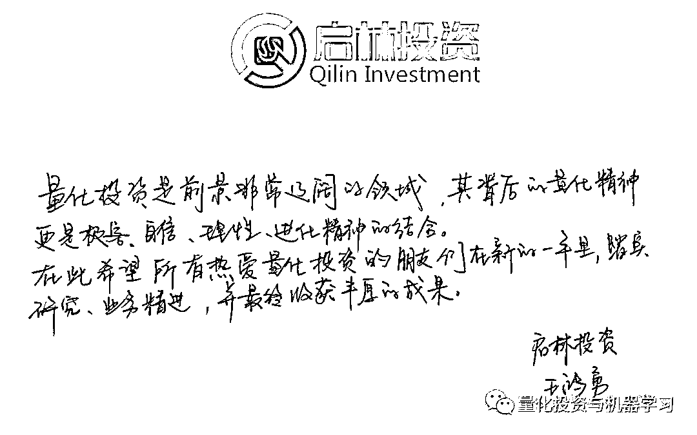

# 百亿量化私募又增 1 家，2021 注定不凡！

> 原文：[`mp.weixin.qq.com/s?__biz=MzAxNTc0Mjg0Mg==&mid=2653311227&idx=1&sn=0cf687566c2252efa217041c76b26fa2&chksm=802d92eeb75a1bf87007eaa089ca8264cc71747abf97b0fea6ca0bab5fe1cf21de7077eb676f&scene=27#wechat_redirect`](http://mp.weixin.qq.com/s?__biz=MzAxNTc0Mjg0Mg==&mid=2653311227&idx=1&sn=0cf687566c2252efa217041c76b26fa2&chksm=802d92eeb75a1bf87007eaa089ca8264cc71747abf97b0fea6ca0bab5fe1cf21de7077eb676f&scene=27#wechat_redirect)

### 

***全网 Quant 都在看！***量化投资与机器学习公众号报道

2021，注定是中国量化私募蓬勃发展的一年。在新年伊始之际，经过 QIML 公众号求证，截止 2021 年 1 月 21 日最新官方数据显示，又有一家量化私募进入百亿名单，它就是：

**启林投资**

**QIML 公众号作为启林的合作伙伴在此表示衷心的祝贺！**

新晋百亿量化私募启林投资（上海启林投资管理有限公司），成立于 2015 年 5 月，《左传》有云：“筚路蓝缕，以启山林”，启林投资的名字便诞生于此。

*   2019 年 12 月，管理规模 30 亿

*   2020 年 11 月，管理规模 70 亿元

*   2021 年 1 月，管理规模破百亿

作为启林资产的创始人兼投资总监，王鸿勇身上有着浓烈的学术色彩。除了是中国科学技术大学物理学士，北京大学物理学硕、博士，德国亥姆霍兹研究所博士后，他还是上海青年东方学者，曾任上海大学物理系副教授。在物理学最顶级的期刊“Physical Review Letters”上曾发表三篇权威学术论文，在其他 SCI 高水平杂志上也累计发表文章 20 余篇。而他带领的投研团队，80%以上来自北、复、交、中科大、哥伦比亚、斯坦福等海内外知名院校，80%拥有硕士学历，18%拥有博士学历。定位于基于数理视角和计算机应用进行股票交易的科技公司，希望成为国内顶尖的交易团队和优秀的资产管理公司。

在今年年初，王鸿勇还通过 QIML 公众号给全网 Quant 写了一段新年寄语： 

从策略的优势来看，启林投资核心 Alpha 策略迭代升级到机器学习，机器学习模型相对多因子模型更能深挖大数据，更非线性更灵活，能定期并且更快地进行策略迭代，有较强的自适应能力。其次，启林投资策略的优势还体现在全频段的预测、有效减小交易摩擦、降低冲击成本的算法交易；能增强产品收益、平滑曲线、降低回撤的程序化 T+0。

据格上理财统计，2020 年证券私募巅峰榜，启林投资荣获量化股票策略和相对价值 Alpha 策略第二名，久经市场风格切换考验！

截止至今，据公开数据显示国内百亿量化私募现共有 12 家（数据来自私募排排网）， 分别是（公司简称，按首字母排序）：

**诚奇资产****幻方量化****金锝资产****九坤投资****进化论资产****灵均投资****明汯投资****鸣石投资****宁波幻方量化****启林投资****盛泉恒元****衍复投资**

注：上述私募规模数据与协会备案规模一致。文中提及的百亿私募需同时满足：机构类型为证券类私募管理人、管理的产品类型以证券投资基金为主。若同一法人名下有两家（或以上）私募机构，规模与业绩均不进行合并统计。

虽然从备案主体来看有 12 家百亿量化机构，但是宁波幻方量化与幻方量化运营团队一致。如果按公司背后的投研团队来划分，也可理解为目前市场上百亿量化私募为 11 家。

目前量化投资市场仍处于群雄逐鹿时代，大浪淘沙、沉者为金。优秀的量化私募管理人应该具备不同良好的策略迭代和更新能力。让我们期待更多量化私募在 AUM 上能够有新的突破！

量化投资与机器学习微信公众号，是业内垂直于**量化投资、对冲基金、Fintech、人工智能、大数据**等领域的主流自媒体。公众号拥有来自**公募、私募、券商、期货、银行、保险、高校**等行业**20W+**关注者，连续 2 年被腾讯云+社区评选为“年度最佳作者”。