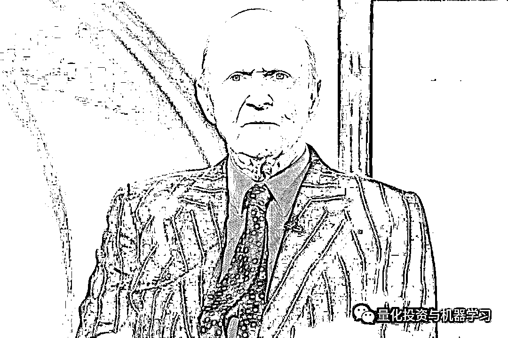

# 最新！2020 全球对冲基金经理前 20 榜单

> 原文：[`mp.weixin.qq.com/s?__biz=MzAxNTc0Mjg0Mg==&mid=2653311215&idx=1&sn=b5c120075fbc44647a61600789f14f0e&chksm=802d92fab75a1bec1878470411fe121afca820b08f18eaca63e6bde2006e1ef6834f10a7522b&scene=27#wechat_redirect`](http://mp.weixin.qq.com/s?__biz=MzAxNTc0Mjg0Mg==&mid=2653311215&idx=1&sn=b5c120075fbc44647a61600789f14f0e&chksm=802d92fab75a1bec1878470411fe121afca820b08f18eaca63e6bde2006e1ef6834f10a7522b&scene=27#wechat_redirect)

### 

***全网 Quant 都在看！***量化投资与机器学习公众号独家报道

**Tiger Global 在 2020 年获得了榜单的第一名**，这是 Tiger Global 首次获得第一名！

据对 LCH 最新披露的数字显示，**2020 年对冲基金行业获利 1270 亿美元**。Chase Coleman 的 Tiger Global 为客户创造了 104 亿美元的收入，Izzy Englander 的 Millennium 紧随其后，为 102 亿美元。

**西蒙斯老爷子的文艺复兴科技由于在去年的公共基金损失超过 30%，从而未上榜，2019 年文艺复兴科技可是排名第三呢！同时，我们从这份榜单也看到，受新冠疫情的影响达里奥的桥水基金蒙受了 121 亿美元的亏损，但自 1975 年成立以来，桥水已经为投资者带来了 465 亿美元的回报，目前管理的资产为 1019 亿美元。在成立以来的净收益上还是排名第一！**

**Two Sigma 在 2018 年排名第 19 名，在 2019 年、2020 年从榜单上消失了。**

**霍恩的 TCI 从 2019 年的第 1 名掉到了第 8 名！**

前 20 名中去年亏损的另外一家公司是 John Paulson 旗下的 Paulson & co.，Paulson 正在逐步将资金转向外部资金，并成为一家家族事务所。去年 6 月底该基金被关闭前，投资者已损失了 12 亿美元。尽管 Paulson 近年来一蹶不振，但自他 1994 年创立公司以来，旗下基金的仍然获利 178 亿美元。

**从 2020 年的榜单数据中我们可以得出，排名前 20 的基金经理掌管着全球 17%的对冲基金资产，并创造了该行业自成立以来的 1.4 万亿美元利润的 43% 。**

此榜单重点来自那些自成立以来总体利润最高的基金经理，而规模最大、历史最悠久的对冲基金往往在这一排名中表现最好。 

在前 20 的榜单中，根据彭博亿万富翁指数榜（共 500 位）2021 年最新**金融-对冲基金**行业的排名中，西蒙斯、格里芬、达里奥、Izzy Englander、David Shaw、科尔曼都榜上有名：

说起第一名老虎基金，QIML 相信很多读者首先想到的是其创始人 Julian Robertson 老爷子。真的是不亏叫老虎：

**无冕之王，咆哮而来！**

*图片来自：网络

Julian Robertson 他所主导的基本面价值投资方法影响了华尔街一代的对冲基金经理。即使在今天老虎系的投资人也遍布整个华尔街比，如今天我们介绍的 Tiger Global 的老大**科尔曼。**

*图片来自：网络

**科****尔曼**更倾向于风险资本投资，其 360 亿美元的资产中约有一半来自风险资本投资，而他的对冲基金管理着约 100 亿美元。他的业绩一直保持两位数，2019 年的收益率达到 33% ！

科尔曼的老虎全球**只有两次亏损**：

与 Tiger Global 一样，Lone Pine 和 Viking 都管理着多头基金和传统的多/空股票型基金。2020 年，Viking 旗下的一只基金上涨了 51.6% 。其做多基金上涨了 33.1% 。Lone Pine 的多空基金上涨了 30% ，而其做多的基金上涨了 46%。

2020 年是 Izzy Englander 旗下 Millennium 自 2000 年以来表现最好的一年，多策略对冲基金在 12 月 17 日前上涨了约 23.3% ！Millennium 一直在投资股票和固收市场，重点关注流动性资产类别。**目前 Millennium 的 AUM 约为 485 亿美元**（大概）。

*图片来自：网络

Millennium 团队的策略五花八门，有相对价值、统计套利、合并套利，或者纯粹的固收和大宗商品投资，但都有一个共同点：**他们只投资流动性高的产品。**

因此，加入 Millennium 的基金经理要么需要加入现有团队中的一个，要么提出一个全新的策略。如果选择后者，你会被详细询问该想法的有效性。那些曾经有过此经历人说：这个过程非常、非常给力。**如果 Millennium 喜欢你****，它将为你建立一个充满数据、分析和世界级的办公室环境**。这可能是你最接近于管理自己的基金的方式。

这可能就是为什么前高盛董事总经理 Ankit Raj、前 hutchinson Hill 创始人 Neil christs、前高盛交易员兼投资组合经理 Uberto Palomba 等人选择去 Millennium 的原因。

目前，Millennium 依靠 240 多个“小分队”（独立运营团队）来管理其资金。“小分队”通常由一名或多名投资组合经理和分析师组成，最小分队可以只有两人。**每个团队的收益与其自身业绩成正比。 而千禧年的薪酬结构更加细化：如果你的团队的策略做得好，你就会得到奖励，即使该基金其他团队都出现了亏损。**

根据相关信息显示，Millennium 今年聘用了大约 70 支分队。这是自公司 1989 年成立以来最多的一次。在接下来的 18 个月里，Millennium 还有 20 多个团队正在筹备中。

根据最新的投资者报告显示，**格里芬的 Citadel Securities 第四季度的净交易收入为 17 亿美元，使得全年的总交易收入达到 67 亿美元！**几乎是 2018 年最高数字的 2 倍！

*图片来自：网络

Citadel Securities 的收入和利润在 2020 年增长了一倍多：

*数据来自：Citadel Securities presentation

目前 Citadel Securities 在美股市场市场的交易份额为 27%，高于 2017 年的 21%。在 order flow 占主导地位，占市场的 46%。

再给大家科普一下： 

**Citadel 是一家全球领先的对冲基金**

**Citadel Securities 是一家全球领先的做市商**

因为这两家公司完全独立，所以两家公司在英国的账户完全独立。不过，考虑到他们共同的出身，他们同时提交了账户：Citadel Europe LLP 和 Citadel Management Europe Ltd.（都是该对冲基金的一部分）和 Citadel Securities Europe（做市商）刚刚发布了截至 2019 年 12 月的财年业绩。这些数据表明，格里芬去年在欧洲经营的对冲基金十分成功。

在 Citadel，员工的薪水也不低。在 Citadel Management Ltd， **218 名员工去年平均的收入是 110 万美元**。在 Citadel Securities Europe，120 名员工平均每人是 6.59 万美元。根据我们在网上查找到的资料，截止去年 6 月的数据显示，其**支付给量化分析师和技术专家平均薪酬为 21.7 万美元，高于其平均薪酬为 21.5 万美元的投资分析师。**从 WSO 与 Glassdoor 的提供的数据综合来看，Citadel 技术人员的薪资从 12.7 万美元到 21.5 万美元不等。

Citadel 支付给技术人员的薪酬高于其他对冲基金，也高于多数投行（高盛在 2017 年将其初级工程师的薪资提高至 10 万美元，并在今年早些时候开始向拥有硕士学位的新技术分析师提供总计 12.8 万美元的薪酬（工资加奖金））。

我们再来看看 Citadel 在 LeetCode 上的面试题目：

大家可以在 LeetCode 官网学习查看。 

Citadel 和 Citadel Securities 2020 年的实习情况堪称：

**奢华**

在今年疫情爆发之初，Citadel Securities 的一部分人撤到了 Palm Beach 的五星级酒店。在那里，Citadel Securities 建立了自己的交易大厅。真爽！

Palm Beach

同时，Citadel Securities 的 35 名实习生今年夏天也去了 Palm Beach 的四季酒店，另外 100 名实习生去了位于威斯康星州 Kohler 的五星级美国俱乐部度假村，在那里每晚的房价可高达 400 美元。这些实习生花了一个月的时间泡在酒店里，白天工作，晚上参加各种活动。Palm Beach 的活动包括：游泳日和 Spikeball 锦标赛。Kohler 的活动包括：皮划艇、攀岩和高尔夫课程。

活动现场

Citadel 的首席运营官 Gerald Beeson 在表示：**“在你事业起步的关键决策时刻，我们希望为你提供一个安全的、沉浸式的暑期项目，让我们的实习生能够和我们杰出的同事一起学习。”**

这些实习生的实习期于 8 月 14 日结束。两地都邀请了 Citadel 创始人格里芬和 Citadel Securities 首席执行官 Peng Zhao 进行了会谈。

Citadel 之所以选择在威斯康星州落户，是因为它离芝加哥很近：从 Citadel 的总部开车要两个多小时，也因为它位于乡村地区，而且 Kohler 还有 2000 多名居民。Citadel 投入了大量资源来升级度假村的技术基础设施，并在主宴会厅打造了一个可容纳 150 人的工作空间，简直棒呆！

Citadel 重新设计了位于威斯康星州科勒的 American Club 酒店布局

Citadel Securities 的 ETF 交易主管 Kelly Brennan 的总部通常在纽约，但她会在佛罗里达待上几周，亲自与团队中的实习生交流。在加入 Citadel Securities 之前，Brennan 在高盛工作了十多年。她说：“过去她和其他实习生有过互动，但今年，他们之间的关系更自然了！”

Brennan 也表示：“这对公司也有好处，公司可以再非工作时间关注实习生，让大家的个性都表现出来，这也能让我们对候选人有一个全面的认识！”

一名实习表示，他在其他金融公司工作的朋友对他这个夏天的经历表示**非常嫉妒**，而且这种经历让他与人们面对面交流产生了很大的不同。大厂就是不一样！

**公众号也希望，国内量化机构能够进一步加强对人才的培养。有些事情不可能一蹴而就，需要沉淀与积累！**

在今年的 2020 年 5 月分，Citadel Securities 被评为 2020 年芝加哥最佳工作场所之一。其来自 27000 多名员工的调查反馈，这些员工在一系列标准中匿名评价了他们的雇主的表现，这些标准包括对领导能力的信任、工作场所决策的公平性以及同事间的情谊。

Citadel Securities 首席执行官 Peng Zhao 表示：“**能被评为芝加哥顶级职场之一，我们感到非常激动”。“我们相信，为有才能的人才提供最好的技术、工具和环境来创造更好的市场，而这一认可正是对这一承诺的证明。**”

评选活动的首席执行官 Michael c. Bush 表示：“像 Citadel Securities 这样的最佳工作场所，建立了强大的信任和人际关系基础，帮助公司度过压力和不确定时期”。

**D****avid Shaw**的排名第六，但是这位哥伦比亚大学前计算机科学教授管理的 D. E. Shaw 规模逾 550 亿美元。而且他本身很严谨、很聪明！

**在扣除手续费后，D.E. Shaw 最大的对冲基金 2020 年的收益率为 19.4%！**

*图片来自：网络

如今，D.E.Shaw 在量化投资与传统基本面策略（如选股）结合方面处于领先地位。这种共生关系被资产管理公司戏称为：**Quantamental**（它是 Quantitative 和 Fundamental 两者的结合，就是**“量化”+“基本面”**的意思，简称**量本投资**）。

D.E.Shaw 的高管强调，他们唯一不变的就是全面采用数据驱动的“量化”方法，无论是在高速套利还是投资可再生能源领域。D.E.Shaw 投资者关系主管亚 Alexis Halaby 表示：**“我们的核心优势是对事物进行科学思考，因此我们不会觉得自己在偏离本源”。**

**D.E.Shaw 还在加大对计算机科学前沿领域的投资**，成立了一个由《The Master Algorithm》作者、计算机科学与工程学教授 Pedro Domingos 领导的机器学习研究小组，并投资于一家量子计算初创公司。

**2019 年回顾**

在 2019 年，以下 20 位表现优秀的对冲基金经理获得了 593 亿美元的收益，实现了至少 10 年来的最佳年度收益。

TCI 基金经理 Christopher Hohn 的 TIC 获得 84 亿美元的惊人收益，位居榜首。Lone Pine 的基金经理 Steve Mandel 以 73 亿美元的收益位居第二，文艺复兴科技的西蒙斯位居第三。

在对冲基金 2019 年赚的**1780 亿**美元资金中，**表现最好的 20 家基金约占三分之一**。自成立之日起，所有对冲基金共为客户赚取了 1.28 万亿美元，其中的 44%，约 5580 亿美元来自前 20 名。量化投资与机器学习微信公众号，是业内垂直于**量化投资、对冲基金、Fintech、人工智能、大数据**等领域的主流自媒体。公众号拥有来自**公募、私募、券商、期货、银行、保险、高校**等行业**20W+**关注者，连续 2 年被腾讯云+社区评选为“年度最佳作者”。