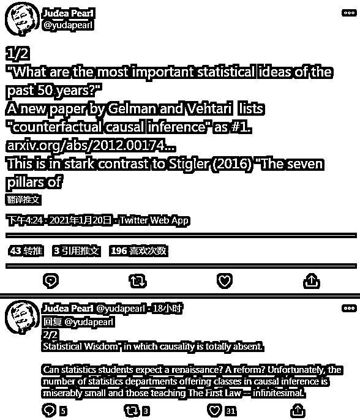
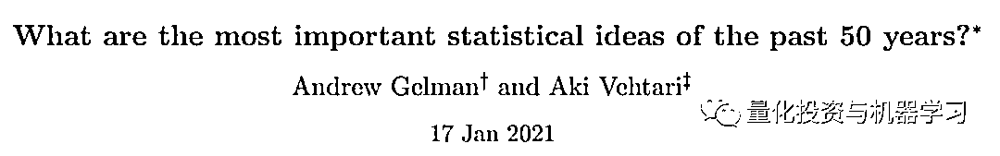
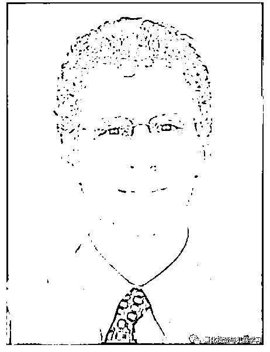

# 过去 50 年最重要的统计学思想！

> 原文：[`mp.weixin.qq.com/s?__biz=MzAxNTc0Mjg0Mg==&mid=2653310940&idx=1&sn=010f4ba82ad642416a94bdb4b807faf3&chksm=802d8dc9b75a04dfcfb1a330d46f33eae408fb446d141839e1e12a11e7614ddf17e5f9c2d37a&scene=27#wechat_redirect`](http://mp.weixin.qq.com/s?__biz=MzAxNTc0Mjg0Mg==&mid=2653310940&idx=1&sn=010f4ba82ad642416a94bdb4b807faf3&chksm=802d8dc9b75a04dfcfb1a330d46f33eae408fb446d141839e1e12a11e7614ddf17e5f9c2d37a&scene=27#wechat_redirect)

### 

***全网 Quant 都在看！***作者 | 陈彩娴、Mr Bear
编辑 | 青暮，AI 科技评论

近日，图灵奖得主、“贝叶斯网络之父”Judea Pearl 在 Twitter 上分享了一篇新论文“What are the most important statistical ideas of the past 50 years?”（过去 50 年中最重要的统计思想是什么？）

这篇论文由哥伦比亚大学统计学教授 Andrew Gelman 和阿尔托大学计算机科学系副教授 Aki Vehtari 所著，他们根据自己的研究和文献阅读经验总结出了**过去半个世纪以来最重要的 8 个统计思想**，并表示：“它们是独立的概念，涵盖了统计方面不同的发展。这些思想都在 1970 年前的理论统计文献和各个应用领域的实践中就已经出现。但是在过去的五十年中，它们各自已经发展到足以成为新事物的程度。”

他们认为，过去半个世纪中最重要的统计思想是：**反事实因果推理，基于 bootstrapping（自助抽样法）和基于模拟的推理，超参数化模型和正则化，多层模型，泛型计算算法（generic computation algorithms），自适应决策分析，鲁棒推理和探索性数据分析**（未按时间顺序，排序不分先后）。

在这篇论文中，**他们将讨论这些思想的共同特征、它们与现代计算和大数据的关系以及在未来几十年中如何发展。**“本文的目的是引起有关统计和数据科学研究更大主题的思考和讨论。”

值得一提的是，Judea Pearl 在推文中表示，“对作者将因果推理列入其中感到欣慰，这与 Stigler 在《统计学七支柱》中的总结截然不同，后者完全没有提到因果推理。”另外，他也对大学统计专业很少安排因果推理课程感到担忧，“统计学可以期待复兴或改革吗？不幸的是，统计系中提供因果推理课程的非常少，更不用提教'The First Law'的，简直是无穷少。”

论文：What are the most important statistical ideas of the past 50 years?

论文地址：*https://arxiv.org/pdf/2012.00174.pdf*

作者简介：

Andrew Gelman，美国统计学家，哥伦比亚大学统计学和政治学教授。他 1986 年获得麻省理工学院数学和物理学博士学位。随后，他获得了博士学位。在哈佛大学统计学荣誉退休教授 Donald Rubin 的指导下，于 1990 年从哈佛大学获得统计学博士学位。他是美国统计协会与数理统计学会的院士，曾三度获得美国统计协会颁发的“杰出统计应用奖”，谷歌学术显示，他的论文总引用量超过 12 万，h-index 为 110。

Aki Vehtari，阿尔托大学计算机科学系副教授，主要研究领域为贝叶斯概率理论和方法、贝叶斯工作流、概率编程、推理方法（例如 Laplace，EP，VB，MC）、推理和模型诊断、模型评估和选择、高斯过程以及分层模型。谷歌学术显示，他的论文总引用量近 4 万。他和 Andrew Gelman 都是《贝叶斯数据分析》的作者，这本书因在数据分析、研究解决难题方面的可读性、实用性而广受读者好评，被认为是贝叶斯方法领域的优秀之作。

以下是全文编译：

**1、过去 50 年最重要的统计思想**

**1.1 反事实因果推理**

在这里，我们首先要介绍在统计学、计量经济学、心理测量、流行病学和计算机科学领域出现的一些重要思想，它们都围绕着因果推理面临的挑战展开，并且都在某种程度上弥平了「对观测推理的因果解释」和「认识到关联关系并不意味着因果关系」这两方面的差距。

核心的思想在于，在某些假设情况下，我们可以识别出因果关系，而且我们可以严谨地声明这些假设，并且通过设计和分析以各种方式解决它们。

**到目前为止，关于如何将因果模型应用于真实数据的具体问题上的争论仍在继续。**然而，在过去的五十年中，这一领域的工作进展使因果推理所需要的这些假设变得精确得多，从而反过来又促进了解决这些问题的统计方法的相关工作。

研究人员针对各个领域研发出了各种各样的因果推理方法：在计量经济学领域中，人们主要关注对线性模型的因果估计的可解释性；在流行病学领域中，人们主要关注基于观测数据的推理；心理学家已经意识到交互和各种处理效应的重要性；在统计学领域中，出现了一系列有关匹配和其它调整并衡量实验组和对照组之间差别的方法；在计算机科学领域中，涌现出有关多维因果归隐模型的研究工作。

在上述所有工作中，有一条研究主线，**即从反事实或可能得到的结果的层面上对因果问题进行建模，这相较于之前没有明确区分描述性推理和因果推理的标准方法是一个巨大的飞跃。**

在这个研究方向上，具有里程碑意义的工作包括 Neyman (1923)，Welch (1937)，Rubin (1974)，Haavelmo (1973) 等人的研究成果，更加详细的研究背景请参阅 Heckman 和 Pinto 于 2015 年发表的论文「Causal analysis after Haavelmo」。

反事实因果推理的思想和方法在统计学以及相关的应用研究和策略分析领域都有深远影响。

**1.2 bootstrap 与基于模拟的推理**

在过去的 50 年中，用计算取代数学分析是统计学的一大发展趋势。这一变化甚至在「大数据」分析出现之前就开始了。

bootstrap 是最纯粹的基于计算定义的统计方法之一，它定义了一些估计量，并将其应用于一组随机重采样数据集。**其思想是将估计值视为数据的一个近似的充分统计量，并将自助分布视为对数据的采样分布的近似。**在概念层面上，人们推崇将预测和重新抽样作为基本原则，可以推导出诸如偏差校正和收缩等统计学操作。

历史上，这一方向诞生了「刀切法」和「交叉验证」等方法。此外，由于 bootstrap 思想的通用性及其简单的计算实现方式，bootstrap 立刻被广泛用于各种传统的解析近似方法效果不佳应用，从而产生了巨大的影响。**时至今日，充足的计算资源也起到了帮助作用，使得对许多重采样得到的数据集进行反复的推理变得十分容易。**

**计算资源的增加也使得其它重采样和基于模拟的方法流行了起来。**在置换检验中，我们通过随机打乱排列真实值（target）来打破预测值和真实值之间的依赖关系，从而生成重采样数据集。参数化的 bootstrap、先验和后验预测检查、基于模拟的校正都是根据模型创建了复制数据集，而不是直接从数据中重采样。在分析复杂模型和算法时，根据已知的数据生成机制采样的做法往往被用于创建模拟实验，用于补充或替代数学理论。

**1.3 过参数化模型和正则化**

自 20 世纪 70 年代以来，统计学受个方面的影响，发生了一个重大的变化，即用一些正则化过程得到稳定的估计和良好的预测结果，从而拟合具有大量参数（有时参数比数据点更多）的模型。**该思想旨在在避免过拟合问题的同时，获得一种非参数化的或高度参数化的方法。**我们可以通过针对参数或预测曲线的惩罚函数来实现正则化。

早期的高度参数化的模型包括「马尔科夫随机场」、「样条函数」、「高斯过程」，随后又出现了「分类和回归决策树」、「神经网络」、「小波收缩」、「Lasso 和 Horseshoe 等最小二乘的替代方法」、「支持向量机及相关理论」。

**上述所有模型都会随着样本规模的增加而扩大，其参数往往也不能被直接解释**，它们是一个更大的预测系统的一部分。在贝叶斯方法中，我们可以首先在函数空间中考虑先验，然后间接推导出相应的模型参数的先验。

**在人们能够容易地获得充足的计算资源之前，这些模型的使用还十分有限。**此后，图像识别、深度神经网络领域中的过参数化模型持续发展。Hastie、Tibshirani 以及 Wainwright 于 2015 年将许多该领域的工作定义为对稀疏结构的估计。

但是在本文作者看来，**正则化技术更为通用，这是因为它使稠密的模型能够适应数据支持的程度。**在统计学领域以外， 这方面也产出了许多成果，例如：非负矩阵分解、非线性降维、生成对抗网络、自编码器。它们都是可以寻找结构和分解结果的无监督学习方法。

**随着统计方法得到了发展，并被应用于更大的数据集上，研究者们还研发了一些调优、自适应，以及组合来自多个拟合结果的推理**（包括 stacking 集成、贝叶斯模型平均、boosting 集成、梯度提升、随机森林）的方法。

**1.4 多层模型**

多层模型的参数因组而异，它使模型可以适应于聚类抽样、纵向研究、时间序列横断面数据、元分析以及其它结构化的环境。在回归问题中，一个多层模型可以被看做特定参数化的协方差结构，或者是一个参数数量随数据比例增加的概率分布。

**多层模型可以被看做一种贝叶斯模型，它们包含未知潜在特征或变化参数的概率分布。反过来，贝叶斯模型也有一种多层结构，包含给定参数的数据和超参数的参数的分布。**

对局部和一般信息进行池化（pooling）的思想是根据带有噪声的数据进行预测的固有数学原理。这一思想可以追溯到拉普拉斯和高斯，高尔顿也隐式地表达了这种思想。

部分池化的思想已经被应用于一些特定应用领域（例如：动物育种）。部分池化与统计估计问题中的多重性的一般关系由于 James 和 Stein 等人的工作而得到了理论上的重要进展。最终，这启发了心理学、药理学、抽样调查等领域的研究。Lindley 和 Smith 于 1972 年发表的论文，以及 Lindley 和 Novick 于 1981 年发表的论文提供了一种基于估计多变量正态分布的超参数的数学结构，而 Efron 和 Morris 等人则给出了相应的决策理论方面的解释，接着这些思想被融入了回归建模并被应用于广泛的使用结构化数据的问题。

从另一个方向来看，Donoho 等人于 1995 年给出了多元参数收缩的信息论解释。**我们更倾向于将多层模型看做将不同的信息源进行组合的框架，而不是一个特定的统计模型或计算过程。**因此，每当我们想要根据数据的子集进行推理（小面积估计）或将数据泛化到新问题（元分析）上的时候，就可以使用这种模型。类似地，**贝叶斯推理的可贵之处在于，它不仅仅是一种将先验信息和数据组合起来的方法，也是一种解释推理和决策的不确定性的方法。**

**1.5 泛型计算方法**

前文中讨论过的建模方面的研究进展高度依赖于现代计算科学，这不仅仅指的是更大的内存、更快的 CPU、高效的矩阵计算、对用户友好的语言，以及其它计算科学方面的创新。用于高效计算的统计算法方面的进展也是一个关键的因素。

在过去的 50 年中，在统计问题的结构方面出现了许多具有创新性的统计算法。EM 算法、Gibbs 采样、粒子滤波、变分推断、期望传播以不同的方式利用了统计模型的条件独立结构。

而 Metropolis 算法、混合或 Hamiltonian 蒙特卡洛算法则并没有直接受到统计问题的启发，它们最初被提出用于计算物理学中的高维概率分布，但是它们已经适应了统计计算，这与在更早的时候被用于计算最小二乘以及最大似然估计的优化算法相同。

当似然的解析形式很难求解或计算开销非常大时，被称为近似贝叶斯计算的方法（通过生成式模型仿真、而不是对似然函数进行估计得到后验推理）是十分有效的。

**纵观统计学的历史，数据分析的发展、概率建模和计算科学是共同发展的。**新的模型会激发具有创新性的计算算法，而新的计算技术又为更加复杂的模型和新的推理思想开启了大门（例如，高维正则化、多层建模、自助抽样法）。通用的自动推理算法使我们可以将模型的研发解耦开来，这样一来变更模型并不需要对算法实现进行改变。

**1.6 自适应决策分析**

自 20 世纪 40 年代至 20 世纪 60 年代，决策理论往往被认为是统计学的基石，代表性的工作包括：效用最大化、错误率控制、以及经验贝叶斯分析。

**近年来，沿着上述工作的方向，研究人员在贝叶斯决策理论、错误发现率分析等领域也取得了一系列成果。**决策理论还受到了有关人类决策中的启发与偏见的心理学研究的影响。

决策也是统计学的应用领域之一。**在统计决策分析领域的领域中，重要的研究成果包括：贝叶斯优化、强化学习**，这与工业中的 A/B 测试的实验设计的复兴以及许多工程应用中的在线学习有关。

计算科学的最新进展使我们可以将高斯过程和神经网络这些高度参数化的模型用作自适应决策分析中的函数的先验，还可以在仿真环境中进行大规模的强化学习，例如：创造能够控制机器人、生成文本、以及参与围棋等游戏。

**1.7 鲁棒的推理**

**鲁棒性思想是现代统计学的核心，它指的是：即使在假设错误的前提条件下，我们也可以使用模型。**实际上，开发出能够在违背上述假设的真实场景下良好运行的模型对于统计理论来说是十分重要的。

Tukey 曾于 1960 年在论文「A survey of sampling from contaminated distributions」中对该领域的工作进行了综述，Stigler 也于 2010 年在论文「The changing history of robustness」中进行了回顾。

受到 Huber 等人工作的影响，研究者们开发出了一系列在现实生活中（尤其是经济学领域，人们对统计模型的缺陷有深刻的认识）具有一定影响力的鲁棒方法。在经济学理论中，存在「as if」分析和简化模型的概念，因此计量经济学家会对在一系列假设下还能运行良好的统计程序十分感兴趣。例如，经济学和其它社会科学领域的应用研究人员广泛使用鲁棒标准误差以及部分识别。

一般来说，正如在 Bernardo 和 Smith 于 1994 年所提出的 「M-开放世界」（在这个世界中，数据生成过程不属于拟合的概率模型）下评估统计过程的想法一样，统计研究中的鲁棒性的主要影响并不在于对特定方法的发展。Greenland 认为，研究者需要显式地解释传统统计模型中没有考虑的误差来源。**对鲁棒性的关注与高度参数化的模型相关，这是现代统计学的特点，对模型评估有更普遍的影响。**

**1.8 探索性数据分析**

**上文讨论的统计思想都涉及密集的理论和计算的结合。**从另一个完全不同的方向来看，研究人员们进行了一种具有影响力的「回归到本质」的探索，**他们跳出概率模型，重点关注数据的图形可视化。**

Tukey 和 Tufte 等人在他们的著作中曾对统计图的优点进行了讨论，而许多这样的思想通过他们在数据分析环境 S（目前在统计学及其应用领域占据主导地位的 R 语言的前身）中的实现开展了统计实践。

在 Tukey 之后，探索性数据分析的拥趸重点说明了渐进理论的局限性以及开放式探索和通信的好处，并且阐明了超越统计理论的对统计科学的更一般的观点。**这与更加关注发现而非检验固定假设的统计建模观点不谋而合。**

**同时，它不仅在特定的图形化方法的发展中十分具有影响力，也从科学的数据中学习，将统计学从定理证明转向更开放、更健康的角度。**举例而言，在医学统计学领域中，Bland 和 Altman 于 1986 年发表的一篇高被引论文推荐人们将图形化方法用于数据对比，从而替换关联性和回归分析。

此外，研究人员试图形式化定义探索性数据分析：Gelman 将数据展示与贝叶斯预测检查的可视化相结合，Wilkinson 形式化定义了统计图中固有的对比和数据结构，而 Wickham 通过这种方式得以实现了一个极具影响力的 R 语言程序包，从而在许多领域中改变了统计学实践。

**计算的进步使从业者们能够快速构建大型的复杂模型，其中在理解数据、拟合的模型、预测结果之间的关系时，统计图是十分有用的。**「探索性模型分析」有时被用来获取数据分析过程的实验特性。研究人员们也一直进行着将可视化囊括在模型构建和数据分析过程中的研究工作。

**2、相同点与不同点**

**2.1 思想能产生方法与工作流程**

**我们之所以认为上面列出的思想重要，是因为它们不仅解决了现有问题，还建立了新的统计思维方式和数据分析方式。**换句话说，上述的每一种思想都是一部法典，其方法不仅局限于统计学，而更像是一种“研究品味”或“哲学思想”：

• 反事实机制将因果推理置于统计或预测的框架中，其中，因果估量（causal estimands）可以根据统计模型中未观察到的数据精确定义和表达，并与调查抽样和缺失数据推算的思想联系起来。

• Boostrap 打开了隐式非参数建模（implicit nonparametric modeling）的大门。

• 过参数化的模型和正则化基于从数据中估计模型参数的能力，将限制模型大小的现有做法形式化和泛化，这与交叉验证和信息标准有关。

• 多层模型将从数据估计先验分布的“经验贝叶斯”技术形式化，使这种方法在类别更广泛的问题中使用时具备更高的计算与推理稳定性。

• 泛型计算算法使实践者能够快速拟合用于因果推理、多层次分析、强化学习和其他许多领域的高级模型，使核心思想在统计学和机器学习中产生更广泛的影响。

• 自适应决策分析将最佳控制的工程问题与统计学习领域联系在一起，远远超出了经典的实验设计。

• 鲁棒推理将对推理稳定性的直觉形式化，在表达这些问题时可以对不同程序进行正式评估和建模，以处理对异常值和模型错误说明的潜在担忧。此外，鲁棒推理的思想也为非参数估计提供了信息。

• 探索性数据分析使图形技术和发现成为统计实践的主流，因为这些工具正好可以用于更好地理解和诊断正在与数据进行拟合的概率模型的新型复杂类别。

**2.2\. 计算上的进步**

元算法（利用现有模型和推理步骤的工作流）在统计学中被广泛使用，比如最小二乘法，矩估计（the method of moments），最大似然，等等。

**在过去 50 年里所开发的许多机器学习元算法都有一个特征，就是它们会以某种方式拆分数据或模型**。学习元算法（Learning Meta-Algorithms）与分治计算方法相关，最著名的是变分贝叶斯和期望传播算法。

元算法和迭代计算在统计学中之所以重要，主要是有两个原因：1）除了最初开发的元算法示例以外，通过多个来源整合信息，或通过整合弱分类器（weak learner）来创建强分类器的通用想法可以得到广泛应用；2）自适应算法在在线学习中发挥了很好的作用，最终被认为代表了现代统计观点：数据和计算分开，信息交换和计算架构是元模型或推理过程的一部分。

**新方法使用新技术工具并不稀奇：随着计算速度越快、计算范围越广，统计学家不再局限于具备解析方案的简单模型与简单的封闭式算法（如最小二乘法）**。我们可以简要说一下上述思想是如何利用现代计算：

• 一些思想（boostrapping，超参数化模型和机器学习元分析）直接利用了计算速度，这在计算机出现之前难以想象。例如，直到引入高效的 GPU 卡和云计算之后，神经网络才更加流行起来。

• 除了计算能力以外，计算资源的分散也很重要：台式计算机能让统计学家和计算机科学家尝试新方法，然后由从业人员使用这些新方法。

• 探索性数据分析最初是从纸笔图形开始，但随着计算机图形学的发展，探索性数据分析已经历彻底改变。

• 过去，贝叶斯推理仅限于可以通过分析解决的简单模型。随着计算能力的提高，变分和马尔可夫链模拟方法使得模型构建和推理算法开发的分离成为可能，概率编程也因此允许不同领域的专家能够专注于模型构建并自动完成推理。这导致了贝叶斯方法在 1990 年开始在许多应用领域变得普及。

• 自适应决策分析，贝叶斯优化和在线学习应用于计算和数据密集型问题，例如优化大型机器学习和神经网络模型，实时图像处理和自然语言处理。

• 鲁棒的统计学不一定需要大量计算，但它的使用在一定程度上由计算驱动，与封闭式估计（如最小二乘法）有所区别。Andrews 等人曾使用大量计算进行了一项模拟研究，促进了对鲁棒方法的开发和理解。

• 减少多元推理的合理性不仅可以通过统计效率来证明，还可以从计算层面证明：激发了一种新的渐近理论。

• 反事实因果推理的关键思想与理论相关，而不是计算相关。但是，近年来，因果推理在使用计算密集的非参数方法后已有了发展，促进了统计学、经济学和机器学习中因果和预测模型的统一。

**2.3 大数据**

除了为统计分析开拓发展空间以外，现代计算还启发了新统计方法的应用和开发，从而产生了大数据，例子有：基因阵列，流图像和文本数据，以及在线控制问题，如自动驾驶汽车。**事实上，“数据科学”流行的原因之一就是因为，在此类问题中，数据处理和高效计算是与用于拟合数据的统计方法一样重要的。**

这与 Hal Stern 的观点相关：**统计分析最重要的方面不是对数据进行的操作，而是你所使用的数据是什么。**与先前的方法相比，本文讨论的所有思想都有一个共同特征，即有助于使用更多的数据：

• 反事实框架允许使用用于对受控实验建模的相同结构从观测数据中进行因果推断。

• Bootstrapping 可用于纠正偏差，与在分析计算无法进行的复杂调查、实验设计和其他数据结构上进行方差估计。

• 正则化允许用户在模型中加入更多预测变量，而不必担心过度拟合。

• 多层模型使用部分汇集来合并来源不同的信息，从而更广泛应用元分析的原理。

• 泛型计算算法允许用户拟合更大的模型，这对将可用数据连接到重要的基本问题来说可能是有必要的。

• 自适应决策分析利用在数值分析中开发的随机优化方法。

• 鲁棒推理可以更常规地使用具有异常值、相关性和其他可能阻碍常规统计建模的数据。

• 探索性数据分析为复杂数据集的可视化打开了大门，并推动了整洁数据分析（tidy data analysis）的发展，以及统计分析、计算和通信的集成。

在过去的 50 年里，统计编程环境也有了很大的发展，最著名的是 S 语言、R 语言，还有以 BUGS 开头命名的通用推理引擎及其后继者。近日，数值分析、自动推理和统计计算的思想开始以可复制的研究环境（如 Jupyter notebook）和概率编程环境（如 Stan，Tensorflow 和 Pyro）的形式混合在一起。因此，我们至少可以预计推理和计算方法的部分统一，例如使用自动微分进行优化、采样和灵敏度分析。

**2.4 这些思想的关联与交互**

Stigler 在 2016 年提出，**一些明显不同的统计领域背后存在某些共同主题的相关性**。这一互相联系的思想也可以用于最近的发展。例如，鲁棒统计学（侧重于偏离特定模型假设）和探索性数据分析（传统上被认为对模型根本不感兴趣）之间有什么联系？

探索性方法（如残差图和 hanging rootograms ）可以从特定的模型分类（分别是累计回归和泊松分布）中获得，但是，它们的价值在很大程度上是在于其可解释性，即无需参考启发它们的模型。

同样，你可以单独将一种方法（如最小二乘法）看作对数据的运算，然后研究表现好的数据生成过程的类别，再使用这种理论分析的结果来提出更鲁棒的程序，能够拓展无论是基于故障点（breakdown point），极小化极大风险或其他方式定义的适用范围。相反，纯粹的计算方法（例如蒙特卡洛积分估算）可以被有效解释为统计推理问题的解决方案。

另一个联系是，因果推理的潜在结果框架对人群中的每个单元都有不同的处理效应，因此自然而然就采用了一种元分析方法将效应多样化，并使用在实验或观察性研究分析中使用多层次回归进行建模。

回过头来看，研究 bootstrap 可以为我们提供一种新观点：将经验贝叶斯（多层次）推理看作非透视方法。在该方法中，正态分布或其他参数模型用于部分汇集，但最终估计值不局限于任何参数形式。对小波（wavelets）和其他丰富参数化模型进行正则化的研究与在鲁棒背景下开发的稳定推理程序之间存在意想不到的联系。

其他方法论的联系更为明显。正则化的过参数化模型使用机器学习元算法进行了优化，反过来又可以得出对 contamination 具有鲁棒性的推论。这些连接可以用其他方式表示，鲁棒回归模型对应混合分布，混合分布可以视为多层次模型，还可以使用贝叶斯推理进行拟合。深度学习模型与一种多层次逻辑回归相关，也与复现核心的 Hilbert 空间（在样条中使用，支持向量机）相关。

高度参数化的机器学习方法可以构建为贝叶斯分层模型，其中将惩罚函数正则化与超先验相一致，无监督学习模型也可以被构建为具有未知组员的混合模型。在许多情况下，是否使用贝叶斯生成框架是取决于计算，这也是双向进行：贝叶斯计算方法可以帮助掌握推理和预测中的不确定性，高效优化算法也可以用于近似基于模型的推理 。

**许多被广泛讨论的思想都涉及到丰富的参数化，并伴随一些用于正则化的统计或计算工具。因此，它们可以被认为是经筛选思想的更广泛实现：随着可用数据的增加，模型会变得更大。**

**2.5 理论促进应用，反之亦然**

可以说所有这些方法的共同特征是易记的名称和良好的传播。但是作者怀疑这些方法的名称仅在回顾时会引起注意。诸如“反事实”、“引导程序”、“堆叠”和“增强”之类的术语听起来很专业，而不是令人印象深刻，作者认为**是方法的价值使这些名字变得响亮。**

创新的想法经常会遇到阻力，这也是本文中讨论的这些有影响力的想法的命运。**如果一个新思想起源于一个应用领域，那么要说服理论家相信它的价值可能会遇到很大挑战。相反，批评新方法在理论上是有用的，但在实践中没有用，倒是很容易。**

我们应该澄清，所谓“反对”不一定意味着积极反对。**与其他一些学术领域相比，统计数据不是很政治化**：学术界、政府和行业内部对统计领域的发展很宽容，甚至边缘思想也被允许发展。此处讨论的许多方法（例如引导程序，lasso 和多层模型）在统计和各种应用领域中都立即流行起来，但即使是这些思想也面临着阻力，即局外人需要确信其应用的必要性。

理论统计学是应用统计学的理论，这在一定程度上得益于诸如 Cox 的“Planning of Experiments”，Box and Tiao 的“Bayesian Inference in Statistical Analysis”，Cox and Hinkley 的“Theoretical Statistics”，Box，Hunter 和 Hunter 的“Statistics for Experimenters”等有影响力的著作，帮助我们跨越了理论和应用之间的鸿沟。

**不同于纯数学，不存在纯粹的统计。**没错，一些统计思想是深刻而优美的，并且与数学一样，这些思想也具有基本的联系。例如，回归和均值之间的联系，最小二乘和部分池化之间的联系，但它们仍与特定主题相关。就像摘下的苹果一样，脱离其营养来源后，理论统计研究趋于枯竭。数学也是如此，但是纯数学中的思想似乎可以存在更长的时间，并且能以孤立的研究存在，而统计学思想则无法如此。

应用统计理论带来的好处是显而易见的。**人们可以将理论视为计算的捷径。**我们总是需要这样的捷径：建模的需求不可避免地随着计算能力的增长而增加，因此我们需要分析压缩和逼近的价值。此外，理论可以帮助我们理解统计方法的工作原理，而数学逻辑可以启发新的模型和数据分析方法。

**2.6 和统计领域其他进展的关联**

特定的统计模型与这些重要思想是什么联系？在这里，作者考虑的是有影响力的工作，例如风险回归、广义线性模型、空间自回归、结构方程模型、潜在分类、高斯过程和深度学习。如上所述，在过去的半个世纪中，统计推断和计算领域出现了许多重要的发展，这些发展都受到了上面讨论的新模型和推断思想的启发和推动。**模型、方法、应用程序和计算都结合在一起。**

**讨论不同概念发展之间的联系，并不意味着关于适当使用和解释统计方法的争论仍然存在。**例如，错误发现率（false discovery rate）与多层模型之间存在双重性，但是基于这些不同原理的过程可以给出不同的结果。通常使用贝叶斯方法来拟合多层模型，并且在后验分布中，没有任何东西会一直收敛到零。

相反，错误发现率方法通常使用 p 值阈值，目的是识别少量统计上显著的非零结果。再例如，在因果推理中，人们越来越关注密集参数化的机器学习预测，然后进行后分层（poststratification）以获得特定的因果估计，但是在更开放的环境中，需要发现非零因果关系。同样，根据目标是密集预测还是稀疏预测，使用了不同的方法。

最后，我们可以将统计方法的研究与科学和工程学中统计应用的趋势联系起来。在这里，**作者提到了生物学、心理学、经济学和其他科学领域的复现危机或可复现性革命，这些领域的变异范围足够大，需要根据统计证据得出结论。**

在可复现性革命中，具有里程碑意义的论文包括：

Meehl 发表的“Theoretical risks and tabular asterisks: Sir Karl, Sir Ronald, and the slow progress of soft psychology”，概述了在原假设重要性检验的标准用法中提出科学主张的哲学缺陷。

Ioannidis 发表的“Why most published research findings are false”，其认为，医学上大多数已发表的研究都在使得结论不受其统计数据的支持。

Simmons，Nelson 和 Simonsohn 发表的“False-positive psychology: Undisclosed flexibility in data collection and analysis allow presenting anything as significant ”，解释了“研究人员的自由度”如何使研究人员即使从纯噪声数据中也能常规获得统计意义。

一些补救措施是程序性的，例如 Amrhein，Greenland 和 McShane 发表的“Scientists rise up against statistical significance”。

但也有人建议可以使用多层模型解决不可复现研究的某些问题，将估计值部分归零以更好地反映研究中的效应总量，例如 van Zwet，Schwab 和 Senn 发表的“The statistical properties of RCTs and a proposal for shrinkage”。

可再现性和稳定性问题也直接涉及到引导程序和可靠的统计数据，参见 Yu. B.发表的“Stability.”。

**3、未来几十年的重要统计思想会是什么？**

**3.1 回顾**

在考虑自 1970 年以来最重要的发展时，回顾一下 1920-1970 年的重要统计思想（包括质量控制、潜在变量建模、抽样理论、实验设计、经典和贝叶斯决策分析、置信区间和假设检验、最大似然、方差分析和客观贝叶斯推理）也很有意义。当然还有 1870 年至 1920 年（概率分布分类、均值回归、数据现象学建模），以及 Stigler 在《The History of Statistics》中提到的更早年代的统计思想。

在本文中，作者试图提供一个广泛的视角，以反映不同的观点。但是其他人可能对过去五十年来最重要的统计思想有自己的看法。确实，问这个问题主要是引起人们对统计学观念的重要性的讨论。在本文中，作者避免了使用引文计数或其他数值方法对论文进行排名，但是他们隐含地以类似 page-rank 的方式来衡量影响力，因为他们试图将注意力集中在那些影响了统计实践的方法发展的思想上。

**3.2 展望**

接下来会发生什么？**作者同意卡尔·波普尔（Karl Popper）的观点，即人们无法预见所有未来的科学发展，但是我们可能对当前的趋势将如何持续有比较可靠的见解。**

**最安全的选择是，在现有方法组合上持续取得进展：**对潜在输出的丰富模型进行因果推理，并使用正则化估计；结构化数据的复杂模型，例如随时间演变的网络，对多层模型的可靠推断；对超参数化模型的探索性数据分析；用于不同计算问题的子集（subsetting）和机器学习元算法等等。此外，作者期望在结构化数据的实验设计和采样方面取得进展。

**另一个成熟的发展领域是模型理解，有时也称为可解释机器学习。**这里的矛盾之处在于，理解复杂模型的最佳方法通常是使用简单模型对其进行近似。但问题是，在这过程中是什么在进行交流？一种可能有用的方法是计算对数据和模型参数扰动的推断敏感性，将鲁棒性和正则化的思想与基于梯度的计算方法相结合，该方法在许多不同的统计算法中使用。

最后，鉴于几乎所有新的统计和数据科学思想在计算上都是昂贵的，因此，作者设想了对推论方法验证的未来研究，将诸如软件工程中的单元测试之类的思想应用到从噪声数据中学习的问题中。**随着统计方法变得越来越先进，理解数据、模型和实体理论之间的联系将变得越来越重要。**

量化投资与机器学习微信公众号，是业内垂直于**量化投资、对冲基金、Fintech、人工智能、大数据**等领域的主流自媒体。公众号拥有来自**公募、私募、券商、期货、银行、保险、高校**等行业**20W+**关注者，连续 2 年被腾讯云+社区评选为“年度最佳作者”。