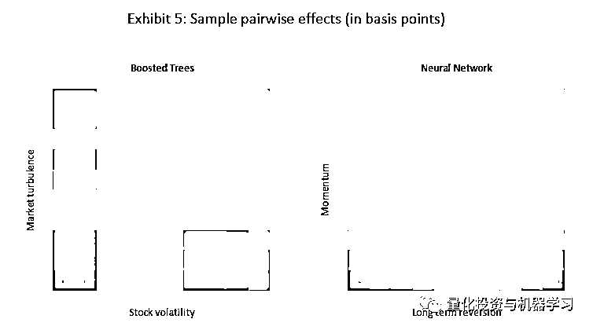
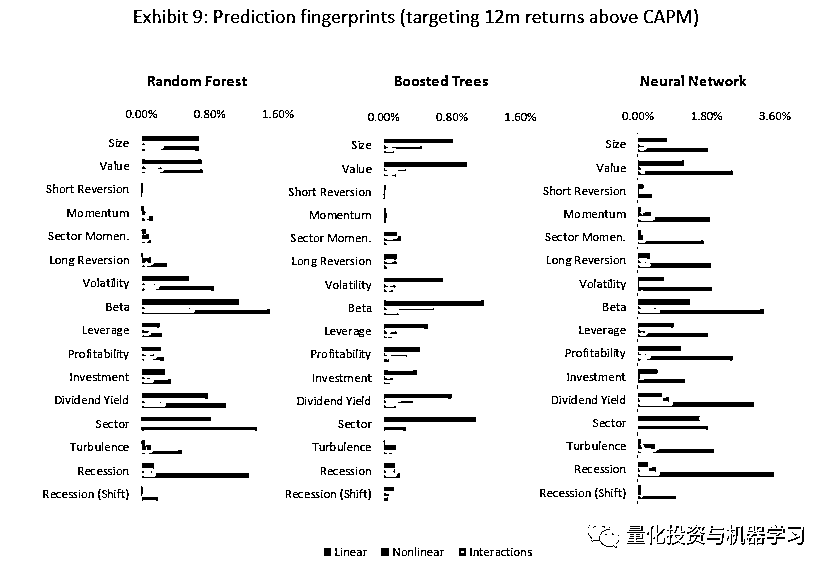

# 道富：机器学习选股，能信吗？

> 原文：[`mp.weixin.qq.com/s?__biz=MzAxNTc0Mjg0Mg==&mid=2653310924&idx=1&sn=6dac223864ae6acc2be6f03832063779&chksm=802d8dd9b75a04cf77d409638c5650ce757ff52d0ca2b54cbdf34eb43eae89407c50286bbb50&scene=27#wechat_redirect`](http://mp.weixin.qq.com/s?__biz=MzAxNTc0Mjg0Mg==&mid=2653310924&idx=1&sn=6dac223864ae6acc2be6f03832063779&chksm=802d8dd9b75a04cf77d409638c5650ce757ff52d0ca2b54cbdf34eb43eae89407c50286bbb50&scene=27#wechat_redirect)

### 

***全网 Quant 都在看！***

作者：Yimou Li、Zachary Simon、David Turkington

编译：QIML 编辑部

**解读介绍**

今天公众号的推文来自道富（State Street）的一篇论文。在本篇论文中，**道富提出了评估机器学习模型在选股中有效性的三个原则，并且基于这些原则比较了多个机器学习模型**。第一个原则是可投资性。为此，道富专注于由高流动性的美国股票组成的投资组合，并调整模型以要求合理的交易量。第二个原则是可解释性，投资者必须对模型的输出有足够的了解，才能相信它，并从中提取一些普遍的见解。为此，**道富选择了一组简洁的预测变量，并应用一种新的方法，称为模型指纹（Model Fingerprint）来揭示影响模型预测效果的线性的、非线性的因素**。第三个原则是，模型的预测应该是有趣的，也就是说，它们的表现应该令人信服地优于简单的模型。为此，我们将样本外的结果与简单的线性回归进行比较。除了这三个原则之外，我们还考虑了人们的专业知识和偏好在模型训练中所扮演的重要角色。我们认为，调整预测目标是实现这一目标最有力的方法之一。基于以上三个准则，我们多次测试了随机森林、增强树和神经网络模型。

**公众号做了脱水解读**

希望大家能有收获

### 

**数据和方法**

我们最终的目标是构建投资组合，所以我们用机器学习的模型去预测股票未来的收益率，然后基于预测的收益率高低，再选择股票构建投资组合。

#### 

**输入-因子（X）**

股票：出于流动性的考虑，我们选取了标普 500 成分股

时间范围：1992 年 12 月-2020 年 9 月

输入变量（X）：主要基于公司特征及市场环境两个维度选取了多个指标，如下表 1，为了避免异常值的影响，我们把除行业属性以外所有的指标转换成了横截面的排序值。

#### 

**输出-目标（Y）**

我们尝试了多种不同的预测目标：

1、每只股票下个月的绝对收益率；（作为基准模型）

2、基于 CAMP 模型的超额收益率；

3、基于六因子模型（Fama 五因子及动量因子）的超额收益率；

在以上 2、3 的超额收益了计算时，我们使用过去 1 年的滚动时间窗口。

#### 

**模型和训练**

按照模型的复杂度，分别选取了以下模型：

1、OLS

2、LASSO

3、Random Forest

4、Boosted Trees

5、Neural Network

*   训练集：1992-2014

*   测试集：2015-2020

#### 

**什么是 Model Fingerprints？**

Li et al.（2020）提出了基于 Model Fingerprints（以下简称 MF）解释机器学习模型的框架。**MF 能够量化出每个变量及变量的相互作用对模型预测效果的贡献**。在 MF 的框架下，一个模型的预测效果被切分为以下几个部分来解释：

1、Linear Prediction Effect: 各个因子线性部分的贡献（如 x1，x2）

2、Nonliear Prediction Effect: 各因子非线性部分的贡献（如 x1 的平方）

3、Interaction Prediction Effect：各因子之间相互作用的贡献（如 x1*x2）

**关于 Model Fingerprints 的具体解释，我们会基于 Li et al.（2020）的论文在下一篇推文中，详细介绍。**

**基准模型的测试结果**

在这一小节，我们来看一下基准模型的测试结果，我们首先用 1992-2014 年的数据对模型进行训练，一旦模型确定后，在测试集中并不对模型的参数进行修改。在测试数据中，每个月根据模型的预测结果，做多前 20%的股票，同时做空后 20%的股票。每个股票的权重设置为等权。

表 2 中给出了不同模型的测试效果。其中‘Equal Factor Weights’模型是仅对表 1 的 12 个公司特征的因子（不包括行业属性因子）求滚动均值后并等权加权后进行排序选股的模型。尽管该模型非常简单，但它的表现还是大幅优于 OLS 和 LASSO 等线性模型。对于其他更复杂的模型，Random Forest 有着最低的换手率和最高的风险，但相比线性模型，**Random Forest 更能发现不同因子子集所带来的增量信息。而 Boosted Trees 和 neural networks 的整体效果最优，但换手也更高，主要是因子这两类模型能够发现不同因子间非线性及相互结合带来的增量信息。**

**解释**

我们现在运用 ML 的方法解释各个模型的结果，我们没有给出线性回归模型的 ML 分析，因为线性回归模型的 ML 全部来自于因子的线性关系，对于非线性和因子间的交互作用（Interactions）都为 0。还有需要注意的是，以下的分析结果都来自于训练数据集。

Boosted Trees 和 Neural Network 学到的线性信息比较相似，大部分来自 Value 和 Momentum 两个因子。而 Random Forest 学习到的线性信息大部分来自于 Volatility 和 Beta 这类偏风险的因子。Boosted Trees 能够学习到更多的非线性信息，而 Neural Network 则能学到最多的因子交互作用带来的信息。**我们也可以发现 Turbulence、Recession 这类市场环境类的信息，本身带来的线性及非线性信息比较有限，主要是跟其他因子发生交互作用后带来的增量信息**（如 Neural Network 中所示）。

以上结果也显示，Short Reversion（短期反转）的因子的效果并不是特别有效，这与 Gu et al.(2000)的结果有很大的区别，一个比较可能的原因是短期反转的因子在小市值的股票上有更明显的效果，但本次测试的股票池是标普 500，所以从可投资性的角度，短期反转比不是一个有效的因子。

我们继续探索因子间的交互作用带来的有效增量信息，表 4 分别给出了三个模型最有效的三个因子交互的组合。Random Forest 主要结合了 Recession 和 beta、Volatility。Boost Trees 和 Neural Network 都主要结合了 Turbulence 和常用的 Size、Value 及 Momentum 等因子。

通过下图 5 我们也可以发现，在市场波动较大时，Boosted Trees 更青睐于低波动的股票，当市场波动低的时候更青睐高波动的股票。从右图可以看出，Neural Network 非常坚定的选取低 Momentum，高 Long Reversion 的股票。

下图 6，左右分别展示了 Neural Network 模型构建的组合，在测试及训练样本中分别来自线性、非线性及交互作用的收益（加总起来就是总收益）。在测试集中，收益主要来自于非线性及交互作用，且两者之间在关键时刻有对冲的效果，平滑了整体收益。而在测试样本中，线性的收益表现与训练集中有很大的差别，说明线性的超参数在测试集中已经不再有效。

表 7 展示了各个模型，线性、非线性及交互作用各部分收益之间的相关性。我们可以发现在训练集内，所有三个模型线性收益部分的相关性都非常高。Booted Trees 和 Neural Networks 的非线性及交互部分的收益率相关性也比较高。说明这些模型选了许多相同的股票，或至少具有相似特征的股票。而对于每个模型，非线性（及交互作用）与线性部分的相关性大部分（除了 Random Forest）都为负的，说明非线性及交互作用多多少少扮演了线性部分对冲的角色。

#### 

**不同预测目标的测试结果**

不同的预测目标的设定，代表了不同的策略逻辑。比如我们不相信市场择时，那我们就可以将预测目标从总收益变为超额收益。或者我们不希望有过多的交易成本，那么预测的目标也可以从短期收益切换为长期收益。接下来，我们看一下，不同预测目标下模型的效果有什么变化。

我们使用了两种不同的超额收益的定义：CAPM 及六因子模型；同时也采用了两个不同的预测时间：1 个月和 12 个月。从下图（8）可以发现，在样本外测试集中，Equal Factor Weights 模型中，以 12 个月 Total Return 为预测目标的模型表现最佳。对于其他模型，都是以 1 个月的 CAPM 超额收益为预测目标的模型表现最佳。相比较简单的线性模型，复杂的机器学习模型整体的表现都比较领先。但相比要与其他论文，这个领先的幅度并不是特别大。最主要的原因，是我们对模型增加了可实施及可解释性的约束。

下图给出了基于 12 个月 CAPM 超额收益预测目标的各模型的 MF 分析，Neural Network 能够更多的挖掘因子间的 Interaction。比如 Momentum 在 Random Forest 与 Boosted Trees 中收益的贡献不显著，但在 Neural Network 模型中，**其 Interaction 部分贡献了很大收益，说明动量因子大部分情况下需要和其他因子进行结合才能发挥作用。**

**总结**

**从一个投资者的角度，复杂的模型必须是可投资、可解释且有意义的**。基于这个出发点，此次实证研究做了以下限制，首先是基于流动性高的标普 500 成分股进行选股，其次输入的变量也局限在有实际可解释意义的因子中。最后我们用 MF 的方法去解释各个因子在模型收益的贡献。只有清楚的知道收益的来源，及模型的逻辑我们才能放心的在实际投资中进行应用。

内容：

INVESTABLE AND INTERPRETABLE MACHINE LEARNING FOR EQUITIES

参考文献：

Li, Y., Turkington, D. and Yazdani, A., 2020\. “Beyond The Black Box: An Intuitive Approach to Prediction with Machine Learning.” The Journal of Financial Data Science, Vol. 2, No. 3

量化投资与机器学习微信公众号，是业内垂直于**量化投资、对冲基金、Fintech、人工智能、大数据**等领域的主流自媒体。公众号拥有来自**公募、私募、券商、期货、银行、保险、高校**等行业**20W+**关注者，连续 2 年被腾讯云+社区评选为“年度最佳作者”。