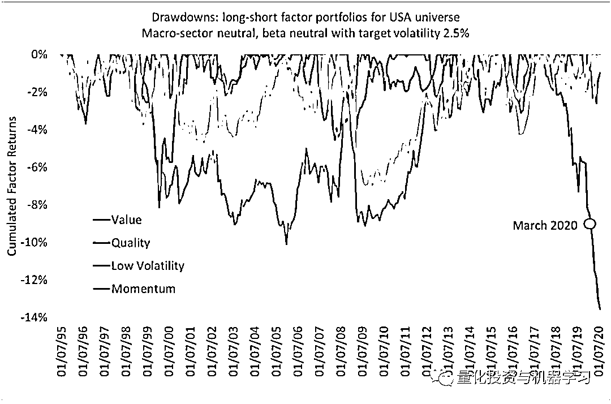
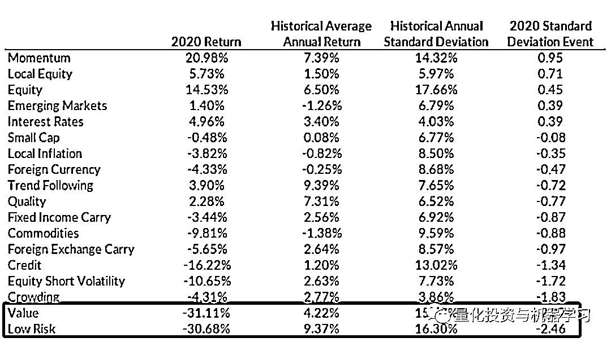
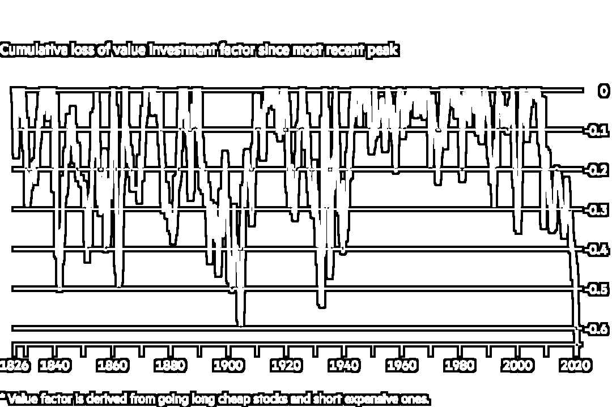
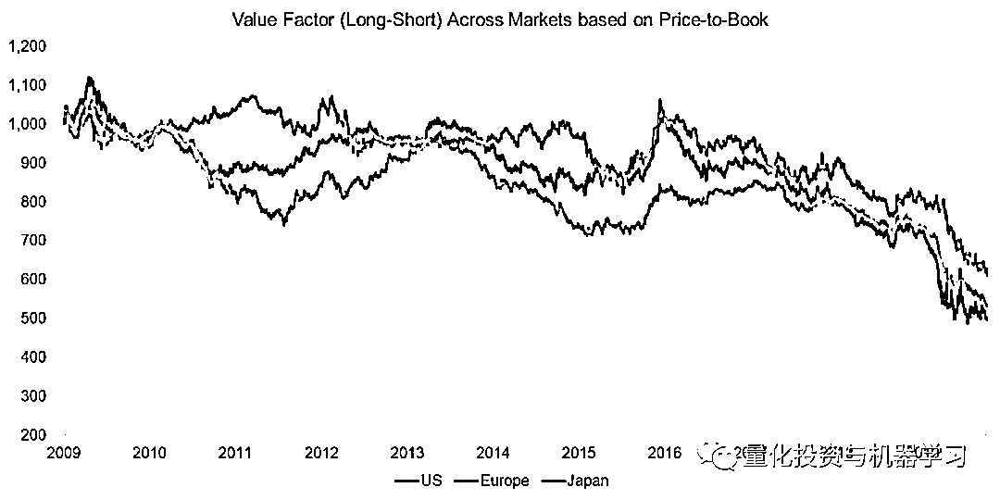

# Two Sigma 公布 2020 年最糟糕因子

> 原文：[`mp.weixin.qq.com/s?__biz=MzAxNTc0Mjg0Mg==&mid=2653310880&idx=1&sn=cf830f7c2f2edfae02534353c07cd2ae&chksm=802d8db5b75a04a39fe72183710e412f002c8989ea4e767173c8e57cddf4209a290ff39b3416&scene=27#wechat_redirect`](http://mp.weixin.qq.com/s?__biz=MzAxNTc0Mjg0Mg==&mid=2653310880&idx=1&sn=cf830f7c2f2edfae02534353c07cd2ae&chksm=802d8db5b75a04a39fe72183710e412f002c8989ea4e767173c8e57cddf4209a290ff39b3416&scene=27#wechat_redirect)

***全网 Quant 都在看！***

BNP Paribas 资管的研究员在最新的一篇论文写到：

2019-2020 很可能会像 2009-2011 和 1998-2000 那样，被载入史册。在此期间，基金经理所使用的最传统的因子组合并没有发挥作用。

这一次：**The main culprit was without doubt the** **value factor！**

根据他们的分析，最近一年中（截至 8 月），美股的价值因子月度超额收益率为-6.7%：

Two Sigma 2020 最新的因子报告展示了去年因子的收益情况，以及 1996 年以来每个因子平均年收益率与标准差：

从上表来看，**表现最好的是动量因子**。除过 6 月初和 11 月初至中旬的两次短期下调外，动量因子在今年大部分时间都呈上升趋势。

价值因子是 2020 年表现最差的因子，已连续 4 年下跌！价值的四个构成部分都在亏损：

***Price to book、Long-Term Reversal、Earnings Yield、Dividend Yield***

表现不佳的部分原因是，该因子普遍做空了在 2020 年表现出色的“在家办公”科技股！

数据来自：TCI

低风险因子在 2020 年也表现不佳，跌幅超过 30%。其 Beta 和残差波动率受到影响。在 2020 年 2 月和 3 月的新冠肺炎期间，该因子受到的影响最大。

两次危机期间，低 Beta DM 的收益率：

正如我们在市场超卖时所看到的一样，由于 Beta 压缩的原因（例如，在市场恐慌环境时，之前正常情况下 Beta 小于的股票的下跌幅度会超过预期），低 Beta 的股票的表现可能会低于它本身 Beta 所带来的预期。

大家可以看看这篇论文：

此外，这个因子也取决于你是否相信你的风险模型，以及知道哪些股票 Beta 低哪些 Beta 高。突变的市场可能会颠覆风险模型和 Beta 估计，可能导致投资者平仓大量的股票，他们以前认为这是低风险的。

同时，论文还写到，由于大型科技股占据了主导地位，**规模因子**加剧了表现不佳的情况。因为规模因子更青睐小票，而非大票。

论文如下：

其实不光是上面两家机构，在 FactorResearch 的研究中，价值因子已经到了十几年的最低点：

全球： 

美国市场：

因子相关性：**Value 和 Size、Momentum 和 Quality 最高！**

法国兴业银行量化研究主管 Andrew Lapthorne 表示：我们必须清楚，价值策略的表示是 100 年来最差的。但更重要的是，我们要努力理解是哪里出了问题。

Lapthorne 表示，其根本原因在于：**廉价的股票目前保持低价甚至会变得更加便宜，因为它们往往出现在经济敏感性更强的行业，而且总体而言，自 2008 年金融危机以来，全球经济增长乏力。与此同时，不断下跌的债券收益率正迫使投资者投资于科技等领域价格昂贵且增长较快的股票。**

还有以一些人指责衡量股票价值的方法已过时。从历史上看，主要的做法是将股价与公司的账面价值（book value）进行比较，账面价值是是企业资产负债表上体现的企业全部资产(扣除折旧、损耗和摊销)与企业全部负债之间的差额。然而，这一指标不包括品牌和知识产权等无形资产。如今，这些无形资产在一家公司的价值中所占的比例，往往超过了有形资产。

研究机构 Research Affiliates 的一篇论文指出：**鉴于无形资产在公司总资本中的重要性日益增加，所以增加无形资产的计算可以更全面地衡量公司资本**。正如购房者会考虑附件学区房一样，投资者也应该考虑一些短暂但重要的因素。

然而，Dimensional Fund Advisors 的研究主管 Savina Rizova 发现情况恰恰相反：**无形资产很难精确估值，它们带来的噪音实际上是无益的！**

为了比较无形资产的增长与价值因子的表现，FactorResearch 基于 Kenneth R. French 数据构建了一个由（Cheap&Expensive，C&E）美股组成的多空投资组合。

其发现，无形资产所占比例越高，价值因子绩效越差！

但在价值因子表现同样糟糕的欧洲或日本，无形资产的比例没有显著增加。如果无形资产真的是罪魁祸首，那么价值因子不应该在这些市场表现得如此糟糕。

Kenneth r. French Data Library，FactorResearch

那么，如果我们根据 price-to-book，price-to-earnings 和 price-to-cash 来衡量美股多空价值因子的表现，又会怎样呢？从 2009 年到 2020 年，这三个指标的趋势基本相同。无形资产可能会影响市净率，但它们对其它两个指标的影响较小。这进一步证明，无形资产的增加并不能解释价值因素表现不佳的原因。

Kenneth r. French Data Library，FactorResearch

那么，无形资产不能解释价值因子低迷的表现，那么什么能解释呢？

目前大家提出了各种各样的理论，但没有达成共识！

FactorResearch 的研究表明，当投资者对市场环境感到满意时，他们会购买廉价的股票。这是一个基于行为偏差的简单理论。估值较低的公司往往是陷入困境的公司，投资者更有可能在前景良好而非高风险的情况下押注于这些公司。

有很多方法来衡量市场结构，使用市场偏度，隐含波动率或类似的指标。例如，过去十年，价值因子和收益率曲线的表现趋势非常相似。

较低的经济增长预期是收益率曲线下降的一种解释。这对苦苦挣扎的公司来说不是好兆头。在这样的环境下，人们会本能地选择那些增长前景更好的公司，而忽略那些便宜的公司，直到前景好转。

Kenneth r. French Data Library，FRED，FactorResearch

最后，无形资产在市值中所占比例的上升与价值要子表现无关吗？不能这么绝对，但这只是一种因素，而不是核心本质。换句话说，**相关性并不等于因果关系！**

今天就写到这里吧！

量化投资与机器学习微信公众号，是业内垂直于**量化投资、对冲基金、Fintech、人工智能、大数据**等领域的主流自媒体。公众号拥有来自**公募、私募、券商、期货、银行、保险、高校**等行业**20W+**关注者，连续 2 年被腾讯云+社区评选为“年度最佳作者”。