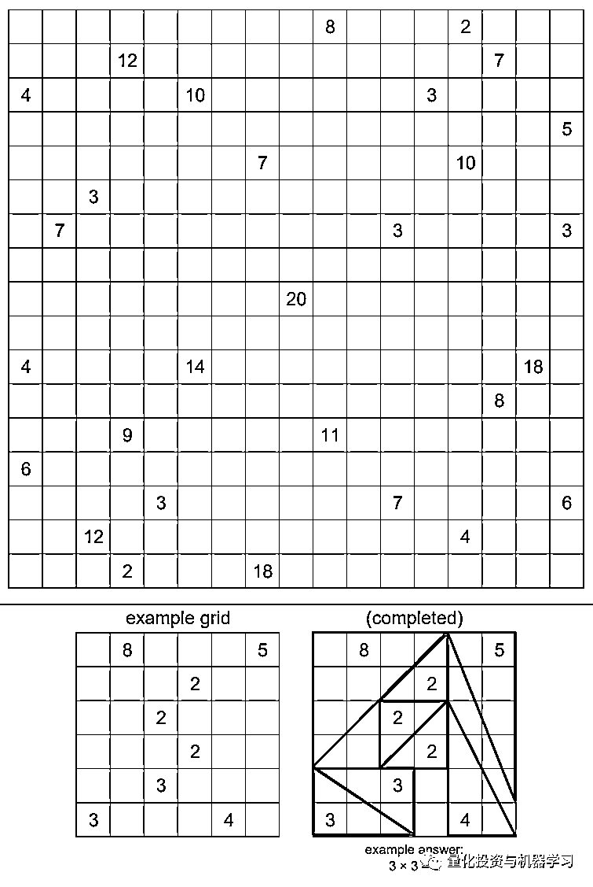

# Quant 求职系列：Jane Street 烧脑 Puzzle（2019-2020）

> 原文：[`mp.weixin.qq.com/s?__biz=MzAxNTc0Mjg0Mg==&mid=2653310812&idx=1&sn=9fe862df4613492f31e380eacf5429ab&chksm=802d8d49b75a045f1db8535a8f93c847e89e5cc243e63afe5105206b20290c7d86e460985db2&scene=27#wechat_redirect`](http://mp.weixin.qq.com/s?__biz=MzAxNTc0Mjg0Mg==&mid=2653310812&idx=1&sn=9fe862df4613492f31e380eacf5429ab&chksm=802d8d49b75a045f1db8535a8f93c847e89e5cc243e63afe5105206b20290c7d86e460985db2&scene=27#wechat_redirect)

***全网 Quant 都在看！***

全球顶尖的自营交易公司 Jane Street 创立于 1999 年，其对自己的描述是：*“a quantitative trading firm and liquidity provider with a unique focus on technology and collaborative problem solving.”*

标普对其有一段评价：

In its ratings action, the rating agency considered Jane Street Group's **"highly profitable trading business,"** **which includes a "leading exchange-traded fund" market-making franchise and strong risk-adjusted capital ratio**. S&P Global Ratings noted that **the company has generated very strong earnings so far in 2020** and that its trading has benefited from the market volatility related to the COVID-19 pandemic.

同事，Jane Street 的面试也是出了名的难，他们倡导：即使我们有一个好的 idea，其他人可能很快也会有。因此，在保持成功的必要技能中，**最重要的是创造性地解决问题！**  

数字 Puzzle、逻辑 Puzzle、有或没有明确答案的 Puzzle、有或没有明确规定规则的 Puzzle 等等，这些都是 Jane Street 日常工作的一部分，其实在解出 Puzzle 时的感觉也是很棒的，那种成就感只有自己心里能体会得到！ 

公众号今天列出了 Jane Street 在 2019-2020 年所有的 Puzzle，看看你们能做出来否，祝你好运！

**先不要看答案！** **先自己做！****否则就失去了进步的意义！**

**2019 年 1 月**

A 17-by-17 field is divided into unit squares. Some of the squares contain “posts” at their center. Each post is represented below by a number. Construct one or more fences emanating from each post, such that the total length of fence connected to a post equals the number given. Fences have integer length and can only be constructed horizontally or vertically. Fences from different posts may not touch, nor may a fence from one post touch a different post.

The goal of this puzzle is to build your fences in such a manner that it is possible to draw a **closed loop** through some of the remaining empty squares. The loop must enclose at least one post, and must be **symmetric** in some way (either via rotation or reflection). As in the example, the loop must be rectilinear, passing through the centers of adjacent empty squares.

The answer to this puzzle is the **product of the fence-lengths** of the fences **inside the loop**. (Note that in the Example, the answer is 2, not 4.)

**答案**

The unique configuration that works is shown to the left. The product of the lengths of the fences inside the loop is **10,077,696.** Nicely done, solvers!

**2019 年 2 月**

TOURWTORTWRTZUPLEBEFADIEILOS

UYSNIEAEAEACFMRVTRVTXRYUQS

SPKNOLIOIGNIEADHDEAEACAEGDABEIGEHN…..????.

**答案**

As shown to the left: the 100 scrabble tiles, when arranged in order into a 10-by-10 grid. A knight’s tour of the grid, starting at the letters T, O, U, R, is spelled out for the first 90 steps. There is only one way to complete the last 10 steps (the shaded squares), and steps 96 through 99 — which correspond to the ‘????’ in the original puzzle — spell the word **MOJO**.

**2019 年 3 月**

**答案**

The completed grids are shown to the left, and below (in blue) is the “sum” grid. The sum of the squares of the values in this grid is **8150**.

**2019 年 4 月**

Fill each cell — even the ones with grey numbers — with a digit between 1 and 9 so that each row, column, and outlined 3-by-3 squares contains each digit once.

A grey number **N** indicates that there is an **N** exactly **N** squares away (horizontally or vertically).

**The answer to this month’s puzzle is the sum of the squares of the numbers written over the gray numbers in the completed grid.**

(For example, if a 7 is written over one of the grey numbers, that would contribute 49 towards the sum.)

**答案**

The completed grid is shown to the left. The sum of the squares of the numbers written over the gray clues is 1105.

**2019 年 5 月**

Seven concentric circles, each of integer diameter, are used to determine six annuli, as shown below. The annuli have a total area of 2019π.

The annuli are then cut into quarters, and these 24 quarter-annuli are rearranged to form the two loops shown below.

What is the **difference** between the enclosed areas of the two loops?

**答案**

The answer to this month’s puzzle is **π−1**.

The loops can be dissected into overlapping rectangles, quarter-circles, and a central square as shown to the left. Furthermore, it can be shown that the diameters of the seven circles are 670, 671, 672, 673, 674, 675, 676\. From here it is a matter of properly adding (and occasionally subtracting) the various component areas to get the correct answer.

**2019 年 6 月**

The grid presented here can be partitioned into 9 L-shaped “hooks”. The largest is 9-by-9 (contains 17 squares), the next largest is 8-by-8 (contains 15 squares), and so on. The smallest hook is just a single square. Find where the hooks are located, and place nine 9’s in the largest hook, eight 8’s in the next-largest, etc., down to one 1 in the smallest hook.

The filled squares must form a connected region. (Squares are “connected” if they are orthogonally adjacent.)

A number outside the grid indicates the sum of the first consecutive block of filled squares when looking in that direction. (As shown in the example.) Furthermore, every 2-by-2 region must contain at least one unfilled square.

**The answer to this puzzle is the product of the areas of the connected groups of empty squares in the completed grid.**

**答案**

The completed grid is shown to the left, and the product of the areas of the empty regions is 78125.

**2019 年 7 月**

Below is a 6-by-6 grid with vowels placed in some squares. Place **distinct*** consonants (allowing Y) into some or all of the empty squares so that you can form a **4-word chain**. The first word in your chain must start and end inside the red outlined region. Similarly, the second, third, and fourth words must start and end inside the blue, green, and purple outlined regions. The last letter (square) of the first word must be the first letter of the second word, the last letter of the second word must start the third, and the last letter of the third must start the fourth. (See the example.)

Words are formed by making king’s move between squares. Squares may be revisited within a word. (As is done in the example, with the ‘E’ in ‘GROTESQUELY’.) Note that staying put (i.e. not moving) is **not** a legal “king’s move”.

Words must be legal English-language SCRABBLE® words , and the score of a word is the sum of the English-language SCRABBLE® point values for the letters. (E.g. 10 points for Q, 4 points for a W.) Your four words must also be **distinct**. (Sorry for not making that clear initially!)

The score for your chain is the product of the scores of your four words.

**Please send us your board and your 4-word chain.**

(*The added consonants must be distinct. So, for example, if you place a ‘Z’ in the top-left square, you cannot place another ‘Z’ in any of the other empty squares.)

**答案**

The top-scoring entries for this month’s puzzle were, as it turns out, literally quite crazy. The top-scoring board is shown to the left. (There were some trivial variations we received, too.)

**2019 年 8 月**

Place the numbers 1, 2,…, N (for some N) on a subset of the squares below, so that it is possible for a knight to move from 1 to N via a series of legal knight’s moves. Each number **inside** the grid represents the height of a building located at that square, and we can think of the knight as jumping from rooftop to rooftop on this series of incrementally taller buildings.

A number **outside** the grid indicates the first (i.e. smallest) number for which the knight was visible looking into the grid in the direction of that row or column. (As shown in the example.)

The answer to this puzzle is the **smallest achievable product** of the areas of the connected groups of empty squares in the completed grid.

**答案**

The lowest possible product of the areas of the empty regions is 144, which can be achieved in a few ways. (One is shown.)

**2019 年 9 月**

Fill each region with the digits 1 though N, where N is the number of cells in the given region. For every cell in the grid, if K denotes the number in that cell, then the nearest value of K (looking only horizontally or vertically) must be located exactly K cells away. (As in the example, below.) Some of the cells have already been filled in.

Once the grid is completed, take the largest “horizontally concatenated number” from each region and compute the sum of these values. **Enter this sum as your answer**. 

**答案**

The completed grid is shown to the left; the sum of the largest horizontally concatenated number in each region is **6092**.

**2019 年 10 月**

Place a collection of right triangles into the grid below. The triangles must have integer-length legs, and the legs must be along grid lines.

Each triangle must contain exactly one number. That number represents the **area** of the triangle containing it. (Every number must eventually be contained in exactly one triangle.) The entire square (1-by-1 cell) containing the number must be inside the triangle.

Triangles’ interiors may not overlap. (But triangles’ boundaries may intersect, as seen in the example.)

As your answer to this month’s puzzle, please send in the product of the **odd horizontal leg** lengths.

**答案**

The answer to this month’s puzzle is **31185**, and the completed grid is presented here.

**2019 年 11 月**

The grid presented here can be partitioned into 9 L-shaped “hooks”. The largest is 9-by-9 (contains 17 squares), the next largest is 8-by-8 (contains 15 squares), and so on. The smallest hook is just a single square. Find where the hooks are located, and place nine 9’s in the largest hook, eight 8’s in the next-largest, etc., down to one 1 in the smallest hook.

The filled squares must form a connected region. (Squares are “connected” if they are orthogonally adjacent.) Furthermore, every 2-by-2 region must contain at least one unfilled square.

A black number outside the grid indicates the product of the concatenated numbers in that row or column, when viewed from that position. (See the example, below.) A red number indicates the greatest common factor of these concatenated numbers, again when viewed from that position.

**The answer to this puzzle is the product of the areas of the connected groups of empty squares in the completed grid.**

**答案**

The answer to this month’s puzzle is **10,000**.  Congrats to everyone who solved it!

**2019 年 12 月**

please submit your answer as well as a brief explanation of how you arrived at it

**答案**

The text of the poem in this month’s puzzle suggests that the puzzle has something to do with chess. The first step to solving it is noticing that each of the 8 lines of the poem contains 8 words. The poem itself represents a chessboard, where each word that begins with K, Q, R, B, N, or P represents a king, queen, rook, bishop, knight, or pawn.

Five of the lines are capitalized and three are not; as in FEN notation, the capitalized lines contain white pieces and the un-capitalized lines contain black pieces. The poem asks for the fastest way to win, but notes that the history will be needed to prove that it’s actually the fastest way to win.  White could win in 2 moves, but only if black cannot castle. Can we determine from the current state of the board whether black is still able to castle? We will show that black cannot castle by analyzing the chess game itself.

There is no possibility for en passant so we know everything relevant about the board except whether black can castle.

 We know white’s queen must be a promoted h pawn, since the original queen must have been taken by a knight without moving.

 Given this, and black’s pawn structure, we know that white must have promoted this pawn on b8, c8, d8, e8, or f8.

 If white promoted on d8, e8, or f8, then the black king must either move or already have moved.

 If white had promoted on b8, it would have needed to capture all 6 of black’s missing pieces in order to travel that far to the left; however, it cannot possibly have captured black’s bishop in cell c8 which always stays on a different color.

 If white had promoted on c8, it must have done so from square c7, having captured black’s bishop on square c8 previously via other means. It also must have done so after all of black’s pawn moves, since black’s bishop on f8 has to have come out, and since black’s a pawn must already have promoted.

 Only a rook could be in square d8 to prevent the black king from having to move after the promotion on c8, but if that were the case, then on the move after the promotion black could only have moved the king or the king’s side rook.

Thus, we can conclude that **black has already lost its option to castle, and white can mate in 2 with Rxd7 followed by Qb8#**

Several solvers interpreted the ” — ” in line 5 of the poem to indicate that castling wasn’t available, as a dash in FEN notation will indicate that castling is unavailable. This was unintentional on our part!

This puzzle was a challenge but we generally gave credit to submitters who acknowledged that black could not castle, and found this 2 move checkmate as a result.

**2020 年 1 月**

Two friends, Alter and Nate, have a conversation:

Alter: Nate, let’s play a game. I’ll pick an integer between 1 and 10 (inclusive), then you’ll pick an integer between 1 and 10 (inclusive), and then I’ll go again, then you’ll go again, and so on and so forth. We’ll keep adding our numbers together to make a running total. And whoever makes the running total be greater than or equal to 100 loses. You go first.

Nate: That’s not fair! Whenever I pick a number X, you’ll just pick 11-X, and then I’ll always get stuck with 99 and I’ll make the total go greater than 100.

Alter: Ok fine. New rule then, no one can pick a number that would make the sum of that number and the previous number equal to 11\. You still go first. Now can we play?

 Nate: Um… sure.

**Who wins, and what is their strategy?**

**答案**

Nate (the first player) can always win in this game, by starting with the number 3.    After this first turn, Nate can force the running total to increment by units of 12.  This could happen 2 different ways:

1、If Alter picks some number X between 2 and 10, Nate chooses 12-X

2、If Alter picks 1, Nate responds by picking 1 as well.  Now Alter cannot pick 10 (since this would force the sum of the previous two numbers to be 11), and must pick some other number Y.  Nate then picks 10-Y.

In this way, Nate can force Alter to choose numbers when the running total is equal to 3, 15, 27, 39, 51, 63, 75, 87, and 99.  At this point, Alter is forced to take the total to 100 or greater.

**2020 年 2 月**

A random line segment of length D is chosen on a plane marked with an infinite checkerboard grid (i.e., a unit side length square grid).  What length D maximizes the probability that the segment crosses exactly one line on the checkerboard grid, and what is this maximal probability?

**答案**

The answer to this month’s puzzle is that **D = 1** and the resulting probability is **2/pi **(or about .6366).  Some of you were able to determine this via simulation, and others went for a more analytical approach.

**2020 年 4 月**

Consider an equilateral triangular grid of dots with N rows, such as the one presented here (with N = 22). A “triad” is a set of 3 dots where each dot in the triad borders the other two. The top two rows the triangular grid form a triad; all triads are (rotations of) precisely this shape.

 For some values of N, it is possible to separate the triangular grid into disjoint triads such that every dot is a part of one triad. For example, it is obviously possible when N=2, but not when N=3 or N=4.

What is the sum of all values of N < 40 for which it is possible?

**答案**

The answer to this month’s puzzle is **284**.  All numbers congruent to 0, 2, 9, or 11 mod 12 are able to be constructed, and no others are.

We can show that all of these numbers work.  The arrangements for N = 2, 9, 11, and 12 are presented here.  We can then add 12 rows to any of these 4 triangle sizes by adding an N=12 triangle, and a 12-by-N parallelogram, below them.   We can construct those parallelograms by adding together 2×3 parallelograms until they are of the dimensions 12-by-N.

**2020 年 5 月**

**答案**

The answer to this month’s puzzle is **416**.

As suggested by the title, one number is expelled in each row.  The nth number in the nth row of the grid is expelled, and does not appear in any future rows.

In each successive row, the numbers are re-ordered.  Starting at the expelled number in row n-1, row n is generated by writing the numbers positioned (-1,1,-2,2,-3,3,-4,4,…) away from the expelled number, as long as they exist, where negative numbers mean “to the left” and positive numbers mean “to the right.”

The bottom grid displays, for each number 1 through 10, the number of the row where it is eventually expelled.  It is not until row 416 that the number 11 is finally expelled!  Most solvers wrote a quick program to compute this instead of running through it manually.   A program would have been essential if we had asked for the row where the number 48 is expelled!

**2020 年 6 月**

Call a “ring” of circles a collection of six circles of equal radius, say r, whose centers lie on the six vertices of a regular hexagon with side length 2r. This makes each circle tangent to its two neighbors, and we can call the center of the regular hexagon the “center” of the ring of circles. If we are given a circle C, what is the maximum proportion of the area of that circle we can cover with rings of circles entirely contained within C that all are mutually disjoint and share the same center?

When submitting an answer, you can either send in a closed-form solution, or your answer out to 6 decimal places.

**答案**

The answer when rounded to 6 decimal places is 0.783464

**2020 年 7 月**

The country of Terniquaternaria follows an unusual numeral system. Its numbers are expressed as in base 4, but there are only three “digits”: 0, 1 and T, which has value (-1). For instance, the number “1T01” corresponds to the number 49 in the usual decimal system (i.e. +1*4³-1*4²+0*4¹+1*4⁰). Due to the lack of a 4th digit, many numbers, such as 29, have no direct representation. Instead, the inhabitants of Terniquaternaria (called “Trits”) express them as the quotient of two representable numbers (when possible). For instance, 29 could be written as (1100T/1TT) or (11111T/1T0T), among other variants.

Decimus just landed in Terniquaternaria and needs to write down his passport number (524293) on the admission form. Is it possible? If so, how can it be written? If not, can you prove impossibility?

**答案**

This puzzle was in fact solvable, and had multiple correct solutions.  One example is：

**1TTTTTTTTT1TTTTTT00T0000011/111111111T0000001**

These trits, when converted to base 10, represent the ratio 3002408341848069/5726584833 = 524293. 

**2020 年 8 月**

Oh no, which one is missing?

**答案**

This puzzle was quite a mess of capital letters with a couple decimals thrown in.  Hopefully after **S**tudying **& P**ondering, the solver noticed that there were a few stock tickers among the jumble of letters.   After that the “Aha!” of the letters being a string containing all but one of the S&P 500 index members would lead to a search ending with **SPGI**, the ticker of the corporation responsible for the index, a satisfyingly “meta” solution.

**2020 年 9 月**

While on vacation in Terniquaternaria, Decimus got to experience the country’s traditional folkloric dance, which they call the “Yawn-ock“. The people of Terniquaternaria pride themselves on being rational, so they dance the Yawn-ock by the following strict rules. Four dancers hold one end of two long pieces of rope and never let go. They initially take the following positions:

During the entire dance, only two types of move are allowed:

*   The entire group rotates 90 degrees counterclockwise (ie the dancer in A moves to B, dancer in B moves to C, etc). This step is called a “Rotate” (R).

*   Dancers in C and D swap places, with D holding the rope up while C is passing under. This step is called a “Swap” (S).

From the initial configuration, a dance master calls out successive R/S steps randomly, that the dancers diligently execute accompanied by music. After this, there is usually quite a tangled mess of rope in the middle!

A participant from the crowd can then step forward and attempt to untangle the ropes by shouting a sequence of the same two moves as above, that the dancers execute. If this person succeeds in fully untangling the ropes, he/she gets crowned King/Queen for the day!

Decimus took careful note of the sequence of moves executed by the dancers:

SRSRRSSRSRSSRSSRRSSRSSSSSRSSRSSRSRS
SRSSRSSSSSSSSRSSRSSSSSRSSRSSRRSSRSS
SSSRSSRSSRSSSSSSSSSSSSSSSSSRSSRSSRS

He would really like to become King, no matter how much research it might take. What sequence would untangle the ropes?

**答案**

The fastest sequence of untangling the ropes that was found was this 114-command beauty:

**RSSSSRSSRSSRSSRSSRSSRSSRSSR****SSR**

**SSRSSRSS**

**RSSRSSRSSRSSSSSRSSRSSRSSSRSSRSSSSRSSRS
SRSSSSRSSRSSRSSRSSRSSRSSSRSSSRSSRSSRSS**

It could be discovered by using the theory of rational tangles, which maps ropes tangled by these commands onto rational numbers using continued fractions.  The late John H. Conway of puzzle math fame worked on this, hence our silly name for the dance “Yawn-ock” (“Conway” is hidden in there backwards).

**2020 年 10 月**

Five children went trick-or-treating together and decided to randomly split their candy haul at the end of the night.  As it turned out, they got a total of 25 pieces of candy, 5 copies each of 5 different types (they live in a small town).  They distribute the candies by choosing an ordering of the 25 uniformly at random from all shufflings, and then giving the first 5 to the first child, the second 5 to the second, and so on.

What is the probability that each child has one type of candy that they have strictly more of than every other trick-or-treater? Give your (exact!) answer in a lowest terms fraction.

**答案**

The probability that every child would have strictly more of a candy than each other trick-or-treater was precisely **318281087/8016470462**, which comes to just under 4%.  The most straightforward way to compute this was to assign a particular candy to each child and compute the probability of that (writing some code certainly helped here) and then multiplying the result by 120 to account for the disjoint other assignments of candy to trick-or-treater.

**2020 年 12 月**

Each of the grids below is incomplete. Place numbers in some of the empty cells so that in total each grid’s interior contains one 1, two 2’s, etc., up to seven 7’s. Furthermore, each row and column within each grid must contain exactly 4 numbers which sum to 20\. Finally, the numbered cells must form a connected region, but every 2-by-2 subsquare in the completed grid must contain at least one empty cell.

Some numbers have been placed inside each grid. Additionally, some blue numbers have been placed outside of the grids. These blue numbers indicate the first value seen in the corresponding row or column when looking into the grid from that location.

Once each of the grids is complete, create a 7-by-7 grid by “adding” the four grids’ interiors together (as if they were 7-by-7 matrices). The answer to this puzzle is the sum of the **squares** of the values in this final grid.

**答案**

The four completed grids are shown to the left, and below them is the sum of the corresponding entries, whose sums of squares came to **8520**.

量化投资与机器学习微信公众号，是业内垂直于**量化投资、对冲基金、Fintech、人工智能、大数据**等领域的主流自媒体。公众号拥有来自**公募、私募、券商、期货、银行、保险、高校**等行业**20W+**关注者，连续 2 年被腾讯云+社区评选为“年度最佳作者”。