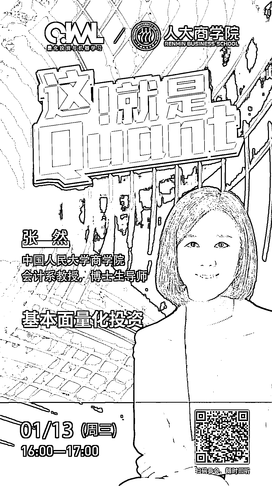

# 张然博士：基本面量化投资

> 原文：[`mp.weixin.qq.com/s?__biz=MzAxNTc0Mjg0Mg==&mid=2653310636&idx=1&sn=7ca103a5c12ee5148619700543bc20de&chksm=802d8cb9b75a05afa5c0c4c994c16d44d587e8a2dae49956c0bea48ecd48c7910de685cfbf64&scene=27#wechat_redirect`](http://mp.weixin.qq.com/s?__biz=MzAxNTc0Mjg0Mg==&mid=2653310636&idx=1&sn=7ca103a5c12ee5148619700543bc20de&chksm=802d8cb9b75a05afa5c0c4c994c16d44d587e8a2dae49956c0bea48ecd48c7910de685cfbf64&scene=27#wechat_redirect)

***1***

**嘉宾介绍**

**张然** | 博士，“青年长江学者”，中国人民大学商学院会计系教授，博士生导师，“杰出青年学者”。立里科技联合创始人。2006-2019 年执教于北京大学光华管理学院。财政部第一届企业会计准则咨询委员会委员。

研究聚焦于基本面量化投资和私募股权投资领域。2017 年出版专著《基本面量化投资》，该书出版一周即名列亚马逊图书新品排行榜“投资理财”类第一名。 在 国 际 顶 尖 学 术 期 刊 Journal of Financial Economics，The Accounting Review，Journal of International Business Studies 和国内顶尖期刊《经济研究》、 《管理世界》、《会计研究》等发表论文数十篇，译著有《阿尔法经济学》 等。

研究成果获得美国金融量化协会 (Q-Group) Roger F. Murray 杰出研究一等奖、美国会计学会（American Accounting Association）中西区“最佳论文奖”、国家自然科学基金结题“特优”等奖励。

担任顶级公募基金高级顾问，同时任比亚迪公司独立董事、审计委员会主席。

***2***

**嘉宾互动环节**

本次网络直播会议将设置：**读者问答环节**。大家如有问题向嘉宾提问，请**扫码下方二维码**填写问卷。我们将根据问题质量，选择性在直播中进行回答。欢迎大家踊跃提问哦！

***3***

**如何参会？**

**扫描**海报**二维码**

或点击**阅读原文**

即可收听！

点击**阅读原文**，收看直播与回放！