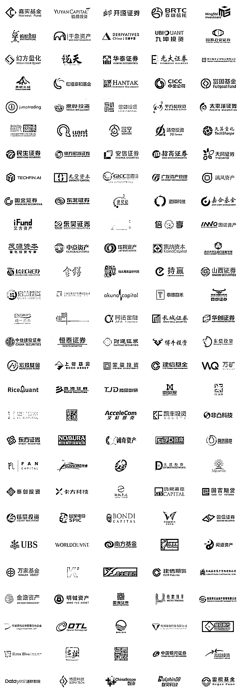

# 华创证券五大部门联合招聘：快到碗里来！

> 原文：[`mp.weixin.qq.com/s?__biz=MzAxNTc0Mjg0Mg==&mid=2653310623&idx=1&sn=ef4c317ce69007d415071e527b89bb23&chksm=802d8c8ab75a059c0367deb6007d55962063adcf973c36f9546db7b31b1f589be1a5692ff946&scene=27#wechat_redirect`](http://mp.weixin.qq.com/s?__biz=MzAxNTc0Mjg0Mg==&mid=2653310623&idx=1&sn=ef4c317ce69007d415071e527b89bb23&chksm=802d8c8ab75a059c0367deb6007d55962063adcf973c36f9546db7b31b1f589be1a5692ff946&scene=27#wechat_redirect)

***全网 Quant 都在看！***

量化投资与机器学习微信公众号，是业内垂直于**量化投资、对冲基金、****Fintech、人工智能、大数据**等领域的主流自媒体。公众号拥有来自**公募、私募、券商、期货、银行、保险、高校**等行业 20W+**关注者，****我们为所有量化金融机构提供岗位招聘与推广服务。**

**本次招聘为**量化投资与机器学习公众号联合华创证券**在**量化投资与研究、金融科技、证券公司数字化建设、私募产品研究**等部门开展招聘。华创在量化投研、金融科技、金融产品、数字化建设上，有浓厚的协作习惯和共建氛围，重点项目由多团队协作完成，各岗位都强调 IT 开发、数据分析和证券业务的结合。对于个人综合能力提升和职业定位，提供了更为广阔空间。** 

**华创欢迎各类人才的加入，只要你具备以下能力，相信就有合适的岗位: **扎实的开发代码能力，或者扎实的数据分析能力、持续学习和不断求深的工作习惯、高度负责和自我驱动的工作态度。再次强调：IT 开发、数据分析、证券业务，是最为关注的三项技术能力，依据个人特长定岗。****

**本次招聘的岗位，除证券公司数字化建设之外，其余岗位欢迎应届生和实习生，并有留有机会。**

**编号：**01****

**岗位：**金融工程分析师****

**所属部门：研究所**

**职级：高级分析师、分析师、实习生**

**招聘人数：2-3 人**

**工作地点：上海**

****工作内容****

**1、量化策略开发，独立或协同完成卖方分析研报；**

**2、进行量化策略交流和市场沟通。完成路演，专项课题的开发。**

****岗位要求****

**1、高级分析师需要在金融行业工作至少 3 年的从业人员，特别优秀者可放宽期限。分析师和实习生，没有从业要求，在校生也应聘；**

**2、必须具备较强的计算机开发能力，以计算机、金融工程、数学统计、物理、化学、生物等理工科及相关复合教育背景最佳，精通 Python、MATLAB 之一，熟练 SQL；**

**3、具备较强的数量分析能力，对金融数据的处理和分析方法有较强的理解和实践，对于概率、统计、机器学习等一种或多种学科有扎实的理论基础和应用能力；**

**4、学习能力非常强，逻辑性强，对量化开发充满激情，并有良好的沟通能力和团队协作精神。**

**---**

**编号：**02****

**工作职责：**证券公司数字化建设****

**所属部门：数字建设部**

**职级：数字化系统的开发负责人、高级产品和项目经理**

**招聘人数：3-5 人**

**工作地点：北京/上海均可**

****职位描述****

**1、参与公司综合业务管理平台建设工作，负责或主导综合业务管理平台中一个或多个具体端（资金端、资产端、员工端）相关系统和基础数据库的建设工作；**

**2、紧密与业务部门合作，把控综合业务管理平台的方案设计、实施落地、更新迭代，并推动业务部门完成配套的业务重构工作；**

**3、带领团队完成证券公司数据中台的设计、开发和维护。**

****任职要求****

**1、计算机相关专业本科或以上学历；5 年以上技术架构、产品设计、系统开发相关岗位经验（三者具备之一即可）；**

**2、对证券行业知识、业务架构和应用架构有整体深刻理解，能够独立完成客户调研、需求分析、架构设计，完成业务架构的技术落地方案；**

**3、自主开发能力，能够针对业务需求，组织团队进行部分系统的独立开发、二次开发、产品迭代。**

****加分项****

**1、对证券行业有深刻的技术理解，熟悉证券行业的业务系统（如投行、研究所、资管、自营、经纪等）；**

**2、有数据架构、数据建模、大数据经验者优先考虑。**

**---**

**编号：**03****

**岗位：**高频策略开发****

**所属部门：资产管理部**

**职级：投资主办、高级研究员、研究员**

**招聘人数：3 人**

**工作地点：上海  **

****1、量化研究岗高频方向（全职 2 位/实习若干）****

****工作职责****

**1、大数据分析与统计挖掘，研究市场微观结构中的统计规律；**

**2、编写高频因子，完成因子报告、数据校验（JAVA/Python）。**

****职位要求****

**1、扎实的数据分析能力，有大数据挖掘经验的优先；**

**2、熟练掌握 JAVA/Python 等编程能力；**

**3、有高频和日内交易实践者优先；**

**4、良好的团队协作和沟通能力。**

****2、量化开发岗（全职 1 位/实习 1-2 位）****

****工作职责****

**1、量化交易系统开发（JAVA/C++)；**

**2、系统性能调优和优化。**

****职位要求****

**1、编程功底扎实，熟悉 linux 环境下 JAVA/C++开发调试和测试技术；**

**2、熟悉多线程并发、线程优化、进程间通信等高性能计算编程；**

**3、良好的团队协作和沟通能力。**

**---**

**编号：**04****

****金融科技方向招聘****

**工作简介：华创证券金融工程部，是具备算法交易（TradeX）、金融科技、金融工程和量化投资等业务全覆盖的专注于量化业务的新设立一级部门。目前，团队正致力于在金融资产的智能定价、量化投资、金融垂类知识图谱和 NLP 算法研究等方向进行研发工作。拟招聘若干研究开发、产品设计、量化投资和深度学习方向的优秀人才加入团队！**

****1、量化策略研究员（全职+实习）****

****工作职责****

**1、对海量金融数据进行分析与挖掘，研究基本面量化投资方法；**

**2、挖掘基于知识图谱和大数据的投资因子，验证投资方法论的有效性；**

**3、与投资部门或产品部门合作，进行策略和因子的商业化应用。**

****职位要求****

**1、具备一定的量化金融相关工作经验，经济、金融、金融工程、数学、统计等相关专业同学优先；**

**2、具有扎实的量化金融知识，精通计量经济学、数理统计等领域知识；**

**3、精通 python，有面向对象编程的思想和经验，精通 SQL，掌握机器学习相关算法原理与典型应用场景；**

**4、有极强的学习能力和自驱力，同时做事细心，踏实肯干，具备良好的沟通能力。**

****2、金融自然语言处理工程师（全职+实习）**** 

****工作职责****

**1、负责金融领域各类深度学习算法的应用于开发；**

**2、负责金融行业非结构化，半结构化和关系数据的知识抽取工作；**

**3、利用自然语言处理方法解决实际金融业务中的问题，如金融词库建设、金融分词算法、文本相关性、分类/聚类算法研发、舆情重要性分级/正负向判断等算法研发。**

****职位要求****

**1、对自然语言处理算法/深度学习算法有浓厚兴趣；  **

**2、熟悉 Python / java 语言编程，有 Tensorflow/Keras 等深度学习框架和 Linux 开发环境经验；**

**3、较强的学习能力，良好的沟通表达和团队协作能力，对金融行业有强烈兴趣，有金融知识业务基础或经验者更佳；**

**4、具有开源项目经验者优先。**

****3、金融数据爬虫工程师（全职）****

****工作职责****

**1、参与并负责各类投研金融数据爬虫系统的设计与开发；**

**2、参与基于另类投资数据研究体系的构建。**

****职位要求****

**1、计算机/数学或金融工程等相关专业的在校研究生，对编程有较强兴趣，沟通能力强，有较强的动手编程能力；**

**2、熟练掌握 Python / Java 等编程语言；**

**3、精通常用的爬虫技术及架构设计，并能快速开发实现；熟悉静态.动态网页等大规模文本数据的高效信息抽取、清洗、存储等技术；**

**4、对金融特别是资本市场研究感兴趣者，有相关经验者优先；**

**5、有爬虫开发项目经验者优先。**

****4、数据质量工程师（全职）****

****工作职责****

**1、负责金融数据的质量检测规则制定与实施，定期汇报项目进展情况；**

**2、负责对线上数据 badcase 挖掘监控，并推动问题的解决和改进，不断满足客户的需求。**

****任职要求****

**1、计算机相关专业，本科及以上学历； **

**2、具有数据质量相关理论知识和实施经验；**

**3、掌握 Python/Shell 至少一门开发语言，熟悉基本数据库系统及网络知识；**

**4、良好的业务分析和数据分析能力，善于总结问题并能积极的进行过程优化，具有良好的学习能力； **

**5、有金融行业相关经验优先。**

**---**

**编号：**05****

**岗位：**私募 FOF 和产品研究****

**所属部门：机构业务中心、金融工程部**

**职级：团队负责人、团队核心骨干、研究员**

**招聘人数：3-5 人 **

**工作地点：北京/上海均可**

****职位描述****

**1、负责市场中私募证券投资基金的分析研究和尽职调查，为公司机构业务提供代销评审、产品准入和白名单评审的支持，为私募 FOF 投资提供私募基金投资建议；**

**2、独立从事对私募基金的尽职调查工作，撰写尽职调查报告，对私募基金提出客观、全面、深入的评价；**

**3、撰写私募基金相关的研究报告，包括私募行业分析、私募基金研究、投资策略研究、金融市场研究等，为公司私募业务发展提供决策支持；**

**4、为团队提供金融产品的专业性指导，并能根据需求输出文案、文章；**

**5、负责基金组合、定制金融产品的策略评估、方案审核，确保组合、金融产品上线、运行。**

****任职要求****

**1、本科或以上学历，金融相关专业；**

**2、团队负责人和团队骨干成员，要求 3-5 年私募基金研究工作经验，了解私募基金市场现状和发展趋势，了解私募基金相关政策；对于团队负责人，要求有带团队经验或管理经验。**

**3、研究员要求数据处理能力和分析能力强；研究员面向在校学生。优秀学生提供实习生岗位，并有留用机会。**

**4、对各类私募基金有一定研究能力，对其中 1-2 类基金理解特别深刻；**

**5、具有出色的沟通能力、书面表达能力和团队合作精神，能独立思考，能承受工作压力。**

****加分项****

**1、有开发能力、数据分析能力者优先；**

**2、对量化私募基金有深度理解者优先；**

**3、有具备深度的 FOF 投资策略框架者优先。**

****具体投递方式****

**投递邮箱**

*****huachuang_fintech@126.com*****

****简历命名****

****编号****-岗位-QIML 公众号****

****企业如有招聘需求，****请发邮件至：****

*****lhtzjqxx@163.com***** ****部分合作机构**** 

****

**不定期更新···**