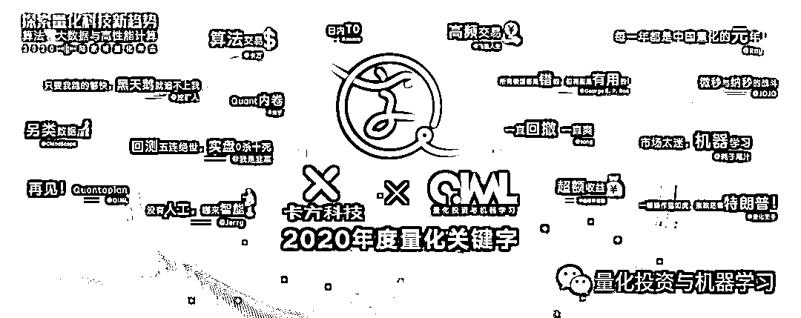

# 五、年

> 原文：[`mp.weixin.qq.com/s?__biz=MzAxNTc0Mjg0Mg==&mid=2653310607&idx=1&sn=e249d43edbb90be7f4849184ec0385ef&chksm=802d8c9ab75a058cb7aff53650cf74831b6ba74bf7330f6e9c08288a2b63f24720e0e3cba692&scene=27#wechat_redirect`](http://mp.weixin.qq.com/s?__biz=MzAxNTc0Mjg0Mg==&mid=2653310607&idx=1&sn=e249d43edbb90be7f4849184ec0385ef&chksm=802d8c9ab75a058cb7aff53650cf74831b6ba74bf7330f6e9c08288a2b63f24720e0e3cba692&scene=27#wechat_redirect)

***全网 Quant 都在看！***

最近 QIML 一直在做 2020 年的一些回顾与总结。今天该轮到总结自己啦！

2020 年 QIML 全媒体矩阵累计阅读量：**1100 万**

2020 年 QIML 累计发表文章：**452 篇**

2020 年 QIML 合作量化机构：**82 家**

粉丝数从 16 年的 1W 到 20 年的**22W+**，QIML 用了**4 年**  

相对一些自媒体来说，这些数字可能微不足道。但 5 年来 QIML 一直用心做在这件事，这就够了！

**再次感谢全网 Quant 对我们的支持与厚爱！**

同时 QIML 也联名众多知名量化机构对全网 Quant 送上新年的祝福：

点击图片查看寄语

下面让我们看看 2020 年的一些精华！

**1 ****篇人气最高的推文**

综合数据来看，下面这篇文章是 2020 年 QIML 热度最高的推文。毕竟祖师爷倒了，大家还是感慨颇多！

 
**2 ****场重要的大会** 点击阅读原文查看回播
 
**3 ****张热度最高的图片**

三十而已剧照

新财富会议

2020 陆家嘴量化年会 

**4 ****篇热度最高的年度文献总结**

 2020 AFA 年会：精选『量化』论文汇总！

2021-01-05

 2020 年度精选论文汇总：量化、交易、策略

2021-01-02

 2020『卖方金工』研报热度榜单出炉！

2021-01-01

 2020『量化圈』年度最佳论文出炉！

2020-12-30

**5 ****篇热度最高的量化研究文章**

 另类 Alpha：研报情绪因子（附代码）

2020-12-17

 基于深度强化学习的股票交易策略框架（代码+文档）

2020-12-01

 JPMorgan 最新报告解读：A 股新闻情绪指数策略（附下载）

2020-11-26

 相关矩阵、特征、预测、股市！（附代码）

2020-09-20

 JPMorgan 最新报告解读：基于 NLP 的 A 股交易策略（附下载）

2020-07-29

其他的内容大家搜索一些**关键词**即可！

<mpsearch class="js_mpsearch appmsg_search_iframe js_uneditable custom_select_card" data-keywords="%5B%7B%22label%22%3A%22%E9%87%8F%E5%8C%96%E6%8A%95%E8%B5%84%22%7D%2C%7B%22label%22%3A%22%E6%9C%BA%E5%99%A8%E5%AD%A6%E4%B9%A0%22%7D%2C%7B%22label%22%3A%22%E5%AF%B9%E5%86%B2%E5%9F%BA%E9%87%91%22%7D%2C%7B%22label%22%3A%22%E6%8B%9B%E8%81%98%22%7D%2C%7B%22label%22%3A%22Quant%22%7D%2C%7B%22label%22%3A%22Python%22%7D%5D" data-parentclass="appmsg_search_iframe_wrp" data-ratio="1.5664335664335665" data-w="286"></mpsearch>