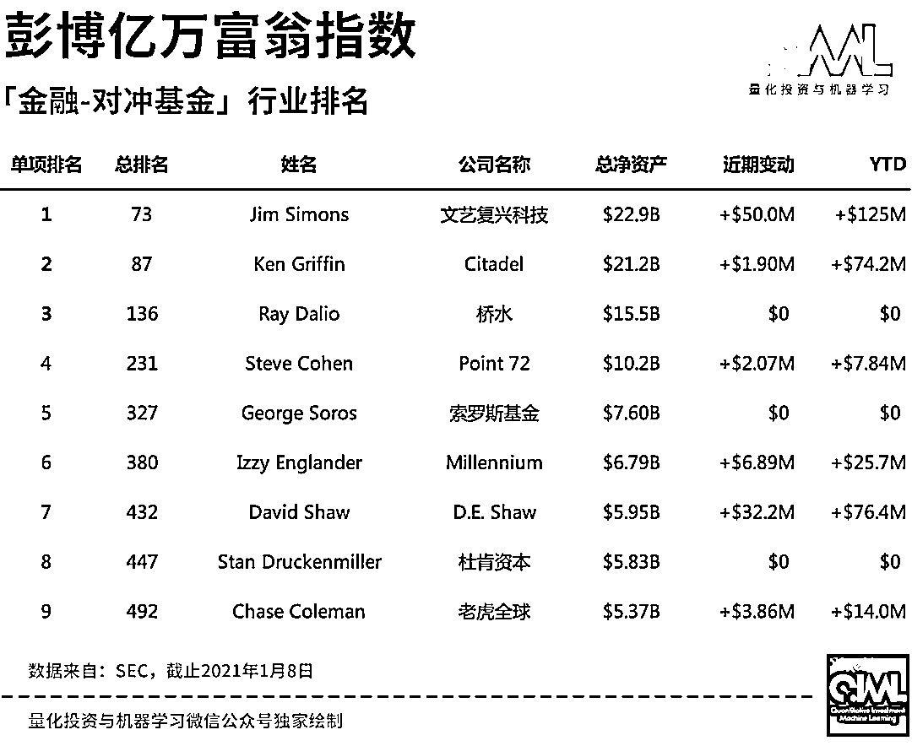

# 二千零二十、对冲基金亿万富翁榜单出炉！老爷子又是第一

> 原文：[`mp.weixin.qq.com/s?__biz=MzAxNTc0Mjg0Mg==&mid=2653310522&idx=1&sn=10cdeb869f5613800c294c1c1b0ee986&chksm=802d8c2fb75a0539881dc43e46e13943ae1e0bc6af5f5fa3158a3f9e16278ffaa71043ba61c2&scene=27#wechat_redirect`](http://mp.weixin.qq.com/s?__biz=MzAxNTc0Mjg0Mg==&mid=2653310522&idx=1&sn=10cdeb869f5613800c294c1c1b0ee986&chksm=802d8c2fb75a0539881dc43e46e13943ae1e0bc6af5f5fa3158a3f9e16278ffaa71043ba61c2&scene=27#wechat_redirect)

***全网 Quant 都在看！***

**免责声明：**本文所引述机构或个人的观点、言论、数据及其他信息仅作参考和资讯传播之目的，不代表公众号赞同其观点或证实其描述。

昨天，根据彭博亿万富豪榜的最新数据，马斯克个人资产升至 1950 亿美元，超越亚马逊创始人杰夫·贝索斯成为新任世界首富。

那么，在彭博亿万富翁指数榜（共 500 位）中，在金融领域与对冲基金相关的榜单又是如何呢？让我们来一起看看 2021 年最新**金**融-对冲基金****行业的排名情况：

前三赢家：

从左到右依次是：达里奥、格里芬、西蒙斯

由于 Q4 的数据还未更新，我们来看看去年 Q3 全球对冲基金 AUM 表现:

但根据彭博的最新数据报道显示，像文艺复兴科技、Two Sigma 等这样的头部对冲基金字在 2020 年的一些产品表现也不是特别理想：

图片来自：彭博

文艺复兴目前管理着 600+亿美元资产，在 2020 年 9 月份致客户的一封信中其表示：

***its losses were due to being under-hedged during March’s collapse and then over-hedged in the rebound from April through June. That happened because its trading models “overcompensated” for the original trouble.***

根据彭博的统计口径和数据，其整理出 2020 年全球对冲基金表现不佳的产品如下：

报道内容来自：彭博

2020 年全球对冲基金表现最佳的产品如下：

报道内容来自：彭博

希望 2021 年会大家都过的好点！

量化投资与机器学习微信公众号，是业内垂直于**量化投资、对冲基金、Fintech、人工智能、大数据**等领域的主流自媒体。公众号拥有来自**公募、私募、券商、期货、银行、保险、高校**等行业**20W+**关注者，2019 年被腾讯云+社区评选为“年度最佳作者”