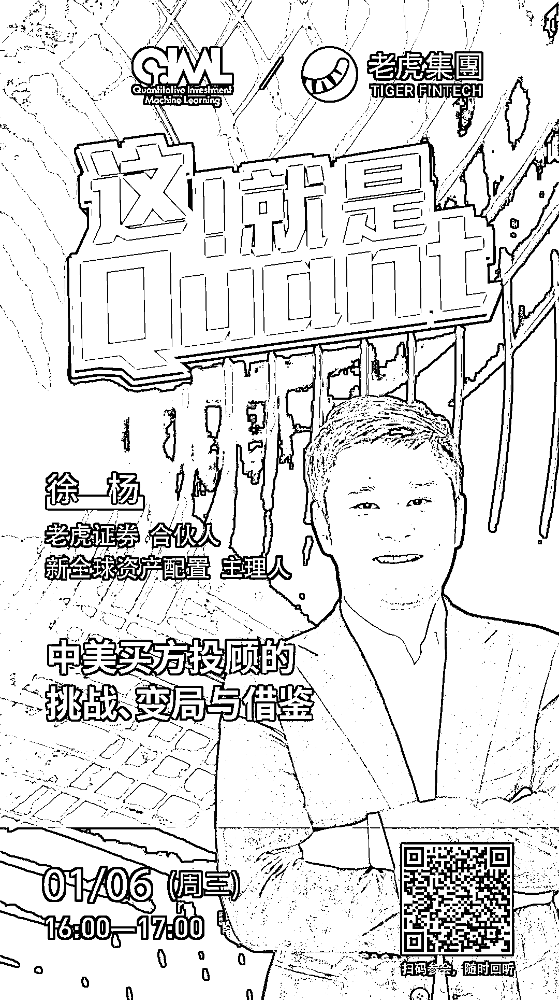

# 老虎证券：中美买方投顾的挑战、变局与借鉴

> 原文：[`mp.weixin.qq.com/s?__biz=MzAxNTc0Mjg0Mg==&mid=2653310299&idx=1&sn=42dcca5d249946dac71cd9a6f0e080cd&chksm=802d8f4eb75a0658f9463c3365638e9947627acd36f3a55d4544763f066a67362498ee6d2442&scene=27#wechat_redirect`](http://mp.weixin.qq.com/s?__biz=MzAxNTc0Mjg0Mg==&mid=2653310299&idx=1&sn=42dcca5d249946dac71cd9a6f0e080cd&chksm=802d8f4eb75a0658f9463c3365638e9947627acd36f3a55d4544763f066a67362498ee6d2442&scene=27#wechat_redirect)

***1***

**嘉宾介绍**

**徐杨** | 老虎证券合伙人，公众号新全球资产配置主理人。负责资管、买方投顾和投顾金融科技。拥有超过 10 年的美国资产管理实操和教育经验，是以投资人教育为己任的美国持牌买方投顾。ETF 发行管理、行为金融学和量化投资专家，研究策略涵盖量化价值投资、因子投资，资产配置，CTA 策略，全球宏观对冲基金策略。

曾直接管理和咨询超过 50 亿美金的全球资产，在美国发行和管理多只主动和被动 ETF，客户包括美国超高净值家庭、加利福尼亚州养老金、斯特恩家族等；对美国基金业的策略、运营、合规以及产品创新非常熟悉；精通美国的注册投资顾问（RIA）体系和相关的金融科技业务。财新、华尔街见闻 、格隆汇、金融界、同花顺等主流财经媒体专栏作家。

***2***

**嘉宾互动环节**

本次网络直播会议将设置：**读者问答环节**。大家如有问题向嘉宾提问，请**扫码下方二维码**填写问卷。我们将根据问题质量，选择性在直播中进行回答。欢迎大家踊跃提问哦！

***3***

**如何参会？**

**扫描**海报**二维码**

或点击**阅读原文**

即可收听！

点击**阅读原文**，收看直播与回放！