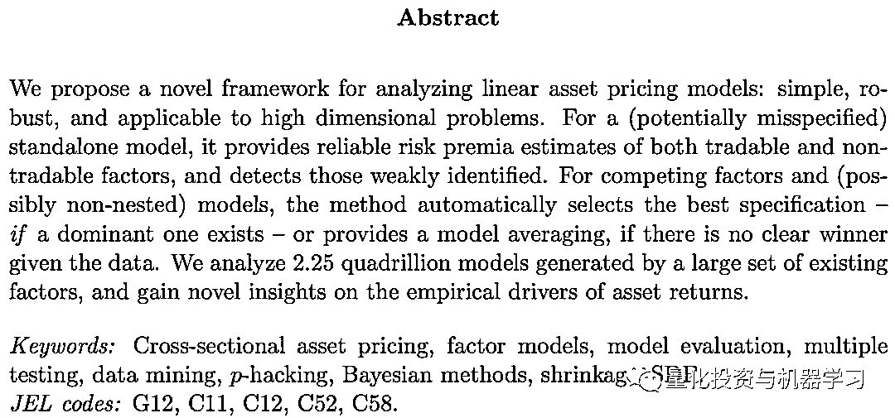
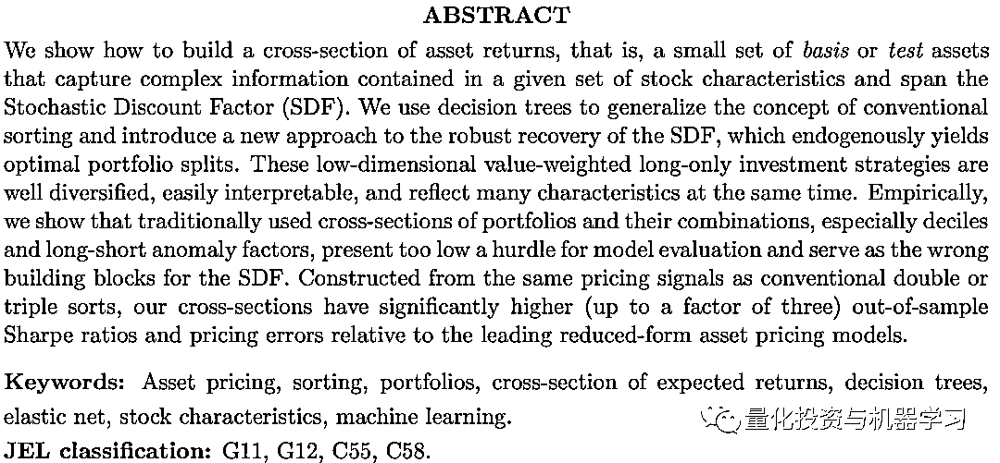
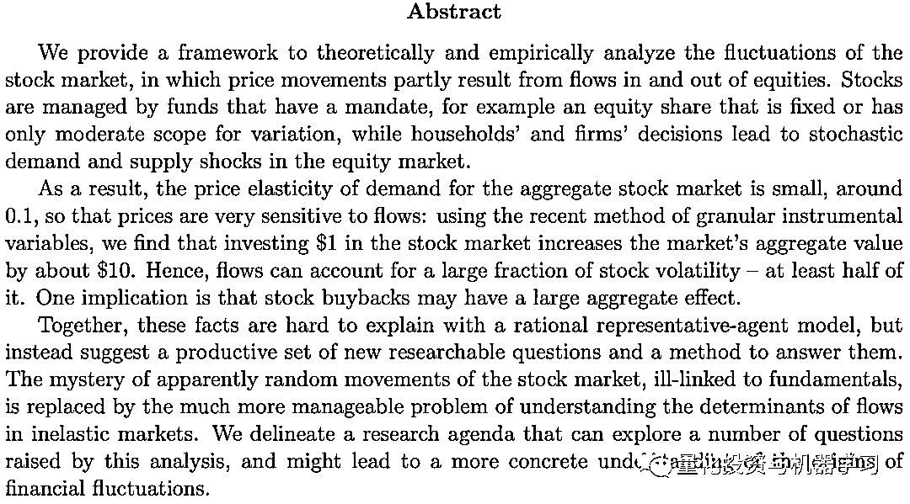
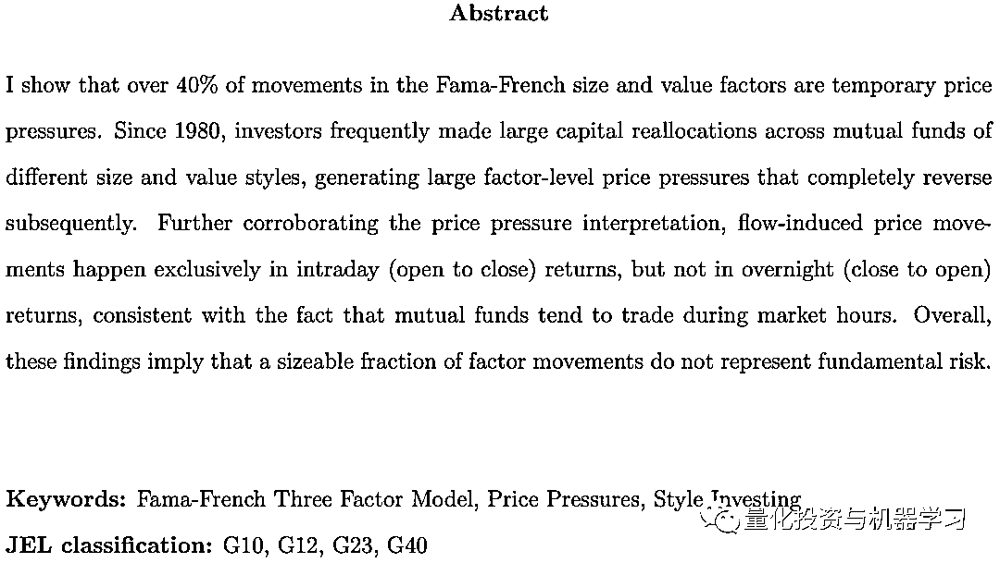
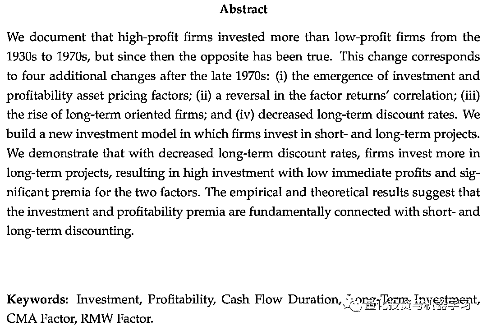
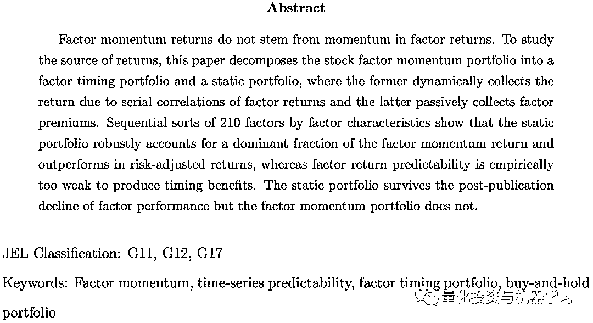
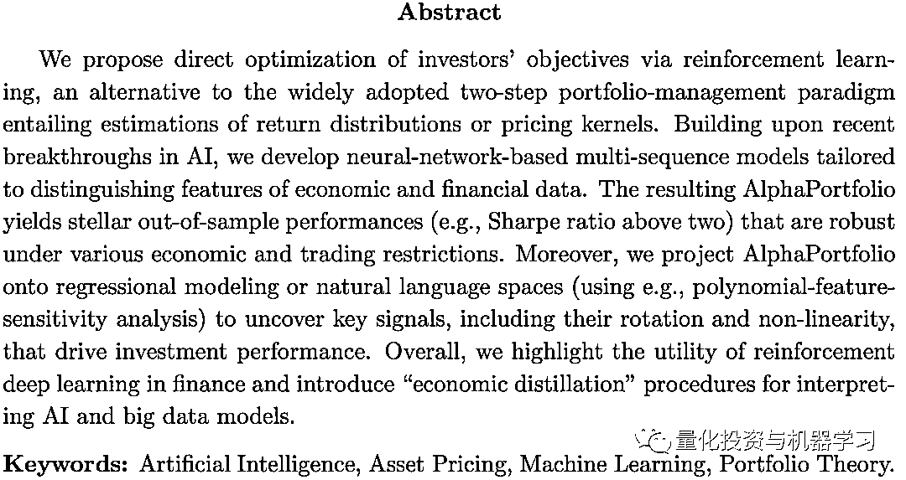
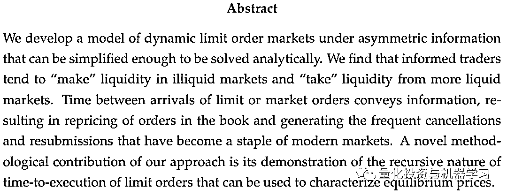

# 二千零二十、AFA 年会：精选『量化』论文汇总！

> 原文：[`mp.weixin.qq.com/s?__biz=MzAxNTc0Mjg0Mg==&mid=2653310247&idx=1&sn=cfeed58b22258055e514aafef724152d&chksm=802d8f32b75a06248f156f37ee6603db4738c6df28054e8d95a9b0349a36f3b32f1c9fe649a9&scene=27#wechat_redirect`](http://mp.weixin.qq.com/s?__biz=MzAxNTc0Mjg0Mg==&mid=2653310247&idx=1&sn=cfeed58b22258055e514aafef724152d&chksm=802d8f32b75a06248f156f37ee6603db4738c6df28054e8d95a9b0349a36f3b32f1c9fe649a9&scene=27#wechat_redirect)

***全网 Quant 都在看！***

一年一度的美国金融协会（AFA）ASSA 会议刚刚结束。在今年的会议上，发表了很多优秀的论文，公众号总结了几篇与量化领域相关且值得一读的论文分享给大家！ 

***1、Bayesian Solutions for the Factor Zoo: We Just Ran Two Quadrillion Models*** 

******

***2、******Forest through the Trees: Building Cross-Sections of Stock Returns***

******

***3、In Search of the Origins of Financial Fluctuations: The Inelastic Markets Hypothesis***

******

***4、What Drives the Size and Value Factors?***

******

***5、The Great Divorce Between Investment and Profitability***

******

***6、Decomposing Factor Momentum***

******

***7、AlphaPortfolio: Direct Construction through Reinforcement Learning and Interpretable AI***

******

***8、Limit Order Markets under Asymmetric Information*** 

******

**相关热点文章**

 
 
 **论文下载**

在**后台**输入

***2020AFA 精选***

*—End—*

量化投资与机器学习微信公众号，是业内垂直于**量化投资、对冲基金、Fintech、人工智能、大数据**等领域的主流自媒体。公众号拥有来自**公募、私募、券商、期货、银行、保险、高校**等行业**20W+**关注者，2019 年被腾讯云+社区评选为“年度最佳作者”。