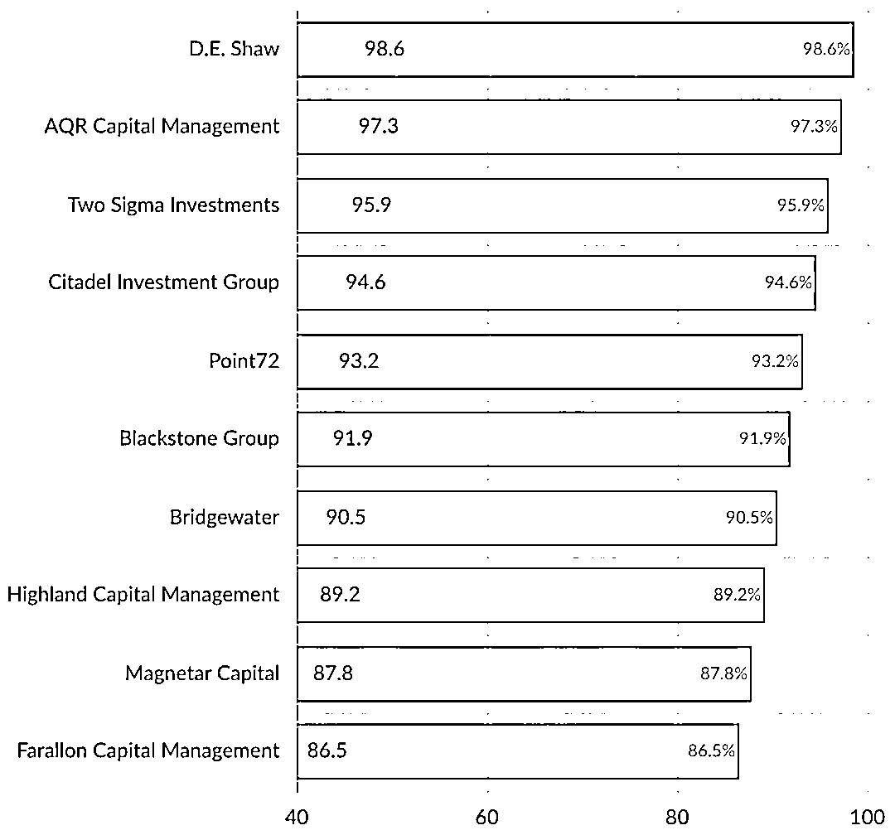
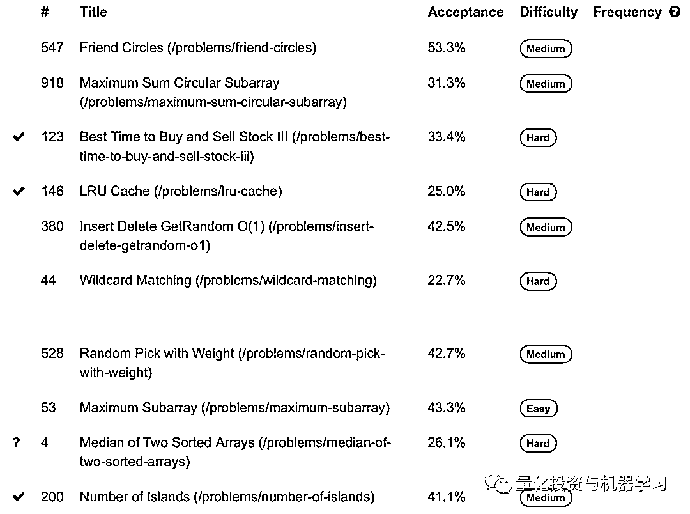

# Two Sigma：面试还是挺难（附面经）！

> 原文：[`mp.weixin.qq.com/s?__biz=MzAxNTc0Mjg0Mg==&mid=2653310216&idx=1&sn=7e2337f5a922ac651ccb9e3c88782c53&chksm=802d8f1db75a060b797de3d3a9562a32070eb184299a51016f28d2d0296fb6a49ebb48432e96&scene=27#wechat_redirect`](http://mp.weixin.qq.com/s?__biz=MzAxNTc0Mjg0Mg==&mid=2653310216&idx=1&sn=7e2337f5a922ac651ccb9e3c88782c53&chksm=802d8f1db75a060b797de3d3a9562a32070eb184299a51016f28d2d0296fb6a49ebb48432e96&scene=27#wechat_redirect)

***全网 Quant 都在看！***

每年夏天，Two Sigma 都会邀请一群有才华实习生一起工作，一起创新与探索，一起应对复杂的挑战。因为新冠疫情的原因，Two Sigma 今年专门为实习生设计了一个全程线上的培训项目，为期 10 周。

近日，Two Sigma 特地邀请了一些在这次暑期培训的实习生来聊聊他们的经历。公众觉得很有意义，分享给大家。

给大家先看两组数据：

**成长机会最佳机构** 

在对成长机会的机构调查中，Two Sigma 排前三：

****

**满意程度最佳机构** 

在满意程度的机构调查中，Two Sigma 排第一：

****

**如何准备 Two Sigma 面试？**

**▍Juan Pablo | Engineering**

练习一些技术问题，比如编程面试的问题。然后在面试前放松一下，这样我就能在面试中保持冷静和自信。

**▍Bill | Quantitative Research**

我把准备工作分为三个方向

1、统计学：Two Sigma 希望你对统计学有基本的掌握，如线性回归，t 统计和显著性检验。

2、数据科学：Two Sigma 希望看到你很好地理解获取数据、构造特征、创建模型和验证它们的流程。

3、编程：Two Sigma 要求你是一个有能力的程序员，如 DFS、BFS、动态编程等。

**▍Evan | Engineering**

参加面试时，把每一个编程挑战都看作是结对编程（Pair Programming），这似乎有助于我完成整个过程。

Pair Programming 是一个编程模式。两个程序员并排坐在一台电脑前，面对同一个显示器，使用同一个键盘，同一个鼠标一起工作。他们一起分析，一起设计，一起写测试例子，一起编码，一起单元测试，一起整合测试(Integration Test)，一起写文档等。基本上所有的开发环节都一齐肩并肩地，平等地，互补地进行开发工作。

## **你最大的挑战是什么？**

**▍Ying | Data Science**

在我实习项目的初始阶段，我需要提出一些假设来进行测试，这是我最大的挑战。在我最初的假设中，我多次尝试解决统计关系，但没有找到任何明确的信号。当时对我来说有点沮丧和压力。但是我的经理和队友们给了我很多建议和支持。他们指出的方向证明是非常有用和重要的。这个挑战是通过团队合作解决的，而不仅仅是我一个人。

**▍Evan | Engineering**

我最大的挑战是分清计划和测试的优先级。我以前是一个一头扎进代码中，一边工作一边解决细节和 bug 的人，但我被告知直到第二周才开始编写代码，即使那时我也必须从接口和测试开始。在这样工作了整个夏天之后，我无法想象还有其他的工作方式。

## **你会从这个实习中得到什么？**

**▍Bill | Quantitative Research**

无论你决定去哪家公司，实习还是全职，确保你周围都是聪明善良的人。

## **你会给那些即将开始工作的同学有什么建议？**

**▍Bill | Quantitative Research**

就像生活中的许多事情一样，你付出多少，就得到多少。无论你是否迈出了最好的一步，积极主动地交朋友并向他人学习，都完全是你自己的选择。

**▍Juan Pablo | Engineering**

不仅要专注于编程，也要专注于建立交流与联系，结识与你共事那些出色而聪明的人。10 周听起来可能很长，但很快就结束了。

---

根据 WSO 的 30 份样本统计，Two Sigma 的面试还是挺难的！

**同时，我们发现，在面试中 hackerank、 leetcode 是提到最多的。大家要多加练习！**

在这里给大家分享一些网友整理 Two Sigma 曾有过的**leetcode**面试题目：

**『**量化研究和建模**』面试技巧**

量化研究和建模涵盖了一系列不同的学科，**从简单的统计，到复杂的理论数学，再到前沿的机器学习技术**。

**一般面试从上午 9 点到下午 6 点！**  

**1、上午，注重技术层面**

Two Sigma 将讨论下面提到的大部分话题（没有特定的顺序），但每个话题的深度取决于你的背景。涵盖数据分析（你如何理解和分析数据集）以及进行假设检验。通常会深入到统计和数学，例如回归技术、机器学习算法和概率等话题。切记，Two Sigma 会花一些时间来了解你对编程和算法开发的熟悉程度。

**2、午餐，互相了解对方**

你将和几位 Two Sigma 的员工一起吃午饭。在这段时间里，会收集你早上面试的反馈，并就你是否会继续这个过程提出建议。

**3、下午，额外的面试**

涵盖各种各样的话题，进一步评估你的技能。你会遇到任何对你的背景感兴趣的招聘经理。这些会议通常会持续一个小时，你可能会被要求讨论具体的项目以及你在之前的职位中所做的贡献。

Two Sigma 将通过讨论和解决问题来探索你的知识和经验领域。你要和面试官一起思考问题，找出解决问题的最佳方法。记住，你的面试官是来引导你并和你一起头脑风暴的，所以当你需要澄清时，请问问题，并且接受提示和反馈。在解决这些问题的时候，与面试官交流一下你的想法，这样面试官就能更好地促进双方的讨论。在 Two Sigma，合作是非常重要的！

**『软件工程』面试技巧**

一般面试从上午 9 点到下午 6 点！

**1、上午，注重技术层面**

分成三个小时的访谈。你将会被问到一些技术问题，这些问题涵盖了一系列的计算机科学内容，比如数据结构、算法和面向对象的设计模式。你会被要求在桌面上编写代码，也可能被要求在白板上参与系统设计。Two Sigma 可能涉及的其他 CS 领域包括：**Big** **O notation、树/图遍历、递归、搜索/排序、哈希表、并发性等其他主题**。

**2、午餐，互相了解对方**

你将和几位 Two Sigma 的员工一起吃午饭。在这段时间里，会收集你早上面试的反馈，并就你是否会继续这个过程提出建议。

**3、下午，额外的面试**

持续 60 分钟左右，你可能会被要求讨论具体的项目以及你在之前的职位中所做的贡献。

Two Sigma 希望通过面试经验让你了解这里的工作环境。在这面试的一天，你基本和面试官们一起在电脑上写代码。你要和面试官一起思考问题，找出解决问题的最佳方法。

Two Sigma 在以下几个方面将对你进行评估：**编程能力、计算机科学知识、测试、设计/架构以及一般的问题解决能力**。Two Sigma 测试这些东西的原因不是试图证明 Two Sigma 比你聪明，或者故意让你在你几年前从 CS 101 中学到的东西上犯错——而是因为 Two Sigma 真的相信编你可以编写干净和可扩展的代码。

**几个重要的点：**

**1、蛮力解决方案并不总是最好的，考虑内存约束和性能！**

**2、尝试在****hackerank、 leetcode****、CareerCup、TopCoder****等网站上完成编程挑战。**

3、看一些书籍：Elements of Programming Interviews (偏向 C++) 、Cracking the Coding Interview（偏向 Java) * （*Two Sigma 与这些书的作者没有任何关系，但作者们备受人们的尊敬。）

希望以上的内容对大家有所帮助！

本期推文来自：Two Sigma 官网与网络公开渠道

量化投资与机器学习微信公众号，是业内垂直于**量化投资、对冲基金、Fintech、人工智能、大数据**等领域的主流自媒体。公众号拥有来自**公募、私募、券商、期货、银行、保险、高校**等行业**20W+**关注者，2019 年被腾讯云+社区评选为“年度最佳作者”。