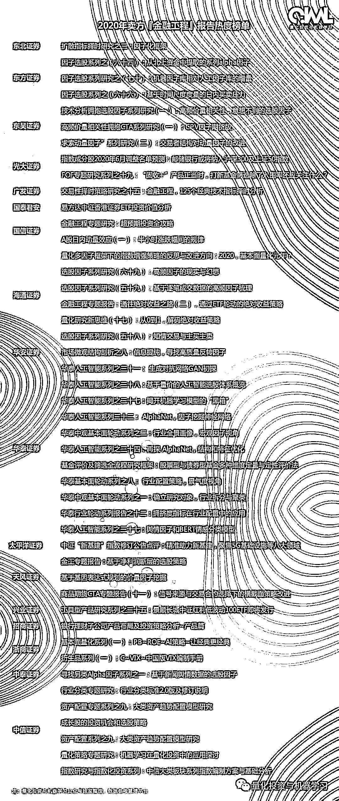

# 2020『卖方金工』研报热度 榜单出炉！

> 原文：[`mp.weixin.qq.com/s?__biz=MzAxNTc0Mjg0Mg==&mid=2653310083&idx=1&sn=039125e73e0bada2464022def6600d47&chksm=802d8e96b75a07800d92200cfb0ec3974a26e40080126db5c411f29eaf3b809ba4b0d6a83a5d&scene=27#wechat_redirect`](http://mp.weixin.qq.com/s?__biz=MzAxNTc0Mjg0Mg==&mid=2653310083&idx=1&sn=039125e73e0bada2464022def6600d47&chksm=802d8e96b75a07800d92200cfb0ec3974a26e40080126db5c411f29eaf3b809ba4b0d6a83a5d&scene=27#wechat_redirect)

***全网 Quant 都在看！***

一年一度的 QIML 年度总结大会如约而至~

本期我们要介绍的是 2020 卖方金工报告热度榜单：

按券商首字母排序

**往期推荐**

 
 

量化投资与机器学习微信公众号，是业内垂直于**量化投资、对冲基金、Fintech、人工智能、大数据**等领域的主流自媒体。公众号拥有来自**公募、私募、券商、期货、银行、保险、高校**等行业**20W+**关注者，2019 年被腾讯云+社区评选为“年度最佳作者”。