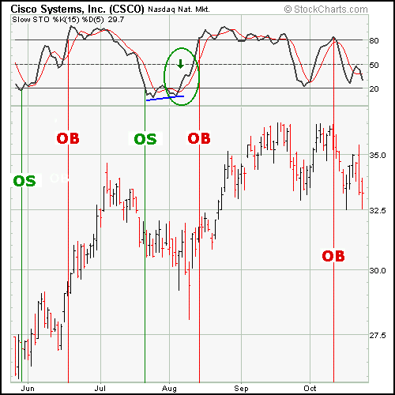

# 技术指标和振荡器简介 [ChartSchool]

### 目录

+   技术指标和振荡器简介

    +   介绍

    +   什么是技术指标？

    +   技术指标提供了什么？

    +   为什么使用指标？

    +   使用指标的技巧

    +   领先指标

        +   动量振荡器

        +   领先指标的优缺点

    +   滞后指标

        +   滞后指标的优缺点

    +   指标的挑战

    +   振荡器类型

        +   中心化振荡器

        +   带状振荡器

        +   中心化和带状振荡器的优缺点

    +   振荡器信号

        +   正向和负向背离

    +   超买和超卖极端

    +   中线交叉

    +   振荡器信号的优缺点

## 介绍

本文旨在介绍技术指标的概念，并解释如何在分析中使用它们。我们将阐明**领先**和**滞后指标**之间的区别，以及探讨其优缺点。许多流行的指标，如果不是大多数，都显示为**振荡器**。基于此，我们还将展示如何阅读振荡器，并解释信号是如何产生的。稍后，我们将把重点转向特定的技术指标，并提供信号实例。

## 什么是技术指标？

**技术指标是通过将公式应用于证券的价格数据而导出的一系列数据点。** 价格数据包括一段时间内的开盘价、最高价、最低价或收盘价的任意组合。一些指标可能仅使用收盘价，而其他指标则将成交量和未平仓合约量纳入其公式中。价格数据输入到公式中，产生一个数据点。

例如，3 个收盘价格的平均值是一个数据点[(41+43+43) / 3 = 42.33]。然而，一个数据点并不能提供太多信息，也不能成为一个指标。需要一系列一段时间内的数据点来创建有效的参考点，以便进行分析。通过创建数据点的时间序列，可以比较当前水平和过去水平。为了分析目的，技术指标通常以图形形式显示在证券价格图表的上方或下方。一旦以图形形式显示，指标就可以与相应的证券价格图表进行比较。有时，指标会绘制在价格图上，以进行更直接的比较。

## 技术指标提供了什么？

技术指标提供了一个不同的视角来分析价格走势。有些指标，比如移动平均线，是从简单的公式中衍生出来的，其机制相对容易理解。而另一些指标，比如随机指标，则有复杂的公式，需要更多的学习才能完全理解和欣赏。无论公式的复杂程度如何，技术指标都可以提供对基础价格走势的强度和方向的独特视角。

**简单移动平均线是一种指标，计算出一段特定周期内证券的平均价格。**如果一个证券异常波动，那么移动平均线将有助于平滑数据。移动平均线滤除了随机噪音，提供了对价格走势更平滑的视角。Veritas（VRTSE）显示出很多波动性，分析师可能很难辨别出趋势。通过将 10 天简单移动平均线应用于价格走势，随机波动被平滑处理，更容易识别趋势。

## 为什么要使用指标？

指标具有三个广泛的功能：**警报、确认和预测**。

+   指标可以作为一个**警报**，让人更仔细地研究价格走势。如果动量减弱，这可能是一个观察支撑位突破的信号。或者，如果有一个大的正向背离正在形成，这可能作为一个观察阻力位突破的警报。

+   指标可以用来**确认**其他技术分析工具。如果价格图表上有突破，相应的移动平均线交叉可能用来确认突破。或者，如果一支股票突破支撑位，相应的成交量动态平衡指标（OBV）可能用来确认弱势。

+   一些投资者和交易者使用指标来**预测**未来价格的走势。

## 使用指标的提示

指标指示。这听起来很简单，但有时交易者会忽略证券的价格走势，只关注指标。指标通过公式过滤价格走势。因此，它们是衍生物，而不是价格走势的直接反映。在应用分析时应考虑这一点。对指标的任何分析都应考虑**价格走势**。指标对证券的价格走势有何说法？价格走势是变强还是变弱？

即使指标生成买入和卖出信号时可能很明显，这些信号也应与其他技术分析工具的背景结合起来。指标可能会闪烁出一个买入信号，但如果图表模式显示出一系列下降峰的下降三角形，那可能是一个虚假信号。

在 Rambus（RMBS）图表上，MACD 从 11 月到 3 月有所改善，形成了正向分歧。所有 MACD 买入机会的特征都存在，但股票未能突破阻力并超过先前的反应高点。股票的这种非确认应该被视为不持有多头头寸的警告信号。值得一提的是，当股票在 03 年 3 月突破下降三角形的支撑时，出现了卖出信号。

来自 StockCharts.com 的 MACD 示例图表")

在技术分析中，学习如何阅读指标更多是一门艺术而非科学。同一指标在应用于不同股票时可能表现出不同的行为模式。对 IBM 有效的指标可能不适用于达美航空。通过仔细研究和分析，随着时间的推移，对各种指标的专业知识将会逐渐发展。随着这种专业知识的发展，某些微妙之处以及喜欢的设置将变得清晰起来。

今天有数百种指标在使用中，每周都会有新指标被创建。技术分析软件程序内置了几十种指标，甚至允许用户创建自己的指标。鉴于与指标相关的炒作量，选择要遵循的指标可能是一项艰巨的任务。即使引入了数百种新指标，只有少数几种确实提供了不同的视角并值得关注。奇怪的是，通常最值得关注的指标是那些存在时间最长且经受住时间考验的指标。

在选择用于分析的指标时，要***谨慎***和***适度***选择。试图涵盖五个以上的指标通常是徒劳的。最好专注于两到三个指标，并彻底了解它们的复杂性。尽量选择互补而不是同步移动并生成相同信号的指标。例如，使用两个适合显示超买和超卖水平的指标是多余的，比如随机指标和 RSI。这两个指标都衡量动量，并且都有超买/超卖水平。

## 领先指标

正如它们的名称所示，领先指标旨在引导价格走势。大多数代表一种固定回顾期内的价格动量，即用于计算指标的周期数。例如，一个 20 天的随机振荡器将使用过去 20 天的价格走势（大约一个月）进行计算。所有先前的价格走势将被忽略。一些更受欢迎的领先指标包括商品通道指数（CCI）、动量、相对强弱指数（RSI）、随机振荡器和威廉斯%R。

### 动量振荡器

许多领先指标采用动量振荡器的形式。**一般来说，动量衡量了证券价格的变化速度。** 当证券价格上涨时，价格动量增加。证券上涨得越快（周期内价格变化越大），动量增加就越大。一旦这种上涨开始放缓，动量也会减缓。当证券开始横盘交易时，动量实际上开始从先前的高水平下降。然而，在横盘交易中动量下降并不总是一个熊市信号。这只是意味着动量正在回归到一个更中间的水平。

动量指标采用各种公式来衡量价格变化。**RSI（*一种动量指标*）比较了上涨期间的平均价格变化与下跌期间的平均变化**。在 IBM 图表上，RSI 从十月上升到十一月底。在这段时间内，股价从上六十多上涨到低八十多。当股价在十二月上半月横盘交易时，RSI 急剧下降（蓝线）。股票的这种整理是相当正常且健康的。从这些高位（接近 70）开始，平价行动预计会导致 RSI（和动量）下降。如果 RSI 围绕 50 左右交易，而股票开始横盘交易，预计指标不会下降。图表上的绿线标记了股票和 RSI 横盘交易的时期。RSI 从一个相对中位水平开始，大约在 50 左右。随后股票的平价行动也产生了相对平价行动的指标，保持在 50 左右。

### 领先指标的优缺点

显然使用领先指标有许多好处。**提前发出进入和退出的信号是主要好处**。领先指标产生更多信号，允许更多交易机会。早期信号也可以预警潜在的强势或弱势。由于它们产生更多信号，领先指标最适合在交易市场中使用。这些指标可以在趋势市场中使用，但通常是*跟随*主要趋势，*而不是*反对它。在上涨市场中，最佳用法是帮助识别超卖条件以寻找买入机会。在下跌市场中，领先指标可以帮助识别超买情况以寻找卖出机会。

早期信号带来更高回报的可能性，而更高回报意味着更大的风险。更多信号和更早的信号意味着虚假信号和鞭挞的机会增加。虚假信号会增加潜在损失的可能性。鞭挞可能会产生佣金，从而侵蚀利润并考验交易耐力。

## 滞后指标

正如其名称所示，**滞后指标**跟随价格走势，通常被称为趋势跟踪指标。很少情况下，这些指标会领先于证券价格。趋势跟踪指标在市场或证券出现强劲趋势时效果最佳。它们旨在让交易者进入并保持在趋势持续的情况下。因此，在交易或横向市场中，这些指标并不有效。如果在交易市场中使用趋势跟踪指标，可能会导致许多错误信号和突发事件。一些流行的趋势跟踪指标包括移动平均线（指数、简单、加权、变量）和 MACD。

上图显示了[S&P 500 ($SPX)![[$SPX]](img/b38b179934b0dddea47bcd5abdbb525a.jpg)](http://stockcharts.com/h-sc/ui?s=$spx "$SPX (current chart)")的 20 日简单移动平均线和 100 日简单移动平均线。使用移动平均线交叉来生成信号，在图表涵盖的两年内出现了七个信号。在这两年内，该系统将会获利颇丰。这是由于从 1997 年 10 月到 1998 年 8 月以及从 1998 年 11 月到 1999 年 8 月形成的强劲趋势。然而，请注意，一旦指数开始在交易区间内横向移动，突发事件就会开始。1997 年 11 月（卖出）、1999 年 8 月（卖出）和 1999 年 9 月（买入）的信号在几天内就被逆转。如果这些移动平均线更长（50 日和 200 日移动平均线），那么突发事件将会更少。如果这些移动平均线更短（10 日和 50 日移动平均线），那么突发事件将会更多，信号也会更早。

### 滞后指标的优缺点

趋势跟踪指标的主要好处之一是能够抓住趋势并保持在趋势中。只要市场或相关证券发展出持续的趋势，趋势跟踪指标就可以获利颇丰且易于使用。趋势越长，信号越少，交易越少。

趋势跟踪指标的好处在于当证券处于交易区间时会丧失。以标普 500 指数为例，该指数至少有 50%的时间处于区间交易状态。尽管该指数从 1982 年到 1999 年呈上升趋势，但也存在大段的横向运动。从 1964 年到 1980 年，该指数在 85 和 110 之间的大范围区间内交易。

趋势跟踪指标的另一个缺点是信号往往较晚。当移动平均线交叉发生时，已经发生了相当大部分的波动。1998 年 11 月的买入信号发生在 1130，比 1998 年 10 月的低点 950 高约 19%。**晚入场和退出点可能扭曲风险/收益比。**

## 指标的挑战

对于技术指标，灵敏度和一致性之间存在权衡。在理想情况下，我们希望一种指标对价格波动敏感，提供早期信号，并且虚假信号（鞭挞）较少。如果通过减少周期数来增加灵敏度，指标将提供早期信号，但虚假信号的数量将增加。如果通过增加周期数来降低灵敏度，那么虚假信号的数量将减少，但信号将滞后，这将扭曲风险收益比。

移动平均线越长，反应越慢，生成的信号越少。随着移动平均线缩短，它变得更快、更易变动，增加了虚假信号的数量。各种动量指标也是如此。14 周期的 RSI 将生成比 5 周期的 RSI 更少的信号。5 周期的 RSI 将更为敏感，具有更多的超买和超卖读数。每位投资者都应选择适合自己交易风格和目标的时间框架。

## 振荡器类型

**振荡器是一种指标，随着时间的变化，其值在中心线上下或在设定水平之间波动。** 振荡器可以在极端水平（超买或超卖）上保持较长时间，但不能持续趋势。相比之下，像累积指标 OBV 这样的证券或累积指标可以随着时间的持续增加或减少而趋势。

如指标比较图所示，振荡器的运动更为有限，持续运动（趋势）受到限制，无论时间跨度多长。在两年的时间内，移动平均收敛差离指标（MACD）在零线上下波动，大约触及零线约 18 次。此外，请注意，每次 MACD 超过+80 时，指标都会回落。尽管 MACD 的值范围没有上限或下限，但其运动似乎受到限制。另一方面，OBV 在 2003 年 3 月开始上升趋势，并在接下来的一年稳步增长。其运动不受限制，可以发展出长期趋势。

有许多不同类型的振荡器，有些属于多个类别。振荡器类型的分类始于两种类型：**中心振荡器**，在中心点或线上下波动，以及**带状振荡器**，在超买和超卖的极端之间波动。一般来说，中心振荡器最适合分析价格动量的方向，而带状振荡器最适合识别超买和超卖水平。

### 中心振荡器

**中心振荡器在中心点或线上下波动。**这些振荡器适合识别证券走势背后的动量的强度或弱点，或者方向。在其最纯粹的形式中，当中心振荡器交易在其中心线上方时，动量为正（看涨），当振荡器交易在其中心线下方时，动量为负（看跌）。

MACD 是一个在零线上下波动的中心振荡器的例子。MACD 是一个证券的 12 日 EMA 和 26 日 EMA 之间的差值。一个移动平均线远离另一个移动平均线，读数就越高。尽管 MACD 没有范围限制，但两个移动平均线之间的极端差异不太可能持续很长时间。

#### MACD

MACD 独特之处在于它既有滞后元素，也有领先元素。移动平均线是滞后指标，可以被归类为趋势跟随或滞后元素。然而，通过取移动平均线的差值，MACD 融合了动量或领先元素的方面。移动平均线之间的差异代表变化率。通过测量变化率，MACD 成为领先指标，但仍带有一点滞后。通过整合移动平均线和变化率，MACD 在振荡器中占据了一个独特的位置，既是滞后指标又是领先指标。

#### ROC

变动率（ROC）是一个中心振荡器，也在零线上下波动。顾名思义，ROC 测量给定时间段内的价格变化百分比。例如，20 天的 ROC 将测量过去 20 天的价格变化百分比。当前价格与 20 天前的价格之间的差异越大，ROC 振荡器的值就越高。当指标高于 0 时，价格变化百分比为正（看涨）。当指标低于 0 时，价格变化百分比为负（看跌）。

与 MACD 一样，ROC 没有上限或下限。这是大多数中心振荡器的典型特征，可能会使人难以发现超买和超卖的情况。这个 ROC 图表表明，读数在+20%以上和-20%以下代表极端情况，并且不太可能持续很长时间。然而，判断+20%和-20%为极端读数的唯一方法是根据过去的观察。此外，+20%和-20%代表这种特定证券的极端情况，可能对其他证券不适用。带状振荡器提供了更好的选择来判断极端价格水平。

### 带状振荡器

带状振荡器在两个代表极端价格水平的带上下波动。下带代表超卖读数，上带代表超买读数。这些设定的带基于振荡器，从一个证券到另一个证券变化很小，使用户能够轻松识别超买和超卖的情况。相对强弱指数（RSI）和随机指标是带状振荡器的两个例子。（注：RSI 和随机指标的公式和原理比 MACD 和 ROC 更复杂。因此，计算在单独的文章中讨论。）

#### 随机指标/RSI

对于 RSI，超买和超卖的带通常设置为 70 和 30。大于 70 的读数被视为超买，低于 30 的读数被视为超卖。对于随机指标，大于 80 的读数为超买，低于 20 的读数为超卖。尽管这些是推荐的带设置，但某些证券可能不符合这些范围，可能需要更精细的调整。对带的调整通常是一个判断，反映了交易者的偏好和证券的波动性。

许多，但并非所有，带状振荡器在设定的上限和下限内波动。相对强弱指数（RSI）的范围为 0 到 100，永远不会高于 100 或低于零。随机指标是另一个具有固定范围的振荡器，上限和下限分别为 100 和 0。然而，商品通道指数（CCI）是一个不受范围限制的带状振荡器的例子。

#### CCI

### 中心振荡器和带状振荡器的优缺点

居中振荡器最适合用于识别背后动能的潜在强度或方向。广义上讲，超过中心点的读数表示看涨动能，而低于中心点的读数表示看跌动能。居中振荡器和带状振荡器之间最大的区别在于后者能够识别极端读数。虽然可以用居中振荡器识别极端读数，但并不理想。带状振荡器最适合识别超买和超卖条件。

## 振荡器信号

振荡器以各种方式生成买入和卖出信号。有些信号旨在提前进入，而其他信号则在趋势开始后出现。除了买入和卖出信号外，振荡器还可以表明当前趋势存在问题或当前趋势即将改变。尽管振荡器可以生成自己的信号，但重要的是将这些信号与技术分析的其他方面结合使用。大多数振荡器都是动量指标，只反映了证券价格行为的一个特征。还应考虑成交量、价格模式和支撑/阻力水平。

### 正向和负向背离

背离是许多振荡器信号以及其他指标背后的关键概念。背离可以作为一个警告，表明趋势即将改变或设置一个买入或卖出信号。有两种类型的背离：**正向和负向**。在其最基本形式中，***负向***背离是指当指标下降而基础证券上涨时。***正向***背离是指当指标上涨而基础证券下跌时。

当基础证券达到新高时，但指标未能记录新高并形成较低的高点时，就会出现负向背离。对于动量指标，负向背离显示出逐渐减弱的上涨动能，有时可能预示着一个看跌反转。并非所有负向背离都会产生良好的信号，特别是在强势上涨期间。在上面的 Staples (SPLS)图表中，股票在九月形成了一个更高的高点，但 MACD 未超过其先前的高点。形成了一个负向背离，MACD 很快移动到了其信号线以下（红色）。

当一项证券创下新低，但指标保持在先前低点之上形成更高低点时，就会出现正向背离。对于动量指标来说，正向背离显示出较少的下行动量，有时可以预示着一个看涨反转。并非所有正向背离都会产生良好的信号，特别是在强势下跌趋势中。在上面的 Sprint (S) 图表中，该股票在九月初形成了一个较低低点，但 RSI 保持在先前低点之上形成了正向背离。此外，请注意 RSI 在八月中旬处于超卖状态，并在九月保持在 30 以上。随后 RSI 上涨至 50 以上并 Sprint 的突破证实了信号。 Sprint 后来回落至突破点以下，这时需要重新评估。

背离，无论是正向还是负向，也可能出现在非动量指标中，如成交量平衡线、积累/分布线、AD 线和 Chaikin 资金流。在上面的 Expeditors (EXPD) 图表中，该股票在九月创下新高，但成交量平衡线（OBV）未能确认出现更高高点。OBV 正在形成较低高点，并且该指标已经跌破了其 10 日简单移动平均线。

## 超买和超卖极端

**带状振荡器旨在识别超买和超卖极端。** 由于这些振荡器在极端值之间波动，它们在趋势市场中可能难以使用。带状振荡器最适用于交易区间或不呈现趋势的证券。在强势趋势中，用户可能会看到许多实际上并不有效的信号。如果一只股票处于强势上涨趋势中，在超卖条件下买入会比在超买条件下卖出要好得多。

在强势趋势中，与基础趋势相反的振荡器信号比与趋势一致的信号不那么可靠。**趋势是你的朋友，与其对抗可能会很危险。** 尽管证券会发展出趋势，但它们也会在这些趋势内波动。如果一只股票处于强势上涨趋势中，那么在振荡器达到超卖条件（并接近支撑测试）时买入会比在超买条件下卖出要好得多。在强势下跌趋势中，当振荡器达到超买条件时卖出会更好。如果最小阻力路径是向上（向下），那么只对牛市（熊市）信号采取行动将与趋势保持一致。试图违背趋势进行交易会带来额外的风险。

当趋势强劲时，带状振荡器可能在超买或超卖水平附近持续较长时间。超买条件并不表示是卖出时机，超卖条件也不表示是买入时机。在强劲上涨趋势中，振荡器可能达到超买条件，并随着基础证券继续上涨而保持该状态。可能会出现负面背离，但应对上涨趋势的卖出信号持怀疑态度。在强劲下跌趋势中，振荡器可能达到超卖条件，并随着基础证券继续下跌而保持该状态。同样，可能会出现正面背离，但应对下跌趋势的买入信号持怀疑态度。这并不意味着逆势信号不起作用，但应在适当的背景下考虑，并与技术分析的其他方面一起考虑。

使用带状振荡器的第一步是确定标记极端的上下限。对于 RSI，30 以下和 70 以上代表一个极端。对于随机指标，20 以下和 80 以上代表一个极端。我们知道当 RSI 低于 30 或随机指标低于 20 时，存在超卖条件。同样，当 RSI 高于 70 和随机指标高于 80 时，存在超买条件。**识别超买或超卖条件应作为警示，以更加警惕地监视其他技术方面**（*价格模式、趋势、支撑、阻力、蜡烛图形、成交量或其他指标*）。

生成信号的最简单方法是注意上下限的交叉。如果一项证券超买（RSI 超过 70，随机指标超过 80）并回落至上限以下，则会产生卖出信号。如果一项证券超卖（RSI 低于 30，随机指标低于 20）并回升至下限以上，则会产生买入信号。请记住，这些是最简单的方法。

简单信号也可以与背离和移动平均线交叉结合，产生更可靠的信号。一旦股票超卖，交易者可能会寻找 RSI 中出现正面背离，然后上穿 30。当随机指标超买时，交易者可能会寻找负面背离，并将其与移动平均线交叉和下穿 80 结合起来产生信号。（注：随机指标通常与 3 天简单移动平均线一起绘制，作为触发线。当随机指标上穿触发线时，这是一个看涨的移动平均线交叉，当下穿时则是看跌的）。

思科（CSCO）图表显示，随机振荡器可以很快地从超卖变为超买。很大程度上取决于用于计算振荡器的时间周期数量。10 天慢速随机振荡器比 20 天更波动。细绿线表示随机振荡器触及或穿过 20 的超卖线时。细红线表示随机振荡器触及或穿过超买线时。当时 CSCO 处于强劲的上升趋势，并且几乎没有卖压。因此，试图在振荡器再次跌破 80 以下时卖出将违背上升趋势，不是正确的策略。当一项证券趋势向上或有多头偏向时，交易者最好寻找超卖条件以产生购买机会。

我们还可以看到，股票的很大上涨发生在随机振荡器上升到 80 以上之后（红色细线）。八月份的绿色圆圈显示了一个购买信号，由三个独立的项目生成：一，振荡器从超卖条件中上升到 20 以上；二，振荡器上升到其 3 日移动平均线以上；三，振荡器形成了正向分歧。这三个项目的确认使信号更加可靠。购买信号后，仅仅 4 天后振荡器就进入了超买区。然而，股票在达到高点之前继续上涨了 2-3 周。

微软（MSFT）图表显示了相对强弱指数（RSI）的交易机会。由于 14 周期 RSI 很少下跌到 30 以下和上涨到 70 以上，选择了 10 周期 RSI 以增加灵敏度。随着中期和长期趋势明显偏向熊市，精明的交易者可以在 RSI 达到超买时做空（黑色垂直线）。更激进的交易者可以在 RSI 下跌到 30 以下然后再次上升到这个超卖水平时做多。前两个购买信号是由正向分歧和从超卖条件下跌到 30 以上生成的。第三个购买信号是在 RSI 短暂下跌到 30 以下后产生的。请记住，这三个信号都是违背更大的下降趋势的，交易策略应相应调整。

## 中线交叉

正如其名称所示，中线交叉信号主要适用于在中线上下波动的居中振荡器。交易者也被称为使用 RSI 的中线交叉来验证从超买或超卖读数生成的背离或信号。然而，大多数带状振荡器，如 RSI 和随机指标，依赖于背离和超买/超卖水平来生成信号。对于带状振荡器来说，中间地带有点像无人之地，可能最好留给其他工具。对于我们的目的，中线交叉的分析将集中在诸如 Chaikin Money Flow、MACD 和 Rate-of-Change（ROC）等居中振荡器上。

中线交叉有时被解释为买入或卖出信号。当交叉线上方时产生买入信号，当交叉线下方时产生卖出信号。对于 MACD 或 ROC，交叉线上方或下方零线将作为信号。

**在中线上方或下方的运动表明动量已经从正向转为负向或从负向转为正向。** 当一个居中的动量振荡器上升到中线以上时，动量变为正向，可能被视为看涨。当一个居中的动量振荡器下降到中线以下时，动量变为负向，可能被视为看跌。

在这张英特尔（INTC）的 MACD 和 ROC 图表上，有许多信号是由中线交叉产生的。有一些优秀的信号，但也有很多虚假信号和鞭挞。这突显了与交易振荡器信号相关的一些挑战。此外，它强调了结合各种信号以创建更强大的买入和卖出信号的重要性。一些交易者也批评中线交叉信号过于迟到，错过了很多行情。

中线交叉也可以作为确认信号，验证先前的信号或加强当前趋势。如果存在正向背离和看涨的移动平均线交叉，那么在中线上方的后续上涨将确认先前的买入信号。振荡器未能上穿中线可能被视为非确认，并作为出现问题的警示。

在带有 MACD 的英特尔（INTC）图表上，中线交叉作为一系列看涨信号中的第三个。即使在第三个信号之后，英特尔仍有很多上涨空间。

1.  出现了形成更高低点的信号，表明可能存在正向背离。

1.  出现了看涨的移动平均线交叉以确认正向背离。

1.  最后，出现了看涨的中线交叉。

一些交易者可能担心等待第三个和最终确认会错过太多的行情。然而，这可能是一个更可靠的信号，有助于避免虚假信号。等待第三个信号将减少利润，但也有助于降低风险。

查金货币流量是一个以中线为中心的振荡器的例子，重视在中线上下交叉。背离、超买水平和超卖水平都次于指标的绝对水平。振荡器的运动方向很重要，但需要放在绝对水平的背景下。振荡器在零线以上的时间越长，越有积累的证据。振荡器在零线以下的时间越长，越有分布的证据。**因此，当振荡器在零线以上交易时被认为是看涨的，而在零线以下交易时被认为是看跌的。**

在 IBM 的图表上，查金货币流量在七月份开始下降。此时，股票随市场下跌，振荡器的下降是正常的。然而，在八月下半月，当振荡器未能继续上涨而股票下跌并跌破零线时，人们开始担忧。随着股票进一步上涨，查金货币流量继续恶化。这作为一个信号表明出了问题。

## 振荡器信号的利弊

带状振荡器最适合用于识别超买和超卖条件。然而，超买并不意味着要作为卖出信号，超卖也不意味着要作为买入信号。超买和超卖情况仅作为警示，表明条件正在达到极端水平，应密切关注价格走势和其他指标。

为了提高振荡器信号的稳健性，交易者可以寻找多个信号。买入或卖出信号的标准可能取决于三个独立但相互确认的信号。买入信号可能是由超卖读数、正向分歧和牛市移动平均线交叉产生的。相反，卖出信号可能是由负向分歧、熊市移动平均线交叉和熊市中线交叉产生的。

传统的图表模式分析也可以应用于振荡器。这有点棘手，但可以帮助识别振荡器运动背后的力量。寻找更高的高点或更低的低点可以帮助确认先前的分析。趋势线突破可以表明动量方向的变化即将发生。

在市场的主要趋势相反的情况下交易振荡器信号是危险的。在牛市中，最好通过超卖信号、正向分歧、牛市移动平均线交叉和牛市中线交叉寻找买入机会。在熊市中，最好通过超买信号、负向分歧、熊市移动平均线交叉和熊市中线交叉寻找卖出机会。

最后，振荡器在与图案分析、支撑/阻力识别、趋势识别和其他技术分析工具结合使用时效果最佳。通过了解更广泛的情况，振荡器信号可以被放入背景中。重要的是要识别当前趋势，甚至确定证券是否根本没有趋势。在不同情况下，振荡器读数和信号可能具有不同的含义。通过将其他分析技术与振荡器读数结合使用，成功的机会可以大大增加。
