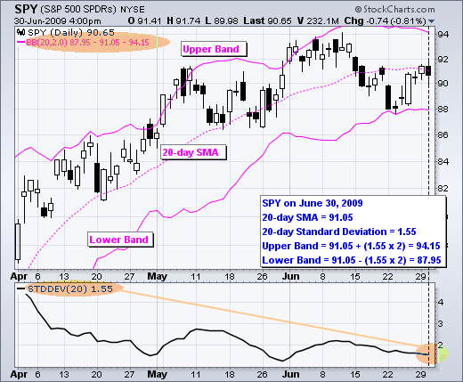
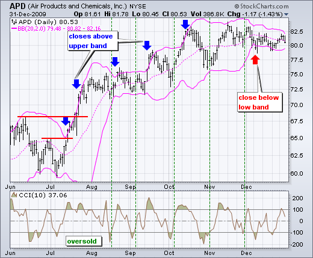

# 布林带 

### 目录

+   布林带

    +   介绍

    +   SharpCharts 计算

    +   信号：W 底部

    +   信号：M 顶

    +   信号：走势带

    +   结论

    +   使用 SharpCharts

    +   建议的扫描

        +   看涨布林带交叉

        +   看跌布林带交叉

    +   额外资源

        +   股票与商品杂志文章

## 介绍

由约翰·博林格（John Bollinger）开发，布林带®是放置在移动平均线上下的波动性带。波动性基于标准差，随着波动性的增加和减少而变化。当波动性增加时，带自动扩大，当波动性减少时，带变窄。布林带的这种动态特性也意味着它们可以在不同的证券上使用标准设置。对于信号，布林带可用于识别 M 顶和 W 底部，或确定趋势的强度。从带宽变窄中得出的信号在 ChartSchool 关于带宽的文章中讨论。

注：布林带®是约翰·博林格的注册商标。

## SharpCharts 计算

```py
  * Middle Band = 20-day simple moving average (SMA)
  * Upper Band = 20-day SMA + (20-day standard deviation of price x 2) 
  * Lower Band = 20-day SMA - (20-day standard deviation of price x 2)

```


点击这里下载此电子表格示例。")

**布林带由一个中间带和两个外部带组成。** 中间带是一个通常设置为 20 个周期的简单移动平均。使用简单移动平均是因为标准差公式也使用简单移动平均。标准差的回溯期与简单移动平均相同。外部带通常设置在中间带的上下 2 个标准差处。



设置可以调整以适应特定证券或交易风格的特征。 布林格建议对标准差乘数进行小幅调整。 更改移动平均线的周期数也会影响用于计算标准差的周期数。 因此，标准差**乘数**只需要进行小幅调整。 增加移动平均线周期将自动增加用于计算标准差的周期数，并且还需要增加标准差**乘数**。 使用 20 天 SMA 和 20 天标准差，标准差乘数设置为 2。 布林格建议将标准差乘数增加到 2.1 以用于 50 周期 SMA，并将标准差乘数降低到 1.9 以用于 10 周期 SMA。

## 信号：W 底部

W 底部也是亚瑟·梅里尔（Arthur Merrill）的工作的一部分，他识别出具有基本 W 形状的 16 种模式。 布林格使用这些不同的 W 形状模式与布林带来识别 W 底部。 “W 底部”形成在下降趋势中，并涉及两个反应低点。 特别是，布林格寻找 W 底部，其中第二个低点低于第一个低点，但保持在下轨之上。 有四个步骤可以确认布林带中的 W 底部。 首先，形成反应低点。 这个低点通常，但并非总是，低于下轨。 其次，向中轨反弹。 第三，证券中有一个新的价格低点。 这个低点**高于**下轨。 在测试中保持在下轨之上的能力显示了最后一次下跌的弱势。 第四，模式通过第二个低点的强劲走势和阻力突破得到确认。


图表 2 显示了 2010 年 1 月至 2 月的 Nordstrom（JWN）中的 W 底部。 首先，股票在 1 月形成了一个反应低点（黑色箭头）并跌破了下轨。 其次，股票反弹至中轨之上。 第三，股票跌破了 1 月的低点并保持在下轨之上。 即使 2 月 5 日的低点突破了下轨，但布林带是使用收盘价计算的，因此信号也应基于收盘价。 第四，股票在 2 月底大幅上涨，并伴随着扩大的交易量突破了 2 月初的高点。 图表 3 显示了 2009 年 7 月至 8 月的 Sandisk 中的较小 W 底部。


## 信号：M 顶

M 顶也是亚瑟·梅里尔（Arthur Merrill）的工作的一部分，他识别出具有基本 M 形状的 16 种模式。 布林格（Bollinger）使用这些不同的 M 形状模式与布林带来识别 M 顶。 根据布林格的说法，顶部通常比底部更复杂且拉长。 双顶，头肩顶模式和钻石代表不断演变的顶部。

在其最基本形式中，M-顶类似于双顶。然而，反弹高点并不总是相等的。第一个高点可能高于或低于第二个高点。布林格建议在证券创造新高时寻找非确认迹象。这基本上是 W-底的相反。非确认发生有三个步骤。首先，证券创造了一个高于上轨的反弹高点。其次，价格回调至中轨。第三，价格上涨至先前高点但未能达到上轨。这是一个警示信号。第二个反弹高点无法达到上轨显示了动量减弱，这可能预示着趋势反转。最终确认是通过支撑位被突破或出现熊市指标信号。


图表 4 显示了 2008 年 4 月至 5 月间埃克森美孚（XOM）出现了一个 M-顶形态。股票在 4 月份突破了上轨。5 月份出现了回调，然后再次上涨至 90 美元以上。尽管股票在日内交易中突破了上轨，但并未收盘在上轨之上。两周后，M-顶得到确认，支撑位被突破。同时，注意到 MACD 形成了一个熊市背离，并跌破了其信号线以得到确认。


图表 5 显示了 2008 年 7 月至 8 月间 Pulte Homes（PHM）处于上升趋势中。价格在 9 月初突破了上轨，确认了上升趋势。在回调至 20 日简单移动平均线（布林带中轨）以下后，股票上涨至 17 美元以上的新高。尽管这是本次上涨的新高，但价格并未突破上轨。这是一个警示信号。一周后股票跌破支撑位，MACD 跌破了其信号线。注意到这个 M-顶更为复杂，因为在峰值两侧有较低的反弹高点（蓝色箭头）。这个不断演变的顶部形成了一个小的头肩顶形态。

## 信号：走出布林带

突破或触及布林带并不是信号本身。正如布林格所说，触及或超过布林带的动作并不是信号，而是“标签”。从表面上看，向上突破显示力量，而向下急剧移动到下轨显示弱点。动量振荡器的工作方式基本相同。超买并不一定是看涨的。达到超买水平需要一定的力量，而超买条件在强劲的上升趋势中可能延续。同样，价格可以在强劲的上升趋势中“走在带子上”并多次触及。想一想。上轨是 20 周期简单移动平均线的 2 个标准差之上。需要相当强劲的价格波动才能超过这个上轨。在布林带确认 W 底之后发生的上轨触及将标志着上升趋势的开始。正如强劲的上升趋势产生了许多上轨标签一样，价格在上升趋势中永远不触及下轨也是常见的。20 日简单移动平均线有时充当支撑。事实上，在下穿 20 日简单移动平均线之前，有时提供买入机会，以便下一次触及上轨。



图表 6 显示了空气产品（APD）在七月中旬突然上涨并收于上轨之上。首先，请注意这是一次强劲的上涨，突破了两个阻力水平。强劲的向上推力是力量的表现，而非弱点。八月份交易走平，20 日简单移动平均线横向移动。布林带变窄，但 APD 没有收于下轨之下。价格和 20 日简单移动平均线在九月份上涨。总体而言，APD 在四个月内至少五次收于上轨之上。指标窗口显示了 10 周期的商品通道指数（CCI）。CCI 低于 -100 被视为超卖，回升至 -100 以上标志着超卖反弹的开始（绿色虚线）。上轨标签和突破开启了上升趋势。CCI 随后识别了可交易的回调，低于 -100。这是将布林带与动量振荡器结合以获取交易信号的示例。


图表 7 显示了孟山都（MON）在下轨上行走。该股票在一月份突破支撑并收于下轨之下。从一月中旬到五月初，孟山都至少五次收于下轨之下。请注意，在此期间该股票没有一次收于上轨之上。支撑突破和最初收于下轨之下标志着下降趋势。因此，使用 10 周期的商品通道指数（CCI）来识别短期超买情况。超过 +100 是超买。回落至 +100 以下标志着下降趋势的恢复（红色箭头）。该系统在 2010 年初触发了两个良好的信号。

## 结论

布林带通过 20 周期 SMA 反映方向，通过上/下带反映波动性。因此，它们可以用来确定价格相对高低。**根据布林的说法，带应该包含 88-89%的价格行动，这使得带外的移动具有重要意义。** 从技术上讲，当价格高于上带时，价格相对较高，当价格低于下带时，价格相对较低。然而，相对高不应被视为熊市或卖出信号。同样，相对低不应被视为牛市或买入信号。价格之所以高或低是有原因的。与其他指标一样，布林带不应被单独使用。图表分析师应将布林带与基本趋势分析和其他指标结合使用以进行确认。

## 使用 SharpCharts

在 SharpCharts 中可以找到布林带作为价格叠加。与简单移动平均线一样，布林带应该显示在价格图上方。在选择布林带时，默认设置将出现在参数窗口中（20,2）。第一个数字（20）设置了简单移动平均线和标准差的周期。第二个数字（2）设置了上下带的标准差倍数。这些默认参数将带设置为简单移动平均线的 2 个标准差之上/之下。用户可以根据自己的图表需求更改参数。布林带（50,2.1）可用于较长时间范围，或者布林带（10,1.9）可用于较短时间范围。[点击这里](http://stockcharts.com/h-sc/ui?s=QQQ&p=D&b=5&g=0&id=p50569930924 "http://stockcharts.com/h-sc/ui?s=QQQ&p=D&b=5&g=0&id=p50569930924")查看实时示例。


## 建议的扫描

### 牛市布林带交叉

此扫描找到刚刚突破其上布林带线的股票。这个扫描只是一个起点。需要进一步的细化和分析。

```py
[type = stock] AND [country = US] 
AND [Daily SMA(20,Daily Volume) > 40000] 
AND [Daily SMA(60,Daily Close) > 5] 

AND [Daily Close x Daily Upper BB(20,2.0)] 
```

### 熊市布林带交叉

此扫描找到刚刚跌破其下布林带线的股票。这个扫描只是一个起点。需要进一步的细化和分析。

```py
[type = stock] AND [country = US] 
AND [Daily SMA(20,Daily Volume) > 40000] 
AND [Daily SMA(60,Daily Close) > 5] 

AND [Daily Lower BB(20,2.0) x Daily Close] 
```

有关布林带扫描的语法详细信息，请参阅我们支持中心的[扫描指标参考](http://stockcharts.com/docs/doku.php?id=scans:indicators#bollinger_bands "http://stockcharts.com/docs/doku.php?id=scans:indicators#bollinger_bands")。

* * *

## 其他资源

### 《股票与商品》杂志文章

**[艾米·吴的布林带](http://stockcharts.com/h-mem/tascredirect.html?artid=\V20\C01\015BOLL.pdf "http://stockcharts.com/h-mem/tascredirect.html?artid=\V20\C01\015BOLL.pdf")**

2001 年 12 月 - 《股票与商品》V. 20:1 (78-79)

**[使用布林带（Bollinger Bands）by 约翰·布林格（John Bollinger）](http://stockcharts.com/h-mem/tascredirect.html?artid=\V10\C02\USINGBO.pdf "http://stockcharts.com/h-mem/tascredirect.html?artid=\V10\C02\USINGBO.pdf")**

1992 年 1 月 - 股票与商品 V. 10:2 (47-51)
