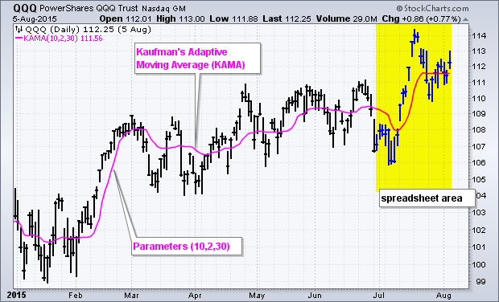

# 考夫曼自适应移动平均线（KAMA）[ChartSchool]

### 目录

+   考夫曼自适应移动平均线（KAMA）

    +   介绍

    +   计算

        +   效率比率（ER）

        +   平滑常数（SC）

        +   KAMA

    +   计算示例/图表

    +   用法和信号

    +   与 SharpCharts 一起使用

    +   建议扫描

        +   价格上穿 KAMA 时的总体上升趋势

        +   价格下穿 KAMA 时的总体下降趋势

    +   进一步研究

    +   额外资源

        +   股票与商品杂志文章

## 介绍

由佩里·考夫曼（Perry Kaufman）开发，考夫曼自适应移动平均线（KAMA）是一种移动平均线，旨在考虑市场噪音或波动性。当价格波动相对较小且噪音较低时，KAMA 将紧密跟随价格。当价格波动加大并且距离价格较远时，KAMA 将进行调整。这种趋势跟踪指标可用于识别总体趋势，时间转折点和过滤价格波动。

## 计算

计算考夫曼自适应移动平均线需要几个步骤。让我们首先从佩里·考夫曼推荐的设置开始：KAMA(10,2,30)。

+   10 是效率比率（ER）的周期数。

+   2 是最快 EMA 常数的周期数。

+   30 是最慢 EMA 常数的周期数。

在计算 KAMA 之前，我们需要计算效率比率（ER）和平滑常数（SC）。将公式分解成易于理解的小块有助于理解指标背后的方法论。请注意，ABS 代表绝对值。

### 效率比率（ER）

ER 基本上是根据日常波动调整的价格变化。

```py
ER = Change/Volatility

Change = ABS(Close - Close (10 periods ago))

Volatility = Sum10(ABS(Close - Prior Close))

Volatility is the sum of the absolute value of the last ten price changes (Close - Prior Close). 

```

从统计学角度来看，效率比率告诉我们价格变化的分形效率。ER 在 1 和 0 之间波动，但这些极端情况是例外，而不是规范。如果价格连续上涨 10 个周期或下跌 10 个周期，ER 将为 1。如果价格在 10 个周期内保持不变，ER 将为零。

### 平滑常数（SC）

平滑常数使用 ER 和基于指数移动平均的两个平滑常数。

```py
SC = [ER x (fastest SC - slowest SC) + slowest SC]2

SC = [ER x (2/(2+1) - 2/(30+1)) + 2/(30+1)]2

```

正如您可能已经注意到的，平滑常数在其公式中使用了指数移动平均的平滑常数。（2/30+1）是 30 周期 EMA 的平滑常数。最快的 SC 是较短 EMA（2 周期）的平滑常数。最慢的 SC 是最慢 EMA（30 周期）的平滑常数。请注意，结尾处的“2”是为了平方该方程。

### KAMA

有了效率比率（ER）和平滑常数（SC），我们现在可以计算考夫曼自适应移动平均线（KAMA）。由于我们需要一个初始值来开始计算，第一个 KAMA 只是一个简单移动平均线。以下计算基于以下公式。

```py
Current KAMA = Prior KAMA + SC x (Price - Prior KAMA)

```

## 计算示例/图表

下面的图片显示了用于计算 KAMA 和相应 QQQ 图表的 Excel 电子表格的截图。




点击这里下载") 这个电子表格示例。

## 使用和信号

图表分析师可以像使用其他趋势跟踪指标（如移动平均线）一样使用 KAMA。图表分析师可以寻找价格交叉、方向变化和滤波信号。

首先，KAMA 上下交叉表示价格方向变化。与任何移动平均线一样，简单的交叉系统会产生大量信号和大量虚假信号。图表分析师可以通过将价格或时间过滤器应用于交叉来减少虚假信号。可以要求价格保持交叉一定数量的天数，或要求交叉超过 KAMA 一定百分比。


其次，图表分析师可以利用 KAMA 的方向来定义证券的整体趋势。这可能需要调整参数以进一步平滑指标。图表分析师可以更改中间参数，即最快的 EMA 常数，以平滑 KAMA 并寻找方向变化。只要 KAMA 下降并形成较低低点，趋势就是向下的。只要 KAMA 上升并形成较高高点，趋势就是向上的。下面的 Kroger 示例显示了 KAMA（10,5,30）从 12 月到 3 月的陡峭上升趋势，以及从 5 月到 8 月的较缓上升趋势。


最后，图表分析师可以结合信号和技术。图表分析师可以使用长期 KAMA 来定义更大的趋势，使用短期 KAMA 进行交易信号。例如，KAMA（10,5,30）可以用作趋势过滤器，在上升时被视为看涨。一旦看涨，图表分析师可以寻找价格上穿 KAMA（10,2,30）时的看涨交叉。下面的示例显示了 MMM 在长期 KAMA 上升并在 12 月、1 月和 2 月出现看涨交叉。长期 KAMA 在 4 月转为下跌，并在 5 月、6 月和 7 月出现看跌交叉。


## 使用 SharpCharts

KAMA 可以作为 SharpCharts 工作台中的指标叠加显示。一旦选择了默认设置，参数框将自动显示在图表中，图表分析师可以根据自己的分析需求更改这些参数。第一个参数是效率比率，图表分析师应该避免增加这个数字。相反，图表分析师可以减少它以增加灵敏度。希望平滑 KAMA 以进行长期趋势分析的图表分析师可以逐步增加中间参数。即使差异只有 3，KAMA(10,5,30)比 KAMA(10,2,30)平滑得多。


## 建议扫描

### 价格上涨趋势，价格上穿 KAMA

这个扫描从平均每日交易 100,000 股并且平均收盘价高于 10 的股票开始。当交易在长期 KAMA(10,5,30)上方时存在上升趋势。当价格移动到短期 KAMA(10,2,30)上方时，买入信号出现。

```py
[type = stock] AND [country = US] 
AND [Daily SMA(20,Daily Volume) > 100000] 
AND [Daily SMA(60,Daily Close) > 10] 

AND [KAMA(10,5,30) >  Daily SMA(50,KAMA(10,5,30))]
AND [Daily Close crosses KAMA(10,2,30)] 
```

### 价格跌破 KAMA，整体下降趋势

这个扫描从平均每日交易 100,000 股并且平均收盘价高于 10 的股票开始。当交易在长期 KAMA(10,5,30)下方时存在下降趋势。当价格移动到短期 KAMA(10,2,30)下方时，卖出信号出现。

```py
[type = stock] AND [country = US] 
AND [Daily SMA(20,Daily Volume) > 100000] 
AND [Daily SMA(60,Daily Close) > 10] 

AND [KAMA(10,5,30) <  Daily SMA(50,KAMA(10,5,30))]
AND [KAMA(10,2,30) crosses Daily Close] 
```

有关 KAMA 扫描的语法详细信息，请参阅我们的[扫描指标参考](http://stockcharts.com/docs/doku.php?id=scans:indicators#kaufman_s_adaptive_moving_average_kama "http://stockcharts.com/docs/doku.php?id=scans:indicators#kaufman_s_adaptive_moving_average_kama")在支持中心。

## 进一步研究

从作者那里，下面的书提供了关于指标、程序、算法和系统的详细信息，包括有关 KAMA 和其他移动平均系统的详细信息。

| **交易系统和方法** Perry Kaufman |
| --- |
|  |
|  |

## 其他资源

### 股票与商品杂志文章

**[Perry Kaufman 与 Thom Hartle 的访谈](https://technical.traders.com/archive/articlefinal.asp?file=\V13\C06\SIDEADA.pdf "https://technical.traders.com/archive/articlefinal.asp?file=\V13\C06\SIDEADA.pdf")**

1995 年 5 月 - 股票与商品
