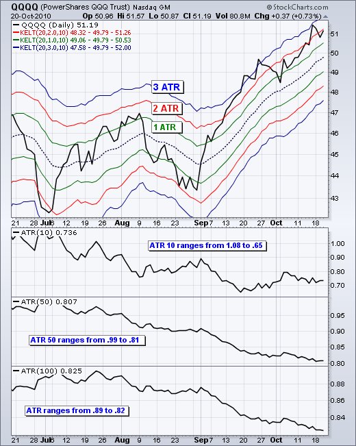
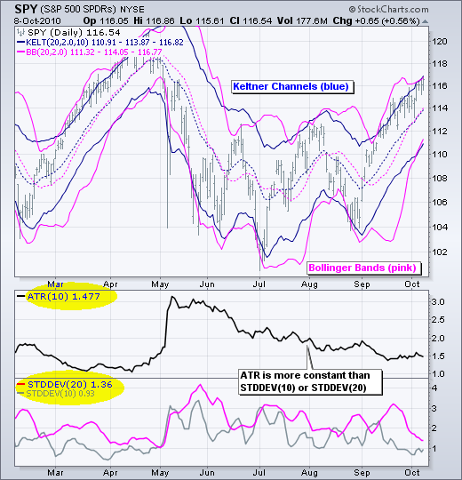
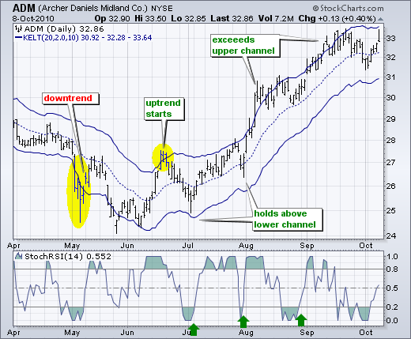
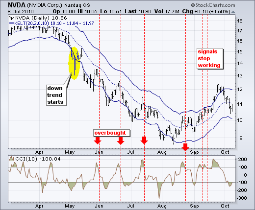
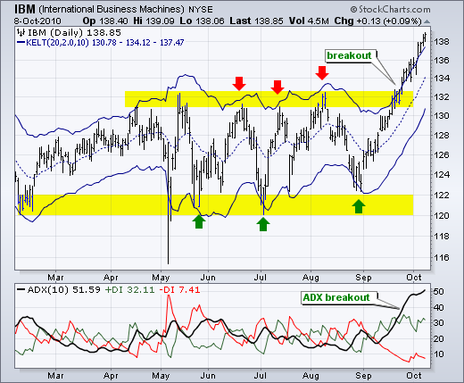
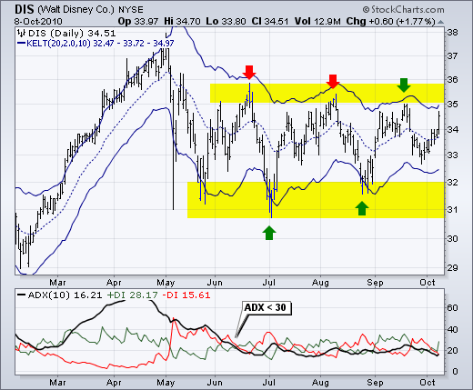
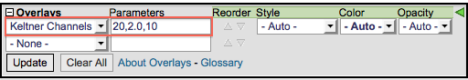

# 凯尔特纳通道[图表学校]

### 目录

+   凯尔特纳通道

    +   介绍

    +   计算

    +   解释

    +   与布林带对比

    +   上升趋势

    +   下降趋势

    +   平稳趋势

    +   结论

    +   使用 SharpCharts

    +   建议扫描

        +   牛市凯尔特纳通道突破后的超卖

        +   熊市凯尔特纳通道突破后的超买

    +   进一步研究

    +   额外资源

        +   股票与商品杂志文章

## 介绍

凯尔特纳通道是基于波动率的信封，设置在指数移动平均线的上方和下方。这个指标类似于布林带，布林带使用标准差来设定带。凯尔特纳通道不使用标准差，而是使用真实波幅（ATR）来设定通道距离。通常情况下，通道设置在 20 日 EMA 的两个真实波幅值的上方和下方。指数移动平均线决定方向，真实波幅设定通道宽度。**凯尔特纳通道是一种趋势跟踪指标，用于识别通道突破和通道方向的逆转。** 当趋势平稳时，通道也可以用来识别超买和超卖水平。

在他 1960 年的著作《如何在商品市场赚钱》中，切斯特·凯尔特纳介绍了“十日移动平均交易规则”，被认为是凯尔特纳通道的原始版本。这个原始版本以典型价格的 10 日简单移动平均（{(H+L+C)/3)}）作为中线。高低范围的 10 日简单移动平均被加减以设定上下通道线。琳达·布拉德福德·拉什克在 1980 年代介绍了凯尔特纳通道的更新版本。与布林带类似，这个新版本使用基于波动率的指标——真实波幅（ATR），来设定通道宽度。StockCharts.com 使用这个更新版本的凯尔特纳通道。

## 计算

计算凯尔特纳通道有三个步骤。首先，选择指数移动平均线的长度。其次，选择真实波幅（ATR）的时间周期。第三，选择真实波幅的乘数。

```py
Middle Line: 20-day exponential moving average 
Upper Channel Line: 20-day EMA + (2 x ATR(10))
Lower Channel Line: 20-day EMA - (2 x ATR(10))

```

上面的示例基于 SharpCharts 的默认设置。由于移动平均线滞后于价格，较长的移动平均线会有更多的滞后，而较短的移动平均线则会有较少的滞后。ATR 是基本的波动率设置。较短的时间框架，如 10，会产生更加波动的 ATR，随着 10 期波动性的起伏而波动。较长的时间框架，如 100，会平滑这些波动，产生更加稳定的 ATR 读数。乘数对通道宽度影响最大。简单地从 2 改为 1 会将通道宽度减半。从 2 增加到 3 会使通道宽度增加 50%。

这里有一张图表展示了三条 Keltner 通道，分别设置在中心移动平均线的 1、2 和 3 个 ATR 之外。这种特定技术多年来一直由 [SpikeTrade.com](http://spiketrade.com "http://spiketrade.com") 的 Kerry Lovvorn 提倡。



上图显示了默认的红色 Keltner 通道，更宽的蓝色通道和更窄的绿色通道。蓝色通道设置为中心移动平均线的三个平均真实范围值之上和之下（3 x ATR）。绿色通道使用一个 ATR 值。所有三个通道共享 20 天的 EMA，即中间的虚线。指标窗口显示了 10 期、50 期和 100 期的平均真实范围（ATR）的差异。请注意，短期 ATR（10）更加波动，范围更广。相比之下，100 期 ATR 更加平稳，范围波动较小。

## 解释

基于通道、波段和包络线的指标旨在涵盖大部分价格行为。因此，超出或低于通道线的走势值得关注，因为这种情况相对较少见。趋势通常始于某个方向的强劲走势。突破上通道线显示出非凡的力量，而跌破下通道线则显示出非凡的弱势。这种强劲的走势可能预示着一种趋势的结束和另一种趋势的开始。

以指数移动平均线为基础，Keltner 通道是一种趋势跟踪指标。与移动平均线和趋势跟踪指标一样，Keltner 通道滞后于价格走势。移动平均线的方向决定了通道的方向。通道向下移动时通常存在下降趋势，而通道向上移动时存在上升趋势。当通道横向移动时，趋势是平的。

通道上升并突破上升趋势线可能预示着上升趋势的开始。通道下降并突破下降趋势线可能预示着下降趋势的开始。有时，在通道突破后强劲的趋势并没有形成，价格在通道线之间波动。这种交易范围以相对平坦的移动平均线为特征。然后可以利用通道边界来识别超买和超卖水平以进行交易。

## 与布林带相比

Keltner 通道和布林带之间有两个区别。首先，Keltner 通道比布林带更平滑，因为布林带的宽度基于标准偏差，比真实波幅（ATR）更不稳定。许多人认为这是一个优点，因为它创造了一个更为恒定的宽度。这使得 Keltner 通道非常适合趋势跟踪和趋势识别。其次，Keltner 通道还使用指数移动平均线，比布林带中使用的简单移动平均线更敏感。下图显示了 Keltner 通道（蓝色）、布林带（粉色）、真实波幅（10）、标准偏差（10）和标准偏差（20）进行比较。请注意 Keltner 通道比布林带更平滑。另外，请注意标准偏差的范围比真实波幅（ATR）大。



## 上升趋势

下图显示了阿彻丹尼尔斯中部（ADM）在 Keltner 通道上升并股价突破上通道线时开始上升趋势。ADM 在 4 月至 5 月明显处于下降趋势，因为价格继续穿过下通道。6 月份价格强劲上涨，超过了上通道，通道转向上方开始新的上升趋势。请注意，7 月初和 7 月底价格在下通道线上方保持。



即使建立了新的上升趋势，通常也明智地等待回调或更好的入场点以改善回报风险比。然后可以使用动量振荡器或其他指标来定义超卖读数。本图显示了 StochRSI 之一，这是更敏感的动量振荡器，在上升趋势期间至少三次跌破 0.20 以变为超卖。随后再次上穿 0.20 标志着上升趋势的恢复。

## 下降趋势

第二张图显示了英伟达（NVDA）开始下跌趋势，急剧跌破下通道线。在这一初始突破之后，股票在五月中旬至八月初的时间内遇到了 20 天 EMA（中线）附近的阻力。未能接近上通道线显示了强烈的下行压力。



以 10 期商品通道指数（CCI）作为动量振荡器，用于识别短期超买条件。超过 100 的移动被视为超买。随后回落至 100 以下信号着下跌趋势的恢复。这个信号一直有效直到九月。这些失败的信号表明可能发生趋势变化，随后通过突破上通道线得到确认。

## 平稳趋势

一旦确定了交易区间或平稳交易环境，交易员可以使用 Keltner 通道来识别超买和超卖水平。交易区间可以通过平坦的移动平均线和平均趋向指数（ADX）来识别。下图显示了 IBM 在二月至九月底之间在 120-122 区域的支撑和 130-132 区域的阻力之间波动。20 天 EMA，中线，滞后于价格走势，但在四月至九月间趋于平缓。

指标窗口显示 ADX（黑线）确认了弱势趋势。低且下降的 ADX 表示弱势趋势。高且上升的 ADX 表示强势趋势。ADX 在整个时间内都低于 40，在大部分时间内低于 30。这反映了趋势的缺失。此外，请注意，ADX 在六月初达到峰值，直到八月底下降。



武装着弱势趋势和交易区间的前景，交易员可以使用 Keltner 通道来预测逆转。此外，请注意通道线通常与图表支撑和阻力重合。IBM 从五月底到八月底三次跌破下通道线。这些跌幅提供了低风险的入场点。股票未能触及上通道线，但在阻力区逆转时接近。迪士尼图表显示了类似的情况。



## 结论

**凯尔特纳通道是一种趋势跟踪指标，旨在识别潜在趋势。** 趋势识别占据了大部分战斗。趋势可以是上升、下降或平稳的。使用上述方法，交易员和投资者可以识别趋势以建立交易偏好。在上升趋势中偏好看涨交易，在下降趋势中偏好看跌交易。平稳趋势需要更灵活的方法，因为价格往往在上轨线处顶峰，在下轨线处低谷。与所有分析技术一样，凯尔特纳通道应与其他指标和分析一起使用。动量指标 是对趋势跟踪凯尔特纳通道的良好补充。

## 使用 SharpCharts

凯尔特纳通道可以在 SharpCharts 中作为价格叠加显示。与移动平均线一样，凯尔特纳通道应该显示在价格图上方。在从下拉框中选择指标后，参数窗口中将显示默认设置（20,2.0,10）。第一个数字（20）设置指数移动平均线的周期。第二个数字（2.0）是 ATR 倍数。第三个数字（10）是真实波幅（ATR）的周期数。这些默认参数将通道设置为 20 日 EMA 的 2 个 ATR 值之上/之下。用户可以根据自己的图表需求更改参数。[点击这里](http://stockcharts.com/h-sc/ui?s=SPY&p=D&st=2010-02-03&en=2010-10-09&id=p15714633106&listNum=30&a=211776022 "http://stockcharts.com/h-sc/ui?s=SPY&p=D&st=2010-02-03&en=2010-10-09&id=p15714633106&listNum=30&a=211776022") 查看实时示例。



## 建议扫描

### 在牛市凯尔特纳通道突破后超卖

这个扫描器寻找在 20 天前突破其上轨凯尔特纳通道的股票，以确认或建立上升趋势。当前的 10 周期 CCI 低于-100，表明短期超卖状态。

```py
[type = stock] AND [country = US] 
AND [Daily SMA(20,Daily Volume) > 40000] 

AND [20 days ago Daily High > 20 days ago Daily Upper Kelt Chan(20,2.0,10)] 
AND [Daily CCI(10) < -100]
```

### 在熊市凯尔特纳通道突破后超买

这个扫描器寻找在 20 天前突破其下轨凯尔特纳通道的股票，以确认或建立下降趋势。当前的 10 周期 CCI 高于+100，表明短期超买状态。

```py
[type = stock] AND [country = US] 
AND [Daily SMA(20,Daily Volume) > 40000] 

AND [20 days ago Daily Low < 20 days ago Daily Lower Kelt Chan(20,2.0,10)] 
AND [Daily CCI(10) > 100]
```

有关用于凯尔特纳通道扫描的扫描语法的更多详细信息，请参阅我们支持中心的[扫描指标参考](http://stockcharts.com/docs/doku.php?id=scans:indicators#keltner_channels "http://stockcharts.com/docs/doku.php?id=scans:indicators#keltner_channels")。

## 进一步研究

| **趋势交易谋生** 托马斯·卡尔 | **趋势跟踪** 迈克尔·科维尔 |
| --- | --- |
|  |  |
|  |  |

* * *

## 附加资源

### Stocks & Commodities Magazine 文章

**[Keltner Channel by Stuart Evens](http://stockcharts.com/h-mem/tascredirect.html?artid=\V17\C12\095KELT.pdf "http://stockcharts.com/h-mem/tascredirect.html?artid=\V17\C12\095KELT.pdf")**

1999 年 11 月
