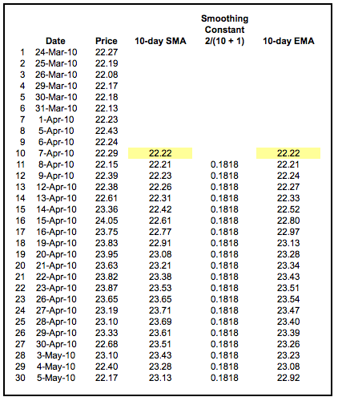
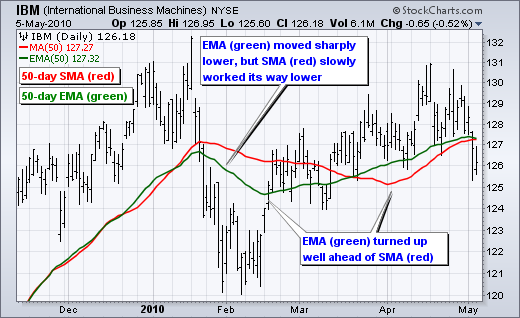
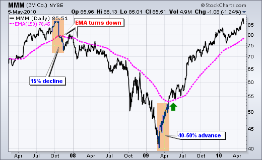
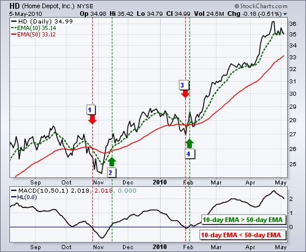
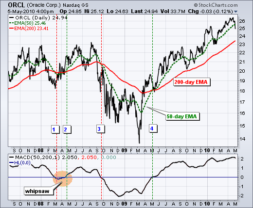
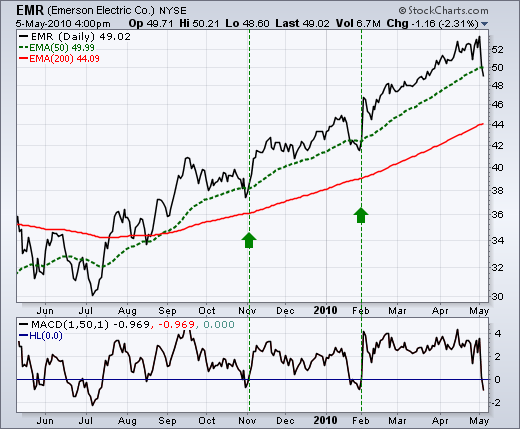
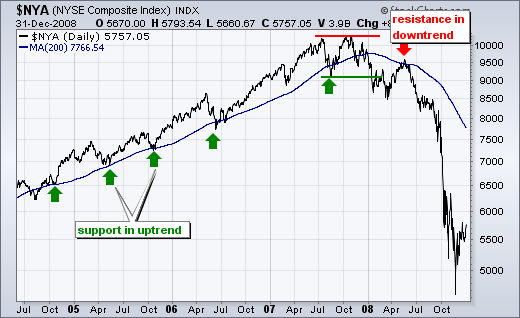
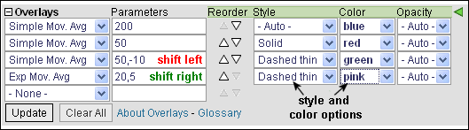
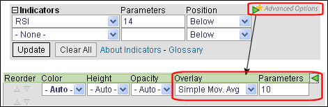

# 移动平均线 - 简单和指数[ChartSchool]

### 目录

+   移动平均线 - 简单和指数

    +   介绍

    +   简单移动平均线计算

    +   指数移动平均线计算

        +   加权乘数

        +   EMA 准确性

    +   滞后因素

    +   简单移动平均线与指数移动平均线的比较

    +   长度和时间范围

    +   趋势识别

    +   双交叉

    +   价格交叉

    +   支撑和阻力

    +   结论

    +   与 SharpCharts 一起使用

    +   建议的扫描

        +   看涨移动平均线交叉

        +   看跌移动平均线交叉

    +   进一步研究

    +   其他资源

        +   股票与商品杂志文章

## 介绍

移动平均线平滑价格数据，形成趋势跟踪指标。它们不预测价格方向，而是以滞后的方式定义当前方向。移动平均线滞后是因为它们基于过去的价格。尽管有这种滞后，移动平均线有助于平滑价格走势并过滤噪音。它们也构成许多其他技术指标和叠加图形的基础，如 Bollinger Bands、MACD 和 McClellan Oscillator。最流行的两种移动平均线类型是**简单移动平均线（SMA）**和**指数移动平均线（EMA）**。这些移动平均线可用于识别趋势方向或定义潜在的支撑和阻力水平。

这是一个同时包含简单移动平均线和指数移动平均线的图表：


点击图表查看实时版本

## 简单移动平均线计算

**简单移动平均线是通过计算特定周期内某个证券的平均价格形成的。** 大多数移动平均线是基于收盘价格的。 5 天简单移动平均线是收盘价格的五天总和除以五。 正如其名称所示，移动平均线是一个移动的平均值。 随着新数据的出现，旧数据被丢弃。 这导致平均值沿着时间尺度移动。 以下是一个 5 天移动平均线在三天内演变的示例。

```py
Daily Closing Prices: 11,12,13,14,15,16,17

First day of 5-day SMA: (11 + 12 + 13 + 14 + 15) / 5 = 13

Second day of 5-day SMA: (12 + 13 + 14 + 15 + 16) / 5 = 14

Third day of 5-day SMA: (13 + 14 + 15 + 16 + 17) / 5 = 15

```

移动平均线的第一天简单地涵盖了过去五天。 移动平均线的第二天删除了第一个数据点（11）并添加了新的数据点（16）。 移动平均线的第三天继续删除第一个数据点（12）并添加新的数据点（17）。 在上面的示例中，价格在七天内逐渐从 11 增加到 17。 请注意，移动平均线在三天的计算期间也从 13 上升到 15。 还要注意，每个移动平均值都略低于最后的价格。 例如，第一天的移动平均值等于 13，而最后的价格是 15。 过去四天的价格较低，这导致移动平均线滞后。

## 指数移动平均线计算

指数移动平均线（EMAs）通过对最近价格应用更多权重来减少滞后。 应用于最近价格的权重取决于移动平均线中的周期数。 EMAs 与简单移动平均线不同之处在于给定日期的 EMA 计算取决于该日期之前所有日期的 EMA 计算。 您需要远远超过 10 天的数据才能计算出一个相当准确的 10 天 EMA。

计算指数移动平均线（EMA）有三个步骤。 首先，计算初始 EMA 值的简单移动平均线。 指数移动平均线（EMA）必须从某个地方开始，因此在第一次计算中，使用简单移动平均线作为前一期的 EMA。 其次，计算权重乘数。 第三，使用价格、乘数和前一期的 EMA 值，计算初始 EMA 值和今天之间每天的指数移动平均线。 以下公式是用于 10 天 EMA 的。

```py
Initial SMA: 10-period sum / 10 

Multiplier: (2 / (Time periods + 1) ) = (2 / (10 + 1) ) = 0.1818 (18.18%)

EMA: {Close - EMA(previous day)} x multiplier + EMA(previous day). 
```

### 权重乘数

10 周期指数移动平均线对最近价格应用 18.18%的权重。 10 周期 EMA 也可以称为 18.18%EMA。 20 周期 EMA 对最近价格应用 9.52%的权重（2/（20+1）= .0952）。 请注意，较短时间段的权重大于较长时间段的权重。 实际上，每当移动平均线周期加倍时，权重就会减半。

如果您想要使用特定百分比的 EMA，您可以使用此公式将其转换为时间周期，然后将该值输入为 EMA 的参数：

```py
Time Period = (2 / Percentage) - 1

3% Example:  Time Period = (2 / 0.03) - 1 = 65.67 time periods
```

### EMA 准确性

下面是英特尔的 10 日简单移动平均线和 10 日指数移动平均线的电子表格示例。SMA 的计算很简单，几乎不需要解释：10 日 SMA 随着新价格的出现而移动，旧价格消失。电子表格中的指数移动平均线从其第一个 EMA 值（22.22）的 SMA 值开始。在第一次计算后，使用正常的 EMA 公式。

EMA 的公式包含了前一期的 EMA 值，而前一期的 EMA 值又包含了更早之前的 EMA 值，依此类推。每个先前的 EMA 值占当前值的一小部分。因此，当前的 EMA 值将根据您在 EMA 计算中使用了多少过去数据而变化。理想情况下，为了获得 100%准确的 EMA，您应该使用股票历史上的每个数据点来计算 EMA，从股票存在的第一天开始计算。这并不总是切实可行，但您使用的数据点越多，EMA 就越准确。目标是在最小化计算时间的同时最大化准确性。

下面的电子表格示例回溯了 30 个周期。在 EMA 计算中仅包含了 30 个数据点，电子表格中的 10 日 EMA 值并不是非常准确。在我们的图表中，我们至少计算了 250 个周期（通常更多），导致 EMA 值准确到几分之一美分。



点击此处下载此电子表格示例。")

## 滞后因素

移动平均线越长，滞后越多。10 日指数移动平均线会紧密跟随价格并在价格转向后很快转向。短期移动平均线就像快艇 - 灵活且快速变化。相比之下，100 日移动平均线包含大量过去数据，使其变化缓慢。长期移动平均线就像海洋油轮 - 行动迟缓且变化缓慢。100 日移动平均线需要更大更长的价格波动才能改变方向。


点击图表查看实时版本。

上面的图表显示了标普 500ETF 的 10 日 EMA 紧随价格走势，而 100 日 SMA 持续上涨。即使在 1 月至 2 月的下跌中，100 日 SMA 也保持不变。当涉及滞后因素时，50 日 SMA 介于 10 日和 100 日移动平均线之间。

## 简单移动平均线 vs 指数移动平均线

尽管简单移动平均线和指数移动平均线之间存在明显差异，但一个不一定比另一个更好。指数移动平均线滞后较少，因此对最近的价格和最近的价格变化更敏感。指数移动平均线会在简单移动平均线之前转折。另一方面，简单移动平均线代表整个时间段内价格的真实平均值。因此，简单移动平均线可能更适合识别支撑或阻力水平。

移动平均线的偏好取决于目标、分析风格和时间范围。图表分析师应该尝试使用两种类型的移动平均线以及不同的时间框架，以找到最合适的选择。下图显示了 IBM 的 50 天简单移动平均线以红色显示，50 天指数移动平均线以绿色显示。两者在一月底达到峰值，但指数移动平均线的下降比简单移动平均线更陡。指数移动平均线在二月中旬转折，但简单移动平均线一直下跌直到三月底。请注意，简单移动平均线在指数移动平均线之后一个多月才转折。



## 长度和时间框架

移动平均线的长度取决于分析目标。短期移动平均线（5-20 周期）最适合短期趋势和交易。对中期趋势感兴趣的图表分析师会选择更长的移动平均线，可能延伸至 20-60 周期。长期投资者会更喜欢具有 100 个或更多周期的移动平均线。

一些移动平均线长度比其他更受欢迎。200 天移动平均线可能是最受欢迎的。由于其长度，这显然是一个长期移动平均线。其次，50 天移动平均线在中期趋势中相当受欢迎。许多图表分析师同时使用 50 天和 200 天移动平均线。在短期内，10 天移动平均线过去相当受欢迎，因为它容易计算。只需将数字相加并移动小数点即可。

## 趋势识别

使用简单移动平均线或指数移动平均线可以产生相同的信号。如上所述，偏好取决于个人。以下示例将同时使用简单和指数移动平均线。术语“移动平均线”适用于简单和指数移动平均线。

移动平均线的方向传达了关于价格的重要信息。上升的移动平均线显示价格一般在上涨。下降的移动平均线表明价格平均下跌。上升的长期移动平均线反映了长期上升趋势。下降的长期移动平均线反映了长期下降趋势。



上图显示了 3M（MMM）的 150 天指数移动平均线。这个例子展示了在趋势强劲时移动平均线的工作效果。150 天 EMA 在 2007 年 11 月和 2008 年 1 月再次下降。请注意，需要一个 15%的下跌才能改变这个移动平均线的方向。这些滞后指标在趋势反转发生时（最好情况下）或发生后（最坏情况下）识别出来。MMM 持续下跌至 2009 年 3 月，然后激增 40-50%。请注意，直到这次激增之后，150 天 EMA 才开始上升。然而，一旦开始上升，MMM 在接下来的 12 个月内继续上涨。在强劲趋势中，移动平均线的效果非常出色。

## 双重交叉

两个移动平均线可以一起使用以生成交叉信号。在《金融市场技术分析》中，约翰·墨菲称之为“双重交叉法”。双重交叉涉及一个相对较短的移动平均线和一个相对较长的移动平均线。与所有移动平均线一样，移动平均线的一般长度定义了系统的时间框架。使用 5 天 EMA 和 35 天 EMA 的系统将被视为短期。使用 50 天 SMA 和 200 天 SMA 的系统将被视为中期，甚至是长期。

当较短的移动平均线穿过较长的移动平均线时，会出现看涨的交叉。这也被称为金叉。当较短的移动平均线穿过较长的移动平均线时，会出现看跌的交叉。这被称为死叉。

移动平均线交叉产生相对较晚的信号。毕竟，该系统使用了两个滞后指标。移动平均线周期越长，信号滞后越大。这些信号在趋势确立时效果很好。然而，在没有强劲趋势的情况下，移动平均线交叉系统会产生很多虚假信号。

还有一种三重交叉法，涉及三个移动平均线。当最短的移动平均线穿过两个较长的移动平均线时，就会产生信号。一个简单的三重交叉系统可能涉及 5 天、10 天和 20 天的移动平均线。



上图显示了家得宝（HD）的 10 日 EMA（绿色虚线）和 50 日 EMA（红线）。黑线是每日收盘价。使用移动平均线交叉会导致三次鞭策，然后才捕捉到一个好的交易。10 日 EMA 在 10 月底（1）跌破 50 日 EMA，但这并没有持续很久，因为 10 日 EMA 在 11 月中旬又回升（2）。这次交叉持续时间更长，但在 1 月份（3）发生的下一个空头交叉接近 11 月底的价格水平，导致另一次鞭策。这次空头交叉也没有持续很久，因为 10 日 EMA 在几天后又回升到 50 日 EMA 之上（4）。经历了三次错误信号后，第四个信号预示着一次强劲的上涨，股价上涨超过 20%。

这里有两个要点。首先，交叉点容易出现鞭策。可以应用价格或时间过滤器来帮助防止鞭策。交易者可能要求交叉点持续 3 天才采取行动，或要求 10 日 EMA 在移动超过/低于 50 日 EMA 一定量之后才采取行动。其次，MACD 可用于识别和量化这些交叉点。MACD (10,50,1)将显示代表两个指数移动平均线之间差异的线。MACD 在金叉时变为正值，在死叉时变为负值。百分比价格振荡器（PPO）可以用相同的方式显示百分比差异。请注意，MACD 和 PPO 基于指数移动平均线，与简单移动平均线不匹配。



这张图显示了甲骨文（ORCL）的 50 日 EMA，200 日 EMA 和 MACD(50,200,1)。在 2 年半的时间里，有四次移动平均线交叉。前三次导致鞭策或糟糕的交易。随着第四次交叉，ORCL 开始持续上涨至 20 美元左右。再次强调，当趋势强劲时，移动平均线交叉效果很好，但在没有趋势的情况下会导致亏损。

## 价格交叉

移动平均线也可以用于生成简单价格交叉信号。当价格上涨超过移动平均线时，会产生多头信号。当价格下跌低于移动平均线时，会产生空头信号。价格交叉可以结合在更大趋势内进行交易。较长的移动平均线为更大趋势设定基调，较短的移动平均线用于生成信号。只有当价格已经高于较长移动平均线时，才会寻找多头价格交叉。这将与更大趋势保持一致。例如，如果价格高于 200 日移动平均线，图表分析师只会关注价格上涨至 50 日移动平均线时的信号。显然，价格跌破 50 日移动平均线将先于此类信号出现，但这种空头交叉将被忽略，因为更大趋势是上涨的。空头交叉只会暗示更大上涨趋势中的回撤。价格再次突破 50 日移动平均线将标志着价格上涨的转势和更大上涨趋势的延续。

下一个图表显示了爱默生电气（EMR）的 50 日 EMA 和 200 日 EMA。该股票在 8 月份突破并保持在 200 日移动平均线之上。在 11 月初和 2 月初，价格曾短暂跌破 50 日 EMA。价格迅速回升至 50 日 EMA 之上，提供了与更大上升趋势一致的多头信号（绿色箭头）。指标窗口中显示了 MACD(1,50,1)，以确认价格穿越 50 日 EMA 之上或之下。1 日 EMA 等于收盘价。当收盘价高于 50 日 EMA 时，MACD(1,50,1)为正，当收盘价低于 50 日 EMA 时，MACD(1,50,1)为负。



## 支撑和阻力

移动平均线也可以在上升趋势中充当支撑，在下降趋势中充当阻力。短期上升趋势可能会在 20 日简单移动平均线附近找到支撑，这也是布林带中使用的。长期上升趋势可能会在 200 日简单移动平均线附近找到支撑，这是最受欢迎的长期移动平均线。事实上，200 日移动平均线可能会提供支撑或阻力，仅仅因为它被广泛使用。这几乎就像是一个自我实现的预言。



上图显示了从 2004 年中期到 2008 年底的纽约综合指数与 200 日简单移动平均线。在上涨过程中，200 日线多次提供支撑。一旦趋势发生逆转，形成双顶支撑突破，200 日移动平均线在 9500 附近充当了阻力。

不要期望从移动平均线中得到精确的支撑和阻力水平，尤其是较长的移动平均线。市场受情绪驱动，这使其容易出现过度波动。移动平均线可以用来识别支撑或阻力***区域***，而不是精确的水平。

## 结论

使用移动平均线的优势需要与劣势权衡。移动平均线是追随趋势或滞后的指标，总是落后一步。尽管如此，这并不一定是坏事。毕竟，趋势是你的朋友，最好是跟随趋势交易。移动平均线确保交易者与当前趋势保持一致。尽管趋势是你的朋友，但证券在交易范围内花费了大量时间，这使移动平均线失效。一旦进入趋势，移动平均线会让你保持在内部，但也会提供晚期信号。不要指望使用移动平均线在顶部卖出和底部买入。与大多数技术分析工具一样，移动平均线不应单独使用，而应与其他互补工具结合使用。图表分析师可以使用移动平均线来定义整体趋势，然后使用 RSI 来定义超买或超卖水平。

* * *

## 与 SharpCharts 一起使用

移动平均线在 SharpCharts 中作为价格叠加线可用。用户可以通过叠加菜单选择简单移动平均线或指数移动平均线。第一个参数用于设置时间周期数。

可以添加一个可选参数来指定计算中应使用哪个价格字段 - “O”表示开盘价，“H”表示最高价，“L”表示最低价，“C”表示收盘价。逗号用于分隔参数。

另一个可选参数可以用于将移动平均线向左（过去）或向右（未来）移动。负数（-10）会将移动平均线向左移动 10 个周期。正数（10）会将移动平均线向右移动 10 个周期。

可以通过简单地向工作台添加另一个叠加线来将多个移动平均线叠加到价格图中。StockCharts 会员可以更改颜色和样式以区分多个移动平均线。选择指标后，点击小绿色三角形打开“高级选项”。



“高级选项”也可以用于将移动平均线叠加到其他技术指标如 RSI、CCI 和成交量上。



**[点击这里](http://stockcharts.com/h-sc/ui?s=$COMPQ&p=D&b=5&g=0&id=p77483337065&listNum=30&a=200726208 "http://stockcharts.com/h-sc/ui?s=$COMPQ&p=D&b=5&g=0&id=p77483337065&listNum=30&a=200726208") 查看带有几种不同移动平均线的实时图表。**

## 建议的扫描

### 看涨移动平均线交叉

此扫描寻找具有上升 150 天简单移动平均线和 5 天 EMA 与 35 天 EMA 看涨交叉的股票。只要 150 天移动平均线交易高于五天前的水平，它就会上升。当 5 天 EMA 在高于平均水平的交易量下移动到 35 天 EMA 上方时，就会出现看涨交叉。

```py
[type = stock] AND [country = US] 
AND [Daily SMA(20,Daily Volume) > 40000] 
AND [Daily SMA(60,Daily Close) > 20] 

AND [Daily SMA(150,Daily Close) > 5 days ago Daily SMA(150,Daily Close)] 
AND [Daily EMA(5,Daily Close) > Daily EMA(35,Daily Close)] 
AND [Yesterday's Daily EMA(5,Daily Close) < Yesterday's Daily EMA(35,Daily Close)] 
AND [Daily Volume > Daily SMA(200,Daily Volume)]
```

### 看跌移动平均线交叉

此扫描寻找具有下跌 150 天简单移动平均线和 5 天 EMA 与 35 天 EMA 看跌交叉的股票。只要 150 天移动平均线交易低于五天前的水平，它就会下降。当 5 天 EMA 在高于平均水平的交易量下移动到 35 天 EMA 下方时，就会出现看跌交叉。

```py
[type = stock] AND [country = US] 
AND [Daily SMA(20,Daily Volume) > 40000] 
AND [Daily SMA(60,Daily Close) > 20] 

AND [Daily SMA(150,Daily Close) < 5 days ago Daily SMA(150,Daily Close)] 
AND [Daily EMA(5,Daily Close) < Daily EMA(35,Daily Close)] 
AND [Yesterday's Daily EMA(5,Daily Close) > Yesterday's Daily EMA(35,Daily Close)] 
AND [Daily Volume > Daily SMA(200,Daily Volume)]
```

欲了解有关移动平均线扫描的语法详情，请参阅我们支持中心的[扫描指标参考](http://stockcharts.com/docs/doku.php?id=scans:indicators#moving_average "http://stockcharts.com/docs/doku.php?id=scans:indicators#moving_average")。

* * *

## 进一步研究

约翰·墨菲的书中有一章专门讨论移动平均线及其各种用途。墨菲介绍了移动平均线的利弊。此外，墨菲展示了移动平均线如何与布林带和基于通道的交易系统配合使用。

| **金融市场技术分析** 约翰·墨菲 |
| --- |
|  |
|  |

* * *

## 附加资源

### 股票与商品杂志文章

**[与移动平均线交易的科林·亚历山大](http://stockcharts.com/h-mem/tascredirect.html?artid=\V11\C06\TRADEWI.pdf "http://stockcharts.com/h-mem/tascredirect.html?artid=\V11\C06\TRADEWI.pdf")**

1993 年 5 月 - 股票与商品 V. 11:6 (257-260)

**[约翰·斯威尼的移动平均线应用](http://stockcharts.com/h-mem/tascredirect.html?artid=\V16\C04\029APPL.pdf "http://stockcharts.com/h-mem/tascredirect.html?artid=\V16\C04\029APPL.pdf")**

1998 年 3 月 - 股票与商品
