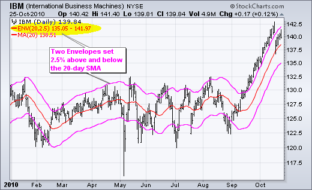
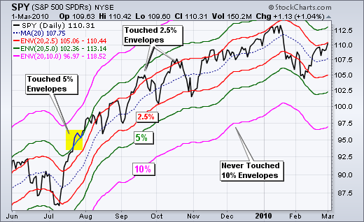
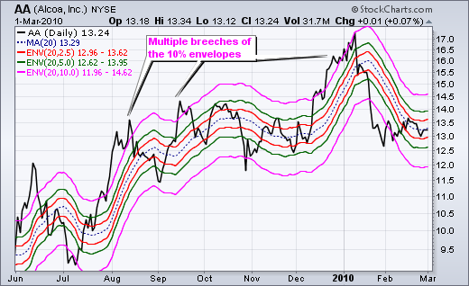
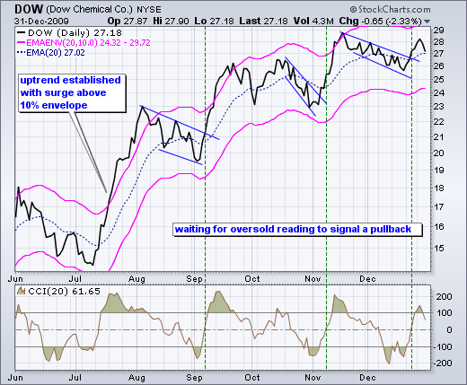
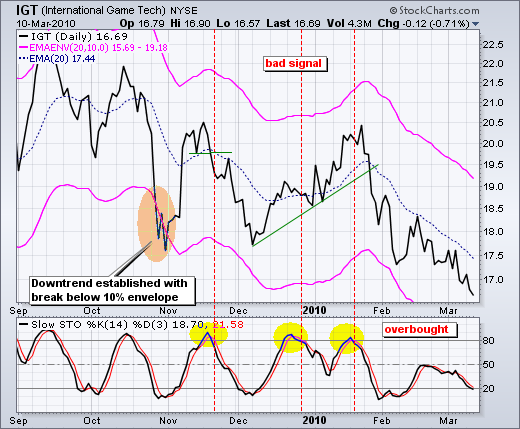
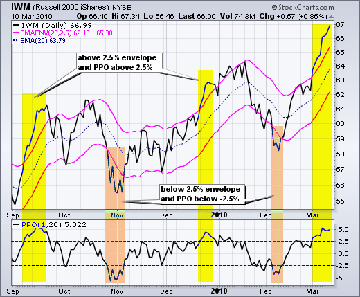
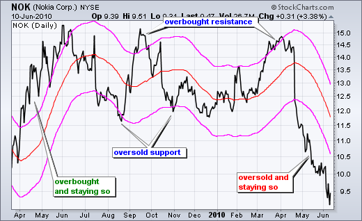
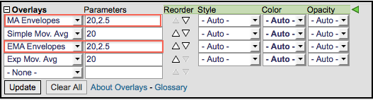

# 移动平均包络 [ChartSchool]

### 目录

+   移动平均包络

    +   介绍

    +   计算

    +   解释

    +   参数

    +   趋势识别

    +   类似于%价格振荡器

    +   超买/超卖

    +   结论

    +   与 SharpCharts 一起使用

    +   建议的扫描

        +   突破上包络后超卖

        +   突破下包络后超买

    +   进一步研究

## 介绍

移动平均包络是基于百分比的包络，设置在移动平均线的上方和下方。作为该指标基础的移动平均线可以是简单移动平均或指数移动平均。然后，每个包络都设置在移动平均线的相同百分比上方或下方。这样就形成了跟随价格走势的平行带。以移动平均线为基础，移动平均包络可以用作趋势跟踪指标。然而，该指标不仅限于趋势跟踪。当趋势相对平稳时，包络也可以用于识别超买和超卖水平。

## 计算

移动平均包络的计算方法很简单。首先，选择简单移动平均或指数移动平均。简单移动平均对每个数据点（价格）的权重相同。指数移动平均对最近的价格赋予更大的权重，滞后性更小。其次，选择移动平均的时间周期数。第三，设置包络的百分比。一个 20 天的移动平均线，带有 2.5%的包络，将显示以下两条线：

```py
Upper Envelope: 20-day SMA + (20-day SMA x .025)
Lower Envelope: 20-day SMA - (20-day SMA x .025)

```



上图显示了 IBM 的 20 天简单移动平均线和 2.5%的包络。请注意，20 天简单移动平均线被添加到此 SharpChart 中以供参考。请注意包络如何与 20 天简单移动平均线平行移动。它们始终保持在移动平均线的上方和下方的恒定 2.5%。

## 解释

基于通道、带和包络的指标旨在涵盖大部分价格走势。因此，突破包络上下方的走势值得关注。趋势往往始于某个方向的强劲走势。突破上包络显示出非凡的强势，而跌破下包络则显示出非凡的弱势。这种强劲走势可能预示着一种趋势的结束和另一种趋势的开始。

以移动平均线为基础，移动平均线包络是一种自然的趋势跟踪指标。与移动平均线一样，包络会滞后于价格走势。移动平均线的方向决定了通道的方向。一般来说，当通道向下移动时存在下降趋势，而当通道向上移动时存在上升趋势。当通道横向移动时，趋势是平的。

有时，在包络突破后，强劲的趋势并没有形成，价格进入交易区间。这种交易区间以相对平坦的移动平均线为特征。然后可以利用包络来识别超买和超卖水平以进行交易。突破上部包络表示超买情况，而突破下部包络表示超卖状态。

## 参数

移动平均线包络的参数取决于您的交易/投资目标以及所涉证券的特征。交易者可能会使用较短（更快）的移动平均线和相对紧密的包络。投资者可能更喜欢较长（更慢）的移动平均线和较宽的包络。

证券的波动性也会影响参数。布林带和凯尔特纳通道具有内置机制，可以自动调整到证券的波动性。布林带使用标准差来设置带宽。凯尔特纳通道使用真实波幅（ATR）来设置通道宽度。这些指标会根据波动性自动调整。图表分析师在设置移动平均线包络时必须独立考虑波动性。波动性较高的证券将需要更宽的带来包含大部分价格走势。波动性较低的证券可以使用较窄的带。



在选择正确的参数时，通常可以叠加几个不同的移动平均线包络并进行比较。上面的图表显示了基于 20 日 SMA 的三个移动平均线包络的标普 500 ETF。2.5%的包络（红色）被触及了多次，5%的包络（绿色）仅在 7 月的激增期间被触及。10%的包络（粉色）从未被触及，这意味着这个区间太宽。中期交易者可能会使用 5%的包络，而短期交易者可以使用 2.5%的包络。



股指和交易所交易基金需要更紧的信封线，因为它们通常比个别股票波动性小。阿尔科公司的图表与 SPY 图表具有相同的移动平均信封线。然而，注意到阿尔科公司多次突破了 10%的信封线，因为它更具波动性。

## 趋势识别

移动平均信封线可用于识别表明开始一个持续趋势的强劲动作。关键在于选择正确的参数。这需要练习、试错。下图显示了陶氏化学（DOW）的移动平均信封线（20,10）。使用收盘价是因为移动平均是用收盘价计算的。一些图表分析师更喜欢使用条形图或蜡烛图来利用日内的最高价和最低价。注意到 DOW 在七月中旬突破了上限信封线，并持续上涨直至八月初。这显示了非凡的强势。此外，注意到移动平均信封线上升并跟随上涨。股价从 14 涨至 23 后，显然是超买的。然而，这次上涨建立了一个强有力的先例，标志着一个持续趋势的开始。



道指在建立上升趋势后很快就变得超买，是时候等待一个可玩的回调了。交易者可以通过基本图表分析或指标寻找回调。回调通常以下降旗或楔形出现。道指在八月形成了一个完美的下降旗，并在九月突破了阻力。另一个旗帜在十月底形成，并在十一月突破。十一月的激增后，股票在五周的旗帜中回调至十二月。商品通道指数（CCI）显示在指标窗口中。低于-100 的移动显示超卖读数。当更大的趋势向上时，超卖读数可以用来识别回调，以改善交易的风险回报比。当 CCI 再次移回正区域（绿色虚线）时，动量再次变为看涨。

逆向逻辑可以应用于下降趋势。强劲的下穿下限信号表明了异常的弱势，可能预示着一个持续的下降趋势。下图显示了国际游戏科技（IGT）在 2009 年 10 月底突破了 10%的信封线，确立了一个下降趋势。由于这次急剧下跌后股票被卖空得相当厉害，等待反弹是明智的选择。然后我们可以使用基本价格分析或其他动量指标来识别反弹。



指标窗口显示了使用随机振荡器来识别超买反弹。超过 80 被视为超买。一旦超过 80，图表分析师可以寻找图表信号或回落至 80 以下以示拐点（红色虚线）。第一个信号得到了支撑线突破的确认。第二个信号导致了一个鞭挞（损失），因为股票几周后上涨到 20 以上。第三个信号通过趋势线突破得到了确认，导致了一个相当急剧的下跌。

## 与%价格振荡器类似

在继续讨论超买和超卖水平之前，值得指出的是移动平均包络线类似于百分比价格振荡器（PPO）。移动平均包络线告诉我们一个证券是否在某个特定移动平均线上方交易了一定百分比。PPO 显示了短期指数移动平均线和长期指数移动平均线之间的百分比差异。PPO(1,20)显示了 1 周期 EMA 和 20 周期 EMA 之间的百分比差异。1 天的 EMA 等于收盘价。20 周期指数移动平均线包络线反映了相同的信息。



上图显示了罗素 2000 ETF（IWM）与 PPO(1,20)和 2.5%指数移动平均包络线。在 PPO 上设置了 2.5%和-2.5%的水平线。请注意，当 PPO 上涨至 2.5%时（黄色阴影），价格会上涨至 2.5%包络线以上，当 PPO 下跌至-2.5%时（橙色阴影），价格会下跌至 2.5%包络线以下。PPO 是一个动量振荡器，可用于识别超买和超卖水平。通过延伸，移动平均包络线也可以用于识别超买和超卖水平。PPO 使用指数移动平均线，因此必须与使用 EMA 而不是 SMA 的移动平均包络线进行比较。

## 超买/超卖

测量超买和超卖条件是棘手的。证券可以在强劲的上升趋势中变得超买并保持超买。同样，证券可以在强劲的下降趋势中变得超卖并保持超卖。在强劲的上升趋势中，价格经常上涨至上包络线以上并继续上涨。事实上，随着价格继续上涨，上包络线也会上升。这可能在技术上看起来是超买的，但保持超买是一种强势的迹象。对于超卖也是如此。超买和超卖读数最好在趋势变平时使用。

诺基亚的图表包含了所有内容。粉色线代表移动平均包络线（50,10）。50 天简单移动平均线位于中间（红色）。包络线设置在这个移动平均线的上下各 10%。图表从一个超买水平开始，随着四月至五月间出现的强劲趋势而保持超买状态。从六月到四月，价格走势波动，这是超买和超卖水平的完美场景。九月和三月中旬的超买水平预示了逆转。同样，八月和十月底的超卖水平预示了上涨。图表以一个超卖状态结束，随着一个强劲的下跌趋势出现而保持超卖状态。



超买和超卖条件应作为进一步分析的警示。超买水平应通过图表阻力得到确认。图表分析师还可以寻找看跌模式，以加强超买水平的逆转潜力。同样，超卖水平应通过图表支撑得到确认。图表分析师还可以寻找看涨模式，以加强超卖水平的逆转潜力。

## 结论

移动平均包络线主要用作趋势跟踪指标，但也可用于识别超买和超卖条件。在一个整理期之后，强劲的包络线突破可以预示着一个延续趋势的开始。一旦确定了上升趋势，图表分析师可以转向动量指标和其他技术，以识别在该趋势内的超卖读数和回调。超买条件和反弹可以被用作在更大的下跌趋势中的卖出机会。在没有强劲趋势的情况下，移动平均包络线可以像百分比价格振荡器一样使用。突破上包络线的走势信号超买读数，而突破下包络线的走势信号超卖读数。重要的是结合技术分析的其他方面来确认超买和超卖读数。阻力和看跌逆转模式可用于证实超买读数。支撑和看涨逆转模式可用于确认超卖条件。

## 使用 SharpCharts

移动平均信封可以在 SharpCharts 中作为价格叠加显示。与移动平均一样，信封应该显示在价格图上方。在从下拉框中选择指标后，参数窗口中将显示默认设置（20,2.5）。“MA 信封”基于简单移动平均。“EMA 信封”基于指数移动平均。第一个数字（20）设置了移动平均的周期。第二个数字（2.5）设置了百分比偏移量。用户可以更改参数以适应其图表需求。相应的移动平均可以作为单独的叠加显示。[点击这里](http://stockcharts.com/h-sc/ui?s=SPY&p=D&st=2010-02-03&en=2010-10-09&id=p15714633106&listNum=30&a=211776022 "http://stockcharts.com/h-sc/ui?s=SPY&p=D&st=2010-02-03&en=2010-10-09&id=p15714633106&listNum=30&a=211776022") 查看实时示例。



## 建议扫描

### 突破上限信封后被过度推销

此扫描查找于二十天前突破其上限指数移动平均信封（50,10）的股票，以确认或建立上升趋势。当前的 10 周期 CCI 低于-100，表示短期超卖状态。

```py
[type = stock] AND [country = US] 
AND [Daily SMA(20,Daily Volume) > 40000] 
AND [Daily SMA(60,Daily Close) > 10] 

AND [20 days ago Daily Close > 20 days ago Daily Upper MA Env(50,10.0,Daily Close)] 
AND [Daily CCI(10) < -100]
```

### 突破下限信封后超买

此扫描查找于二十天前突破其下限指数移动平均信封（50,10）的股票，以确认或建立下降趋势。当前的 10 周期 CCI 高于+100，表示短期超买状态。

```py
[type = stock] AND [country = US] 
AND [Daily SMA(20,Daily Volume) > 40000] 
AND [Daily SMA(60,Daily Close) > 10] 

AND [20 days ago Daily Close < 20 days ago Daily Lower MA Env(50,10.0,Daily Close)] 
AND [Daily CCI(10) > 100]
```

有关用于移动平均信封扫描的扫描语法的更多详细信息，请参阅我们的[扫描指标参考](http://stockcharts.com/docs/doku.php?id=scans:indicators#moving_average_envelopes "http://stockcharts.com/docs/doku.php?id=scans:indicators#moving_average_envelopes") 在支持中心。

## 进一步研究

| **走势交易赚钱** 托马斯·卡尔 | **趋势跟随** 迈克尔·科维尔 |
| --- | --- |
|  |  |
|  |  |
