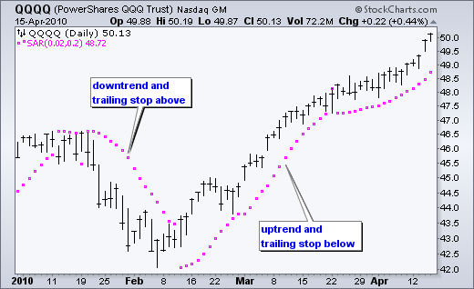
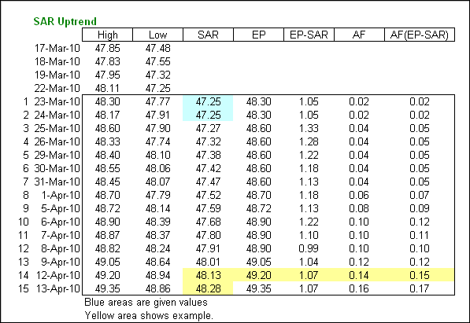
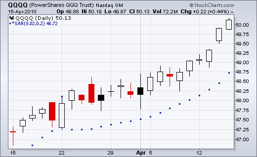
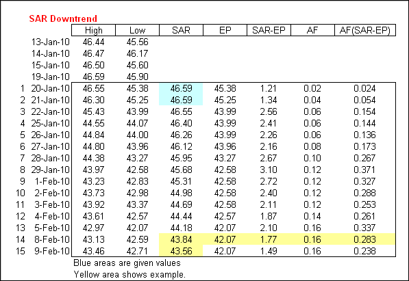
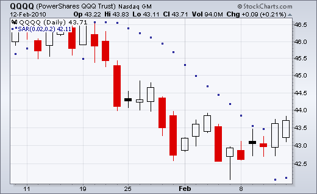
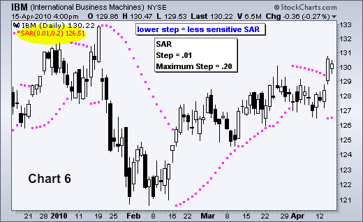
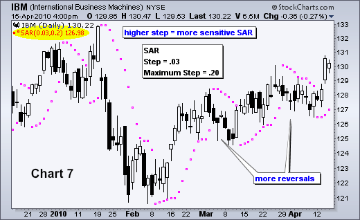
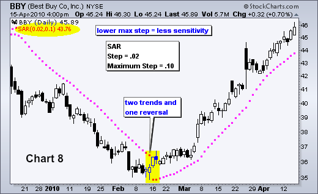
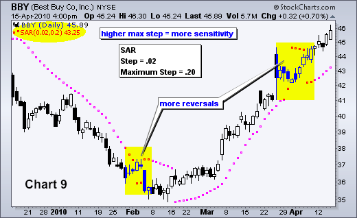
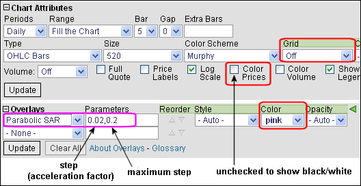

# 抛物线 SAR 

### 目录

+   抛物线 SAR

    +   介绍

    +   计算

    +   解释

    +   步进增量

    +   最大步长

    +   结论

    +   与 SharpCharts 一起使用

    +   建议扫描

        +   突破下降 SAR

        +   突破上升 SAR

    +   额外资源

        +   股票与商品杂志文章

## 介绍

抛物线 SAR 是由威尔斯·威尔德（Welles Wilder）开发的基于价格和时间的交易系统。威尔德称之为“抛物线时间/价格系统”。SAR 代表“停止和反转”，这是系统中实际使用的指标。**随着趋势随时间延伸，SAR 会跟踪价格。** 当价格上涨时，指标位于价格下方；当价格下跌时，指标位于价格上方。在这方面，当价格趋势发生逆转并突破指标时，指标会停止并反转。

威尔德（Wilder）在他的 1978 年著作《技术交易系统中的新概念》中介绍了抛物线时间/价格系统。这本书还包括 RSI、真实波幅（ATR）和方向运动概念（ADX）。尽管是在计算机时代之前开发的，但威尔德的指标经受住了时间的考验，仍然非常受欢迎。



## 计算

SAR 的计算涉及复杂的 if/then 变量，使其难以放入电子表格中。这些示例将提供 SAR 计算的一般概念。由于上升 SAR 和下降 SAR 的公式不同，因此更容易将计算分为两部分。第一部分涵盖上升 SAR 的计算，第二部分涵盖下降 SAR。

```py
Rising SAR
----------

Prior SAR: The SAR value for the previous period. 

Extreme Point (EP): The highest high of the current uptrend. 

Acceleration Factor (AF): Starting at .02, AF increases by .02 each time the extreme point makes a new high. AF can reach a maximum of .20, no matter how long the uptrend extends. 

Current SAR = Prior SAR + Prior AF(Prior EP - Prior SAR)
13-Apr-10 SAR = 48.28 = 48.13 + .14(49.20 - 48.13)

The Acceleration Factor is multiplied by the difference between the Extreme Point and the prior period's SAR. This is then added to the prior period's SAR. Note however that SAR can never be above the prior two periods' lows. Should SAR be above one of those lows, use the lowest of the two for SAR. 

```





```py
Falling SAR
-----------

Prior SAR: The SAR value for the previous period. 

Extreme Point (EP): The lowest low of the current downtrend. 

Acceleration Factor (AF): Starting at .02, AF increases by .02 each time the extreme point makes a new low. AF can reach a maximum of .20, no matter how long the downtrend extends. 

Current SAR = Prior SAR - Prior AF(Prior SAR - Prior EP)
9-Feb-10 SAR = 43.56 = 43.84 - .16(43.84 - 42.07)

The Acceleration Factor is multiplied by the difference between the Prior period's SAR and the Extreme Point. This is then subtracted from the prior period's SAR. Note however that SAR can never be below the prior two periods' highs. Should SAR be below one of those highs, use the highest of the two for SAR. 

```





## 解释

拟合停止与反转指标（SAR）跟随价格走势，可视为趋势跟踪指标。一旦下降趋势逆转并开始上升，SAR 就像一个移动止损一样跟随价格。只要上升趋势保持不变，止损就会不断上升。换句话说，在上升趋势中，SAR 永远不会下降，并且随着价格的上涨不断保护利润。该指标作为防止降低止损的一种保护措施。一旦价格停止上涨并在 SAR 之下反转，下降趋势开始，SAR 位于价格之上。SAR 会像移动止损一样跟随价格下降。只要下降趋势延续，止损就会不断下降。由于 SAR 在下降趋势中永远不会上升，它会不断保护空头头寸的利润。

## 步长增量

加速因子（AF），也称为步长，决定了 SAR 的灵敏度。SharpCharts 用户可以设置步长和最大步长。如电子表格示例所示，步长是影响 SAR 变化率的乘数。这就是为什么它被称为加速因子。步长随着趋势的延伸逐渐增加，直到达到最大值。**通过减小步长可以降低 SAR 的灵敏度**。较低的步长将 SAR 移动离价格更远，使得反转的可能性降低。

**通过增加步长可以增加 SAR 的灵敏度**。较高的步长将 SAR 移动靠近价格行动，使得反转更有可能发生。如果步长设置得太高，指标将经常反转。这将产生鞭挞并且无法捕捉趋势。图表 6 显示了 IBM 的 SAR（.01, .20）。步长为.01，最大步长为.20。图表 7 显示了具有更高步长（.03）的 IBM。在图表 7 中，SAR 更为敏感，因为有更多的反转。这是因为图表 7 中的步长（.03）高于图表 6 中的步长（.01）。





## 最大步长

该指标的灵敏度也可以通过最大步长进行调整。虽然最大步长可以影响灵敏度，但步长更为重要，因为它设置了随着趋势发展而增加的增量增长率。此外，请注意，增加步长可以确保在趋势发展时更快地达到最大步长。图表 8 显示了百思买（BBY）的最大步长（.10），低于默认设置（.20）。这种较低的最大步长降低了指标的灵敏度，并产生了较少的反转。请注意，此设置捕捉到了为期两个月的下降趋势和随后为期两个月的上升趋势。图表 9 显示了具有较高最大步长（.20）的 BBY。这个更高的数值在二月初和四月初产生了额外的反转。





## 结论

抛物线 SAR 在趋势证券中效果最佳，根据 Wilder 的估计，这种情况大约发生 30%的时间。这意味着指标将在 50%以上的时间或证券不处于趋势时容易出现鞭挞。毕竟，SAR 旨在捕捉趋势并像追踪止损一样跟随。与大多数指标一样，信号质量取决于设置和基础证券的特性。正确的设置结合良好的趋势可以产生出色的交易系统。错误的设置将导致鞭挞、损失和沮丧。没有黄金法则或一刀切的设置。每个证券都应根据其自身特性进行评估。抛物线 SAR 还应与其他指标和技术分析技术结合使用。例如，可以使用 Wilder 的平均趋向指数来估计趋势的强度，然后再考虑信号。

## 与 SharpCharts 一起使用

抛物线 SAR 可以在 SharpCharts 中作为叠加显示。默认参数为步长为 0.02，最大步长为 0.20。如上所示，这些参数可以根据个别证券的特性进行更改。下面的示例显示了指标为粉色，价格为黑色/白色，图表网格已移除。这种对比使得更容易将指标与基础证券的价格走势进行比较。点击[这里](http://stockcharts.com/h-sc/ui?s=$SPX&p=D&b=5&g=0&id=p25997070229&listNum=30&a=202528465 "http://stockcharts.com/h-sc/ui?s=$SPX&p=D&b=5&g=0&id=p25997070229&listNum=30&a=202528465")查看抛物线 SAR 的实时示例。




## 建议扫描

### 突破下跌的 SAR

此扫描从过去三个月内平均价格为$10 或更高且平均成交量大于 40,000 的股票开始。然后，该扫描筛选出具有看涨 SAR 反转（抛物线 SAR（0.01，0.20））的股票。此扫描仅作为进一步细化的起点。

```py
[type = stock] AND [country = US] 
AND [Daily SMA(20,Daily Volume) > 40000] 
AND [Daily SMA(60,Daily Close) > 10] 

AND [Yesterday's Daily High < Yesterday's Daily Parabolic SAR(0.01,0.2)] 
AND [Daily High > Daily Parabolic SAR(0.01,0.2)]
```

### 突破上升的 SAR

这个扫描从过去三个月平均价格大于$10 且平均交易量大于 40,000 的股票开始。然后过滤出具有熊市 SAR 反转（抛物线 SAR (.01,.20)）的股票。这个扫描只是作为进一步细化的起点。

```py
[type = stock] AND [country = US] 
AND [Daily SMA(20,Daily Volume) > 40000] 
AND [Daily SMA(60,Daily Close) > 10] 

AND [Yesterday's Daily Low > Yesterday's Daily Parabolic SAR(0.01,0.2)] 
AND [Daily Low < Daily Parabolic SAR(0.01,0.2)]
```

欲了解更多有关抛物线 SAR 扫描语法的详细信息，请参阅我们的[扫描指标参考](http://stockcharts.com/docs/doku.php?id=scans:indicators#parabolic_stop_and_reverse_parabolic_sar "http://stockcharts.com/docs/doku.php?id=scans:indicators#parabolic_stop_and_reverse_parabolic_sar")在支持中心。

* * *

## 附加资源

### 股票与商品杂志文章

**[Hartle 的抛物线交易系统](http://stockcharts.com/h-mem/tascredirect.html?artid=\V11\C11\THEPARA.pdf "http://stockcharts.com/h-mem/tascredirect.html?artid=\V11\C11\THEPARA.pdf")**

十月 1993

**[Sweeney 的抛物线](http://stockcharts.com/h-mem/tascredirect.html?artid=\V15\C07\PARABOL.pdf "http://stockcharts.com/h-mem/tascredirect.html?artid=\V15\C07\PARABOL.pdf")**

六月 1997
