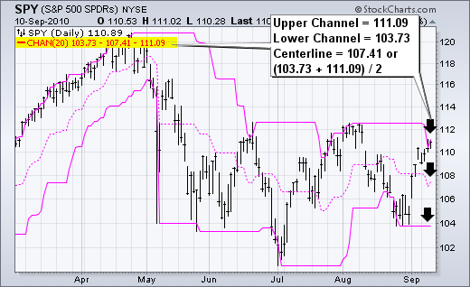
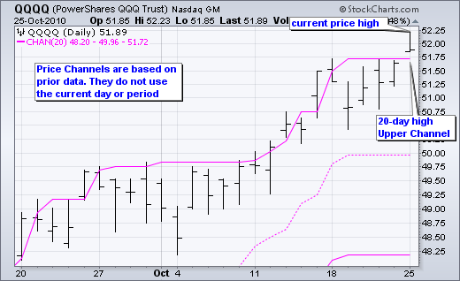
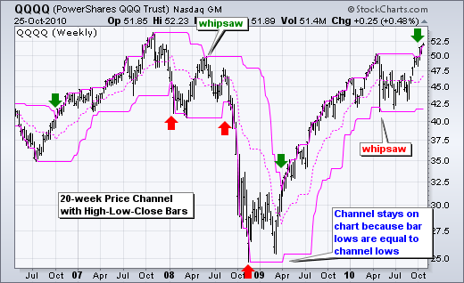
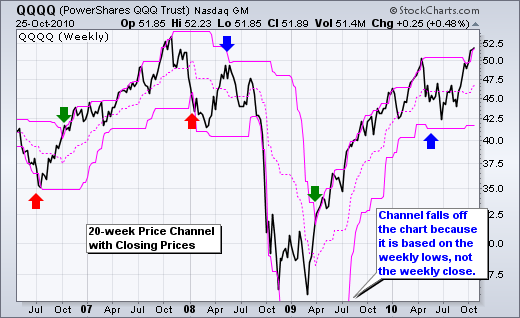
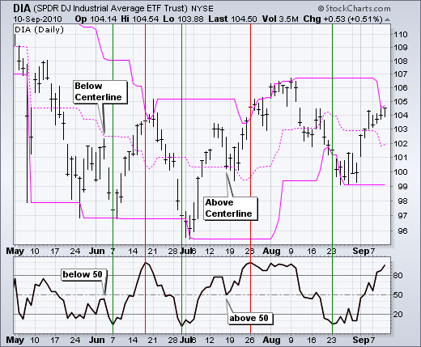
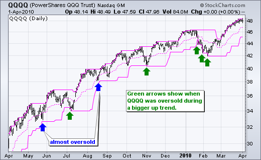
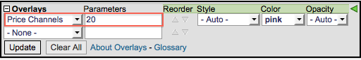

# 价格通道 

### 目录表

+   价格通道

    +   介绍

    +   计算

    +   解释

    +   趋势识别

    +   类似于随机指标

    +   超买/超卖

    +   结论

    +   与 SharpCharts 一起使用

    +   建议扫描

        +   更大上升趋势中的超卖反弹

        +   更大下降趋势中的超买下跌

    +   进一步研究

## 介绍

价格通道是设定在证券价格上下的线。上通道设定在 x 期高点，下通道设定在 x 期低点。对于一个 20 天的价格通道，上通道将等于 20 天的高点，下通道将等于 20 天的低点。虚线中心线是两个通道线之间的中点。价格通道可用于识别信号上升的上升趋势的开始或信号下降的下降趋势的开始。价格通道还可用于识别更大的下降趋势或上升趋势中的超买或超卖水平。

## 计算

```py
Upper Channel Line: 20-day high
Lower Channel Line: 20-day low
Centerline: (20-day high + 20-day low)/2 

```



上述公式基于日线图和 20 周期价格通道，这是 SharpCharts 中的默认设置。价格通道可用于分钟线、日线、周线或月线图表。回溯期（20）可以更短或更长。较短的回溯期，如 10 天，产生更紧密的通道线。较长的回溯期产生更宽的通道。

价格通道公式不包括最近的周期。价格通道是基于当前周期之前的价格。10 月 21 日的 20 天价格通道将基于前一天 10 月 20 日的 20 天高点和 20 天低点。如果使用最近的周期，通道突破将不可能发生。在下面的图表中，请注意价格如何突破了上方价格通道，因为高点是基于倒数第二根柱子，而不是当前柱子。



## 解释

价格通道可用于识别趋势反转或超买/超卖水平，表明在更大趋势中出现回调。突破上通道线显示出非凡的力量，可能预示着上升趋势的开始。相反，跌破下通道线显示出严重的弱势，可能预示着下降趋势的开始。一旦上升趋势开始，图表分析师可以转向更短的时间框架，以识别带有超卖读数的回调。跌破下通道线表明超卖条件，可能预示着回调的结束。同样，大趋势中的短期反弹可以通过价格通道来识别。突破上通道线信号超买条件，可能预示着反弹的结束。

## 趋势识别

价格通道可用于识别可能导致持久趋势反转的强劲走势。基本上，突破 20 日价格通道信号新的 20 日高点。突破 20 周价格通道信号新的 20 周高点。显然，20 周高点比 20 日高点更重要。时间框架的选择取决于您的交易时间框架和使用价格通道的理由。例如，图表分析师可以使用带有 20 周价格通道的周线图来确定大趋势和整体交易偏好。

上图显示了纳斯达克 100 ETF（QQQQ）在 4 年半时期的周价格。绿色箭头标记了突破上通道线的周高点，预示着上升趋势的开始。红色箭头标记了突破下通道线的周低点，预示着下降趋势的开始。这些通道突破捕捉到了一些良好的趋势，但也有两次误导性信号。指标信号并非完美，会有误导性信号。这只是游戏的一部分。



信号可以通过使用仅收盘线图进一步过滤。第二张图显示了相同的 4 年半时期，使用 20 周价格通道和 QQQQ 作为仅收盘线图。这消除了周内的高点和低点。请注意，QQQQ 在 2008 年 5 月没有收于上通道线上方，也没有在 2010 年 5 月收于下通道线下方（蓝色箭头）。使用仅收盘价格图表可以减少波动性并提供信号。



## 与随机指标类似

当考虑随机振荡器所测量的内容时，价格通道类似于随机振荡器。 这种动量振荡器测量收盘价相对于一定时间内的高低范围的水平，比如 20 天。 当收盘价接近其 20 天范围的高端时，随机振荡器相对较高；当随机振荡器接近此范围的低端时，它相对较低。 换算成数字，当随机振荡器高于 80 时，相对较高；当低于 20 时，相对较低。

让我们将 20 天快速随机振荡器与 20 天价格通道进行比较。 当价格超过上价格通道时，随机振荡器通常会高于 80。 同样，当价格低于下价格通道时，20 天快速随机振荡器通常会低于 20。 由于价格通道数据以前一期结束，因此存在轻微的时间差。 另一方面，随机振荡器数据以当前期结束。 这意味着随机振荡器包括最新的价格走势，但价格通道不包括。 尽管如此，这两者基本上测量的是相同的内容。



道琼斯工业指数 SPDR（DIA）图表显示了 20 天价格通道（粉色）和 20 天快速随机振荡器。 当随机振荡器超买时（红线），价格接近上通道线。 当随机振荡器超卖时（绿线），价格接近下通道线。 当随机振荡器低于 50 时，价格通常在价格通道的中心线以下（6 月初）。 当随机振荡器高于 50 时，价格通常在中心线以上。

## 超买/超卖

使用价格通道来衡量超买和超卖条件可能有些棘手。 在强劲的上升趋势中，证券可能会超买并保持超买。 同样，在强劲的下降趋势中，证券可能会超卖并保持超卖。 在强劲的上升趋势中，价格可能会上涨到上通道线以上并继续上涨。 实际上，随着价格继续上涨，上通道趋势线也会上升。 这可能在技术上看起来是超买的，但保持超买是一种力量的表现。 同样，随机振荡器可能会上升到 80 以上，这在技术上是超买的，并保持超买一段时间。

成功使用超买和超卖水平取决于成功识别趋势。一旦较大的上升趋势被确认，交易者可以在较小的趋势中寻找超卖水平。短期超卉水平出现在较大的上升趋势中的回调之后。如上所述，当 QQQQ 飙升至上通道线以上时，周线图变得看涨。一旦周线图看涨，交易者可以转向每日图表寻找超卖信号。周线图代表较大的趋势。每日图表代表较小的趋势。



上图显示了 QQQQ 的每日价格。更大的趋势（周线图）是上涨的，因此我们会在每日图表上寻找回调。绿色箭头显示了 QQQQ 何时跌破了 20 日价格通道。在 7 月初和 11 月初有两个良好的信号。在 1 月至 2 月期间有三次接触。前两个信号是“早期”的，而 2 月的信号是直接命中。

在下降趋势中可以应用反向逻辑。周线下降趋势始于跌破下通道线。一旦建立了这种下降趋势，图表分析师可以转向每日图表寻找超买信号。超买信号出现在较大的下降趋势中的反弹之后。下降趋势往往比上升趋势快。这意味着在强劲或快速的下降趋势中可能不会出现超买读数。图表分析师可能需要调整价格通道设置或使用中线来获取信号。价格更有可能触及中线而不是上通道线。

## 结论

**价格通道告诉我们一个证券何时达到 xx 期高点或 xx 期低点。** 20 日价格通道标记了 20 日的高低范围，10 周价格通道标记了 10 周的高低范围。中线标记了中点。持续超过上通道线的证券显示出强势。毕竟，要形成更高的高点需要强劲的买盘压力。相反，持续跌破下通道线的证券显示出弱势。较低的低点表明有强劲的卖盘压力。使用价格通道，图表分析师可以确定主导力量，买盘压力或卖盘压力。与所有指标一样，重要的是使用其他分析技术来确认或反驳价格通道。图表分析师可以使用图表模式、指标或基本图表分析来补充价格通道。

## 使用 SharpCharts

价格通道可以在 SharpCharts 中作为价格叠加显示，并应显示在价格图表的顶部。在从下拉框中选择指标后，参数窗口中将显示默认设置（20）。用户可以更改参数以适应其图表需求。较短的回顾期将缩小通道。较长的回顾期将扩大通道。[点击这里](http://stockcharts.com/h-sc/ui?s=SPY&p=D&yr=0&mn=6&dy=0&id=p40145316764&listNum=30&a=212191178 "http://stockcharts.com/h-sc/ui?s=SPY&p=D&yr=0&mn=6&dy=0&id=p40145316764&listNum=30&a=212191178") 查看实时示例。



## 建议的扫描

### 大型上升趋势中的超卖反弹

这个扫描从平均每股$20 和每日成交量 10 万股的股票开始。由于股票交易在其 200 日简单移动平均线上方，所以存在上升趋势。股票在移动到下限价格通道以下后变得超卖，然后在再次交叉上限价格通道以上后转向上。

```py
[type = stock] AND [country = US] 
AND [Daily SMA(20,Daily Volume) > 100000] 
AND [Daily SMA(60,Daily Close) > 20] 

AND [Daily Close > Daily SMA(200,Daily Close)] 
AND [Daily Close crosses Daily Lower Price Chan(20)] 
AND [Daily Close > Yesterday's Daily Close]
```

### 大型下降趋势中的超买下跌

这个扫描从平均每股$20 和每日成交量 10 万股的股票开始。由于股票交易在其 200 日简单移动平均线下方，所以存在下降趋势。股票在移动到上限价格通道以上后变得超买，然后在再次交叉下限价格通道以下后转向下。

```py
[type = stock] AND [country = US] 
AND [Daily SMA(20,Daily Volume) > 100000] 
AND [Daily SMA(60,Daily Close) > 20] 

AND [Daily Close < Daily SMA(200,Daily Close)] 
AND [Daily Upper Price Chan(20) crosses Daily Close] 
AND [Daily Close < Yesterday's Daily Close]
```

有关用于价格通道扫描的语法的更多详细信息，请参阅我们支持中心的[扫描指标参考](http://stockcharts.com/docs/doku.php?id=scans:indicators#price_channels "http://stockcharts.com/docs/doku.php?id=scans:indicators#price_channels")。

## 进一步学习

尽管《趋势交易致富》中没有专门使用价格通道，但它向交易者展示如何朝着基础趋势方向交易。这本实用书还将向读者展示如何从中配置看涨和看跌观察列表，以设置您的入场和出场价格

迈克尔·科维尔的书介绍了各种趋势跟踪系统的基本概念和技术，包括一种由海龟闻名的系统。科维尔展示了为什么市场价格包含所有可用信息。读者将学会如何解释价格波动并从趋势跟踪中获利。

| **趋势交易致富** 托马斯·卡尔 | **趋势跟踪** 迈克尔·科维尔 |
| --- | --- |
|  |  |
|  |  |
