# 成交量价格 [ChartSchool]

### 目录

+   成交量价格

    +   介绍

    +   计算

    +   解释

    +   细微差别

    +   识别支撑

    +   识别阻力

    +   支撑突破

    +   阻力突破

    +   结论

    +   与 SharpCharts 一起使用

## 介绍

成交量价格是一个指标，显示了特定价格范围的成交量，这是基于收盘价格的。成交量价格条是水平的，并显示在图表的左侧，以对应这些价格范围。图表分析师可以将这些条形图视为单一颜色或两种颜色，以区分上涨成交量和下跌成交量。通过结合成交量和收盘价格，这个指标可以用于识别高成交量价格范围，以标记支撑或阻力。StockCharts 默认显示十二个成交量价格条，但用户可以增加或减少这个数字以适应他们的偏好。

## 计算

成交量价格计算基于图表上显示的整个时期。五个月日线图上的成交量价格是基于**所有**五个月的每日收盘数据。两周 30 分钟图上的成交量价格是基于两周的 30 分钟收盘数据。三年周线图上的成交量价格是基于三年的每周收盘数据。你明白了吧。成交量价格计算不会超出图表显示的历史数据范围。

```py
There are four steps involved in the calculation. 
This example is based on closing prices and the default parameter setting (12). 

  1\. Find the high-low range for closing prices for the entire period.  
  2\. Divide this range by 12 to create 12 equal price zones.
  3\. Total the amount of volume traded within each price zone.  
  4\. Divide the volume into up volume and down volume (optional). 

```

请注意，当收盘价格从一个周期下跌到下一个周期时，成交量为负。当收盘价格从一个周期上涨到下一个周期时，成交量为正。

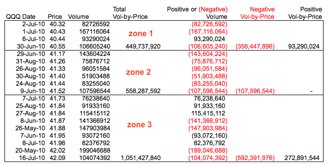

上面的示例显示了从 2010 年 4 月 12 日到 9 月 15 日对纳斯达克 100ETF 进行的成交量价格计算。在此期间，收盘价格范围从 40.32 到 47.87（47.87 - 40.32 = 7.55）。一百一十个收盘价格（每个交易日一个）从低到高排序，然后分成 12 个均匀的价格区间（7.55/12 = .6292）。

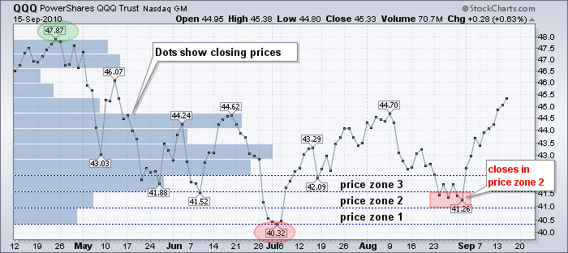

上图突出显示了前三个价格区间（40.32 至 40.95，40.96 至 41.58 和 41.59 至 42.21）。从低点（40.32）开始，我们可以添加区间大小（.6292）以创建导致高点的价格区间。只有落在这些区间内的价格才用于特定的成交量价格计算。

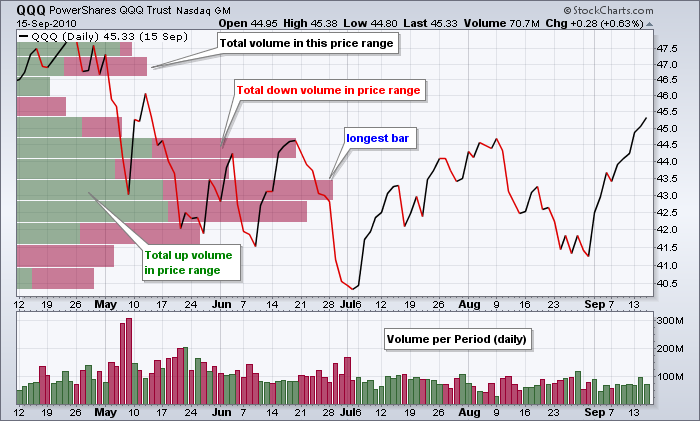

成交量价格条代表每个价格区间的总成交量。成交量可以分为正成交量和负成交量。请注意上图中的成交量价格条是红色和绿色的，以区分正成交量和负成交量。

## 解释

体积价格法（Volume-by-Price）可用于确定当前的支撑和阻力水平，以及估计未来的支撑和阻力水平。具有大量交易量的价格区域反映了高水平的兴趣，这可能影响未来的供应或需求（即阻力或支撑）。价格下方的长体积价格条应被视为回调期间的潜在支撑。同样，价格上方的长体积价格条应被视为反弹时的潜在阻力。

价格突破长体积价格条上方或下方也可用作信号。突破长条上方显示出力量，因为需求足够强大，能够克服供应过剩。同样，突破长条下方显示出弱势，因为供应充足到足以压倒需求。

## 细微差别

在看一些示例之前，了解体积价格法的工作原理是很重要的。体积价格法可用于确定当前的支撑或阻力。当前的条形图**不应用于验证过去的支撑或阻力水平**，因为该指标基于图表上显示的所有价格-交易量数据。这意味着对于从一月到六月的图表，有六个月的数据。条形图可能看起来在三月识别出支撑，但请记住，指标数据远远超出三月，因为图表在六月结束。

图表分析师还应了解，大的间隙可能会产生等于零的条。这是有道理的，因为当特定价格区域内没有收盘价格时，体积价格等于零。

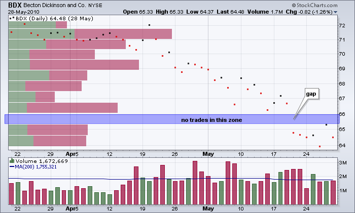

## 识别支撑

Netflix（NFLX）的图表显示体积价格法在六月底识别出 95-100 附近的支撑。请注意，这是最长的条。此外，请注意 NFLX 正在开始回调，因此我们可以使用体积价格法来估计近期的支撑。第二张图显示了 NFLX 的图表，黄色区域标记了第一张图中的体积价格支撑。预计 95-100 区域会有支撑，并且股票在七月底在此处扭转。请注意，八月份的交易量激增，以验证从支撑处的扭转。

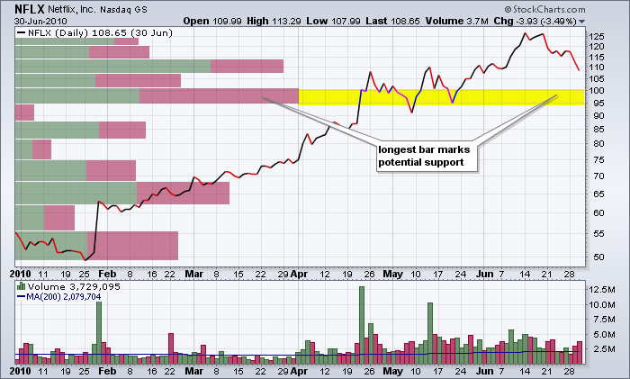

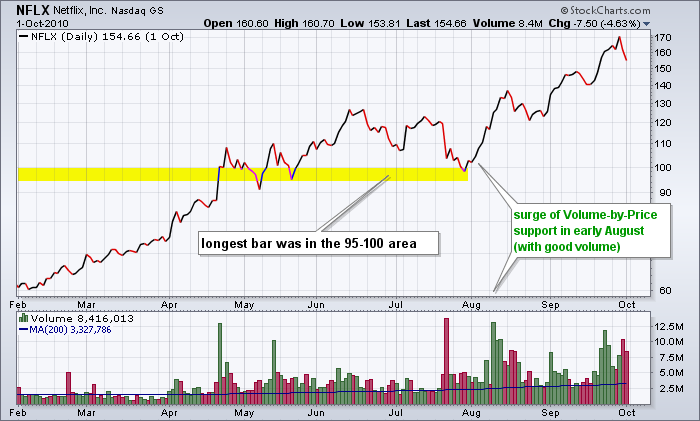

## 识别阻力

TE Connectivity（TEL）的图表显示体积价格法在八月初识别出 26-26.5 附近的阻力。请记住，四月份突破此条并不真正是突破，因为当前的体积价格计算从一月延伸到八月初。第二长的条标记了 26-26.5 区域的当前阻力。TEL 正处于决定性时刻，价格接近阻力。第二张图显示了第一张图中的体积价格阻力以及在阻力处的最终失败。

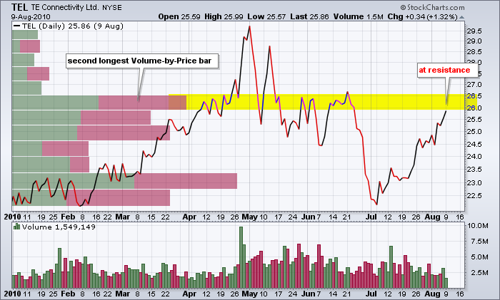

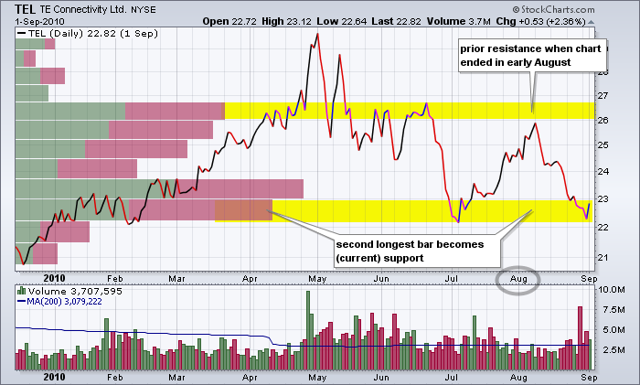

## 支撑突破

突破长期成交量价格条下方表明供应增加或卖压增加，可能预示着价格下跌。价格下方的长条显示了感兴趣区域和潜在支撑。突破这一支撑区域表明卖压显著增加，随后预计价格将下跌。

三星（SNDK）图表显示了一个长的成交量价格条，标志着 8 月中旬 39-43 区域的支撑。此外，请注意，股票至少在 7 月初至 8 月中旬之间围绕 42 形成了至少三个反应低点。这个支撑（需求）区域清晰可见。第二张图显示 SNDK 突破了先前确定的成交量价格支撑区域，并伴有高成交量。需求崩溃，供应占据上风，价格急剧下跌。

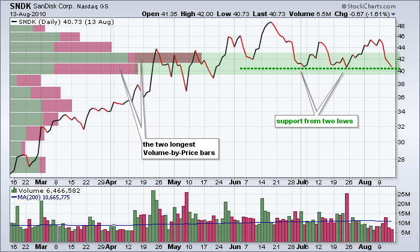

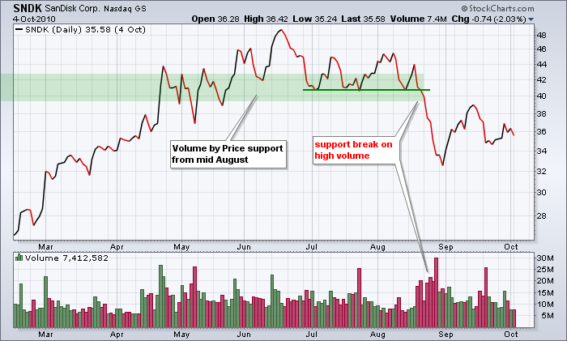

## 突破阻力

突破长期成交量价格条的暂停表明需求增加，可能预示着价格上涨。价格上方的长条标志着供应过剩，需求无法克服。突破这一阻力区域表明需求增强，预计价格将上涨。

有时，图表分析师需要结合价格行为和成交量价格来确定支撑区域和阻力区域。麦当劳（MCD）图表显示了一个长条，标志着 60 至 61 之间的头顶供应。股票还在 61 至 62 之间遇到阻力，4 月底和 6 月中旬的反应高点。至于支撑，第二和第三长的条形图标记了 57.5-58.5 区域的潜在需求，股票接近 5 月底的低点。总体而言，随着 MCD 试图保持在 5 月底的低点之上，价格图表上可能正在形成一个大型对称三角形。第二张图显示 MCD 在 7 月突破阻力，并在 8 月大幅上涨至新高。

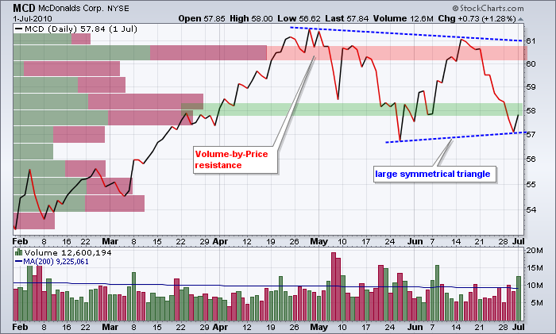

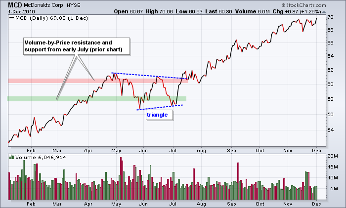

## 结论

Volume-by-Price 最适合用于识别当前或未来的支撑和阻力。当价格高于长柱时，指标标记潜在支撑，当价格低于长柱时，标记潜在阻力。图表分析师可以通过查看 Volume-by-Price 柱内的正（绿色）和负（红色）成交量来增强其分析。长绿色部分反映了更多需求，可以进一步验证支撑。长红色部分反映了更多供应，可以进一步验证阻力。重要的是要用其他指标和分析技术确认 Volume-by-Price 的发现。动量振荡器 和 图表形态 是这种基于成交量的指标的良好补充。

## 使用 SharpCharts

Volume-by-Price 可以在 SharpCharts 的“overlays”部分找到。参数框为空，这意味着使用默认值（12 个周期）。图表分析师可以根据所需的详细程度增加或减少默认设置。请记住，Volume-by-Price 是基于收盘价的，这意味着高点和低点不包括在内。这就是为什么图表分析师有时可能会看到一个没有 Volume-by-Price 柱的高点或低点。当“color volume”框未被选中时，Volume-by-Price 是单色的，当选中此框时是双色的。图表分析师还可以使用高级指标设置来设置不透明度。下面的示例显示了苹果公司的 20 根 Volume-by-Price 柱，彩色成交量和 0.3 的不透明度。[点击这里](http://stockcharts.com/h-sc/ui?s=AAPL&p=D&yr=0&mn=6&dy=0&id=p03412996346&listNum=30&a=209159944 "http://stockcharts.com/h-sc/ui?s=AAPL&p=D&yr=0&mn=6&dy=0&id=p03412996346&listNum=30&a=209159944") 查看实时示例。

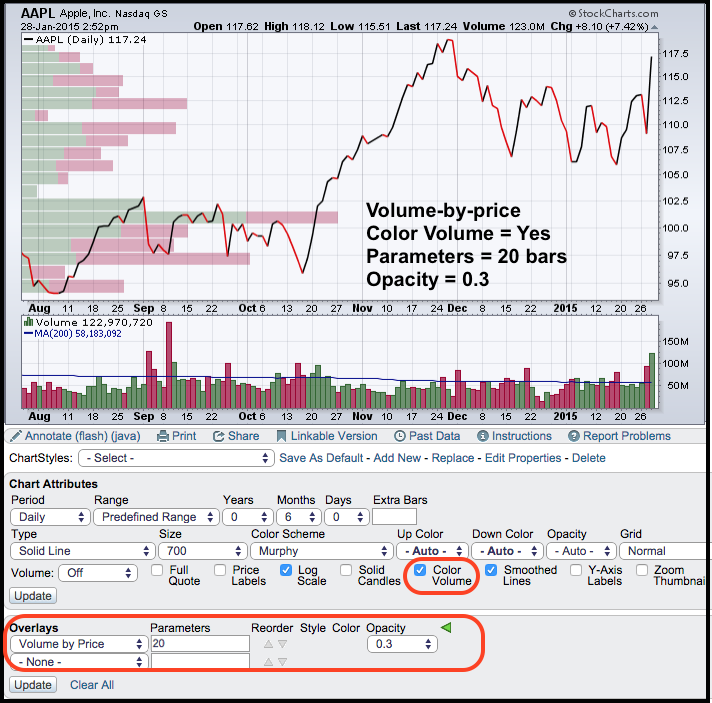
