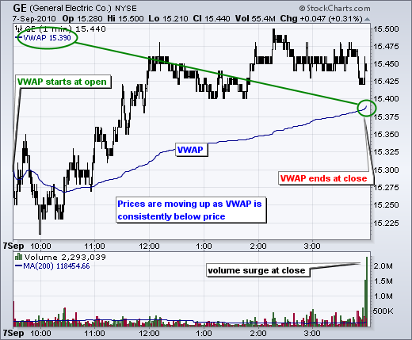
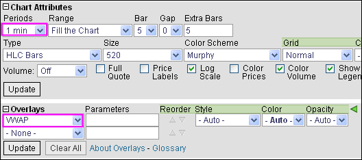

# 成交量加权平均价格（VWAP）[ChartSchool]

### 目录

+   成交量加权平均价格（VWAP）

    +   介绍

    +   Tick 与 Minute

    +   计算

    +   特点

    +   VWAP 的用途

    +   结论

    +   与 SharpCharts 一起使用

## 介绍

成交量加权平均价格（VWAP）就是字面意思：**按成交量加权的平均价格**。VWAP 等于所有交易周期的美元价值除以当天的总交易量。计算从交易开盘开始，到交易收盘结束。因为它仅适用于当天的交易，所以计算中使用了日内周期和数据。

## Tick 与 Minute

传统 VWAP 基于 tick 数据。可以想象，在一天的每一分钟内都会有许多 tick（交易）。在活跃时间段内活跃的证券每分钟可以有 20-30 个 tick。在典型股票交易日的 390 分钟内，许多股票每天的 tick 数量远远超过 5000。每天有超过 5000 只股票交易，这些 tick 开始呈指数增长。不用说，tick 数据非常耗费资源。


与基于 tick 数据的 VWAP 不同，StockCharts.com 提供基于日内周期（1、5、10、15、30 或 60 分钟）的日内 VWAP。请注意，由于计算的性质（见下文），VWAP 在日常、周常或月常周期中没有定义。

## 计算

VWAP 计算涉及五个步骤。首先，计算日内周期的典型价格。这是高、低和收盘价的平均值：{(H+L+C)/3)}。其次，将典型价格乘以周期的成交量。第三，创建这些值的累积总和。这也被称为累积总和。第四，创建成交量的累积总和（累积成交量）。第五，将价格-成交量的累积总和除以成交量的累积总和。

```py
Cumulative(Volume x Typical Price)/Cumulative(Volume)

```


上面的示例显示了 IBM 交易的前 30 分钟的 1 分钟 VWAP。通过将累积价格-成交量除以累积成交量，产生一个根据成交量调整（加权）的价格水平。第一个 VWAP 值始终是典型价格，因为分子和分母中的成交量相等。它们在第一次计算中互相抵消。下图显示了 IBM 的 1 分钟 K 线图和 VWAP。在交易的前 30 分钟内，价格从最高的 127.36 到最低的 126.67。实际上，前 30 分钟非常波动。VWAP 的范围从 127.21 到 127.09，并且大部分时间处于这个范围的中间。


## 特点

像移动平均一样，VWAP 滞后于价格，因为它是基于过去数据的平均值。数据越多，滞后越大。到下午 3:00，一只股票已经交易了约 331 分钟。作为一个累积“平均”，这个指标类似于一个 330 周期的移动平均。这是很多过去的数据。一天结束时的 1 分钟 VWAP 值通常与 390 分钟移动平均的结束值非常接近。这两个移动平均都是基于当天的 1 分钟柱状图。在收盘时，两者都是基于 390 分钟的数据（一整天）。然而，在白天无法将 390 分钟移动平均与 VWAP 进行比较。中午 12:00 的 390 分钟移动平均将包含前一天的数据。而 VWAP 不会。请记住，VWAP 的计算从开盘开始，到收盘结束。到中午 12:00 已经过去了 150 分钟的交易时间。因此，中午 12:00 的 VWAP 需要与 150 分钟移动平均进行比较。


尽管存在滞后，图表分析师可以将 VWAP 与当前价格进行比较，以确定日内价格的大致方向。它类似于移动平均。一般来说，当价格低于 VWAP 时，日内价格下跌，当价格高于 VWAP 时，日内价格上涨。当价格在一天内处于区间时，VWAP 将落在当天的高低范围之间。接下来的三个图表展示了 VWAP 上升、下降和持平的示例。

  

## VWAP 的用途

VWAP 用于识别流动性点。作为一个以成交量加权的价格衡量标准，VWAP 反映了以成交量加权的价格水平。这可以帮助有大额订单的机构。其理念是在输入大额买入或卖出订单时不要扰乱市场。VWAP 帮助这些机构在非常短的时间内确定特定证券的流动和非流动价格点。

VWAP 也可以用于衡量交易效率。在买入或卖出证券后，机构或个人可以将其价格与 VWAP 值进行比较。在 VWAP 值以下执行的买入订单将被视为良好的成交，因为证券是以低于平均价格购买的。相反，在 VWAP 以上执行的卖出订单将被视为良好的成交，因为它是以高于平均价格出售的。

## 结论

VWAP 作为一天价格的参考点。因此，它最适合**盘中分析**。图表分析师可以将当前价格与 VWAP 值进行比较，以确定盘中趋势。VWAP 还可以用于确定相对价值。低于 VWAP 值的价格在当天或特定时间相对较低。高于 VWAP 值的价格在当天或特定时间相对较高。**请记住，VWAP 是一个累积指标，这意味着数据点数量在一天内逐渐增加。**在 1 分钟图表上，IBM 在上午 11:00 将有 90 个数据点（分钟），下午 1:00 将有 210 个数据点，收盘时将有 390 个数据点。随着一天的延长，数据点数量急剧增加。这就是为什么 VWAP 滞后于价格，而这种滞后随着一天的延长而增加。

## 使用 SharpCharts

成交量加权平均价格（VWAP）可以作为 Sharpcharts 上的“叠加”指标绘制。输入证券代码后，选择“盘中”时段和“范围”。这可以是 1 天或“填充图表”。寻找更多细节的图表分析师可以选择“填充图表”。寻找一般水平的图表分析师可以选择 1 天。VWAP 可以绘制超过一天，但随着新的计算周期开始，指标将从其先前的收盘价跳至下一个开盘价的典型价格。此外，请注意 VWAP 值有时可能会脱离价格图表。价格范围从 45.8 到 47 的图表上将显示 45.5 的 VWAP。图表分析师有时需要将范围扩展到整天才能在图表上看到 VWAP。VWAP 值始终显示在图表的左上角。点击下面的图表查看实时示例。



