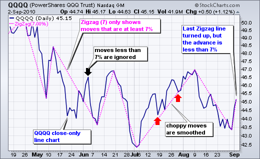
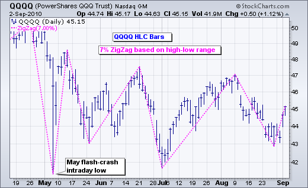
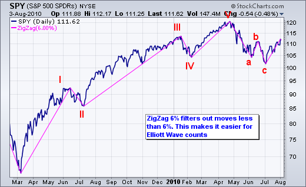
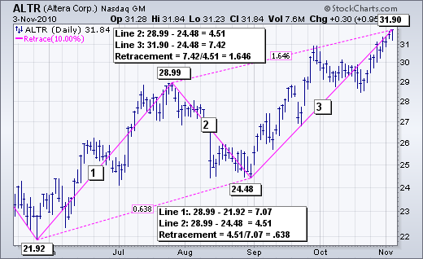
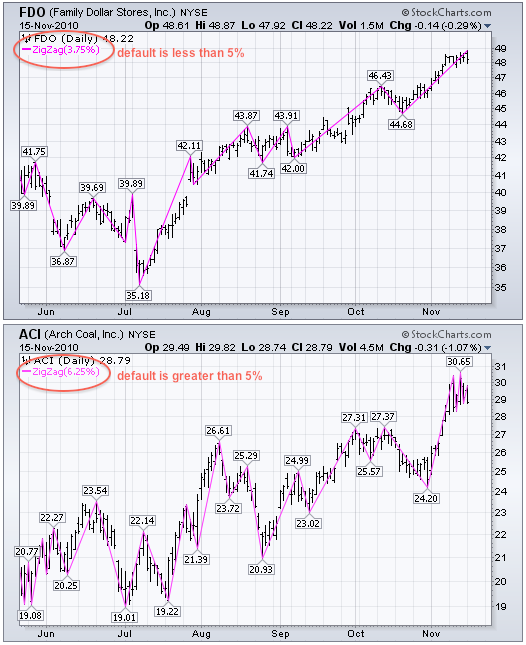
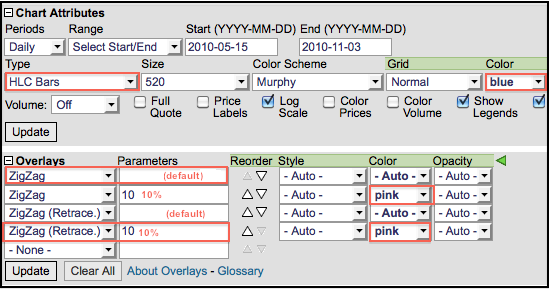
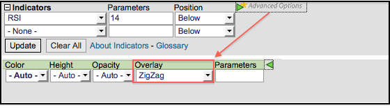

# ZigZag [ChartSchool]

### 目录

+   ZigZag

    +   简介

    +   计算

    +   艾略特波动计数

    +   回撤和投影

    +   结论

    +   与 SharpCharts 一起使用

    +   进一步研究

## 简介

SharpCharts 上的 ZigZag 功能本身不是指标，而是一种过滤较小价格波动的手段。设置为 10%的 ZigZag 将忽略所有小于 10%的价格波动。只有大于 10%的价格波动才会显示出来。过滤掉较小的波动使图表分析者能够看到整体情况而不仅仅是细节。重要的是要记住，ZigZag 功能没有预测能力，因为它是基于事后的绘制线条。任何预测能力都将来自应用程序，如艾略特波动、价格模式分析或指标。图表分析者还可以使用 ZigZag 与回撤功能来识别斐波那契回撤和投影。

## 计算

ZigZag 基于图表的“类型”。基于收盘价的线状和点状图表将显示基于收盘价的 ZigZag。高低收盘价柱状图（HLC）、开盘-最高-最低-收盘价柱状图（OHLC）和蜡烛图显示了周期的高低范围，将显示基于这一高低范围的 ZigZag。基于高低范围的 ZigZag 更有可能改变方向，因为高低范围会更大，产生更大的波动。

参数框允许图表分析者设置 ZigZag 功能的灵敏度。参数框中设置为 5 的 ZigZag 将过滤掉所有小于 5%的波动。设置为 10 的 ZigZag 将过滤掉小于 10%的波动。如果一支股票从 100 的反弹低点到 109 的高点（+9%），则不会有线条，因为波动小于 10%。如果股票从 100 的低点上涨到 110 的高点（+10%），则会有一条线从 100 到 110。如果股票继续上涨到 112，这条线将延伸到 112（从 100 到 112）。直到股票从高点下跌 10%或更多，ZigZag 才会反转。从 112 的高点开始，股票必须下跌 11.2 点（或至 100.8 的低点）才能再次出现线条。下面的图表显示了一个带有 7% ZigZag 的 QQQQ 线状图。6 月初的反弹被忽略，因为小于 7%（黑色箭头）。7 月的两次回调也被忽略，因为它们远低于 7%（红色箭头）。

注意最后一个 ZigZag 线。敏锐的图表分析师会注意到，尽管 QQQQ 仅上涨了 4.13%（43.36 至 45.15），但最后一个 ZigZag 线是向上的。这只是一个临时线，因为 QQQQ 尚未达到 7%的变化阈值。需要到 46.40 才能获得 7%的增长，然后才会有一个永久的 ZigZag 线。如果 QQQQ 在此反弹中未能达到 7%的阈值，然后下跌至 43 以下，这条临时线将消失，之前的 ZigZag 线将从 8 月初的高点继续。

## Elliott Wave Counts

ZigZag 功能可用于过滤小幅波动，并使 Elliott Wave 计数更加直观。下图显示了标普 500ETF 的 6% ZigZag，以过滤小于 6%的波动。经过一些试验，6%被认为是重要的阈值。大于 6%的上涨或下跌被认为足够重要，需要为 Elliott 计数做出波浪。请记住，这只是一个例子。阈值和波浪计数是主观的，取决于个人偏好。基于 6% ZigZag，从 2009 年 3 月到 2010 年 7 月识别出了一个完整的周期。一个完整的周期包括 8 个波动，5 个上涨和 3 个下跌。

## Retracements and Projections

Sharpcharts 用户可以在正常的“ZigZag”和“ZigZag (Retrace.)”之间选择。如上面的示例所示，正常的 ZigZag 显示至少移动特定百分比的线条。ZigZag (Retrace.)连接反应高点和低点，并标记测量先前移动的标签。虚线上的数字反映了当前 Zigzag 线与之前的 ZigZag 线之间的差异。例如，下图显示了 Altera (ALTR)的 15% ZigZag (Retrace.)功能。已标记了三条 ZigZag 线（1、2 和 3）。连接线 1 的低点和线 2 的低点的虚线显示了一个框，其中包含 0.638。这意味着线 2 是线 1 的 0.638（63.8%）。小于 1 的数字表示该线比先前的线短。连接线 2 的高点和线 3 的高点的虚线显示了一个框，其中包含 1.646。这意味着线 3 是线 2 的 1.646（164.6%）。大于 1 的数字表示该线比先前的线长。

你可能已经猜到，将这些线看作前一线的百分比，可以评估斐波那契投影。8 月下跌（线 2）回撤了 6 月至 7 月上涨（线 1）的大约 61.8%。这是经典的斐波那契回撤。从 9 月初到 11 月初的上涨是 8 月下跌的 1.646 倍。在这种意义上，ZigZag（Retrace.）可以用来预测上涨的长度。再次，1.646 接近斐波那契 1.618，这是许多投影估计中使用的黄金比例。查看我们的 ChartSchool 文章，了解更多关于斐波那契回撤的信息。

## 结论

ZigZag 和 ZigZag（Retrace.）过滤价格走势，并没有任何预测能力。当价格移动一定百分比时，ZigZag 线会做出反应。图表分析师可以将各种技术分析工具应用于 ZigZag。通过比较反应高点和低点，图表分析师可以进行基本趋势分析。图表分析师还可以叠加 ZigZag 功能，以寻找在普通柱状图或折线图上可能不太明显的价格模式。ZigZag 有一种突出重要走势并忽略噪音的方式。使用 ZigZag 功能时，不要忘记测量最后一条线，以确定它是暂时的还是永久的。如果当前价格变动小于 ZigZag 参数，则最后一条 ZigZag 线是暂时的。当价格变动大于或等于 ZigZag 参数时，最后一条线是永久的。

## 使用 SharpCharts

ZigZag 和 ZigZag（Retrace.）可以在 SharpCharts 中作为图表属性部分的价格叠加或作为指标的附加项找到。在从下拉框中选择 Zigzag 功能后，参数窗口将为空白。默认参数为 5%，但这取决于证券的价格特征。一些证券在 5%时产生的 Zigzag 线太少，因此默认设置较低（例如 3.75%）。一些证券在 5%时产生太多的 Zigzag 线，因此默认设置较高（例如 6.25%）。Zigzag 参数可以在图表的左上角看到。应用 Zigzag 功能后，图表分析师可以调整参数以满足其图表需求。较低的数字会使功能更敏感，而较高的数字会使其不太敏感。[点击这里](http://stockcharts.com/h-sc/ui?s=$COMPQ&p=D&yr=0&mn=8&dy=0&id=p52942080253&listNum=30&a=213475204 "http://stockcharts.com/h-sc/ui?s=$COMPQ&p=D&yr=0&mn=8&dy=0&id=p52942080253&listNum=30&a=213475204")查看带有 Zigzag（Retrace.）功能的实时图表。

## 进一步学习

| **艾略特波浪理论** 罗伯特·普雷克特 |
| --- |
|  |
|  |
