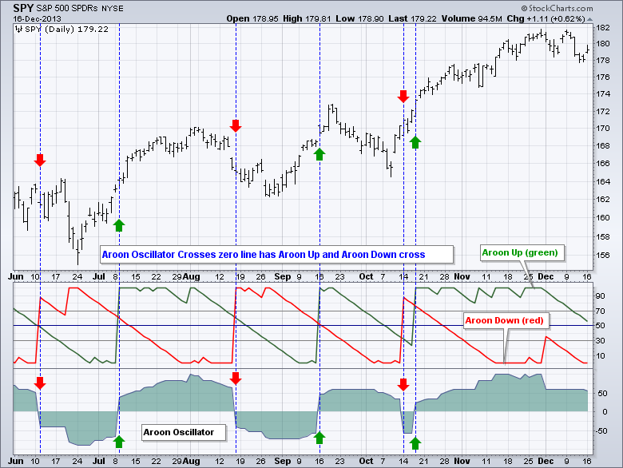
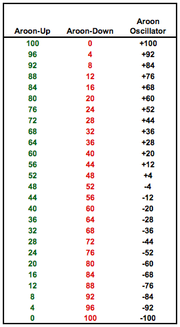
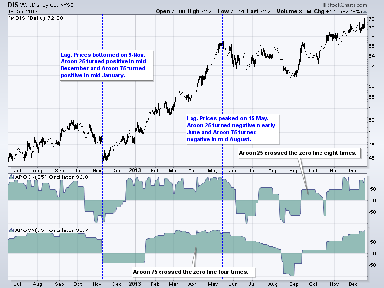
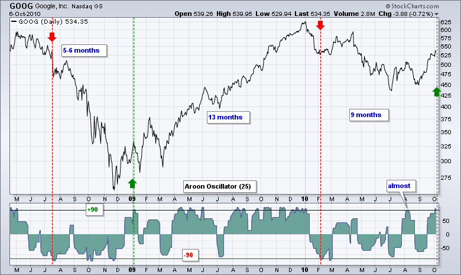
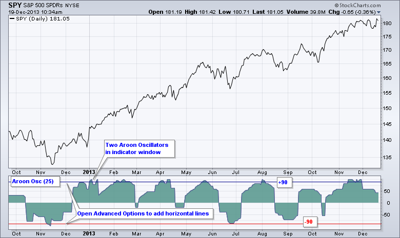
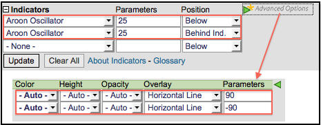

# Aroon振荡器[ChartSchool]

### 目录

+   [Aroon振荡器](#aroon_oscillator)

    +   [介绍](#introduction)

    +   [计算](#calculation)

    +   [解释](#interpretation)

    +   [总体趋势偏差](#general_trend_bias)

    +   [强劲趋势偏差](#strong_trend_bias)

    +   [结论](#conclusions)

    +   [与SharpCharts一起使用](#using_with_sharpcharts)

    +   [建议扫描](#suggested_scans)

        +   [Aroon振荡器上穿零线](#aroon_oscillator_crosses_above_zero)

        +   [Aroon振荡器下穿零线](#aroon_oscillator_crosses_below_zero)

## 介绍

Aroon振荡器是Aroon-Up和Aroon-Down之间的差值。这两个指标通常一起绘制以便进行简单比较，但图表分析师也可以通过Aroon振荡器查看这两个指标之间的差异。该指标在-100和+100之间波动，以零为中线。当振荡器为正时存在上升趋势偏差，而当振荡器为负时存在下降趋势偏差。图表分析师还可以扩大牛熊阈值以识别更强的信号。查看我们的[ChartSchool文章](/school/doku.php?id=chart_school:technical_indicators:aroon "chart_school:technical_indicators:aroon")以获取有关Aroon-Up和Aroon-Down的更多详细信息。

## 计算

Aroon-Up和Aroon-Down衡量价格记录x天高点或低点以来的周期数。Aroon Up基于时间和价格高点。Aroon Down基于时间和价格低点。例如，25天Aroon-Up衡量自25天高点以来的天数，而25天Aroon-Down衡量自25天低点以来的天数。这些指标以百分比形式显示，并在0和100之间波动。Aroon振荡器简单地是Aroon-Up减去Aroon-Down。SharpCharts中的默认参数为25，下面的示例基于25天Aroon振荡器。

```py
Aroon Up = 100 x (25 - Days Since 25-day High)/25
Aroon Down = 100 x (25 - Days Since 25-day Low)/25
Aroon Oscillator = Aroon-Up  -  Aroon-Down

```



简单地计算数字会揭示一些有趣的配对。要达到或超过某个阈值，需要Aroon-Up或Aroon-Down达到最低水平。例如，当Aroon-Up等于100且Aroon-Down等于0时，振荡器等于+100。类似地，当Aroon-Up为0且Aroon-Down为100时，Aroon振荡器等于-100。要使振荡器达到+100，需要一些强劲的上涨价格运动。同样，要使振荡器达到-100，需要一些强劲的下跌价格运动。

等于+40的Aroon振荡器要求Aroon-Up至少为40，这意味着Aroon-Down将为0。正40可能来自一系列Aroon-Up和Aroon-Down的组合（40-0, 44-4, 48-8, 60-20, 72-32, 80-40或100-40）。颠倒这些数字以查看可能产生负40的组合。

一般来说，相对较高的正数要求Aroon-Up相对较高，而相对较低的负数要求Aroon-Down相对较高。下表显示了一系列Aroon-Up和Aroon-Down配对以形成Aroon振荡器。



## 解释

读数高于零意味着Aroon-Up大于Aroon-Down，这意味着价格最近的新高比新低更多。相反，低于零的读数表明Aroon-Down大于Aroon-Up。这意味着价格最近的新低比新高更多。正如你所看到的，Aroon振荡器大部分时间要么是正的，要么是负的。这使得解释变得直接。当指标为正时，时间和价格有利于上涨趋势，当指标为负时，时间和价格有利于下跌趋势。可以使用正负阈值来定义趋势的强度。例如，突破+50将反映出强劲的上涨，而跌破-50将表明强劲的下跌。

## 一般的趋势偏向

定义一般的趋势偏向是Aroon振荡器的最基本用途。该指标在强劲上升趋势中保持在正区间，在强劲下降趋势中保持在负区间。根据参数设置，短期趋势或波动交易可能会导致指标经常在零线上下移动。下图显示了迪士尼的两种不同Aroon振荡器设置：25天和75天。25天Aroon比75天Aroon更敏感。请注意，25天Aroon在十八个月内超过八次穿越零线。75天Aroon只穿越零线四次。图表分析师必须首先确定他们的时间框架，然后选择最能捕捉这个时间框架的设置。短期交易者显然会选择25天Aroon或更短的时间，而寻找2-4个月走势的持仓交易者会选择75天Aroon。



图表还显示，Aroon振荡器并不免疫滞后，因为振荡器在价格已经移动后才变为正或负。参数设置越长，滞后越多。不要期望通过正负交叉来捕捉底部或顶部。作为更多趋势跟踪指标，Aroon振荡器识别可能足够强劲以信号开始持续趋势的走势。然而，并非所有趋势都会延伸。 

## 强劲的趋势偏向

图表分析师可以扩大多头和空头参数以进一步过滤信号。扩大参数将产生更多滞后和更长时间范围的信号。例如，多头阈值可以设置为+90，空头阈值为-90。+90表示Aroon-Up在90到100之间，而Aroon-Down在0到10之间。对于低于-90的读数，情况相反。这样的强劲读数发生在一个重大移动之后，可以预示着一个延续趋势的开始。超过+90的移动被认为是多头的，直到通过低于-90的移动来否定。这个水平足够深，可以吸收大部分上涨趋势中的回调。同样，低于-90的移动被认为足够强大，可以信号延续性下降的开始。直到有一个高于+90的移动，这个信号才会被扭转，这个水平足够高，可以吸收大部分超卖反弹。



谷歌（GOOG）图表显示了Aroon振荡器（25）的水平线在+90和-90处。该指标被添加了两次，并使用“高级选项”添加了水平线。在下面的SharpCharts部分显示了一个实时示例。尽管这些信号滞后，但它们比简单的零线交叉持续时间更长。显然，这些信号不会捕捉底部或顶部，因为它们发生在重大移动之后。此外，请注意在信号发出后，谷歌是如何反向移动的。在2009年1月的多头信号之后，出现了两次急剧的回调。在这些逆势移动之后，趋势继续朝着信号的方向发展。这些90/90信号可用于建立大趋势，然后沿着该趋势方向交易。例如，图表分析师可以在大趋势向上时（Aroon > +90）专注于多头信号。相反，当大趋势向下时（Aroon < -90），图表分析师可以专注于空头信号。图表分析师甚至可以微调多头和空头的阈值。但要小心不要过度拟合。

## 结论

Aroon Oscillator将Aroon-Up和Aroon-Down指标合并为一个指标。这使得更容易识别两者中更强的那个。当Aroon-Up强于Aroon-Down时，振荡器为正，当Aroon-Down强于Aroon-Up时，振荡器为负。当振荡器为正时，存在一般的看涨偏向，当为负时存在看跌偏向。人们很容易寻找看涨和看跌的背离，但该指标并非为传统振荡器信号而设计。与所有技术指标一样，Aroon Oscillator应与技术分析的其他方面一起使用，例如[图表模式分析](/school/doku.php?id=chart_school:chart_analysis:chart_patterns "chart_school:chart_analysis:chart_patterns")或[动量指标](/school/doku.php?id=chart_school:technical_indicators:introduction_to_technical_indicators_and_oscillators#momentum_oscillators "chart_school:technical_indicators:introduction_to_technical_indicators_and_oscillators")。

## 使用SharpCharts

Aroon Oscillator在SharpCharts上作为一个指标可放置在基础证券的价格图表的上方、下方或后方。如上所述，用户可以添加两个具有相同参数的Aroon Oscillators，然后单击绿色箭头以获取高级选项。然后可以添加水平线以设置看涨和看跌的阈值。这些阈值可能根据基础证券的特性而变化。单击下面的图像查看设置。SharpCharts订阅者甚至可以通过单击图表右上角的“添加新”链接将此图表保存到其收藏列表中。**[点击这里](http://stockcharts.com/h-sc/ui?s=SPY&p=D&yr=1&mn=0&dy=0&id=p74556881166&a=214937192 "http://stockcharts.com/h-sc/ui?s=SPY&p=D&yr=1&mn=0&dy=0&id=p74556881166&a=214937192")** 查看带有Aroon Oscillator的实时图表。





## 建议的扫描

### Aroon Oscillator穿越零线

这个简单的扫描搜索股票，其中Aroon Oscillator从负区域穿越到正区域，而每日成交量高于成交量的50日移动平均线。换句话说，看涨交叉发生时成交量在扩大。

```py
[type = stock] AND [country = US] 
AND [Daily SMA(20,Daily Volume) > 100000] 
AND [Daily SMA(60,Daily Close) > 20] 

AND [Daily Aroon Osc(25) crosses 0] 
AND [Daily Volume > Daily SMA(50,Daily Volume)]
```

### Aroon Oscillator穿越零线以下

这个简单的扫描搜索股票，其中Aroon Oscillator从正区域穿越到负区域，而每日成交量高于成交量的50日移动平均线。换句话说，看跌交叉发生时成交量在扩大。

```py
[type = stock] AND [country = US] 
AND [Daily SMA(20,Daily Volume) > 100000] 
AND [Daily SMA(60,Daily Close) > 20] 

AND [0 crosses Daily Aroon Osc(25)] 
AND [Daily Volume > Daily SMA(50,Daily Volume)]
```

欲了解更多有关 Aroon Oscillator 扫描语法的详细信息，请参阅我们的[扫描指标参考](http://stockcharts.com/docs/doku.php?id=scans:indicators#aroon_oscillator "http://stockcharts.com/docs/doku.php?id=scans:indicators#aroon_oscillator")，位于支持中心。
