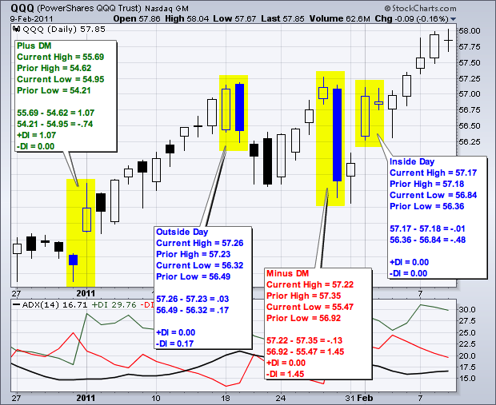
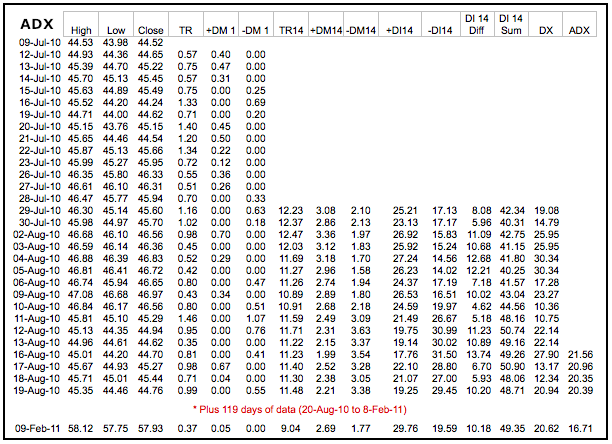
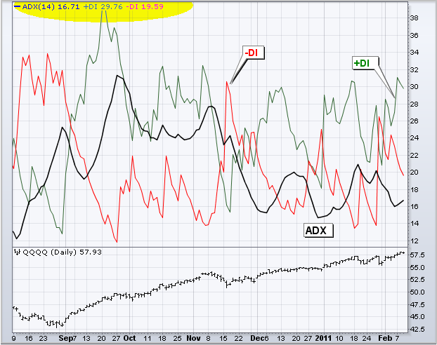
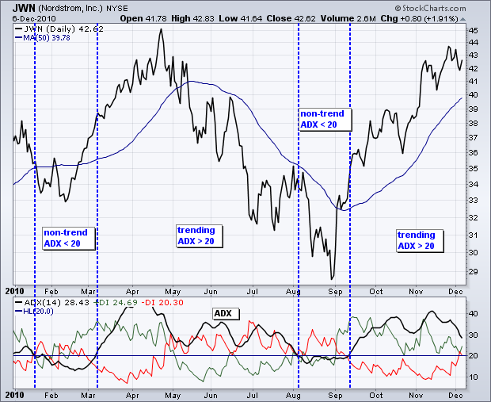
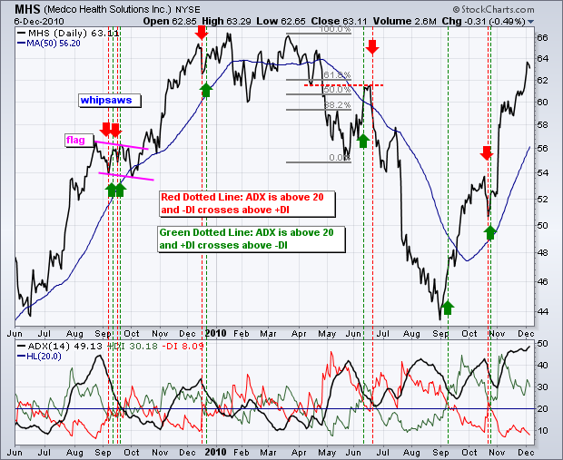
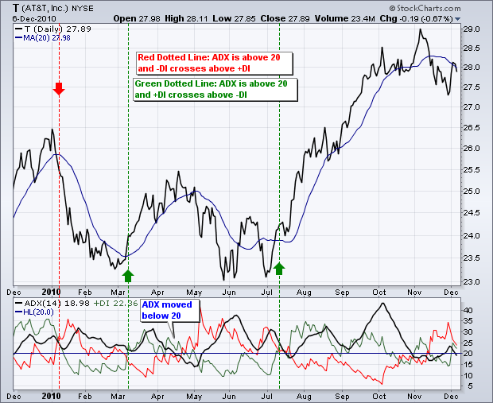
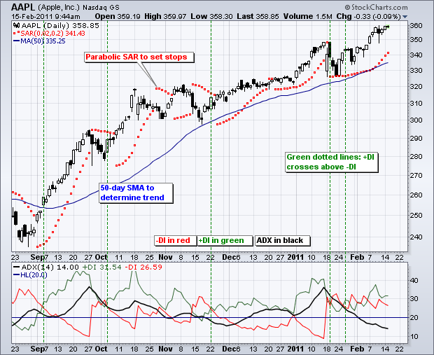
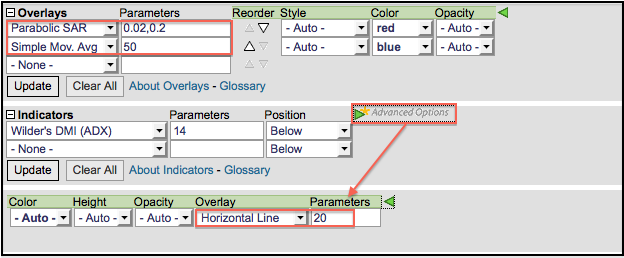

# 平均趋向指数（ADX）[图表学校]

### 目录

+   [平均趋向指数（ADX）](#average_directional_index_adx)

    +   [介绍](#introduction)

    +   [计算](#calculation)

        +   [指标计算](#indicator_calculation)

        +   [Wilder的平滑技术](#wilder_s_smoothing_techniques)

    +   [解释](#interpretation)

        +   [趋势强度](#trend_strength)

    +   [趋势方向和交叉点](#trend_direction_and_crossovers)

    +   [结论](#conclusions)

    +   [使用SharpCharts](#using_with_sharpcharts)

    +   [建议扫描](#suggested_scans)

        +   [整体上涨，+DI穿过-DI](#overall_uptrend_with_di_crossing_above_-di)

        +   [整体下跌，-DI穿过+DI](#overall_downtrend_with_-di_crossing_above_di)

    +   [额外资源](#additional_resources)

        +   [股票与商品杂志文章](#stocks_commodities_magazine_articles)

## 介绍

平均趋向指数（ADX）、负向指标（-DI）和正向指标（+DI）代表了由Welles Wilder开发的一组方向运动指标，形成了一个交易系统。尽管Wilder设计他的方向运动系统时考虑了商品和每日价格，但这些指标也可以应用于股票。

正向和负向运动构成了方向运动系统的基础。Wilder通过比较两个连续低点之间的差值与它们各自高点之间的差值来确定方向运动。

**正向指标（+DI）** 和 **负向指标（-DI）** 是由这些差值的平滑平均值导出的，它们测量了趋势随时间的***方向***。这两个指标通常被统称为方向运动指标（DMI）。

**平均趋向指数（ADX）** 反过来是由+DI和-DI之间的差值的平滑平均值导出的，它测量了趋势的***强度***（无论方向如何）随时间的变化。

使用这三个指标，图表分析师可以确定趋势的***方向***和***强度***。

Wilder在他的1978年著作《技术交易系统中的新概念》中介绍了方向运动指标。这本书还包括了关于[真实波幅（ATR）](/school/doku.php?id=chart_school:technical_indicators:average_true_range_atr "chart_school:technical_indicators:average_true_range_atr")、[抛物线SAR](/school/doku.php?id=chart_school:technical_indicators:parabolic_sar "chart_school:technical_indicators:parabolic_sar")系统和[RSI](/school/doku.php?id=chart_school:technical_indicators:relative_strength_index_rsi "chart_school:technical_indicators:relative_strength_index_rsi")的详细信息。尽管是在计算机时代之前开发的，Wilder的指标在计算上非常详细，并经受住了时间的考验。

## 计算

方向运动是通过比较两个连续低点之间的差异与它们各自高点之间的差异来计算的。

当前高点减去先前高点大于先前低点减去当前低点时，方向运动是**正数**（加号）。这种所谓的正向方向运动（+DM）等于当前高点减去先前高点，前提是它是正数。负值将简单地输入为零。

当前低点减去先前低点大于当前高点减去先前高点时，方向运动是**负数**（减号）。这种所谓的负向方向运动（-DM）等于先前低点减去当前低点，前提是它是正数。负值将简单地输入为零。



上图显示了四个方向运动计算示例。第一对显示了强烈的正向方向运动（+DM）的高点之间的巨大正差异。第二对显示了一个外部日，负向方向运动（-DM）占优势。第三对显示了低点之间的巨大差异，形成强烈的负向方向运动（-DM）。最后一对显示了一个内部日，相当于没有方向运动（零）。正向方向运动（+DM）和负向方向运动（-DM）都是负数并恢复为零，因此它们互相抵消。所有内部日都将有零方向运动。

### 指标计算

平均定向指数（ADX）、正向指标（+DI）和负向指标（-DI）的计算步骤基于上面计算的正向方向运动（+DM）和负向方向运动（-DM）值，以及平均真实范围。+DM和-DM的平滑版本除以平均真实范围的平滑版本，以反映移动的真实幅度。

注意：未描述平均真实范围（ATR），因为整个[ChartSchool文章](/school/doku.php?id=chart_school:technical_indicators:average_true_range_atr "chart_school:technical_indicators:average_true_range_atr")都有关于这个。基本上，ATR是Wilder对两周期交易范围的版本。

下面的计算示例基于一个14周期的指标设置，这是Wilder推荐的。

1.  为每个周期计算真实范围（TR）、正向方向运动（+DM）和负向方向运动（-DM）。

1.  使用Wilder的平滑技术平滑这些周期值。这些将在下一节详细解释。

1.  将14天平滑的正向方向运动（+DM）除以14天平滑的真实范围，以找到14天正向指标（+DI14）。乘以100将小数点移动两位。这个+DI14是绿色的正向指标线（+DI），与ADX线一起绘制。

1.  将14天平滑的负向动向指标（-DM）除以14天平滑的真实范围，以找到14天的负向指标（-DI14）。乘以100将小数点移动两位。这个-DI14是红色的负向指标线（-DI），与ADX线一起绘制。

1.  方向运动指数（DX）等于+DI14减去-DI14的绝对值除以+DI14和-DI14的总和。将结果乘以100将小数点移动两位。

1.  经过所有这些步骤，现在是计算平均趋向指数（ADX）线的时候了。第一个ADX值只是DX的14天平均值。随后的ADX值通过将前一个14天的ADX值乘以13，加上最新的DX值，然后将总和除以14来平滑。



上面是一个包含所有计算的电子表格示例。由于需要大约150个周期来吸收平滑技术，因此存在119天的计算间隙。ADX/DMI爱好者可以[点击此处下载](/school/lib/exe/fetch.php?media=chart_school:technical_indicators_and_overlays:average_directional_index_adx:cs-adx.xls "chart_school:technical_indicators_and_overlays:average_directional_index_adx:cs-adx.xls (343.5 KB)")这个电子表格并查看详细信息。下面的图表显示了使用纳斯达克100ETF（QQQQ）的ADX与+DI和-DI的示例。



### Wilder的平滑技术

如ADX、+DI和-DI的计算所示，涉及大量平滑处理，了解其影响很重要。由于Wilder的平滑技术，需要大约150个数据周期才能获得真实的ADX值。Wilder在RSI和真实波幅计算中使用类似的平滑技术。仅使用30个历史数据周期的ADX值将无法匹配使用150个历史数据周期的ADX值。具有150天或更多数据的ADX值将保持一致。

第一种技术用于平滑每个周期的+DM1、-DM1和TR1值，持续14个周期。与指数[移动平均](/school/doku.php?id=chart_school:technical_indicators:moving_averages "chart_school:technical_indicators:moving_averages")一样，计算必须从某个地方开始，因此第一个值只是前14个周期的总和。如下所示，平滑从第二个14周期计算开始，并持续进行。

```py
First TR14 = Sum of first 14 periods of TR1 
Second TR14 = First TR14 - (First TR14/14) + Current TR1 
Subsequent Values = Prior TR14 - (Prior TR14/14) + Current TR1
```

第二种技术用于平滑每个周期的DX值，以得到平均趋向指数（ADX）。首先，计算前14天的平均值作为起点。第二次和随后的计算使用以下平滑技术：

```py
First ADX14 = 14 period Average of DX 
Second ADX14 = ((First ADX14 x 13) + Current DX Value)/14 
Subsequent ADX14 = ((Prior ADX14 x 13) + Current DX Value)/14
```

## 解释

平均趋向指数（ADX）用于衡量趋势的强度或弱势，而不是实际方向。方向运动由+DI和-DI定义。一般来说，当+DI大于-DI时，多头占优势，而当-DI大于+DI时，空头占优势。这些方向指标的交叉可以与ADX结合使用，形成一个完整的交易系统。

在查看一些信号示例之前，请记住，Wilder是一名商品和货币交易员。他书中的示例是基于这些工具，而不是股票。这并不意味着他的指标不能用于股票。一些股票具有类似商品的价格特征，往往更具有短期和强劲趋势的波动性。波动性较低的股票可能不会生成基于Wilder参数的信号。图表分析师可能需要根据证券的特性调整指标设置或信号参数。

### 趋势强度

在最基本的层面上，平均趋向指数（ADX）可用于确定证券是否处于趋势状态。这种判断有助于交易员选择趋势跟踪系统或非趋势跟踪系统。Wilder建议当ADX高于25时存在强劲趋势，当低于20时不存在趋势。20和25之间似乎存在一个灰色区域。如上所述，图表分析师可能需要调整设置以增加灵敏度和信号。由于所有平滑技术的影响，ADX也存在相当大的滞后性。许多技术分析师使用20作为ADX的关键水平。



上图显示了 Nordstrom（JWN）的50日简单移动平均线和14日平均趋向指数（ADX）。该股票在4月至5月间从强劲上升趋势转为强劲下降趋势，但ADX仍保持在20以上，因为强劲上升趋势迅速转变为强劲下降趋势。该股票在2月和8月形成底部时出现了两个非趋势期。在8月底部形成后，出现了强劲趋势，因为ADX上升到20以上并保持在20以上。

## 趋势方向和交叉

Wilder提出了一个简单的交易系统，使用这些方向运动指标进行交易。第一个要求是ADX交易在25以上。这确保了价格正在趋势。然而，许多交易员使用20作为关键水平。当+DI穿过-DI时，会出现买入信号。Wilder将初始止损设定为信号日的低点。只要这个低点保持，即使+DI再次穿过-DI，信号仍然有效。在放弃信号之前，等待这个低点被突破。如果/当ADX转向上并且趋势加强时，这个多头信号会得到加强。一旦趋势发展并变得有利可图，交易员将不得不加入止损和移动止损，以防趋势持续。当-DI穿过+DI时，会触发卖出信号。卖出信号日的高点成为初始止损。



上图显示了 Medco Health Solutions 的三个方向运动指标。请注意，使用 20 而不是 25 来确定 ADX 信号。较低的设置意味着更多可能的信号。绿色虚线表示买入信号，红色虚线表示卖出信号。为了专注于指标信号，Wilder 的初始止损未被纳入。正如图表清楚显示的那样，有大量的 +DI 和 -DI 交叉。一些发生在 ADX 大于 20 时以验证信号。其他发生在无效信号时。与大多数这类系统一样，会有虚假信号、好信号和坏信号。关键始终是要结合技术分析的其他方面。例如，2009 年 9 月的第一组虚假信号发生在一次整理期间。此外，这种整理看起来像一面旗帜，这是在上涨后形成的一种看涨整理。在形成看涨整理的情况下，忽略看跌信号是明智的。2010 年 6 月的买入信号发生在一个由破支撑和 50-62% 回撤区域标记的阻力区附近。在如此接近这一阻力区的情况下忽略买入信号是明智的。



上图显示了 AT&T（T）在 12 个月内出现的三个信号。这三个信号相当不错，前提是要获利并使用移动止损。Wilder 的[拟合停损](/school/doku.php?id=chart_school:technical_indicators:parabolic_sar "chart_school:technical_indicators:parabolic_sar")可以用来设置移动止损。请注意，在 3 月和 7 月买入信号之间没有卖出信号。这是因为当 -DI 在 4 月底超过 +DI 时，ADX 不到 20。

## 结论

Directional Movement System（方向运动系统）指标的计算复杂，解释简单，成功实施需要实践。 +DI 和 -DI 的交叉频繁发生，图表分析师需要用补充分析来过滤这些信号。设置 ADX 要求将减少信号，但这种超平滑的指标往往会过滤掉许多好信号和坏信号。换句话说，图表分析师可能考虑将 ADX 放在次要位置，专注于方向运动指标（+DI 和 -DI）来生成信号。这些交叉信号将类似于使用动量振荡器生成的信号。因此，图表分析师需要在其他地方寻找确认帮助。基于成交量的指标、基本趋势分析和[图表模式](/school/doku.php?id=chart_school:chart_analysis:chart_patterns "chart_school:chart_analysis:chart_patterns")可以帮助区分强势交叉信号和弱势交叉信号。例如，图表分析师可以在更大的趋势向上时专注于 +DI 买入信号，而在更大的趋势向下时专注于 -DI 卖出信号。

## 使用 SharpCharts

SharpCharts用户可以通过从指标下拉列表中选择平均趋向指数（ADX）来绘制这三个方向运动指标。默认情况下，ADX线为黑色，正向指标（+DI）为绿色，负向指标（-DI）为红色。这样可以轻松识别方向指标的交叉点。虽然ADX可以绘制在主价格图表的上方、下方或后面，但建议绘制在上方或下方，因为涉及到三条线。可以添加水平线来帮助识别ADX的变化。下面的图表示例还显示了50日简单移动平均线和抛物线SAR绘制在价格图表的后面。移动平均线用于过滤信号。只有在交易高于50日[移动平均线](/school/doku.php?id=chart_school:technical_indicators:moving_averages "chart_school:technical_indicators:moving_averages")时才使用买入信号。一旦启动，抛物线SAR可用于设置止损。[点击这里](http://stockcharts.com/h-sc/ui?s=AAPL&p=D&yr=0&mn=6&dy=0&id=p00212055984&listNum=30&a=224849203 "http://stockcharts.com/h-sc/ui?s=AAPL&p=D&yr=0&mn=6&dy=0&id=p00212055984&listNum=30&a=224849203") 查看ADX的实时示例。





## 建议扫描

### 总体上升趋势，+DI穿过-DI

这个扫描从平均每日成交量为100,000股且平均收盘价高于10美元的股票开始。当交易高于50日简单移动平均线时存在上升趋势。当ADX高于20时可能出现买入信号。当+DI移动到-DI上方时，这个信号会实现。

```py
[type = stock] AND [country = US] 
AND [Daily SMA(20,Daily Volume) > 100000] 
AND [Daily SMA(60,Daily Close) > 10] 

AND [Daily ADX Line(14) > 20] 
AND [Daily Plus DI(14) crosses Daily Minus DI(14)] 
AND [Daily Close > Daily SMA(50,Daily Close)]
```

### 总体下降趋势，-DI穿过+DI

这个扫描从平均每日成交量为100,000股且平均收盘价高于10美元的股票开始。当交易低于50日简单移动平均线时存在下降趋势。当ADX高于20时可能出现卖出信号。当-DI移动到+DI上方时，这个信号会实现。

```py
[type = stock] AND [country = US] 
AND [Daily SMA(20,Daily Volume) > 100000] 
AND [Daily SMA(60,Daily Close) > 10] 

AND [Daily ADX Line(14) > 20] 
AND [Daily Minus DI(14) crosses Daily Plus DI(14)] 
AND [Daily Close < Daily SMA(50,Daily Close)]
```

欲了解如何使用平均趋向指数、正向DI和负向DI扫描的语法详情，请参阅我们支持中心的[扫描指标参考](http://stockcharts.com/docs/doku.php?id=scans:indicators#average_directional_indicator "http://stockcharts.com/docs/doku.php?id=scans:indicators#average_directional_indicator")。

* * *

## 其他资源

### 股票与商品杂志文章

**[平均趋向运动指数（ADX）作者：汤姆·哈特尔](http://stockcharts.com/h-mem/tascredirect.html?artid=\V09\C03\ADX.pdf "http://stockcharts.com/h-mem/tascredirect.html?artid=\V09\C03\ADX.pdf")**

1991年2月 - 股票与商品 V. 9:3 (101-102)

**[专家如何使用平均趋向指数，作者：芭芭拉·斯塔尔，博士](http://stockcharts.com/h-mem/tascredirect.html?artid=\V17\C10\076HOW.pdf "http://stockcharts.com/h-mem/tascredirect.html?artid=\V17\C10\076HOW.pdf")**

1999年9月 - 股票与商品

* * *
