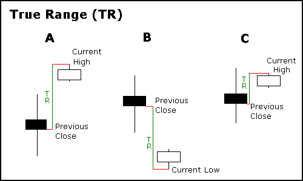
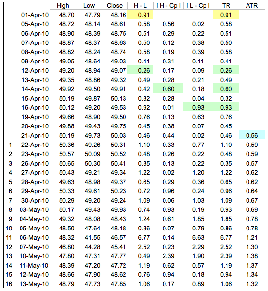
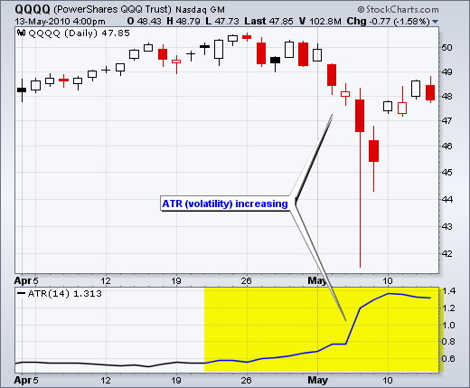
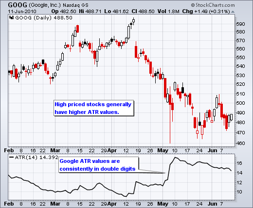
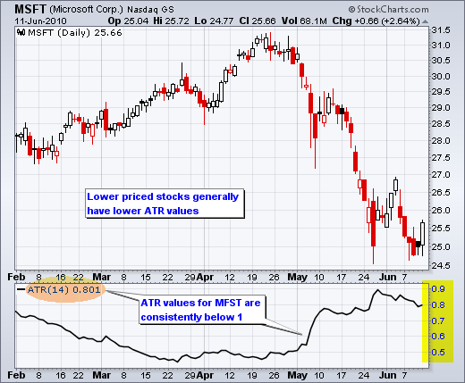
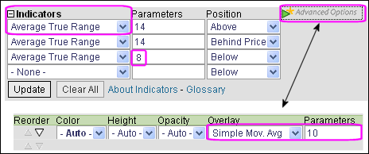

# 真实波动幅度（ATR）

### 目录

+   平均真实波动幅度（ATR）

    +   介绍

    +   真实波动幅度

    +   计算

    +   绝对 ATR

    +   结论

    +   与 SharpCharts 一起使用

    +   建议扫描

        +   排除高波动性

    +   额外资源

        +   股票与商品杂志文章

## 介绍

由 J.韦尔斯·怀尔德（J. Welles Wilder）开发，平均真实波动幅度（ATR）是一种衡量波动性的指标。与他的大多数指标一样，怀尔德设计 ATR 时考虑了商品和每日价格。商品通常比股票更具波动性。它们经常受到间隙和涨跌停限制的影响，当商品开盘时向上或向下移动到当日允许的最大幅度。基于高低范围的波动性公式无法捕捉间隙或涨跌停限制移动的波动性。怀尔德创建了平均真实波动幅度来捕捉这种“缺失”的波动性。重要的是要记住，ATR 并不提供价格方向的指示，只是波动性。

怀尔德在他的 1978 年著作《技术交易系统中的新概念》中介绍了 ATR。这本书还包括抛物线 SAR、RSI 和方向运动概念（ADX）。尽管是在计算机时代之前开发的，怀尔德的指标经受住了时间的考验，仍然非常受欢迎。

## 真实波动幅度

怀尔德最初提出了一个称为**真实波动幅度（TR）**的概念，它被定义为以下三者中的最大值：

+   方法 1：当前高价减去当前低价

+   方法 2：当前高价减去前一日收盘价（绝对值）

+   方法 3：当前低价减去前一日收盘价（绝对值）

使用绝对值确保为正数。毕竟，怀尔德感兴趣的是测量两点之间的距离，而不是方向。如果当前周期的高价高于前一周期的高价，且低价低于前一周期的低价，则当前周期的高低范围将被用作真实波动幅度。这是一个使用方法 1 计算 TR 的外部日。这非常直接了当。当存在间隙或内部日时，将使用方法 2 和 3。间隙发生在前一日收盘价高于当前高价（表示可能的向下间隙或涨跌停限制移动）或前一日收盘价低于当前低价（表示可能的向上间隙或涨跌停限制移动）时。下面的图像显示了何时适合使用方法 2 和 3 的示例。



示例 A：间隙上涨后形成的小高低范围。TR 等于当前高价与前一日收盘价之间的差的绝对值。

示例 B：在跳空下跌后形成了一个较小的高/低范围。TR 等于当前最低价和前一收盘价之间的差值的绝对值。

示例 C：尽管当前收盘价在前一高/低范围内，但当前高/低范围非常小。事实上，它比当前高价和前一收盘价之间的差值的绝对值还要小，而这个差值用于计算 TR。

## 计算

通常，平均真实范围（ATR）基于 14 个周期，并可以根据分钟、日、周或月的基础数据进行计算。在这个示例中，ATR 将基于日数据。因为必须有一个起点，第一个 TR 值简单地是最高价减去最低价，而前 14 天的 ATR 是过去 14 天的每日 TR 值的平均值。之后，Wilder 试图通过纳入前一期的 ATR 值来平滑数据。

```py

Current ATR = [(Prior ATR x 13) + Current TR] / 14

  - Multiply the previous 14-day ATR by 13.
  - Add the most recent day's TR value.
  - Divide the total by 14

```



点击这里查看一个 Excel 电子表格")，展示了 QQQ ATR 计算的开始。

在电子表格示例中，第一个真实范围值（.91）等于最高价减去最低价（黄色单元格）。第一个 14 天 ATR 值（.56）是通过计算前 14 个真实范围值的平均值（蓝色单元格）得出的。随后的 ATR 值使用上述公式进行平滑处理。电子表格中的数值对应下图中的黄色区域。请注意，随着 QQQ 在五月份暴跌并出现许多长蜡烛图，ATR 值激增。



对于那些在家尝试的人，有一些注意事项。首先，就像指数移动平均线（EMAs）一样，ATR 值取决于你从多远的历史数据开始计算。第一个真实范围值简单地是当前最高价减去当前最低价，而第一个 ATR 是前 14 个真实范围值的平均值。真正的 ATR 公式直到第 15 天才开始生效。即便如此，这两个计算的残留效应会略微影响随后的 ATR 值。对于一小部分数据的电子表格数值可能与价格图表上看到的不完全匹配。小数四舍五入也可能会略微影响 ATR 值。在我们的图表中，我们至少计算了 250 个周期（通常更多），以确保我们的 ATR 值更加准确。

## 绝对 ATR

ATR 基于真实范围，使用绝对价格变动。因此，ATR 反映波动性作为绝对水平。换句话说，ATR 不显示为当前收盘价的百分比。这意味着低价股的 ATR 值将低于高价股。例如，一只$20-30 的证券的 ATR 值将远低于一只$200-300 的证券。由于这个原因，ATR 值是不可比较的。即使对于单个证券的大幅价格波动，比如从 70 下跌到 20，也会使长期 ATR 比较变得不切实际。图表 4 显示了谷歌的两位数 ATR 值，图表 5 显示了微软的 ATR 值低于 1。尽管值不同，它们的 ATR 线形状相似。





## 结论

ATR 不是一个方向性指标，如 MACD 或 RSI。相反，ATR 是一个反映移动的兴趣或不感兴趣程度的独特波动性指标。强劲的移动，无论是向任何方向，通常伴随着大范围或大真实范围。这在移动开始时尤其明显。乏味的移动可能伴随着相对较窄的范围。因此，ATR 可用于验证移动或突破背后的热情。具有 ATR 增加的牛市逆转将显示强劲的买盘压力并加强逆转。具有 ATR 增加的熊市支撑突破将显示强劲的卖盘压力并加强支撑突破。

## 使用 SharpCharts

在指标下拉菜单中列为“平均真实范围”，ATR。指标右侧的“参数”框包含用于平滑数据的周期数的默认值，14。要调整周期设置，请突出显示默认值并输入新设置。Wilder 经常使用 8 周期 ATR。SharpCharts 还允许用户将指标放置在价格图表的上方、下方或后面。可以添加移动平均线以识别 ATR 的上升或下降。单击“高级选项”以将移动平均线添加为指标叠加。[点击这里](http://stockcharts.com/h-sc/ui?s=$INDU&p=D&b=5&g=0&id=p51341747448&listNum=30&a=202613287 "http://stockcharts.com/h-sc/ui?s=$INDU&p=D&b=5&g=0&id=p51341747448&listNum=30&a=202613287")查看 ATR 的实时示例。



## 建议的扫描

### 筛选出高波动性

平均真实范围指标可用于扫描以筛选出波动极高的证券。这个简单的扫描搜索处于上升趋势的 S&P 600 股票。最终的扫描条款排除了高波动性股票的结果。请注意，ATR 被转换为一种百分比，以便可以在相同的比例上比较不同股票的 ATR。

```py
[group is SP600]
AND [Daily EMA(50,close) > Daily EMA(200,close)]  

AND [ATR(250) / SMA(20,Close) * 100 < 4] 
```

欲了解有关 ATR 扫描使用的语法详情，请参阅我们的[扫描指标参考](http://stockcharts.com/docs/doku.php?id=scans:indicators#average_true_range_atr "http://stockcharts.com/docs/doku.php?id=scans:indicators#average_true_range_atr")在支持中心。

## 其他资源

### 股票与商品杂志文章

**[工作资金：真实波幅 by Sharon Yamanaka](http://stockcharts.com/h-mem/tascredirect.html?artid=\V20\C03\054ATR.pdf "http://stockcharts.com/h-mem/tascredirect.html?artid=\V20\C03\054ATR.pdf")**

2002 年 2 月 - 股票与商品

**[哪种波动率度量方法？by Gordon Gustafson](http://stockcharts.com/h-mem/tascredirect.html?artid=\V19\C06\067VOL.pdf "http://stockcharts.com/h-mem/tascredirect.html?artid=\V19\C06\067VOL.pdf")**

2001 年 5 月 - 股票与商品 V. 19:6 (46-50)
