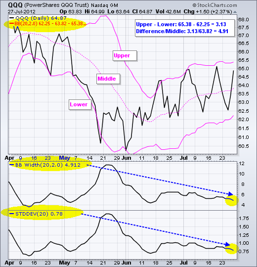
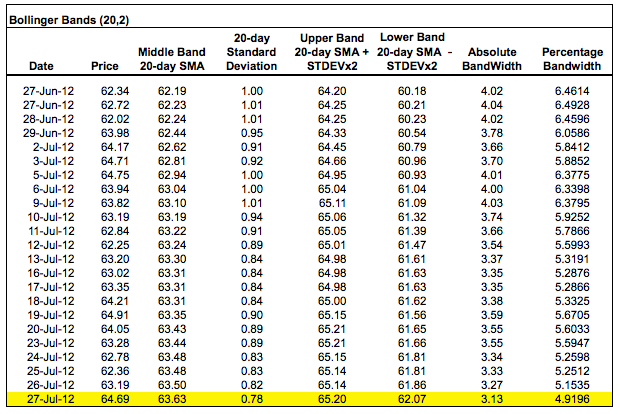
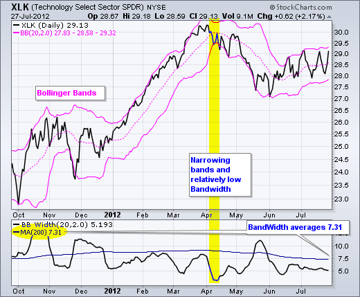
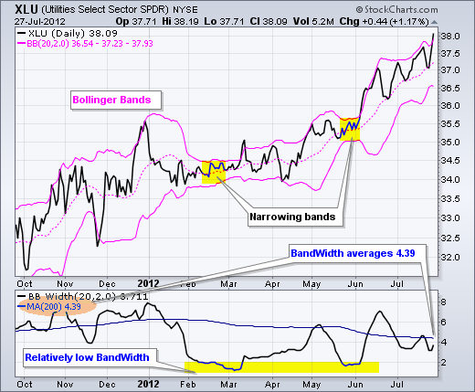
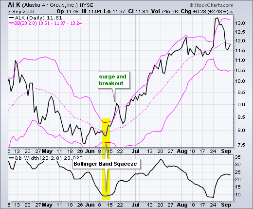
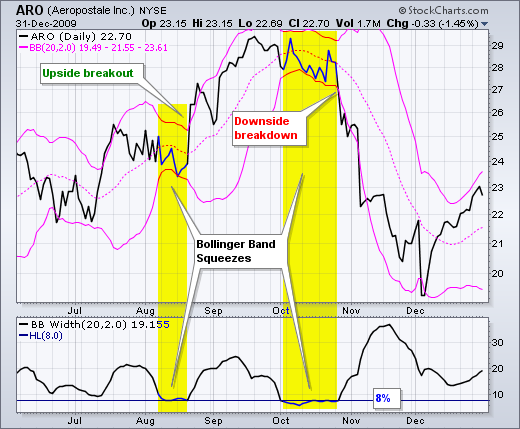
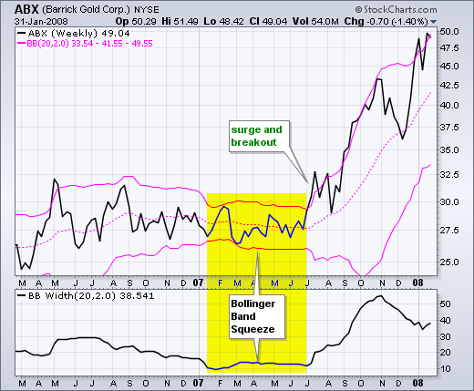
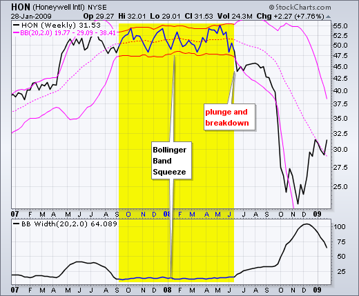
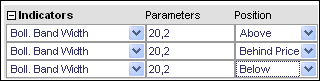
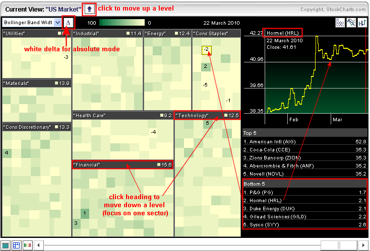

# 布林带宽度 

### 目录

+   布林带宽度

    +   介绍

    +   SharpCharts 计算

    +   定义窄度

    +   信号：挤压

    +   摘要

    +   与 SharpCharts 一起使用

    +   与 MarketCarpets 一起使用

    +   建议的扫描

        +   布林带突破

## 介绍

布林带宽度是从布林带衍生出的指标。在他的书《布林带上的布林格》中，约翰·布林格将布林带宽度称为可以从布林带中衍生出的两个指标之一。另一个指标是%B。

带宽度衡量上带和下带之间的百分比差异。随着布林带变窄，带宽度减小，随着布林带扩大，带宽度增加。由于布林带基于标准差，带宽度的下降反映了波动性的减少，而带宽度的上升反映了波动性的增加。

## SharpCharts 计算

```py
( (Upper Band - Lower Band) / Middle Band) * 100

```

布林带由一个中间带和两个外部带组成。中间带通常设置为 20 个周期的简单移动平均。外部带通常设置为中间带上下 2 个标准差。设置可以根据特定证券或交易风格的特征进行调整。

在计算带宽时，第一步是从上带的值中减去下带的值。这显示了绝对差异。然后将此差异除以中间带，这将使值标准化。然后可以在不同时间段内或与其他证券的带宽值进行比较。



上图显示了纳斯达克 100 ETF（QQQ）的布林带、带宽度和标准差。请注意带宽度如何跟踪标准差（波动性）。两者一起上升和下降。下图显示了一个带有计算示例的电子表格。



## 定义窄度

窄带宽是相对的。带宽值应该相对于一段时间内先前的带宽值进行评估。重要的是要获得一个良好的回顾期，以定义特定 ETF、指数或股票的带宽范围。例如，八到十二个月的图表将显示一段重要时间内的带宽高点和低点。当带宽接近此范围的低点时被认为是窄的，当接近高点时被认为是宽的。





低波动性证券的 BandWidth 值将低于高波动性证券。例如，Utilities SPDR（XLU）代表公用事业股票，其波动性相对较低。Technology SPDR（XLK）代表科技股票，其波动性相对较高。由于低波动性，XLU 的 BandWidth 值将始终低于 XLK。XLU 的 BandWidth 200 日移动平均值低于 5，而 XLK 的 BandWidth 200 日移动平均值高于 7。

## 信号：挤压

Bollinger BandWidth 最为人所知的是用于识别“挤压”现象。当波动性降至非常低的水平时，就会出现狭窄的带状。上下带基于标准偏差，这是波动性的一种度量。当价格趋于平稳或在相对狭窄的范围内波动时，带状变窄。理论认为，低波动性期后将会出现高波动性期。相对较窄的 BandWidth（也称为挤压）可能预示着重大上涨或下跌。挤压后，价格激增并随后带状突破信号标志着新趋势的开始。新的上涨始于挤压和随后突破上带。新的下跌始于挤压和随后突破下带。

图表 2 显示了阿拉斯加航空（ALK）在 6 月中旬出现的挤压现象。在 4 月至 5 月下跌后，ALK 在 6 月初稳定下来，因为 Bollinger 带变窄。BandWidth 下降到 10 以下，使 6 月中旬的挤压现象出现。请记住，10 指的是 10%。换句话说，带的宽度等于中间带的 10%。尽管这个水平看起来很高，但对于 ALK 来说实际上相当低。股价在 15-16 左右时，BandWidth 低于 10%，是一年多来的最低水平。随着股价突破上带，股票开始大幅上涨。



图表 3 显示了 Aeropostale（ARO）出现了几次挤压现象。在指标窗口中添加了一条水平线。这条线标记为 8，根据历史范围被认为相对较低。BandWidth 指标提醒交易者准备在 8 月中旬进行交易。股票随后突破上带并在整个 9 月持续上涨。上涨在 9 月底停滞，BandWidth 再次收窄在 10 月。请注意，BandWidth 下降到低于 8 月份设定的低点，然后趋于平稳。随后在 10 月底突破下轨的信号触发了一个熊市信号。



挤压也可以应用于周线图或更长的时间框架。周线时间框架上的波动性和带宽通常比日线时间框架上更高。这是因为在更长的时间框架上可以预期更大的价格波动。图 4 显示了 Barrick Gold (ABX) 在 2006 年和 2007 年持续整理。随着整理变窄并形成三角形，布林带收缩，带宽在 2007 年 1 月下降到 10 以下。请注意，随着整理的延伸，带宽保持在低水平。在 2007 年 7 月突破时触发了一个看涨信号。随着价格朝一个方向急剧变动，布林带也扩大，带宽也上升。



图 5 显示了 Honeywell (HON) 在 50-55 区域的扩展交易范围。5 月份价格上涨到上轨，但没有突破信号。相反，HON 明显跌破下轨，于 2007 年 6 月触发了一个看跌信号。



## 总结

带宽指标可用于识别布林带挤压。这警示图表分析师准备行动，但方向取决于随后的带突破。挤压后上轨突破是看涨的，而下轨突破是看跌的。但要小心虚假突破。有时第一次突破未能保持，价格会反转。强劲的突破保持并且很少回头。上涨突破后立即回调应作为警告。

## 使用 SharpCharts

带宽指标可以在 SharpCharts 的指标列表中找到。默认参数（20,2）基于布林带的默认参数。这些可以相应地更改。20 代表简单移动平均。2 代表上下轨的标准差数。带宽可以放置在价格图的上方、下方或后面。[点击这里](http://stockcharts.com/h-sc/ui?s=SPY&p=D&yr=0&mn=6&dy=0&id=p38029592805&listNum=30&a=195096097 "http://stockcharts.com/h-sc/ui?s=SPY&p=D&yr=0&mn=6&dy=0&id=p38029592805&listNum=30&a=195096097") 查看带宽的实时示例。



## 使用 MarketCarpets

标准化的布林带宽显示在市场地毯中，这使用户可以比较多个证券的带宽。以[S&P 行业市场地毯](http://stockcharts.com/freecharts/carpet.html "http://stockcharts.com/freecharts/carpet.html")为例，选择布林带宽，然后点击三角形的Δ图标查看绝对水平。有阴影的Δ图标显示百分比变化。白色的Δ图标显示绝对水平。绿色框显示带宽相对较宽的股票。浅色框显示带宽相对较窄的股票。在市场地毯右下方显示带宽最窄的股票列表（底部 5）。点击名称可查看上方的小图表。用户可以通过点击行业标题（例如技术）来深入了解各个行业。有九个行业和每个行业列出的底部 5 个股票，用户可以快速查看相对带宽较窄的 45 只股票。



## 建议的扫描

### 布林带突破

此扫描显示了布林带在收缩 5 天或更长时间后迅速扩张的股票。

```py
[type = stock] AND [country = US] 
AND [Daily SMA(20,Daily Volume) > 40000] 
AND [Daily SMA(60,Daily Close) > 20] 

AND [Daily BB Width(20,2) > Yesterday's max(5, BB Width(20,2)) * 2]
```

有关用于带宽扫描的语法的更多详细信息，请参阅我们的[扫描指标参考](http://stockcharts.com/docs/doku.php?id=scans:indicators#bollinger_band_width_bb_width "http://stockcharts.com/docs/doku.php?id=scans:indicators#bollinger_band_width_bb_width")在支持中心。
