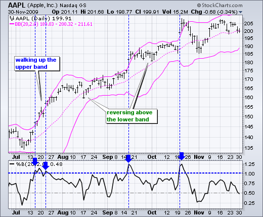
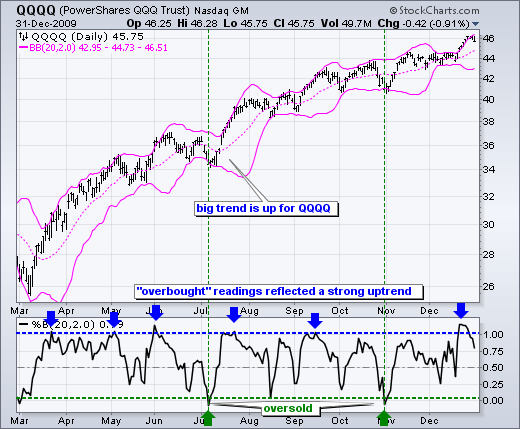
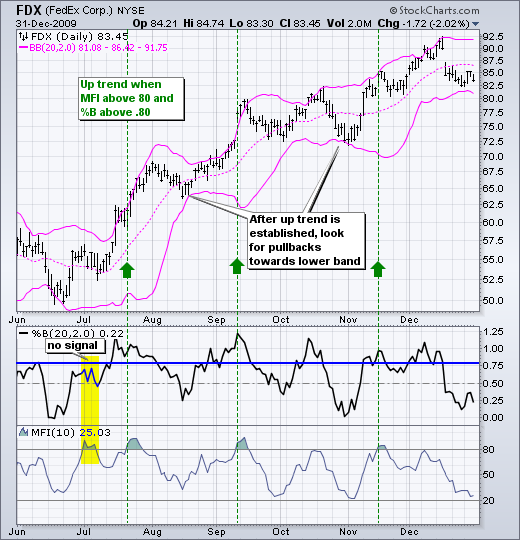
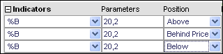

# %B 指标 [图表学校]

### 目录

+   %B 指标](#b_indicator)

    +   [简介](#introduction)

    +   [计算方法](#calculation)

    +   [信号：超买/超卖](#signalsoverbought_oversold)

    +   [信号：趋势识别](#signalstrend_identification)

    +   [结论](#conclusions)

    +   [与SharpCharts一起使用](#using_with_sharpcharts)

    +   [建议扫描](#suggested_scans)

        +   [%B 上升趋势扫描](#b_uptrend_scan)

        +   [%B 下降趋势扫描](#b_downtrend_scan)

## 简介

%B 量化了一个证券的价格相对于上下布林带的关系。有六个基本的关系水平：

+   当价格位于上轨时，%B 等于1

+   当价格位于下轨时，%B 等于0

+   当价格高于上轨时，%B 大于1

+   当价格低于下轨时，%B 低于0

+   当价格高于中轨（20日简单移动平均线）时，%B 大于0.50

+   当价格低于中轨（20日简单移动平均线）时，%B 低于0.50

## 计算

```py
%B = (Price - Lower Band)/(Upper Band - Lower Band)

```

%B 的默认设置基于布林带（20,2）的默认设置。这些带子设置在20日简单[移动平均线](/school/doku.php?id=chart_school:glossary_m#moving_average_ma "chart_school:glossary_m")的上下2个标准差处，这也是中轨。证券价格是收盘价或最后交易价。

## 信号：超买/超卖

%B 可用于识别[超买](/school/doku.php?id=chart_school:glossary_o#overbought "chart_school:glossary_o")和[超卖](/school/doku.php?id=chart_school:glossary_o#oversold "chart_school:glossary_o")情况。然而，重要的是要知道何时寻找超买读数和何时寻找超卖读数。与大多数动量振荡器一样，最好在中期趋势向上时寻找短期超卖情况，在中期趋势向下时寻找短期超买情况。换句话说，在寻找超买或超卖读数之前，要先定义更大的趋势。

图表1显示了苹果（AAPL）处于强劲上升趋势中。请注意，%B 多次上升到1以上，但甚至没有接近0。即使%B 多次上升到1以上，这些“超买”读数也没有产生良好的卖出信号。随着苹果在下轨上方迅速反转并恢复其上升趋势，回调幅度较小。约翰·布林格在强劲趋势中提到“走在带子上”。在强劲上升趋势中，价格可以沿着上轨上涨，很少触及下轨。相反，在强劲下跌趋势中，价格可以沿着下轨下跌，很少触及上轨。



在确认了更大的上升趋势后，当%B移动到零或以下时，可以认为%B被超卖了。记住，当价格触及下轨时，%B会移动到零，当价格低于下轨时，%B会低于零。这代表了一个比20日移动平均线低2个标准差的移动。图表2显示了纳斯达克100 ETF（QQQQ）在2009年3月开始的上升趋势中。在这一上升趋势中，%B在零以下移动了三次。7月初和11月初的超卖读数为参与更大上升趋势提供了良好的入场点（绿色箭头）。



## 信号：趋势识别

约翰·波林格描述了一个使用%B和资金流指数（MFI）的趋势跟踪系统。当%B高于0.80且MFI(10)高于80时，开始了一段上升趋势。MFI的取值范围在0到100之间。当MFI(10)超过80时，处于其范围的上20%，这是一个强劲的读数。当%B低于0.20且MFI(10)低于20时，可以识别出下降趋势。

图表 3 显示了联邦快递（FDX）的%B和MFI(10)。自7月底%B高于0.80且MFI高于80时开始了一段上升趋势。这一上升趋势随后在9月初和11月中旬得到了另外两个信号的确认。虽然这些信号对于趋势识别是有益的，但交易者在经历如此大的波动后可能会遇到风险回报比的问题。要让%B高于0.80且MFI(10)高于80同时发生，需要有大幅价格上涨。交易者可以考虑使用这种方法来识别趋势，然后寻找适当的超买或超卖水平以获得更好的入场点。



## 结论

%B量化了价格与波林格带之间的关系。高于0.80的读数表明价格接近上轨。低于0.20的读数表明价格接近下轨。朝向上轨的激增显示出力量，但有时可能被解释为超买。朝向下轨的暴跌显示出弱势，但有时可能被解释为超卖。很多情况取决于基础趋势和其他指标。虽然%B本身可能具有一定价值，但最好与其他指标或价格分析一起使用。[点击这里](http://stockcharts.com/h-sc/ui?s=$SPX&p=D&yr=0&mn=6&dy=0&id=p62195116429&listNum=61&a=259167452 "http://stockcharts.com/h-sc/ui?s=$SPX&p=D&yr=0&mn=6&dy=0&id=p62195116429&listNum=61&a=259167452") 查看实时图表。

## 使用 SharpCharts

%B 可在 SharpCharts 的指标列表中找到。默认参数（20,2）基于布林带的默认参数。这些可以相应地进行更改。20 代表简单移动平均。2 代表上下轨的标准偏差数量。%B 可以位于价格图表的上方、下方或后方。[点击这里](http://stockcharts.com/h-sc/ui?s=$SPX&p=D&yr=0&mn=6&dy=0&id=p62195116429&listNum=61&a=259167452 "http://stockcharts.com/h-sc/ui?s=$SPX&p=D&yr=0&mn=6&dy=0&id=p62195116429&listNum=61&a=259167452") 查看 %B 的实时示例。



## 建议的扫描

### %B 上升趋势扫描

此扫描筛选出 %B 大于 0.80 且 MFI 刚刚突破 80 的股票。根据布林格尔的说法，这些股票可能开始新的上涨。这个扫描只是一个起点。需要进一步的细化和分析。

```py
[type = stock] AND [country = US] 
AND [Daily SMA(20,Daily Volume) > 40000] 
AND [Daily SMA(60,Daily Close) > 5] 

AND [Daily %B(20,2.0,Daily Close) > 0.8] 
AND [Daily MFI(14) > 80] 
AND [Yesterday's Daily MFI(14) < 80]
```

### %B 下降趋势扫描

此扫描筛选出 %B 低于 0.20 且 MFI 刚刚跌破 20 的股票。根据布林格尔的说法，这些股票可能开始新的下跌。这个扫描只是一个起点。需要进一步的细化和分析。

```py
[type = stock] AND [country = US] 
AND [Daily SMA(20,Daily Volume) > 40000] 
AND [Daily SMA(60,Daily Close) > 5] 

AND [Daily %B(20,2.0,Daily Close) < 0.2] 
AND [Daily MFI(14) < 20] 
AND [Yesterday's Daily MFI(14) > 20]
```

有关用于 %B 扫描的语法详细信息，请参阅我们的[扫描指标参考](http://stockcharts.com/docs/doku.php?id=scans:indicators#bollinger_s_b_indicator "http://stockcharts.com/docs/doku.php?id=scans:indicators#bollinger_s_b_indicator") 在支持中心。
