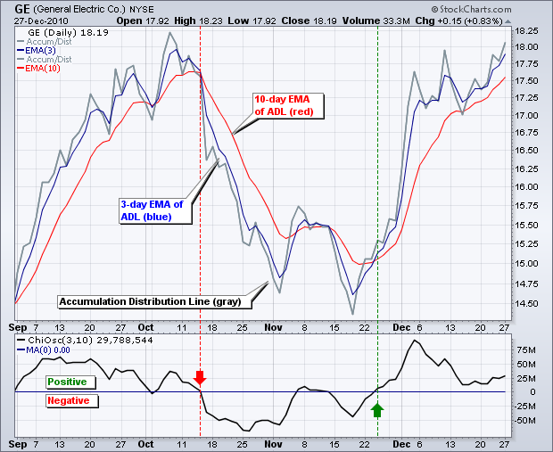
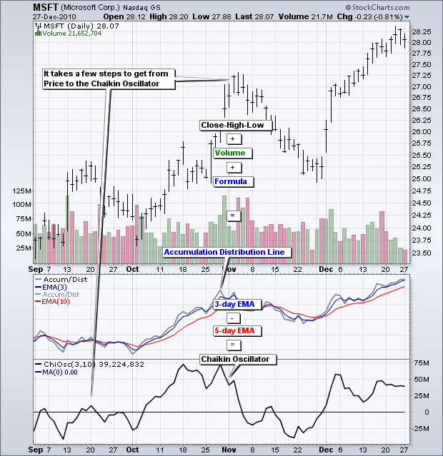
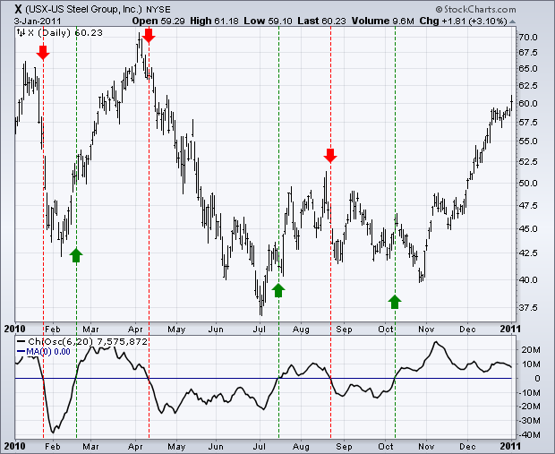
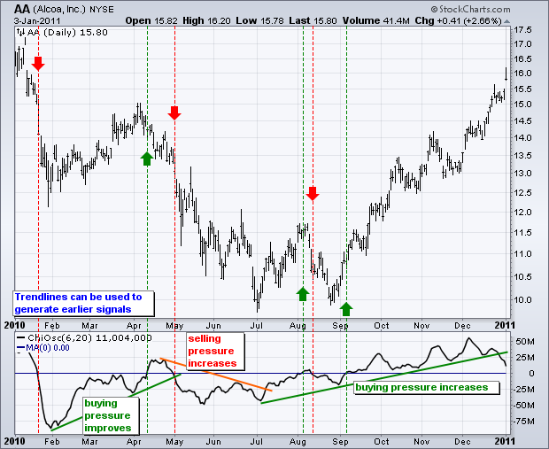
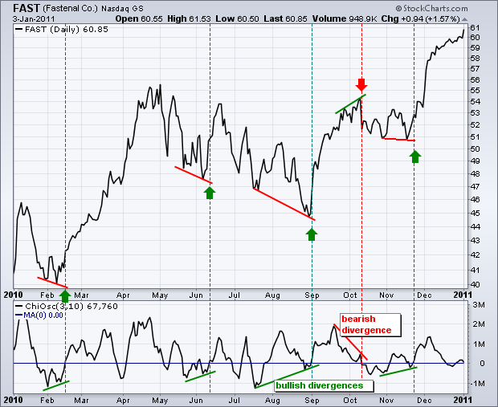
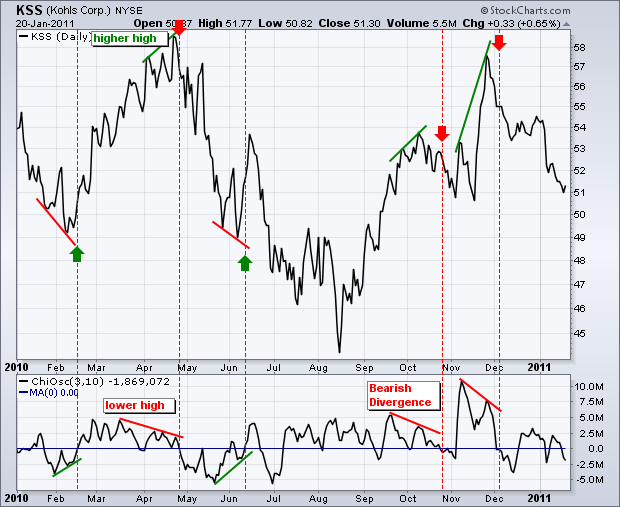
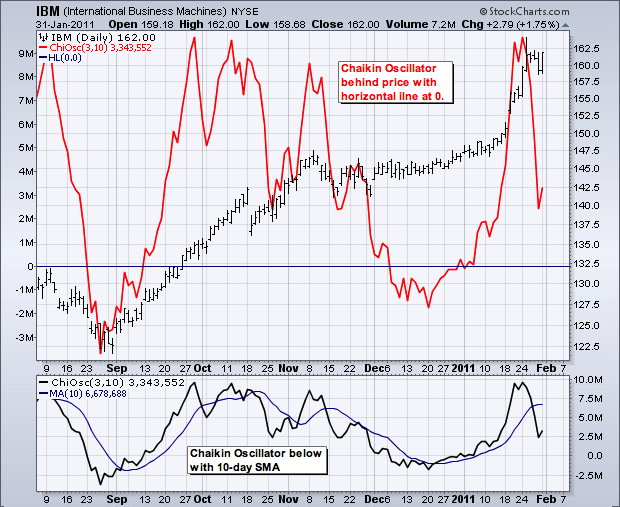
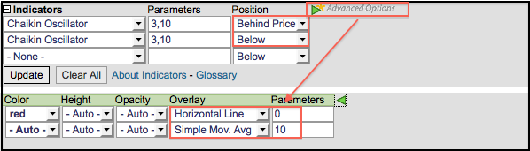

# Chaikin Oscillator [ChartSchool]

### 目录

+   Chaikin Oscillator

    +   介绍

    +   Calculation

    +   解释

    +   买入/卖出偏好

    +   分歧

    +   结论

    +   与 SharpCharts 一起使用

    +   建议扫描

        +   Chaikin Oscillator Turns Positive and RSI Moves Above 55

        +   Chaikin Oscillator Turns Negative and RSI Moves Below 45

    +   进一步研究

## 介绍

由 Marc Chaikin 开发，Chaikin Oscillator 使用 MACD 公式来衡量累积分布线的动量。这使其成为一个指标的指标。Chaikin Oscillator 是累积分布线的 3 日 EMA 与 10 日 EMA 之间的差异。与其他动量指标一样，该指标旨在通过测量背后的动量来预测累积分布线的方向变化。动量变化是趋势变化的第一步。预测累积分布线的趋势变化可以帮助图表分析师预测基础证券的趋势变化。Chaikin Oscillator 通过穿越零线或出现牛市/熊市分歧来生成信号。

## 计算

计算累积分布线（ADL）是计算 Chaikin Oscillator 的第一步。本文将介绍累积分布线的基本要素。查看我们的 ChartSchool 文章获取详细信息。计算累积分布线（ADL）有三个步骤。首先，计算资金流量乘数。其次，将此值乘以成交量以找到资金流量。第三，创建资金流量的累积总和以形成累积分布线（ADL）。第四，取两个移动平均线之间的差异来计算 Chaikin Oscillator。

```py

  1\. Money Flow Multiplier = [(Close  -  Low) - (High - Close)] /(High - Low) 

  2\. Money Flow Volume = Money Flow Multiplier x Volume for the Period

  3\. ADL = Previous ADL + Current Period's Money Flow Volume

  4\. Chaikin Oscillator = (3-day EMA of ADL)  -  (10-day EMA of ADL)		

```

当资金流量乘数为正时，累积分布线上升；当为负时下降。当收盘价位于周期高低范围的上半部时，该乘数为正；当收盘价位于下半部时，该乘数为负。作为 MACD 类型的振荡器，当较快的 3 日 EMA 移动超过较慢的 10 日 EMA 时，Chaikin Oscillator 变为正。相反，当 3 日 EMA 移动低于 10 日 EMA 时，指标变为负。



上图显示了积累分布线（灰色）与 3 日 EMA（蓝色）和 10 日 EMA（红色）。通用电气（GE）的价格不可见，因此我们可以专注于积累分布线和柴金波动指标之间的关系。请注意，当 3 日 EMA 低于 10 日 EMA 时，柴金波动指标进入负值区域。相反，当 3 日 EMA 穿过 10 日 EMA 时，振荡器变为正值。

## 解释

首先要记住，柴金波动指标是一个指标的指标。它衡量了积累分布线的动量。这使得它至少比基础证券的价格远了三步。首先，价格和成交量被重塑成积累分布线。其次，指数移动平均线被应用于积累分布线。第三，移动平均线之间的差异被用来形成柴金波动指标。作为第三阶导数，该指标更容易脱离基础证券的价格。



在澄清了这一点之后，该指标旨在衡量买入和卖出压力（积累分布线）背后的动量。进入正值区域表示积累分布线上升，买入压力占优势。进入负值区域表示积累分布线下降，卖出压力占优势。图表分析师可以通过寻找看涨或看跌的背离来预期进入正值或负值区域的交叉点。

## 买入/卖出偏见

柴金波动指标可以用正值或负值简单地定义一般的买入或卖出偏见。该指标在零线上下振荡。一般来说，当指标为正时，买入压力更大，当指标为负时，卖出压力更大。

柴金波动指标的默认设置（3,10）经常产生经常穿过零线的线。图表分析师可以通过延长移动平均线来平滑指标。下面的示例显示了柴金波动指标（6,20）。两个移动平均线都加倍以保持比例并平滑指标。



美国钢铁 (X) 的柴金波动指标在 12 个月内穿越零线六次。有一些好的信号，比如四月的卖出信号和十月的买入信号。也有一些不好的信号或剧烈波动。关键是，与所有指标一样，要用技术分析的其他方面来确认波动指标的信号，比如纯价格动量指标或图案分析。



Alcoa (AA) 的图表显示了 2010 年六次零线穿越。前五次没有产生良好的信号，但第六次是一个好的信号。图表分析师应该尝试不同的设置，并考虑添加趋势线以增强他们的分析。趋势线的突破通常比零线穿越早。趋势线还捕捉了指标的方向。上升的柴金波动指标反映了买入压力的稳定增加。下降的柴金波动指标反映了卖出压力的稳定增加。

## 背离

看涨和看跌背离警示图表分析师买入或卖出压力的动量转变，可能预示价格图表上的趋势反转。当价格下跌到新低点时，而柴金波动指标形成较高低点时，就形成了一个看涨背离。这种较高低点显示了较少的卖出压力。等待某种确认非常重要，比如指标的上升或进入正值区的交叉。进入正值区显示了积累分布线上行动量的上升。

Fastenal (FAST) 图表显示了 2010 年柴金波动指标的五个背离。默认设置 (3,10) 产生了一个相当敏感的波动指标，会产生许多背离。关键是通过等待确认来区分强劲信号和虚假信号。即使有看涨背离，卖出压力仍然超过买入压力，直到出现零线上方的交叉。买入压力主导，直到出现进入负值区的交叉。



绿色线显示了柴金波动指标形成较低低点，而股票形成较低低点以形成看涨背离。绿色虚线显示了指标进入正值区以确认信号。二月中旬、九月初和十一月末的信号非常好。六月中旬的买入信号会导致剧烈波动，而十月卖出信号后的看跌背离后并没有太多的弱势。

当价格上涨到新高点时，而柴金波动指标未能确认这一新高点时，就形成了一个看跌的背离。这种失败反映了较少的买入压力，有时可能预示价格图表上的看跌反转。确认发生在波动指标进入负值区时。



Kohls（KSS）的图表显示了在 12 个月内三次看跌背离和两次看涨背离。当蔡金振荡器进入负值区域时，确认了看跌背离（红线），显示了积累分布线中实际的下行动量。请记住，当积累分布线的 3 日 EMA 移动低于 10 日 EMA 时，蔡金振荡器（3,10）会转为负值。

## 结论

蔡金振荡器是积累分布线的动量指标。基本上，蔡金振荡器通过测量动量来加速积累分布线。使用蔡金振荡器时，信号更频繁，通常更容易量化。作为资金流动振荡器，它可以与纯价格振荡器一起使用，例如 MACD 或 RSI。与所有指标一样，蔡金振荡器不应作为独立指标使用。

## 使用 SharpCharts

蔡金振荡器可以设置为在证券价格图表的上方、下方或后方的指标。当指标放置在价格图表后面时，可以轻松比较指标/价格的变化。一旦从下拉列表中选择了指标，就会出现默认参数设置（3,10）。这些参数可以调整以增加或减少灵敏度。用户可以点击“高级选项”添加水平线或移动平均线。[点击这里查看实时示例](http://stockcharts.com/h-sc/ui?s=IBM&p=D&yr=0&mn=6&dy=0&id=p43640188268&listNum=30&a=222998125 "http://stockcharts.com/h-sc/ui?s=IBM&p=D&yr=0&mn=6&dy=0&id=p43640188268&listNum=30&a=222998125")。





## 建议的扫描

### 蔡金振荡器转为正值，RSI 移动超过 55

这个扫描从至少在过去 60 天内平均价格为$10 且每日交易量为 100,000 的股票基础开始。当蔡金振荡器移动超过+1000 时，即略高于其中心线（0）时，可以识别出交易量较大的上涨。这一点通过价格动量得到确认，因为 RSI 需要移动超过 55，即略高于其中心线（50）。这个扫描旨在作为进一步分析和尽职调查的起点。

```py
[type = stock] AND [country = US] 
AND [Daily SMA(60,Daily Volume) > 100000] 
AND [Daily SMA(60,Daily Close) > 10] 

AND [Daily Chaikin Osc(3,10) crosses 1000] 
AND [Daily RSI(14,Daily Close) crosses 55]
```

### 蔡金振荡器转为负值，RSI 移动低于 45

这个扫描从股票的基础开始，这些股票在过去 60 天的平均价格至少为$10，每日交易量至少为 100,000。当查金振荡器移动到-1000 以下时，即在其中心线（0）的稍下方时，就会识别出有良好交易量的下降趋势。这一点通过价格动量得到确认，因为需要 RSI 移动到 45 以下，即在其中心线（50）的稍下方。这个扫描旨在作为进一步分析和尽职调查的起点。

```py
[type = stock] AND [country = US] 
AND [Daily SMA(60,Daily Volume) > 100000] 
AND [Daily SMA(60,Daily Close) > 10] 

AND [-1000 crosses Daily Chaikin Osc(3,10)] 
AND [45 crosses Daily RSI(14,Daily Close)]
```

欲了解如何使用查金振荡器扫描的语法详情，请参阅我们的[扫描指标参考](http://stockcharts.com/docs/doku.php?id=scans:indicators#chaikin_oscillator_chaikin_osc "http://stockcharts.com/docs/doku.php?id=scans:indicators#chaikin_oscillator_chaikin_osc")在支持中心。

## 进一步研究

这本书涵盖了所有内容，并且解释简单清晰。墨菲涵盖了大部分主要的图表模式和指标。一个完整的章节专门讨论了理解成交量和未平仓合约。

| **金融市场技术分析** 约翰·J·墨菲 |
| --- |
|  |
|  |
