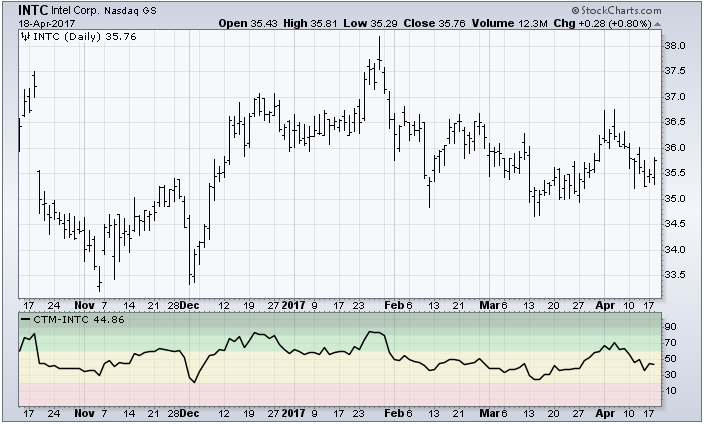

# 查德趋势仪表盘（CTM）[ChartSchool]

### 目录

+   查德趋势仪表盘（CTM）

    +   介绍

    +   计算

    +   解释

    +   结论

    +   与 SharpCharts 一起使用

    +   建议的扫描

        +   CTM 在大量交易量下突破 60

        +   持续高 CTM 的股票

## 介绍

查德趋势仪表盘（CTM），由图沙尔·查德（Tushar Chande）开发，根据涵盖六个不同时间框架的几种不同技术指标为股票或其他证券分配一个数值分数。将所有这些技术信息压缩成一个数字，提供了一种简单的方法来识别给定证券的趋势强度。

## 计算

查德趋势仪表盘的计算基于以下技术指标：

+   高、低和收盘价相对于四个不同时间框架（20 天、50 天、75 天和 100 天）的布林带的位置

+   过去 100 天相对于标准偏差的价格变化

+   14 天的 RSI 值

+   任何短期（2 天）价格通道突破的存在

最终得分转换为 0-100 的尺度以便比较。

## 解释

在 0 到 100 的查德趋势仪表盘尺度上，分数为 100 的股票处于非常强劲的上升趋势中。相反，分数为 0 的股票处于非常强劲的下跌趋势中。

这个尺度可以分为 5 个不同的级别：

+   分数为 90-100 的股票处于非常强劲的上升趋势中

+   分数为 80-90 的股票处于强劲上升趋势中

+   分数为 60-80 的股票处于弱势上升趋势中

+   分数为 20-60 的股票要么是平稳的，要么是弱势下跌趋势中

+   分数为 0-20 的股票处于非常强劲的下跌趋势中

动量交易者应寻找查德趋势仪表盘分数为 80 或更高的股票。这表示强劲的上升趋势。趋势越强劲，延续该趋势的可能性就越大。

查德趋势仪表盘也可以与指数和交易所交易基金（ETF）一起使用，以了解特定行业和行业甚至整个市场的相对趋势。

查德趋势仪表盘的一个优点是其数值是在绝对尺度上设置的，而不是相对于同一组股票。因此，当您比较几种不同类型证券的 CTM 分数时，您正在跨所有证券进行苹果对苹果的比较。

## 结论

Chande 趋势仪提供了一种简单的方法来确定股票是处于上升趋势还是下降趋势，并且便于评估该趋势的强度。通过将几种不同的经过验证的技术趋势指标结合在一起，并将它们简化为一个数字，CTM 使图表分析师能够在快速浏览时获得丰富的趋势信息。

## 使用 SharpCharts

Chande 趋势仪可以在图表下方的指标部分找到。CTM 指标可以放置在主价格图的上方、下方或后面。

当放置在主价格图之上或之下时，背景颜色编码以指示不同的趋势强度水平：

+   **深绿色**: 90-100（非常强劲上升趋势）

+   **中绿色**: 80-90（强劲上升趋势）

+   **浅绿色**: 60-80（弱上升趋势）

+   **黄色**: 20-60（平稳或弱下跌趋势）

+   **粉色**: 0-20（强劲下跌趋势）



## 建议扫描

### CTM 在大量交易量下突破 60

此扫描显示了 Chande 趋势仪已经在较重的交易量下突破 60 的股票。

```py
[type = stock] AND [country = US] 
AND [Daily SMA(60,Daily Volume) > 100000] 
AND [Daily SMA(60,Daily Close) > 20] 

AND [Chande Trend Meter x 60.0]
AND [volume > SMA(50,volume) * 1.5]
```

### 持续高 CTM 的股票

此扫描显示了美国股票的 Chande 趋势仪持续高，过去 50 个交易日平均为 80 或更高。

```py
[type = stock] AND [country = US] 
AND [Daily SMA(60,Daily Volume) > 100000] 
AND [Daily SMA(60,Daily Close) > 20] 

AND [SMA(50,Chande Trend Meter) > 80.0]
```

有关 Chande 趋势仪扫描的语法详细信息，请参阅我们的[扫描指标参考](http://stockcharts.com/docs/doku.php?id=scans:indicators#chande_trend_meter "http://stockcharts.com/docs/doku.php?id=scans:indicators#chande_trend_meter")在支持中心中。
