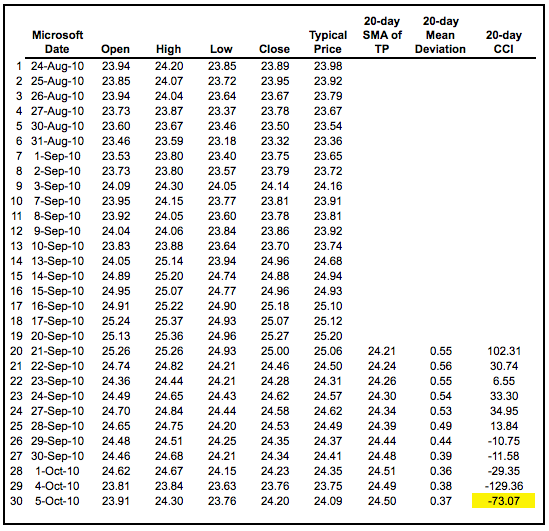
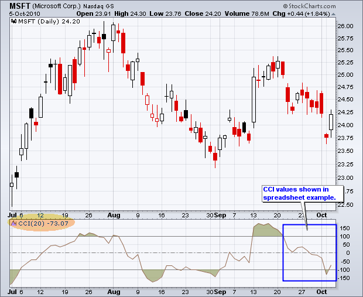
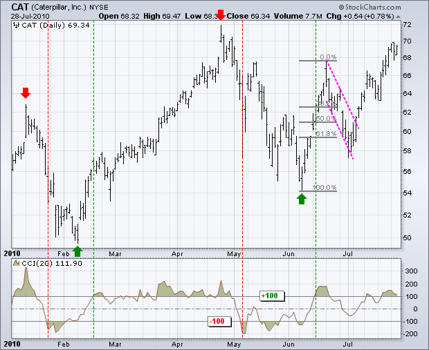
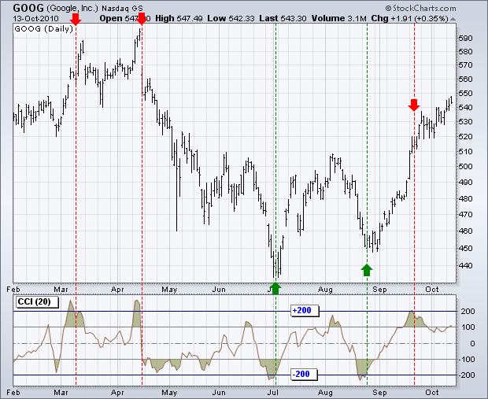
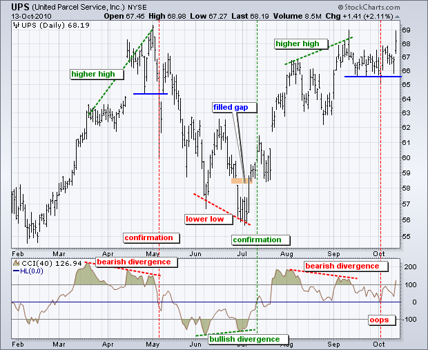
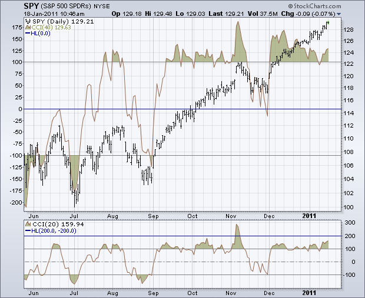
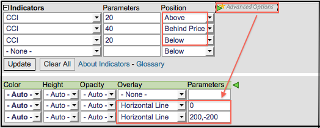
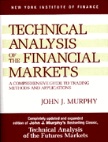
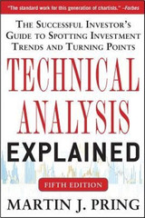

# 商品通道指数（CCI）[图表学校]

### 目录

+   [商品通道指数（CCI）](#commodity_channel_index_cci)

    +   [介绍](#introduction)

    +   [计算](#calculation)

    +   [解释](#interpretation)

    +   [新趋势出现](#new_trend_emerging)

    +   [超买/超卖](#overbought_oversold)

    +   [看涨/看跌背离](#bullish_bearish_divergences)

    +   [结论](#conclusions)

    +   [与SharpCharts一起使用](#using_with_sharpcharts)

    +   [建议扫描](#suggested_scans)

        +   [CCI在上升趋势中超卖](#cci_oversold_in_uptrend)

        +   [CCI在下降趋势中超买](#cci_overbought_in_downtrend)

    +   [进一步研究](#further_study)

## 介绍

由唐纳德·兰伯特（Donald Lambert）开发，并于1980年在《商品》杂志上推出的商品通道指数（CCI）是一种多功能指标，可用于识别新趋势或警示极端条件。兰伯特最初开发CCI是为了识别商品的周期性转折，但该指标也可以成功应用于指数、ETF、股票和其他证券。总的来说，CCI衡量当前价格水平相对于一定时期内的[平均](/school/doku.php?id=chart_school:technical_indicators:moving_averages "chart_school:technical_indicators:moving_averages")价格水平。当价格远高于其平均水平时，CCI相对较高。当价格远低于其平均水平时，CCI相对较低。通过这种方式，CCI可用于识别超买和超卖水平。

## 计算

下面的示例基于20周期商品通道指数（CCI）的计算。CCI周期数也用于简单移动平均和平均偏差的计算。

```py
CCI = (Typical Price  -  20-period SMA of TP) / (.015 x Mean Deviation)

Typical Price (TP) = (High + Low + Close)/3

Constant = .015

There are four steps to calculating the Mean Deviation: 
First, subtract the most recent 20-period average of the typical price from each period's typical price. 
Second, take the absolute values of these numbers. 
Third, sum the absolute values. 
Fourth, divide by the total number of periods (20). 

```

Lambert将常数设定为0.015，以确保大约70%到80%的CCI值落在-100和+100之间。这个百分比还取决于回顾期。较短的CCI（10个周期）将更加[波动](/school/doku.php?id=chart_school:technical_indicators:standard_deviation_volatility "chart_school:technical_indicators:standard_deviation_volatility")，在+100和-100之间的值的百分比较小。相反，较长的CCI（40个周期）将在+100和-100之间的值有更高的百分比。



点击这里查看在Excel电子表格中计算CCI的[链接](/school/lib/exe/fetch.php?media=chart_school:technical_indicators_and_overlays:commodity_channel_index_cci:cs-cci.xls "chart_school:technical_indicators_and_overlays:commodity_channel_index_cci:cs-cci.xls (64 KB)")。



## 解释

CCI衡量证券价格变动与其平均价格变动之间的差异。高正读数表明价格远高于其平均水平，这显示了强势。低负读数表明价格远低于其平均水平，这显示了弱势。

商品通道指数（CCI）可以用作同时发生或领先发生指标。作为同时发生指标，CCI上涨到+100以上反映出强劲的价格行动，可能预示着一段上升趋势的开始。下跌到-100以下反映出弱劲的价格行动，可能预示着一段下降趋势的开始。

作为[领先指标](/school/doku.php?id=chart_school:technical_indicators:introduction_to_technical_indicators_and_oscillators#momentum_oscillators "chart_school:technical_indicators:introduction_to_technical_indicators_and_oscillators")，图表分析师可以寻找可能预示均值回归的超买或超卖条件。同样，看涨和看跌的背离可以用来检测早期动量转变并预测趋势反转。

## 新趋势出现

如上所述，CCI的大部分波动发生在-100和+100之间。超出这一范围的波动显示出异常的强度或弱势，可能预示着一个持续的波动。将这些水平视为看涨或看跌的过滤器。从技术上讲，CCI在正数时偏向多头，在负数时偏向空头。然而，使用简单的零线交叉可能会导致许多虚假信号。尽管入场点会更滞后，需要CCI上升到+100以上才能发出看涨信号，下降到-100以下才能发出看跌信号可以减少虚假信号。

下图显示了卡特彼勒（CAT）的20日CCI。在七个月的时间内出现了四个趋势信号。显然，20日CCI不适合用于长期信号。图表分析师需要使用周线或月线图表来获取长期信号。股票在1月11日达到顶峰并开始下跌。CCI在1月22日（8天后）下跌到-100以下，预示着一个持续波动的开始。同样，股票在2月8日触底，CCI在2月17日（6天后）上升到+100以上，预示着一个持续上涨的开始。CCI并不能准确捕捉到顶部或底部，但它可以帮助过滤掉不重要的波动，专注于更大的趋势。



当CAT在6月上涨到60以上时，CCI触发了一个看涨信号。一些交易者可能认为股票已经超买，这些水平下的风险收益比不利。在看涨信号生效的情况下，重点将放在具有良好风险收益比的看涨设置上。请注意，股票在6月底回撤了先前涨幅的约62%，并形成了一个下降旗形态。随后突破旗形趋势线提供了另一个CCI仍处于多头模式的看涨信号。

## 超买/超卖

识别商品通道指数（CCI）或任何其他动量振荡器的超买和超卖水平可能有些棘手。首先，CCI是一个无限振荡器。从理论上讲，没有上限或下限。这使得超买或超卖的评估是主观的。其次，证券在指标超买后仍可继续上涨。同样，证券在指标超卖后仍可继续下跌。

对于商品通道指数（CCI），超买或超卖的定义有所不同。±100 可能适用于交易范围，但对于其他情况需要更极端的水平。±200 是一个更难达到的水平，更能代表真正的极端。超买/超卖水平的选择还取决于基础证券的波动性。例如，指数ETF（如SPY）的CCI范围通常比大多数股票（如谷歌）要小。



上图显示了谷歌（GOOG）的CCI（20）。使用高级指标选项添加了±200 的水平线。从2010年2月初到10月初，谷歌至少五次超过了±200。红色虚线显示了CCI回落至+200 以下的时刻，绿色虚线显示了CCI回升至-200 以上的时刻。重要的是要等待这些交叉点，以减少趋势延伸时的错误信号。然而，这样的系统并非绝对可靠。请注意，即使CCI在9月中旬超买并下跌至-200 以下后，谷歌仍在不断上涨。

## 牛市和熊市分歧

分歧信号可能标志着潜在的反转点，因为方向性动量不确认价格。当基础证券创下较低低点而CCI形成较高低点时，形成牛市分歧，显示出较少的下行动量。当证券记录较高高点而CCI形成较低高点时，形成熊市分歧，显示出较少的上行动量。在对分歧作为良好反转指标感到兴奋之前，请注意，在强劲趋势中，分歧可能具有误导性。强劲的上升趋势在顶部实际出现之前可能会显示出许多熊市分歧。相反，在持续的下跌趋势中经常出现牛市分歧。

确认是分歧的关键。虽然分歧反映了动量的变化，可以预示趋势反转，但图表分析师应为CCI或价格图表设定一个确认点。如果CCI或价格图表下破零点，可以确认熊市分歧；相反，如果CCI或价格图表上破零点，可以确认牛市分歧。



上图显示了联合包裹服务（UPS）的 40 天 CCI。为了减少波动性，使用了较长的时间框架，40 天而不是 20 天。在七个月的时间内出现了三次相当大的背离，对于仅仅七个月来说实际上是相当多的。首先，UPS 在五月初飙升至新高，但 CCI 未能超过三月的高点，并形成了一个看跌的背离。价格图表上的支撑线突破和 CCI 转入负值领域几天后证实了这一背离。其次，七月初形成了一个看涨的背离，因为股票走低至一个更低的低点，但 CCI 形成了一个更高的低点。这一背离在 CCI 转入正值领域时得到了确认。还要注意，UPS 在七月初迅速填补了六月底的跳空缺口。第三，九月初形成了一个看跌的背离，当 CCI 跌入负值领域时得到了确认。尽管 CCI 确认了这一背离，但价格从未突破支撑线，背离并未导致趋势逆转。并非所有的背离都会产生良好的信号。

## 结论

CCI 是一种多功能的动量振荡器，可用于识别超买/超卖水平或趋势逆转。当指标达到相对极端时，它就会变得超买或超卣。这一极端取决于基础证券的特征和 CCI 的历史范围。波动性较大的证券可能需要比温和证券更大的极端。当 CCI 穿越零和 100 之间的特定阈值时，可以识别出趋势变化。无论如何使用 CCI，图表分析师都应该将 CCI 与其他指标或价格分析结合使用。另一个动量振荡器会显得多余，但[累积/派发线（OBV）](/school/doku.php?id=chart_school:technical_indicators:on_balance_volume_obv "chart_school:technical_indicators:on_balance_volume_obv")或[累积/派发线](/school/doku.php?id=chart_school:technical_indicators:accumulation_distribution_line "chart_school:technical_indicators:accumulation_distribution_line")可以为 CCI 信号增加价值。

## 使用 SharpCharts 时

CCI 可作为 SharpCharts 指标使用，可以放置在基础证券的价格图表的上方、下方或后方。将 CCI 直接放在价格后面可以方便地比较指标运动与价格运动。默认设置为 20 个周期，但可以根据分析需求进行调整。较短的时间框架使指标更为敏感。较长的时间框架使其不太敏感。会员可以点击“高级选项”旁边的绿色箭头，添加水平线以标记超买或超卖水平。可以通过用逗号分隔数字（200，-200）来添加两条线。[点击这里查看实时示例](http://stockcharts.com/h-sc/ui?s=SPY&p=D&yr=0&mn=8&dy=0&id=p10448180746&listNum=30&a=221403127 "http://stockcharts.com/h-sc/ui?s=SPY&p=D&yr=0&mn=8&dy=0&id=p10448180746&listNum=30&a=221403127")。





## 建议的扫描

### CCI超卖处于上升趋势

这个扫描显示了处于上升趋势的股票，CCI处于超卖状态并开始上涨。首先，股票必须在它们的200日移动平均线之上，才能处于总体上升趋势。其次，CCI必须上穿-200，以显示指标从超卖水平上升。

```py
[type = stock] AND [country = US] 
AND [Daily SMA(20,Daily Volume) > 40000] 
AND [Daily SMA(60,Daily Close) > 20] 

AND [Daily Close > Daily SMA(200,Daily Close)] 
AND [Daily CCI(20) crosses -200]
```

### CCI超买处于下降趋势

这个扫描显示了处于下降趋势的股票，CCI处于超买状态并开始下降。首先，股票必须在它们的200日移动平均线之下，才能处于总体下降趋势。其次，CCI必须下穿+200，以显示指标从超买水平下降。

```py
[type = stock] AND [country = US] 
AND [Daily SMA(20,Daily Volume) > 40000] 
AND [Daily SMA(60,Daily Close) > 20] 

AND [Daily Close < Daily SMA(200,Daily Close)] 
AND [200 crosses Daily CCI(20)]
```

有关用于CCI扫描的语法的更多详细信息，请参阅我们支持中心的[扫描指标参考](http://stockcharts.com/docs/doku.php?id=scans:indicators#commodity_channel_index_cci "http://stockcharts.com/docs/doku.php?id=scans:indicators#commodity_channel_index_cci")。

## 进一步研究

Murphy有一个专门讨论动量振荡器及其各种用途的章节。Murphy涵盖了优缺点以及一些特定于商品通道指数的示例。

Pring通过涵盖背离、交叉和其他信号展示了动量指标的基础知识。还有两个章节涵盖了具体的动量指标，并提供了大量示例。

| **金融市场技术分析** 约翰·J·墨菲 | **马丁·普林格的技术分析解析** 马丁·普林格 |
| --- | --- |
| [](http://store.stockcharts.com/products/technical-analysis-of-the-financial-markets-1 "http://store.stockcharts.com/products/technical-analysis-of-the-financial-markets-1") | [](http://store.stockcharts.com/products/technical-analysis-explained-4th-edition "http://store.stockcharts.com/products/technical-analysis-explained-4th-edition") |
| [](http://store.stockcharts.com/products/technical-analysis-of-the-financial-markets-1 "http://store.stockcharts.com/products/technical-analysis-of-the-financial-markets-1") | [](http://store.stockcharts.com/products/technical-analysis-explained-4th-edition "http://store.stockcharts.com/products/technical-analysis-explained-4th-edition") |
